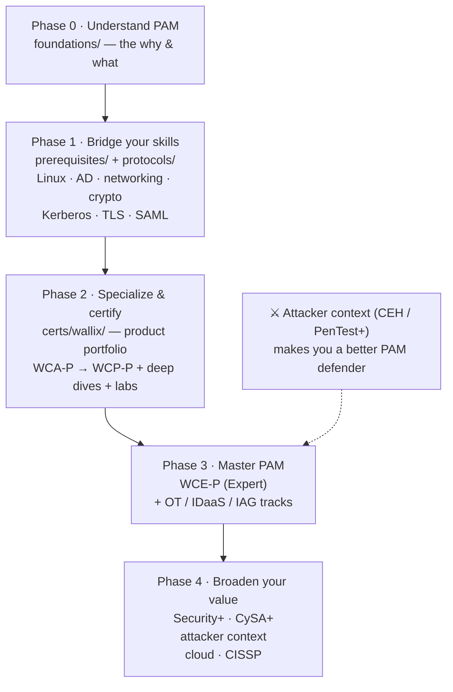
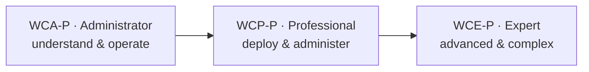
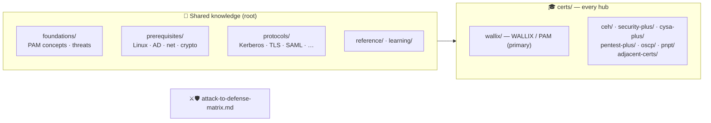

# 🔐 WallixCerts

### The **PAM-first cybersecurity learning path** for a sysadmin going into security

You already run the servers, the directories, and the access. **Privileged Access Management
(PAM)** is the shortest, highest-leverage bridge from *systems administration* into
*cybersecurity* — and this repo is a complete, source-grounded path to walk it: from
*"what is a privileged account?"* to **WALLIX-certified**, then broadened with the other
certifications worth your time.

**[🌐 Read the site](https://morandeirachema.github.io/WallixCerts/)** ·
[🧭 The PAM path](#the-pam-learning-path-your-main-track) ·
[🛡️ WALLIX hub](certs/wallix/README.md) ·
[🧰 Where to practice](learning/platforms.md) ·
[⚔️🛡️ Attack ↔ Defense](attack-to-defense-matrix.md)

---

> [!NOTE]
> **Unofficial & no fabrication.** A community study compilation, not a vendor publication.
> Every factual claim is tied to an official document or reputable source (cited per page);
> unknowns are marked *“not specified in sources.”* Structural quality (valid links, Mermaid,
> sources) is [enforced in CI](.github/workflows/quality.yml).

## 💡 Why PAM — and why a sysadmin is already halfway there

Most breaches don't start with a zero-day; they start with a **stolen or abused privileged
credential** — a domain admin, a root login, a service account, an SSH key. **PAM** is the
discipline that vaults those secrets, brokers and records every privileged session, and
enforces least privilege. It sits at the centre of identity security, and demand is driven by
regulation (NIS2, DORA, ISO 27001).

For a **systems administrator**, that's the good news: the hard prerequisites — **Active
Directory, Linux, SSH/RDP, networking, certificates** — are *your day job*. You're not starting
over; you're **re-pointing skills you already have** at access security. This repo turns that
head start into a certification and a specialization.

| Your sysadmin skill | Becomes, in PAM… |
|---------------------|------------------|
| AD / LDAP / group management | Identity sources, authorization models, least privilege |
| SSH / RDP / jump hosts | Session brokering, proxying, recording, credential injection |
| Service accounts & scripts | Secret vaulting, rotation, app-to-app password management |
| Logging & monitoring | Session audit, SIEM correlation, non-repudiation |

➡️ Start with the *why*: **[What is PAM?](foundations/what-is-pam.md)** ·
**[The threat landscape](foundations/pam-threat-landscape.md)** ·
**[Is PAM a good move for a sysadmin?](certs/wallix/career/sysadmin-to-pam-roadmap.md)**

## The PAM learning path (your main track)

A deliberate, end-to-end route. Walk it in order — each phase builds on the last. Durations are
**suggested estimates**, not requirements; go at your own pace.

| Phase | Goal | Work through | Suggested time |
|-------|------|--------------|----------------|
| **0 · Understand PAM** | Know *why* privileged access is the crown jewel and how PAM defends it | [foundations/](foundations/README.md) — what PAM is, privileged accounts, threat landscape, least-privilege/JIT/Zero-Trust, the IAM/IGA/IDaaS/EPM map | ~2–4 weeks |
| **1 · Bridge your skills** | Convert sysadmin knowledge into the security fundamentals PAM rests on | [prerequisites/](prerequisites/README.md) (Linux, Windows/AD, networking, crypto/PKI) + [protocols/](protocols/README.md) (how Kerberos, TLS, SAML, LDAP, RADIUS, SSH actually work) | ~3–6 weeks |
| **2 · Specialize & certify** | Learn the leading European PAM product and earn your first certs | [WALLIX hub](certs/wallix/README.md): [product portfolio](certs/wallix/overview/product-portfolio.md) → [WCA-P](certs/wallix/pam-bastion/wca-p-administrator.md) → [WCP-P](certs/wallix/pam-bastion/wcp-p-professional.md), backed by the [deep dives](certs/wallix/deep-dives/README.md) and [labs](certs/wallix/labs/README.md) | ~2–4 months |
| **3 · Master PAM** | Go to Expert and cover the wider suite | [WCE-P](certs/wallix/pam-bastion/wce-p-expert.md) + the advanced [deep dives](certs/wallix/deep-dives/README.md) (HA/DR, REST API, troubleshooting) + the [OT](certs/wallix/ot-pam4ot/ewcp-p-ot-professional.md) / [IDaaS](certs/wallix/idaas/ewcp-i-professional.md) / [IAG](certs/wallix/iag/README.md) tracks | ongoing |
| **4 · Broaden your value** | Round out a hireable cybersecurity profile around the PAM core | [Complementary certs](#broaden-your-value-the-other-certs-worth-your-time) below | ongoing |

> 🧰 **Practise as you go** — the [learning platforms](learning/platforms.md) page maps the best
> free & paid hands-on platforms to each phase, and the [WALLIX labs](certs/wallix/labs/README.md)
> walk through real exercises. See the full **[career roadmap](learning/roadmap.md)** for the
> bigger picture.

## 🎓 The WALLIX certification ladder (the heart of Phase 2–3)

Three progressive levels per product track. Code format `WC{level}-{track}`; an `e` prefix means
e-learning. Exam model: a final **multiple-choice exam requiring 70% to pass**. Full detail in the
[certification framework](certs/wallix/overview/certification-framework.md).

| Track | Product | Administrator | Professional | Expert |
|-------|---------|---------------|--------------|--------|
| **PAM / Bastion** | WALLIX Bastion | [WCA-P](certs/wallix/pam-bastion/wca-p-administrator.md) | [WCP-P](certs/wallix/pam-bastion/wcp-p-professional.md) | [WCE-P](certs/wallix/pam-bastion/wce-p-expert.md) |
| **IAG** | WALLIX IAG | [WCA-G](certs/wallix/iag/wca-g-administrator.md) *(soon)* | [WCP-G](certs/wallix/iag/ewcp-g-professional.md) | — |
| **IDaaS** | WALLIX One IDaaS (Trustelem) | — | [WCP-I](certs/wallix/idaas/ewcp-i-professional.md) | — |
| **OT** | WALLIX PAM4OT | — | [eWCP-P-OT](certs/wallix/ot-pam4ot/ewcp-p-ot-professional.md) | — |

Behind the certs sit **13 technical [deep dives](certs/wallix/deep-dives/README.md)** of the WALLIX
suite — Bastion architecture, the ACL data model, sessions, secrets, authentication, HA/DR, the
REST API, PAM4OT, IDaaS, IAG, EPM, and WALLIX One.

## Broaden your value: the other certs worth your time

PAM is the spine; these make you a **rounder, more hireable** security professional. Each is a full
study hub built to the same standards. The key idea: **understanding the attacker makes you a far
better PAM defender** — so the offensive hubs aren't a detour, they're context. The
[attack → defense matrix](attack-to-defense-matrix.md) maps common attacks (with MITRE ATT&CK IDs)
straight to the PAM controls that stop them.

| When | Cert | Why it complements PAM |
|------|------|------------------------|
| **Before / alongside Phase 2** | [Security+](certs/security-plus/README.md) (SY0-701) | The vendor-neutral baseline that clears HR filters and gives you the security vocabulary | 
| **After you're comfortable in PAM** | [CySA+](certs/cysa-plus/README.md) (CS0-003) | Blue-team / SOC detection & response — read the telemetry your PAM sessions generate |
| **For attacker context** | [CEH](certs/ceh/README.md) (v13) · [PenTest+](certs/pentest-plus/README.md) (PT0-003) | Understand credential theft, Pass-the-Hash, Kerberoasting, lateral movement — exactly what PAM defends |
| **To prove hands-on offense** | [PNPT](certs/pnpt/README.md) (TCM) → [OSCP](certs/oscp/README.md) (OffSec) | Real engagements; AD-attack skill that maps one-to-one onto PAM defenses |
| **To go senior / cloud** | [CISSP](certs/adjacent-certs/cissp.md) · [Cloud security](certs/adjacent-certs/cloud-security.md) | Management breadth and securing privileged *cloud* identities |

> ⚠️ The offensive hubs (CEH, PenTest+, OSCP, PNPT) are **educational and defense-oriented**:
> techniques are explained conceptually and paired with countermeasures, for **authorized use only**.

See **[certs/](certs/README.md)** for the full index of every hub.

## 📚 What's inside

- **Shared knowledge (root):** [foundations/](foundations/README.md) ·
  [prerequisites/](prerequisites/README.md) · [protocols/](protocols/README.md) ·
  [reference/](reference/README.md) (glossary, acronyms, compliance, sources) ·
  [learning/](learning/README.md) (roadmap, platforms)
- **Certification hubs:** [certs/](certs/README.md) — [wallix/](certs/wallix/README.md) (primary) ·
  [ceh/](certs/ceh/README.md) · [security-plus/](certs/security-plus/README.md) ·
  [cysa-plus/](certs/cysa-plus/README.md) · [pentest-plus/](certs/pentest-plus/README.md) ·
  [oscp/](certs/oscp/README.md) · [pnpt/](certs/pnpt/README.md) ·
  [adjacent-certs/](certs/adjacent-certs/README.md)
- **The bridge:** [attack-to-defense-matrix.md](attack-to-defense-matrix.md)

## ✅ How this repo is built

- **No fabrication** — every claim is cited or marked *“not specified in sources”*; uncertainties stay flagged.
- **Diagrams are Mermaid**, never ASCII art — they render as real graphics on GitHub and the site.
- **Quality is CI-enforced** — every push runs [`scripts/check-docs.py`](scripts/check-docs.py): no ASCII, valid Mermaid (boxes sized to fit text), a Sources section per page, and **zero broken internal links**. See [MAINTENANCE.md](MAINTENANCE.md).
- Every page ends with a **Sources** list; the whole repo renders as a [searchable site](https://morandeirachema.github.io/WallixCerts/).

## 🔗 Quick links

- 🌐 **[Live documentation site](https://morandeirachema.github.io/WallixCerts/)**
- 🎓 [WALLIX Academy](https://www.wallix.com/support-services/wallix-academy/) · 📘 [Training catalog 2025–2026 (PDF)](https://www.wallix.com/wp-content/uploads/2024/04/WALLIX_TRAINING_2025-2026_ENG.pdf)
- 🧭 [Career roadmap](learning/roadmap.md) · 🧰 [Learning platforms](learning/platforms.md)
- 🧠 [Glossary](reference/glossary.md) · [Acronyms](reference/acronyms.md) · 📚 [Sources](reference/sources.md)

## 🤝 Contributing & license

Contributions welcome — see **[CONTRIBUTING.md](CONTRIBUTING.md)** (the no-fabrication rule,
Mermaid-only diagrams, page conventions, and the verification checklist). Report errors via a
[content-correction issue](SECURITY.md). Licensed under **[MIT](LICENSE)**.

> Not affiliated with or endorsed by WALLIX, EC-Council, CompTIA, OffSec, or TCM Security.
> “WALLIX”, “Bastion”, “Trustelem”, “CEH”, “Security+”, “OSCP”, “PNPT” and related names are
> trademarks of their respective owners, used here for identification and educational purposes
> only. Offensive content is for **authorized, educational use only**.
