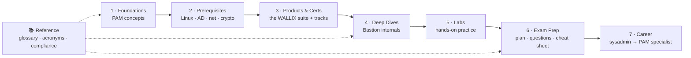
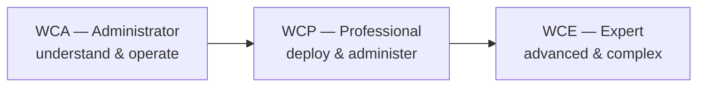
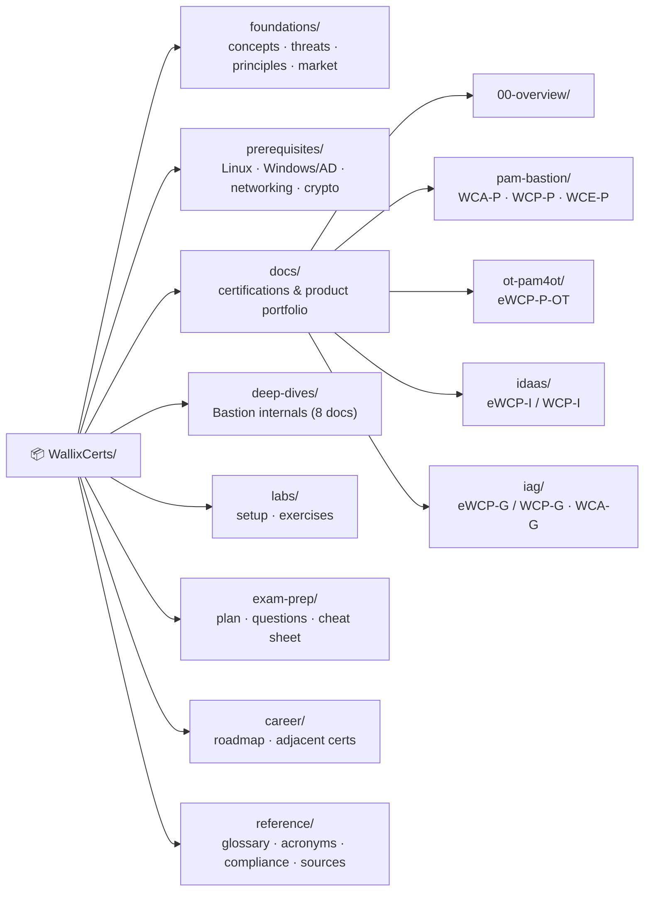

# 🔐 WallixCerts

### A source-grounded study hub for **Privileged Access Management** & the **WALLIX certifications**

*From “what is PAM?” to certified* — concepts, real diagrams, labs, exam prep, and a
career roadmap for a **systems administrator moving into cybersecurity**.

**A multi-certification study collection** — WALLIX / PAM (primary) · [CEH v13](ceh/README.md)

---

> [!NOTE]
> **Unofficial & no fabrication.** A community study compilation, not a WALLIX
> publication. Every factual claim is tied to an official WALLIX document or a reputable
> source (cited per page); unknowns are marked *“not specified in sources.”* Confirm
> current details with WALLIX Academy (`academy@wallix.com`). Compiled **2026-06-17**.

## 🗺️ The learning path

## 📦 What's inside

| # | Section | Start here |
|---|---------|-----------|
| 1 | **Foundations** — what PAM is, threats, core principles, market | [foundations/](foundations/README.md) |
| 2 | **Prerequisites** — Linux · Windows/AD · networking · crypto/PKI | [prerequisites/](prerequisites/README.md) |
| 3 | **Products & Certifications** — the WALLIX suite & cert tracks | [product portfolio](docs/00-overview/product-portfolio.md) · [framework](docs/00-overview/certification-framework.md) |
| 4 | **Deep dives** — WALLIX Bastion internals (8 docs) | [deep-dives/](deep-dives/README.md) |
| 5 | **Labs** — build a lab & guided exercises | [labs/](labs/README.md) |
| 6 | **Exam prep** — study plan, 54 practice Qs, cheat sheet | [exam-prep/](exam-prep/README.md) |
| 7 | **Career** — roadmap & adjacent certifications | [career/](career/README.md) |
| 📚 | **Reference** — glossary, acronyms, compliance, sources | [reference/](reference/README.md) |
| 🔌 | **Protocols** — how Kerberos, RADIUS, AD, LDAP & TLS actually work (mechanisms, encryption, diagrams) | [protocols/](protocols/README.md) |

## 🧭 Other certification content in this repo

Beyond WALLIX / PAM, this repo hosts a second full self-study hub plus concise orientation
pages — all built to the same standards (Mermaid diagrams, source-grounded, no fabrication):

- 🎯 **[Certified Ethical Hacker (CEH)](ceh/README.md)** — a **defense-oriented** EC-Council
  **CEH v13** hub: the 20 modules, the 5 phases, tools, safe-lab guidance, exam prep, and a
  glossary/acronyms. Educational & authorized-use only.
- 🧩 **[Adjacent certifications](adjacent-certs/README.md)** — concise overviews of CompTIA
  Security+, OSCP / PNPT, CISSP, and cloud security (Azure AZ-500 / AWS).
- 🗺️ **[Learning roadmap](learning-roadmap.md)** — how foundations, WALLIX/PAM, CEH, and the
  adjacent certs fit into one cyber-career path.
- ⚔️ **[Attack → Defense matrix](attack-to-defense-matrix.md)** — maps common attack
  techniques (from CEH, with MITRE ATT&CK IDs) to the PAM/WALLIX controls that stop them.
  The concrete bridge between the offensive and defensive hubs.

## 🎓 The WALLIX certification framework

Three progressive levels across product tracks. Code format `WC{level}-{track}`;
an `e` prefix means e-learning. Exam model: a final **MCQ requiring 70% to pass**.

| Track | Product | Administrator | Professional | Expert |
|-------|---------|---------------|--------------|--------|
| **PAM / Bastion** | WALLIX Bastion | [WCA-P](docs/pam-bastion/wca-p-administrator.md) | [WCP-P](docs/pam-bastion/wcp-p-professional.md) | [WCE-P](docs/pam-bastion/wce-p-expert.md) |
| **IAG** | WALLIX IAG | [WCA-G](docs/iag/wca-g-administrator.md) *(soon)* | [WCP-G](docs/iag/ewcp-g-professional.md) | — |
| **IDaaS** | WALLIX One IDaaS (Trustelem) | — | [WCP-I](docs/idaas/ewcp-i-professional.md) | — |
| **OT** | WALLIX PAM4OT | — | [eWCP-P-OT](docs/ot-pam4ot/ewcp-p-ot-professional.md) | — |

📂 <b>Full repository layout</b>

## 🔗 Quick links

- 🎓 [WALLIX Academy](https://www.wallix.com/support-services/wallix-academy/)
- 📘 [Official training catalog 2025–2026 (PDF)](https://www.wallix.com/wp-content/uploads/2024/04/WALLIX_TRAINING_2025-2026_ENG.pdf)
- 🧱 [Product portfolio technical overview](docs/00-overview/product-portfolio.md)
- 🧠 [Glossary](reference/glossary.md) · [Acronyms](reference/acronyms.md)
- 📚 [Full source list](reference/sources.md)

## 🤝 Contributing & license

Contributions welcome — see **[CONTRIBUTING.md](CONTRIBUTING.md)** (the no-fabrication
rule, page conventions, and a periodic verification checklist). Licensed under
**[MIT](LICENSE)**.

> Not affiliated with or endorsed by WALLIX. “WALLIX”, “Bastion”, “Trustelem”, “BestSafe”
> and related names are trademarks of their respective owners, used here for
> identification and educational purposes only.
