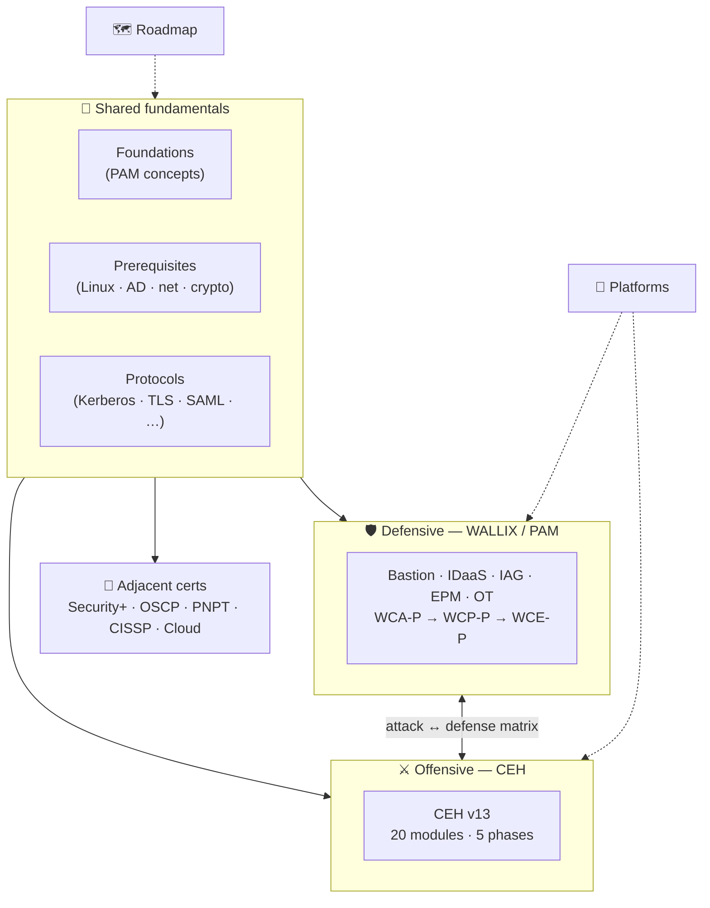
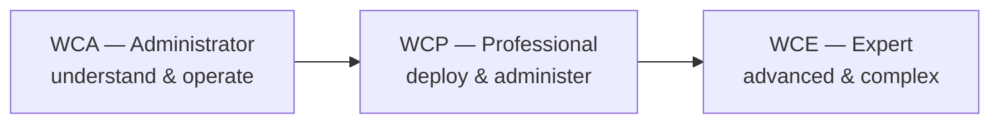
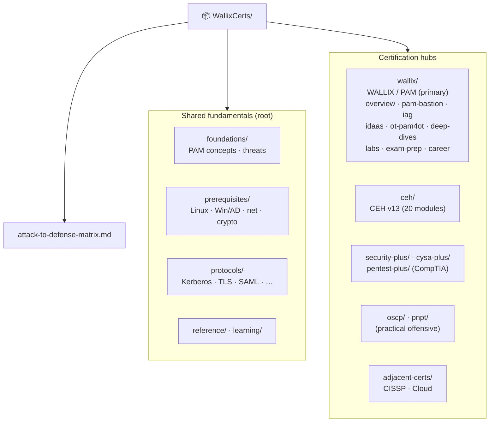

# 🔐 WallixCerts

### A source-grounded **cybersecurity certification study hub**

*From “what is a privileged account?” to certified.* Concepts, **real diagrams**, protocol
internals, labs, exam prep, and a career roadmap — for a **systems administrator moving
into cybersecurity**, anchored on **Privileged Access Management (PAM)** and **WALLIX**.

**[🌐 Read the site](https://morandeirachema.github.io/WallixCerts/)** ·
[🗺️ Roadmap](learning/roadmap.md) ·
[🛡️ WALLIX/PAM](wallix/README.md) ·
[⚔️ CEH](ceh/README.md) ·
[🔌 Protocols](protocols/README.md) ·
[🧰 Platforms](learning/platforms.md)

---

> [!NOTE]
> **Unofficial & no fabrication.** A community study compilation, not a vendor publication.
> Every factual claim is tied to an official document or reputable source (cited per page);
> unknowns are marked *“not specified in sources.”* Structural quality (valid links,
> Mermaid, sources) is [enforced in CI](.github/workflows/quality.yml). Updated **2026-06-19**.

## 🚀 Start here — pick your goal

| I want to… | Go to |
|------------|-------|
| 🛡️ **Get into PAM / pass a WALLIX cert** | [WALLIX / PAM hub](wallix/README.md) · [PAM/Bastion track](wallix/pam-bastion/README.md) |
| ⚔️ **Learn ethical hacking (CEH)** | [CEH v13 hub](ceh/README.md) · [the 20 modules](ceh/domains/README.md) |
| 🧱 **Get the vendor-neutral baseline (Security+)** | [Security+ hub](security-plus/README.md) · [the 5 domains](security-plus/domains/README.md) |
| 🔵 **Become a blue-team / SOC analyst (CySA+)** | [CySA+ hub](cysa-plus/README.md) · [the 4 domains](cysa-plus/domains/README.md) |
| 🟠 **Learn penetration testing (PenTest+ / OSCP / PNPT)** | [PenTest+](pentest-plus/README.md) · [OSCP](oscp/README.md) · [PNPT](pnpt/README.md) |
| 🔌 **Understand a protocol** (Kerberos, TLS, SAML…) | [Protocols](protocols/README.md) |
| 🧭 **Plan a cybersecurity career** | [Learning roadmap](learning/roadmap.md) |
| 🧰 **Find the best platforms to practice** | [Learning platforms](learning/platforms.md) |
| ⚔️🛡️ **See how attacks map to defenses** | [Attack → Defense matrix](attack-to-defense-matrix.md) |

## 🗺️ The big picture

## 📚 What's inside

**🧱 Shared fundamentals**

| Section | Covers |
|---------|--------|
| [Foundations](foundations/README.md) | What PAM is, privileged accounts, the threat landscape, least-privilege/JIT/Zero-Trust, the IAM/IGA/IDaaS/EPM map, market |
| [Prerequisites](prerequisites/README.md) | Linux · Windows/Active Directory · networking · cryptography & PKI (the sysadmin → cyber bridge) |
| [Protocols](protocols/README.md) | **8 mechanism deep dives** — Kerberos, AD, LDAP, RADIUS, TLS, SSH, SAML, OIDC/OAuth 2.0 (flows + how they encrypt) |

**🛡️ [WALLIX / PAM hub](wallix/README.md)** — all WALLIX material under `wallix/`

| Section | Covers |
|---------|--------|
| [Product portfolio](wallix/overview/product-portfolio.md) · [Cert framework](wallix/overview/certification-framework.md) | The WALLIX suite + how the certifications are structured |
| [PAM / Bastion track](wallix/pam-bastion/README.md) | **WCA-P → WCP-P → WCE-P** — curricula, scope, exam focus, study tips |
| [Deep dives](wallix/deep-dives/README.md) | **13 docs** — Bastion architecture, data model, sessions, secrets, auth, HA/DR, REST API, PAM4OT, IDaaS, IAG, EPM, WALLIX One |
| [Labs](wallix/labs/README.md) · [Exam prep](wallix/exam-prep/README.md) · [Career](wallix/career/README.md) | Build a lab, exercises, study plan, practice questions, cheat sheet, roadmap |

**⚔️ CEH hub** *(defense-oriented, educational & authorized-use only)*

| Section | Covers |
|---------|--------|
| [CEH v13 hub](ceh/README.md) | Overview, exam & eligibility, the 5 phases, **legal & ethics**, AI in ethical hacking, engagement & reporting |
| [The 20 modules](ceh/domains/README.md) | Recon → scanning → system hacking → malware → web → wireless → cloud → crypto, each with countermeasures |
| [Tools](ceh/tools/tools-by-phase.md) · [Labs](ceh/labs/building-a-ceh-lab.md) · [Exam prep](ceh/exam-prep/study-plan.md) | Tools by phase, safe-lab setup, study plan, 56 practice Qs, cheat sheet |

**🧱 CompTIA & practical cert hubs** *(vendor-neutral)*

| Hub | Focus | Exam |
|-----|-------|------|
| [Security+](security-plus/README.md) | Foundational baseline (defensive lean) | SY0-701 — [5 domains](security-plus/domains/README.md) |
| [CySA+](cysa-plus/README.md) | Blue-team / SOC analyst — detection & response | CS0-003 — [4 domains](cysa-plus/domains/README.md) |
| [PenTest+](pentest-plus/README.md) | Vendor-neutral penetration testing + reporting | PT0-003 — [5 domains](pentest-plus/domains/README.md) |
| [OSCP / OSCP+](oscp/README.md) | Hands-on offensive (24-hour exam) | OffSec PEN-200 — [skill areas](oscp/topics/README.md) |
| [PNPT](pnpt/README.md) | Practical engagement + live debrief | TCM Security — [engagement phases](pnpt/topics/README.md) |

**🧩 Adjacent certifications** — concise, provider-cited overviews

[CISSP](adjacent-certs/cissp.md) · [Cloud security (AZ-500 / AWS)](adjacent-certs/cloud-security.md) *(Security+, CySA+, PenTest+, OSCP & PNPT each have their own full hubs above)*

**🧭 Cross-cutting & reference**

[Learning roadmap](learning/roadmap.md) · [Attack → Defense matrix](attack-to-defense-matrix.md) · [Learning platforms](learning/platforms.md) · [Glossary](reference/glossary.md) · [Acronyms](reference/acronyms.md) · [Compliance & standards](reference/compliance-and-standards.md) · [Sources](reference/sources.md)

## 🎓 The WALLIX certification framework

Three progressive levels across product tracks. Code format `WC{level}-{track}`; an `e`
prefix means e-learning. Exam model: a final **multiple-choice exam requiring 70% to pass**.

| Track | Product | Administrator | Professional | Expert |
|-------|---------|---------------|--------------|--------|
| **PAM / Bastion** | WALLIX Bastion | [WCA-P](wallix/pam-bastion/wca-p-administrator.md) | [WCP-P](wallix/pam-bastion/wcp-p-professional.md) | [WCE-P](wallix/pam-bastion/wce-p-expert.md) |
| **IAG** | WALLIX IAG | [WCA-G](wallix/iag/wca-g-administrator.md) *(soon)* | [WCP-G](wallix/iag/ewcp-g-professional.md) | — |
| **IDaaS** | WALLIX One IDaaS (Trustelem) | — | [WCP-I](wallix/idaas/ewcp-i-professional.md) | — |
| **OT** | WALLIX PAM4OT | — | [eWCP-P-OT](wallix/ot-pam4ot/ewcp-p-ot-professional.md) | — |

## ✅ How this repo is built

- **No fabrication** — claims are cited or marked *“not specified in sources”*; flagged uncertainties stay flagged.
- **Diagrams are Mermaid**, never ASCII art — they render as real graphics on GitHub and the site.
- **Quality is CI-enforced** — every push runs [`scripts/check-docs.py`](scripts/check-docs.py): no ASCII, valid Mermaid, a Sources section per page, and **zero broken internal links/anchors**. See [MAINTENANCE.md](MAINTENANCE.md).
- Every page ends with a **Sources** list.

📂 <b>Full repository layout</b>

## 🔗 Quick links

- 🌐 **[Live documentation site](https://morandeirachema.github.io/WallixCerts/)**
- 🎓 [WALLIX Academy](https://www.wallix.com/support-services/wallix-academy/) · 📘 [Training catalog 2025–2026 (PDF)](https://www.wallix.com/wp-content/uploads/2024/04/WALLIX_TRAINING_2025-2026_ENG.pdf)
- 🎯 [EC-Council CEH](https://www.eccouncil.org/train-certify/certified-ethical-hacker-ceh/)
- 🧠 [Glossary](reference/glossary.md) · [Acronyms](reference/acronyms.md) · 📚 [Sources](reference/sources.md)

## 🤝 Contributing & license

Contributions welcome — see **[CONTRIBUTING.md](CONTRIBUTING.md)** (the no-fabrication rule,
Mermaid-only diagrams, page conventions, and the verification checklist). Report errors via
a [content-correction issue](SECURITY.md). Licensed under **[MIT](LICENSE)**.

> Not affiliated with or endorsed by WALLIX or EC-Council. “WALLIX”, “Bastion”,
> “Trustelem”, “BestSafe”, “CEH”, and related names are trademarks of their respective
> owners, used here for identification and educational purposes only. The offensive content
> is for **authorized, educational use only**.
