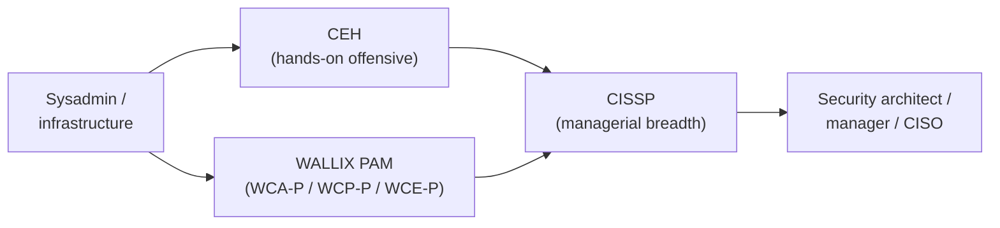

# (ISC)² CISSP — Certified Information Systems Security Professional

The **CISSP (Certified Information Systems Security Professional)** is a managerial, senior-level certification from **(ISC)²** (the International Information System Security Certification Consortium). It validates that you can **design, build, and manage** an organisation's whole security programme — not just operate a single tool. For a sysadmin moving toward security leadership, CISSP is the most widely recognised "breadth" credential and a common requirement in senior security and architecture job postings.

## Learning objectives

- Describe **what CISSP is**: provider, level, and the breadth it certifies.
- Identify **who** the certification is for and where it sits in a career path.
- List the **eight CBK (Common Body of Knowledge) domains** and their scope.
- Summarise the **exam format** (CAT — Computerized Adaptive Testing) with verified, cited specifics.
- State the **experience requirement** and the **Associate of (ISC)²** route.
- Explain **how CISSP fits** alongside the [CEH](../ceh/README.md) and [WALLIX/PAM](../wallix/overview/product-portfolio.md) tracks.

## What it is

- **Provider:** (ISC)², a vendor-neutral non-profit certification body.
- **Level:** Senior / managerial. It is a **management-and-architecture** credential, not a hands-on hacking certification.
- **Focus:** Governance, risk, architecture, and oversight of an enterprise security programme.
- It is **ANSI/ISO/IEC 17024 accredited** and recognised under standards such as the U.S. DoD 8570/8140 baseline (verify current status on isc2.org).

## Who it's for

- Experienced practitioners aiming for **Security Manager, Security Architect, CISO, or senior consultant** roles.
- Sysadmins and engineers who want to move from **operating** controls to **designing and governing** them.
- Anyone whose target job ads list CISSP as required or preferred.

> CISSP rewards **broad, managerial** knowledge. If your goal is hands-on offensive testing, [CEH](../ceh/README.md) is a closer fit; many professionals eventually hold both.

## Domains / scope — the 8 CBK domains

The Common Body of Knowledge (CBK) is organised into eight domains:

| # | Domain |
| --- | --- |
| 1 | Security and Risk Management |
| 2 | Asset Security |
| 3 | Security Architecture and Engineering |
| 4 | Communication and Network Security |
| 5 | Identity and Access Management (IAM) |
| 6 | Security Assessment and Testing |
| 7 | Security Operations |
| 8 | Software Development Security |

Domain weightings are revised periodically — confirm the current percentages in the **CISSP Certification Exam Outline (verify on isc2.org)**.

> Domain 5 (Identity and Access Management) is where CISSP overlaps most directly with **Privileged Access Management (PAM)** and the WALLIX track — see [How it fits](#how-it-fits-a-cyber-path).

## Exam format

| Item | Detail | Status |
| --- | --- | --- |
| Format | **CAT (Computerized Adaptive Testing)** for English exams | Verified (isc2.org) |
| Length | **100–150 items** | Verified (isc2.org) — *(verify on isc2.org)* |
| Time limit | **Up to 3 hours** | Verified (isc2.org) — *(verify on isc2.org)* |
| Question types | Multiple choice and advanced innovative items | Verify on isc2.org |
| Passing standard | Scaled **700 / 1000** | Verify on isc2.org |
| Languages / non-English | Non-English exams may use a **linear (fixed-length)** format | Verify on isc2.org |
| Exam price | Varies by region | *(verify on isc2.org)* — omitted to avoid stale pricing |

**CAT** means the exam adapts: each answer influences the difficulty of the next item, so the test converges on your ability level in fewer questions than a fixed-length exam.

## Prerequisites / experience

- **Minimum five (5) years** of cumulative, paid, full-time work experience in **at least two of the eight CBK domains** *(verify on isc2.org)*.
- **One year may be waived** with an approved four-year college degree (or regional equivalent) **or** an additional credential from the (ISC)² approved list *(verify on isc2.org)*.
- **Associate of (ISC)² route:** you may **pass the exam first without the experience**, becoming an **Associate of (ISC)²**, then earn the full CISSP once you accumulate the required experience (typically within six years) *(verify on isc2.org)*.
- Certification requires **endorsement** by an existing (ISC)² certified professional and ongoing **CPE (Continuing Professional Education)** credits plus an Annual Maintenance Fee to stay current *(verify on isc2.org)*.

> (ISC)² periodically updates its experience-waiver rules; confirm the latest policy on isc2.org before planning around a waiver.

## How it fits a cyber path

CISSP is the **breadth/management** anchor of a certification path; CEH and WALLIX/PAM add **offensive** and **deep technical/PAM** depth.

- **Relation to [CEH](../ceh/README.md):** CEH proves you can *find and exploit* weaknesses; CISSP proves you can *govern and design* the controls that prevent them. CISSP **Domain 6 (Security Assessment and Testing)** frames penetration testing from the management side that CEH performs hands-on.
- **Relation to WALLIX / PAM ([product portfolio](../wallix/overview/product-portfolio.md)):** CISSP **Domain 5 (IAM)** covers the identity, least-privilege, and access-control principles that a **Privileged Access Management (PAM)** product like WALLIX Bastion *enforces in practice*. CISSP gives you the policy and risk vocabulary; the [WALLIX certification framework](../wallix/overview/certification-framework.md) gives you the product-level skills.
- **Sequencing:** Most sysadmins reach CISSP **after** gaining the five years' experience, often holding CEH and/or a PAM credential first. The exam can be passed earlier via the Associate route.

## Study resources

- **Official (ISC)² CISSP Certification Exam Outline** — the authoritative domain list and weightings: https://www.isc2.org/certifications/cissp/cissp-certification-exam-outline
- **Official (ISC)² CISSP page** (training, self-paced, instructor-led): https://www.isc2.org/certifications/cissp
- **Official (ISC)² CISSP CBK Reference** and **(ISC)² Official Study Guide / Practice Tests** (Sybex).
- **Experience requirements page** (waivers, Associate route): https://www.isc2.org/certifications/cissp/cissp-experience-requirements
- Community study notes and reputable third-party courses — useful, but always reconcile domains and exam rules against the official outline.

## Related pages

- [Cloud security certifications](cloud-security.md) — sibling adjacent-cert overview.
- [CEH hub](../ceh/README.md) and [CEH cloud-computing domain](../ceh/domains/19-cloud-computing.md).
- [WALLIX product portfolio](../wallix/overview/product-portfolio.md) and [certification framework](../wallix/overview/certification-framework.md).

## Sources

- (ISC)² CISSP page: https://www.isc2.org/certifications/cissp
- (ISC)² CISSP Certification Exam Outline: https://www.isc2.org/certifications/cissp/cissp-certification-exam-outline
- (ISC)² CISSP Experience Requirements: https://www.isc2.org/certifications/cissp/cissp-experience-requirements
- (ISC)² Computerized Adaptive Testing format updates: https://www.isc2.org/Insights/2025/05/computerized-adaptive-testing-examination-format-updates
