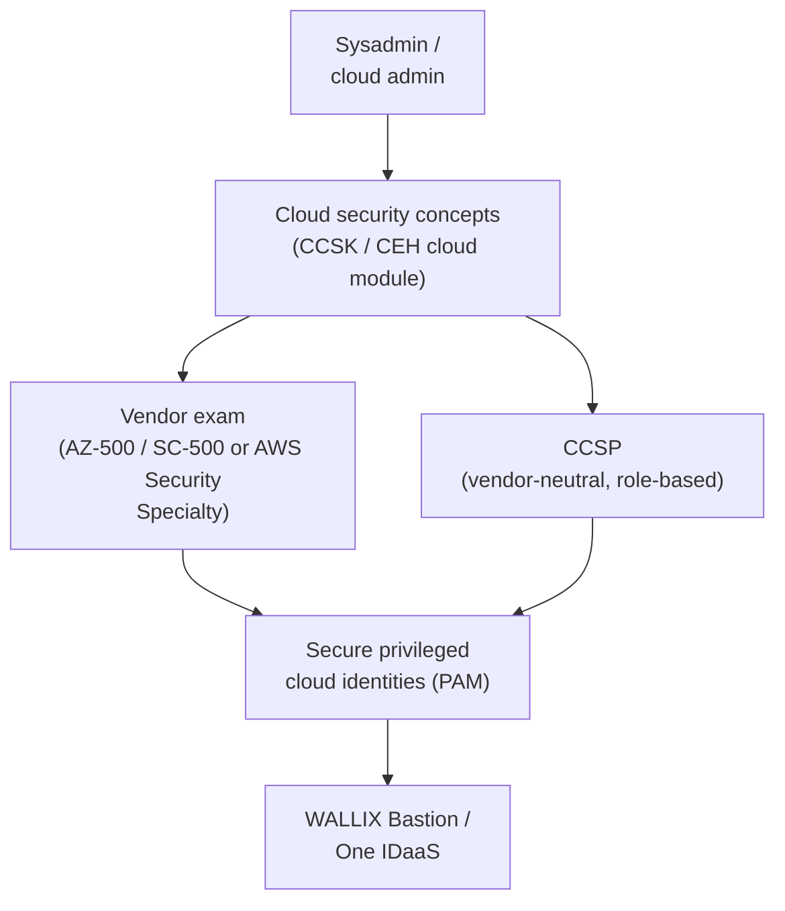

# Cloud Security Certifications

Cloud security certifications validate that you can secure workloads, identities, and data in **public-cloud** platforms. For a sysadmin, they are the natural next step once your infrastructure moves to **IaaS/PaaS/SaaS** (Infrastructure / Platform / Software as a Service) and the **shared-responsibility model** changes who secures what — the same model covered in the [CEH cloud-computing domain](../ceh/domains/19-cloud-computing.md). This page gives a concise overview of the two leading **vendor-specific** exams (Microsoft Azure and AWS) plus the **vendor-neutral** CCSP and CCSK, and explains how cloud security connects to **Privileged Access Management (PAM)**.

## Learning objectives

- Distinguish **vendor-specific** (Azure, AWS) from **vendor-neutral** (CCSP, CCSK) cloud security certifications.
- Recall the **AZ-500 retirement** and its **SC-500** successor, with verified dates.
- Summarise the **AWS Certified Security – Specialty** exam format with cited specifics.
- Explain how cloud security relates to **PAM (privileged cloud identities)** and the [CEH cloud module](../ceh/domains/19-cloud-computing.md).
- Pick a starting certification based on your platform and experience.

## What it is / who it's for

- **Provider & level:** Vendor exams (Microsoft, AWS) are **intermediate/specialty**, tied to one platform. Vendor-neutral exams ((ISC)² CCSP, CSA CCSK) test portable, cross-cloud concepts.
- **Who it's for:** Sysadmins, cloud and security engineers responsible for securing cloud infrastructure, identities, networking, and data — typically **after** some hands-on cloud administration experience.

## Microsoft Azure — AZ-500 (Azure Security Engineer Associate)

- **What it is:** Microsoft Certified **Azure Security Engineer Associate**, earned via **Exam AZ-500: Microsoft Azure Security Technologies**. Intermediate level.
- **Role/scope:** Implement, manage, and monitor security across Azure, multi-cloud, and hybrid environments using **Microsoft Defender for Cloud**, **Microsoft Sentinel**, and **Microsoft Entra ID**.
- **Skills assessed** (per the official certification page): Secure **identity and access**; secure **networking**; secure **compute, storage, and databases**; secure Azure using **Microsoft Defender for Cloud** and **Microsoft Sentinel**.

> ⚠️ **RETIREMENT — verify on learn.microsoft.com.** Microsoft's official certification page states this certification, its exam, and renewal assessments **retire on 31 August 2026**; after that date you can no longer earn or renew it. An already-earned certification **stays on your transcript** but is **not auto-converted**.

- **Successor:** Microsoft has announced **SC-500 — Cloud and AI Security Engineer Associate** (titled *"Implementing End-to-End Security Controls for Cloud and AI Workloads"*), listed as **(beta)** at the time of writing. It broadens scope to **cloud and AI workloads**. **Verify current status, exam availability, and whether you should target SC-500 instead of AZ-500 on learn.microsoft.com** before booking.

| Item | Detail | Status |
| --- | --- | --- |
| Exam | **AZ-500** | Verified (learn.microsoft.com) |
| Retirement | **31 Aug 2026** | Verified — *(verify on learn.microsoft.com)* |
| Successor | **SC-500 (beta)** Cloud and AI Security Engineer Associate | Verified — *(verify on learn.microsoft.com)* |
| Duration | **100 minutes** | Verified (learn.microsoft.com) — *(verify)* |
| Renewal | Annually, free online assessment on Microsoft Learn | Verified — *(verify)* |
| Price / # questions | Region-dependent; not fixed on the page | Omitted to avoid stale figures — *(verify on learn.microsoft.com)* |

## AWS Certified Security – Specialty

- **What it is:** AWS's specialty-level security credential for those who design and implement security solutions on AWS.
- **Exam code:** ⚠️ The brief referenced **SCS-C02**, but AWS has **moved to SCS-C03**; the older **SCS-C02** is being/has been retired (reported cutoff around **1 December 2025**). **Confirm the current code on aws.amazon.com.**

| Item | Detail | Status |
| --- | --- | --- |
| Current code | **SCS-C03** (SCS-C02 retiring) | *(verify on aws.amazon.com)* |
| Duration | **170 minutes** | Verified (aws.amazon.com) — *(verify)* |
| Questions | **65** (multiple choice / multiple response) | Verified (aws.amazon.com) — *(verify)* |
| Cost | **USD 300** | Verified (aws.amazon.com) — *(verify, region-dependent)* |
| Validity | **3 years** | Verified (aws.amazon.com) — *(verify)* |
| Delivery | Pearson VUE test centre or online proctored | Verified (aws.amazon.com) |
| Passing score | Scaled (reported ~750/1000) | *(verify on aws.amazon.com)* |
| Domains & weightings | e.g. threat detection/response, logging & monitoring, infrastructure security, IAM, data protection, application security | **Confirm exact domains and percentages in the official SCS-C03 exam guide (verify on aws.amazon.com)** |

> Domain names and weightings differ between SCS-C02 and SCS-C03 — do not rely on memory; pull the current **SCS-C03 exam guide** PDF from AWS.

## Vendor-neutral options: CCSP and CCSK

For portable, cross-cloud knowledge:

- **(ISC)² CCSP (Certified Cloud Security Professional):** vendor-neutral, **management-leaning** credential covering cloud architecture, design, operations, and compliance across **six CBK (Common Body of Knowledge) domains**. Uses **CAT (Computerized Adaptive Testing)**; has an **experience requirement** (reported ~5 years IT, with cloud/security components, and waiver options). It is the cloud-focused sibling of the [CISSP](cissp.md) — *(verify all specifics on isc2.org)*.
- **CSA CCSK (Certificate of Cloud Security Knowledge):** from the **Cloud Security Alliance (CSA)**. A **certificate** (not a job-role certification) with **no experience requirement**, based on the **CSA Security Guidance**, the **Cloud Controls Matrix (CCM)**, and the **ENISA** cloud risk report — a strong, low-barrier first step *(verify on cloudsecurityalliance.org)*.

> Rule of thumb: **CCSK** to learn the concepts cheaply and quickly; **CCSP** for a recognised role-based credential; **AZ-500/SC-500 or AWS Security – Specialty** to prove platform-specific depth.

## How it fits a cyber path — PAM and CEH

- **Relation to PAM (privileged cloud identities):** The cloud's biggest risk is **over-permissioned identities** — root accounts, admin roles, access keys, and service principals. A **Privileged Access Management (PAM)** solution like **WALLIX Bastion** brokers, vaults, rotates, and records access to these privileged cloud identities, enforcing the **least-privilege** and **just-in-time** access that AZ-500/SC-500 (Entra ID) and AWS Security (IAM) teach you to configure. Cloud security certifications teach you *how the platform's access model works*; PAM is *how you keep that access controlled and auditable*. See the [WALLIX product portfolio](../wallix/overview/product-portfolio.md) and [certification framework](../wallix/overview/certification-framework.md).
- **Relation to [CEH](../ceh/README.md):** The **[CEH cloud-computing module](../ceh/domains/19-cloud-computing.md)** introduces the same **shared-responsibility model**, IaaS/PaaS/SaaS distinctions, container and serverless risks, and **misconfiguration** as the leading breach cause. CEH frames these from a **testing/offensive** angle; the vendor and CCSP/CCSK exams frame them from a **build-and-defend** angle. They reinforce each other.

## Study resources

- **Microsoft AZ-500 / SC-500:** official study guides and certification pages —
  - AZ-500: https://learn.microsoft.com/en-us/credentials/certifications/azure-security-engineer/
  - SC-500 study guide: https://learn.microsoft.com/en-us/credentials/certifications/resources/study-guides/sc-500
- **AWS Certified Security – Specialty:** official exam page and the **SCS-C03 exam guide** on AWS Skill Builder — https://aws.amazon.com/certification/certified-security-specialty/
- **(ISC)² CCSP:** exam outline and page — https://www.isc2.org/certifications/ccsp
- **CSA CCSK:** Cloud Security Alliance training and the CSA Security Guidance — https://cloudsecurityalliance.org/education/ccsk
- Hands-on practice in a free-tier cloud account beats reading alone; reconcile every exam detail against the provider's current page.

## Related pages

- [CISSP overview](cissp.md) — managerial breadth credential (CCSP is its cloud sibling).
- [CEH hub](../ceh/README.md) and [CEH cloud-computing domain](../ceh/domains/19-cloud-computing.md).
- [WALLIX product portfolio](../wallix/overview/product-portfolio.md) and [certification framework](../wallix/overview/certification-framework.md).

## Sources

- Microsoft Azure Security Engineer Associate (AZ-500), incl. retirement notice: https://learn.microsoft.com/en-us/credentials/certifications/azure-security-engineer/
- Microsoft SC-500 (Cloud and AI Security Engineer Associate) study guide: https://learn.microsoft.com/en-us/credentials/certifications/resources/study-guides/sc-500
- AWS Certified Security – Specialty: https://aws.amazon.com/certification/certified-security-specialty/
- AWS SCS-C03 exam guide (docs): https://docs.aws.amazon.com/aws-certification/latest/examguides/security-specialty-03.html
- (ISC)² CCSP: https://www.isc2.org/certifications/ccsp
- Cloud Security Alliance CCSK: https://cloudsecurityalliance.org/education/ccsk
