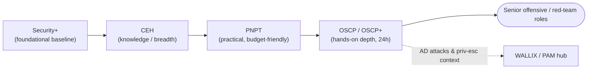

# OSCP / OSCP+ (OffSec PEN-200) — Overview

The **Offensive Security Certified Professional (OSCP)** is a hands-on penetration-testing certification from **OffSec** (formerly Offensive Security). It is earned by passing a fully practical, proctored exam tied to the **PEN-200: Penetration Testing with Kali Linux** course. OSCP is widely regarded as a benchmark proof of *practical* offensive skill — you must actually compromise live machines, not answer multiple-choice questions.

> **Unofficial & no fabrication.** Not affiliated with or endorsed by OffSec. Exam specifics below are from OffSec's official PEN-200 page and OSCP+ exam documentation; anything volatile (price, exact structure) should be re-checked there. Compiled **2026-06-18**.

## Learning objectives

- Describe what OSCP / OSCP+ is and how it relates to the PEN-200 course.
- Identify who OSCP is for and the assumed prerequisites.
- Summarise the scope of skills the exam tests.
- State the verified exam format (hands-on time, report window, scoring) and mark volatile details.
- Contrast OSCP (hands-on) with **CEH** (knowledge) and place it in a cyber path.

## What it is

| Attribute | Detail |
| --- | --- |
| Provider | OffSec (Offensive Security), vendor-neutral |
| Level | Intermediate — respected, demanding hands-on credential |
| Course | **PEN-200: Penetration Testing with Kali Linux** |
| Style | **Fully hands-on**: exploit live targets in a lab, then write a professional report |
| OSCP vs OSCP+ | **OSCP** does not expire; **OSCP+** (awarded for the current AD-inclusive exam) **expires 3 years** from issuance and is maintained via Continuing Professional Education (CPE) or higher OffSec certs *(verify on OffSec — terms change)* |

## Who it's for

- Aspiring and working **penetration testers / red-teamers** who need to prove practical skill.
- Sysadmins and security pros moving into offensive work who already have a hands-on foundation.

OffSec's assumed background: **TCP/IP networking, Windows and Linux administration, and basic Bash or Python scripting**. There is no formal prerequisite exam, but OSCP is not an entry-level cert — a sysadmin should shore up scripting and exploitation fundamentals first.

## Domains / scope

PEN-200 covers, and the exam tests, the practical penetration-testing workflow, including:

- Enumeration and information gathering
- Exploitation of common vulnerabilities and public exploits (with modification)
- **Windows and Linux privilege escalation**
- **Active Directory (AD) attacks** and lateral movement
- Client-side and web-application attack basics; AWS cloud infrastructure assessment is part of recent course content *(verify on OffSec — module list evolves)*
- Professional **report writing**

## Exam format (verified)

| Item | Detail | Source note |
| --- | --- | --- |
| Hands-on exam | **24-hour proctored** assessment over a private VPN (active hacking window is just under 24 hours) | OffSec PEN-200 / OSCP+ guide |
| Report | **Separate ~24-hour window** after the hacking phase to write and submit a professional PDF report | OffSec OSCP+ exam documentation |
| Total points | **100** | OffSec OSCP+ exam guide |
| Passing score | **70 / 100** | OffSec OSCP+ exam guide |
| Active Directory set | **1 AD set of 3 machines = 40 points** (mandatory weighting) | OffSec OSCP+ exam guide |
| Standalone machines | **3 standalone machines = 60 points** (local.txt / proof.txt flags) | OffSec OSCP+ exam guide |
| Bonus points | **None** — removed as of 1 November 2024; score is exam performance only | OffSec OSCP+ exam guide |
| Price | **Not quoted here — verify on OffSec** (course/exam bundle and Learn One subscription prices change) | omitted to avoid stale figures |

> Two artifacts, one exam: the **hands-on compromise** and the **separate written report** are both required. Failing to document properly can fail an otherwise-passing exam.

## How it fits a cyber path: CEH (knowledge) vs OSCP (hands-on)

This is the key contrast for this repo:

| | **CEH** (EC-Council) | **OSCP** (OffSec) |
| --- | --- | --- |
| Primary mode | **Knowledge** — mostly multiple-choice (CEH Practical is the optional hands-on add-on) | **Hands-on** — you must actually exploit live machines |
| Breadth vs depth | Broad survey of attacks and tools | Deep, practical exploitation workflow |
| Proves | You *understand* attacker tactics, techniques, and procedures (TTPs) | You *can perform* an end-to-end compromise and report it |
| Typical order | Often earned first, for breadth and job-filter coverage | Often the next, harder milestone on an offensive track |

A common progression is **CEH for breadth/methodology vocabulary → a practical credential → OSCP for depth.** See this repo's [CEH hub](../ceh/README.md) and the [CEH career & adjacent certs page](../ceh/career/ceh-career-and-adjacent-certs.md).

- **Budget-friendly stepping stone:** the TCM Security **PNPT** is frequently used as a more affordable, also-practical lead-in or alternative to OSCP — see [pnpt.md](./pnpt.md).
- **Foundational baseline first:** if you lack a vendor-neutral security baseline, [security-plus.md](./security-plus.md) comes earlier.
- **Relative to WALLIX / Privileged Access Management (PAM):** OSCP's AD-attack and privilege-escalation focus is exactly the lateral-movement and credential-abuse activity that PAM platforms such as WALLIX are designed to constrain — useful attacker context for defenders deploying PAM.

## Study resources

- **Official:** [OffSec PEN-200 / OSCP page](https://www.offsec.com/courses/pen-200/) — course content, exam structure, Learn One subscription.
- **Official exam guide:** OffSec OSCP+ Exam Guide (rules, proctoring, scoring) — search the OffSec support portal *(verify — link/structure changes)*.
- **Practice:** OffSec's own lab machines, plus community ranges (e.g., Hack The Box, Proving Grounds). Build comfort with enumeration, manual exploitation, and AD attacks.
- **In this repo:** [CEH labs](../ceh/labs/building-a-ceh-lab.md) and [tools by phase](../ceh/tools/tools-by-phase.md) help you practise the underlying techniques safely and legally.

> Use offensive techniques only against systems you own or are **explicitly authorised in writing** to test. See the CEH hub's [legal & ethics](../ceh/00-overview/legal-and-ethics.md) note.

## Sources

- OffSec — PEN-200 / OSCP official course page (course scope, 24-hour proctored exam, 3 standalone machines = 60 pts, 1 AD set of 3 machines = 40 pts, OSCP vs OSCP+ 3-year validity): https://www.offsec.com/courses/pen-200/
- OffSec — OSCP+ Exam Guide / Exam FAQ (70/100 to pass, 100 total points, AD set = 40 pts, no bonus points since 1 Nov 2024, report window): https://help.offsec.com/hc/en-us/articles/360040165632-OSCP-Exam-Guide
- Related in this repo: [../ceh/README.md](../ceh/README.md) · [../ceh/career/ceh-career-and-adjacent-certs.md](../ceh/career/ceh-career-and-adjacent-certs.md) · [security-plus.md](./security-plus.md) · [pnpt.md](./pnpt.md)
- Verify all volatile specifics (price, exact exam structure, validity/CPE terms) on OffSec's site — programs change.
