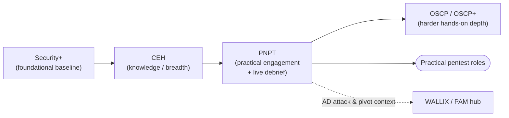

# PNPT (TCM Security Practical Network Penetration Tester) — Overview

> 📚 **There's now a full PNPT study hub** → **[../pnpt/](../pnpt/README.md)** — the engagement
> phases (OSINT → external → Active Directory → lateral movement → report & debrief), exam
> structure, and a study plan. This page stays as a one-screen orientation.

The **Practical Network Penetration Tester (PNPT)** is a hands-on penetration-testing certification from **TCM Security**. It is built around a realistic, multi-day network assessment: you perform reconnaissance, compromise an **Active Directory (AD)** environment, write a professional report, and then **present your findings in a live debrief** to senior penetration testers. It is widely positioned as a **budget-friendly, real-world alternative to the OSCP**.

> **Unofficial & no fabrication.** Not affiliated with or endorsed by TCM Security. Exam specifics below are from TCM Security's official PNPT page; anything volatile (price, exact structure) should be re-checked there. Compiled **2026-06-18**.

## Learning objectives

- Describe what the PNPT is and what makes its format distinctive (the live debrief).
- Identify who the PNPT is for and the suggested preparation.
- Summarise the exam's scope.
- State the verified exam format and mark volatile details.
- Position the PNPT as a practical, affordable lead-in or alternative to OSCP, and relate it to this repo's CEH and WALLIX/PAM material.

## What it is

| Attribute | Detail |
| --- | --- |
| Provider | TCM Security (vendor-neutral) |
| Level | Practical, real-world; pitched between foundational and OSCP-level difficulty |
| Style | **Fully practical** simulated engagement — **no flags, no multiple choice** |
| Distinctive feature | A **live 15-minute report debrief** with TCM's senior penetration testers |
| Validity | **Does not expire** (per TCM, as of 17 April 2023); exam vouchers valid 12 months from purchase *(verify on TCM — terms change)* |

## Who it's for

- Aspiring **network penetration testers** and ethical hackers wanting a realistic, affordable practical cert.
- Sysadmins and IT pros moving into offensive work who want an engagement-style assessment rather than a flag-hunt.

TCM recommends beginners complete the **Practical Junior Penetration Tester (PJPT)** first. The PNPT voucher bundles a full training path, so it is approachable for motivated newcomers while still being a genuine hands-on test.

## Domains / scope

The PNPT assessment simulates a full external-to-internal engagement and evaluates:

- **Open-Source Intelligence (OSINT)** reconnaissance
- External penetration testing
- **Active Directory exploitation** and Domain Controller compromise
- **Antivirus and egress-filtering bypass** techniques
- **Lateral and vertical movement** (pivoting and privilege escalation)
- Professional **report documentation** and a **live presentation/defence** of findings

## Exam format (verified)

| Item | Detail | Source note |
| --- | --- | --- |
| Practical exam | **5 full days** to complete the assessment | TCM Security official page |
| Report | **2 additional days** to write a professional report | TCM Security official page |
| Debrief | **Live 15-minute debrief** presenting to senior penetration testers | TCM Security official page |
| Question style | No multiple choice, no capture-the-flag flags — a realistic engagement | TCM Security official page |
| Tools | All tools permitted (including AI-enabled), with disclosure required in the report | TCM Security official page |
| Included | 1 exam attempt **+ 1 free retake**, plus bundled on-demand training (12-month access) | TCM Security official page |
| Price | **Verify on TCM Security** — listed around the **US$399–$499** range recently *(verify — sale/regular pricing changes)* | stated with source caveat |

> The **live debrief** is the PNPT's signature element: you must not only compromise the environment and document it, but also explain and defend your methodology like a real consultant — practice many other certs do not require.

## How it fits a cyber path

The PNPT sits on the **practical offensive** track, typically after a breadth foundation and often **before, or instead of, the OSCP**.

- **Budget-friendly OSCP alternative:** the PNPT is markedly cheaper than OSCP and is engagement-style (OSINT → external → AD → report → debrief) rather than a points-based flag exam. Many use it as a confidence-building lead-in to [OSCP](oscp.md), or as a standalone practical credential. The free retake lowers the cost of a first failure.
- **Relative to this repo's CEH hub:** **CEH** (EC-Council Certified Ethical Hacker) is largely **knowledge/breadth** (mostly multiple-choice); the PNPT is **fully hands-on and report-driven**. CEH gives the methodology vocabulary; the PNPT proves you can run an end-to-end engagement. See [../ceh/README.md](../ceh/README.md) and the [CEH career & adjacent certs page](../ceh/career/ceh-career-and-adjacent-certs.md).
- **Foundational baseline first:** if you need a vendor-neutral baseline, start with [security-plus.md](security-plus.md).
- **Relative to WALLIX / Privileged Access Management (PAM):** the PNPT's AD-compromise and lateral-movement focus mirrors exactly the privileged-credential abuse that PAM platforms such as WALLIX aim to prevent and audit — strong attacker context for defenders working with PAM.

## Study resources

- **Official:** [TCM Security PNPT page](https://certifications.tcm-sec.com/pnpt/) — exam details, included training path, retake policy.
- **Bundled training path** (typically included with the voucher): Practical Ethical Hacking, Windows/Linux Privilege Escalation, OSINT Fundamentals, External Pentest Playbook.
- **Recommended lead-in:** the **PJPT (Practical Junior Penetration Tester)** for those newer to AD attacks.
- **Practice:** build a small Active Directory lab to rehearse OSINT → external foothold → privilege escalation → lateral movement → reporting. This repo's [CEH labs](../ceh/labs/building-a-ceh-lab.md) cover safe lab construction.

> Use offensive techniques only against systems you own or are **explicitly authorised in writing** to test. See the CEH hub's [legal & ethics](../ceh/00-overview/legal-and-ethics.md) note.

## Sources

- TCM Security — PNPT official certification page (5-day practical exam, 2-day report window, live 15-minute debrief, OSINT/AD/AV-bypass/pivoting scope, free retake, bundled training, non-expiring cert): https://certifications.tcm-sec.com/pnpt/
- TCM Security — certifications hub (PJPT and related): https://certifications.tcm-sec.com/
- Related in this repo: [../ceh/README.md](../ceh/README.md) · [../ceh/career/ceh-career-and-adjacent-certs.md](../ceh/career/ceh-career-and-adjacent-certs.md) · [security-plus.md](security-plus.md) · [oscp.md](oscp.md)
- Verify all volatile specifics (price, exact structure, voucher/retake terms) on TCM Security's site — programs change.
