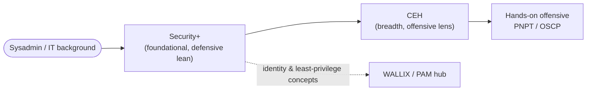

# CompTIA Security+ (SY0-701) — Overview

> 📚 **There's now a full Security+ study hub** → **[../security-plus/](../security-plus/README.md)**
> — the five domains taught in depth, exam prep, practice questions, cheat sheet, and a long
> acronym/glossary reference. This page stays as a one-screen orientation.

CompTIA **Security+** is a vendor-neutral, foundational cybersecurity certification from **CompTIA** (the Computing Technology Industry Association). It validates the core knowledge needed for entry-level security roles and is one of the most widely requested baseline credentials in job postings. The current exam at the time of writing is **SY0-701** *(verify on [CompTIA](https://www.comptia.org/en-us/certifications/security/) — specifics change)*; CompTIA refreshes the exam code roughly every three years.

> **Unofficial & no fabrication.** Not affiliated with or endorsed by CompTIA. Exam specifics below are from CompTIA's official Security+ page; anything volatile (price, exam code, retirement date) should be re-checked there before you rely on it. Compiled **2026-06-18**.

## Learning objectives

- Describe what Security+ is and where it sits (vendor-neutral, foundational, defensive-leaning).
- Identify who Security+ is for and what experience CompTIA recommends.
- Summarise the five exam domains and their weightings.
- State the verified exam format and note which details change over time.
- Place Security+ in a sysadmin-to-security path and relate it to this repo's CEH and WALLIX/PAM material.

## What it is

| Attribute | Detail |
| --- | --- |
| Provider | CompTIA (vendor-neutral) |
| Level | Foundational / entry-level |
| Style | Broad security fundamentals with a **defensive (blue-team) lean** |
| Current exam | **SY0-701**, launched 7 November 2023; retirement estimated ~2026 *(verify — CompTIA rotates codes)* |
| Vendor-neutral? | Yes — not tied to any product |

Security+ is **breadth, not depth**: it surveys threats, architecture, operations, and governance at a working level rather than drilling into one platform or into hands-on exploitation.

## Who it's for

- Sysadmins, network admins, and help-desk staff making a first move into security.
- Anyone needing a recognised baseline credential to clear job-posting filters.
- US federal and defence-contractor staff who need a **DoD 8140**-aligned baseline (see below).

CompTIA's recommended (not mandatory) experience is **CompTIA Network+ and about two years in a security or systems-administrator role**. A sysadmin's networking and operating-system background maps directly onto this material.

## Domains / scope

Five domains, with CompTIA's published weightings *(verify on [CompTIA](https://www.comptia.org/en-us/certifications/security/) — weightings change per exam version)*:

| Domain | Weight |
| --- | --- |
| General Security Concepts | 12% |
| Threats, Vulnerabilities, and Mitigations | 22% |
| Security Architecture | 18% |
| Security Operations | 28% |
| Security Program Management and Oversight | 20% |

## Exam format (verified)

| Item | Detail | Source note |
| --- | --- | --- |
| Exam code | SY0-701 | CompTIA — verify; codes rotate ~every 3 years |
| Questions | **Maximum 90**, mix of multiple-choice and **performance-based questions (PBQs)** | CompTIA official page |
| Duration | **90 minutes** | CompTIA official page |
| Passing score | **750** on a scale of **100–900** | CompTIA official page |
| Languages | English, Japanese, Portuguese, Spanish, Thai | CompTIA official page |
| Price / renewal (CEUs) | **Not quoted here — verify on CompTIA** (price and the Continuing Education / CEU renewal terms change) | omitted to avoid stale figures |

> Performance-based questions are interactive simulations (e.g., configuring a setting or analysing output), not just multiple choice — they are why hands-on familiarity helps.

## DoD 8140 / 8570 relevance

Security+ is long-established as a **United States Department of Defense (DoD)** baseline credential. CompTIA states Security+ aligns with multiple **DoD Directive 8140** cyber work roles (e.g., cyber defense analyst, incident responder, vulnerability analyst, security control assessor). DoD 8140 is the current cyber workforce framework that succeeded the older **DoD 8570** information-assurance baseline, under which Security+ was a staple. This DoD alignment is a major reason Security+ appears so often in US government and defence-contractor job requirements.

- **Verify current status** on the DoD cyber workforce site — approved-certification lists and role mappings are revised over time: US DoD Cyber Workforce — https://public.cyber.mil/ *(verify on DoD / CompTIA — specifics change)*.

## How it fits a cyber path

Security+ is typically a **first or early** security certification — the breadth baseline you earn before choosing an offensive or defensive track.

- **Relative to this repo's CEH hub:** Security+ and **CEH** (EC-Council Certified Ethical Hacker) are both vendor-neutral and breadth-focused, but Security+ leans **defensive/foundational** while CEH adds the **offensive lens** on top. A common order is Security+ then CEH. See [../ceh/README.md](../ceh/README.md) and the [CEH career & adjacent certs page](../ceh/career/ceh-career-and-adjacent-certs.md).
- **Relative to WALLIX / Privileged Access Management (PAM):** Security+ gives you the access-control, identity, and least-privilege concepts that PAM products such as WALLIX operationalise — useful background before working with a specific PAM platform.
- **Next steps:** depth-focused hands-on certs follow once you pick a track — see the offensive siblings [oscp.md](oscp.md) and [pnpt.md](pnpt.md).

## Study resources

- **Official:** [CompTIA Security+ page](https://www.comptia.org/en-us/certifications/security/) — exam objectives PDF, CertMaster Learn/Labs/Practice.
- **Recommended experience:** CompTIA Network+ plus ~2 years in a security or sysadmin role.
- **Practice:** download the current exam objectives and work performance-based labs; a sysadmin home lab covering networking, identity, and logging maps well to the Security Operations domain.
- **In this repo:** the [CEH labs](../ceh/labs/building-a-ceh-lab.md) and [reference glossary](../ceh/reference/glossary.md) reinforce shared fundamentals.

## Sources

- CompTIA — Security+ (SY0-701) official certification page (exam code, ~90 questions, 90 minutes, 750/100–900 passing score, domain weightings, recommended experience, DoD 8140 alignment): https://www.comptia.org/en-us/certifications/security/
- US DoD Cyber Workforce, Directives 8140 / 8570 (verify current Security+ mapping): https://public.cyber.mil/
- Related in this repo: [../ceh/README.md](../ceh/README.md) · [../ceh/career/ceh-career-and-adjacent-certs.md](../ceh/career/ceh-career-and-adjacent-certs.md) · [oscp.md](oscp.md) · [pnpt.md](pnpt.md)
- Verify all volatile specifics (price, exam code, retirement date, CEU renewal) on CompTIA's site — programs change.
