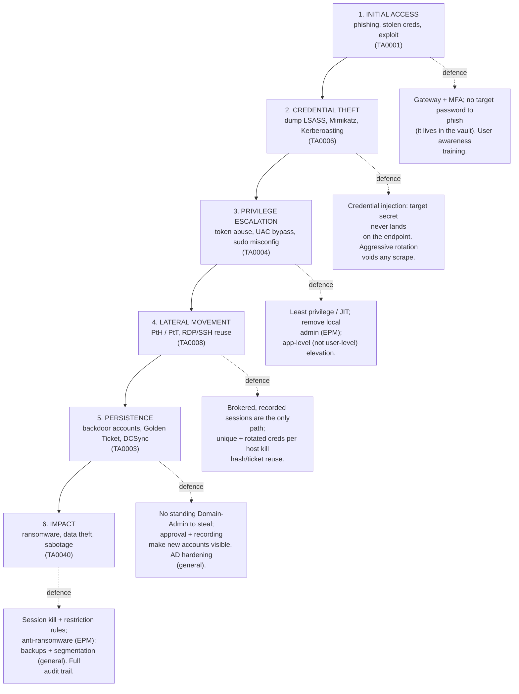

# Attack-to-Defense Matrix — Mapping CEH Attacks to PAM/WALLIX Controls

This page is the **bridge between the two hubs** of this repository: the **offensive
hub** (the [Certified Ethical Hacker (CEH) program](ceh/README.md)) and the **defensive
hub** (the [WALLIX / Privileged Access Management material](README.md)). It takes the
attack techniques a CEH candidate studies and maps each one to the **Privileged Access
Management (PAM)** and endpoint controls that blunt it — citing the relevant
**MITRE ATT&CK** technique IDs and linking back into both hubs.

It deliberately follows, and does not contradict, the
[PAM threat landscape](foundations/pam-threat-landscape.md) page, which already lays out
the attack chain and the headline credential-centric techniques. Where this page adds
value is breadth (more techniques) and **cross-linking**: every row points you to the
CEH page that explains the *attack* and the WALLIX/foundations page that explains the
*defence*.

> **Honest framing.** Some controls below are **WALLIX-specific features** (e.g. credential
> injection on the back leg, the Session Probe, change-on-check-in rotation). Others are
> **general best practice** that PAM supports but does not own (MFA, network segmentation,
> AD hardening, SIEM detection). Each row says which is which. PAM is one layer of
> **defence-in-depth**, not a silver bullet — see the closing note.

## Learning objectives

After working through this page you should be able to:

- Walk the **attack chain** — initial access → credential theft → privilege escalation →
  lateral movement → persistence → impact — and name a defensive intervention at each stage.
- Map at least ten **MITRE ATT&CK** techniques (credential dumping, Pass-the-Hash,
  Pass-the-Ticket, Kerberoasting, Golden/Silver Ticket, phishing, valid accounts, remote
  services, privilege escalation, account manipulation/creation) to concrete controls.
- Distinguish a **WALLIX Bastion / BestSafe feature** from a **general best-practice
  control** for each mapping.
- Explain *why* keeping the target secret off the endpoint (vault + injection), rotating
  it aggressively, brokering every hop, and recording everything breaks the middle of the
  attack chain.
- Use this page as an index into both the CEH domain pages and the WALLIX deep-dives.

---

## 1. The attack chain with defensive interventions overlaid

The flowchart below is the kill-chain from the
[PAM threat landscape](foundations/pam-threat-landscape.md#2-the-attack-chain-kill-chain)
(stages and ATT&CK tactics unchanged), with the **defensive interventions** that fire at
each stage drawn alongside. The middle stages (credential theft → persistence) are where
PAM does most of its work; the bookends (initial access, impact) lean more on general
controls.

> **The one sentence to remember** (from the threat-landscape page): *PAM breaks the
> attack chain at stages 2-5 by keeping the credential out of the attacker's reach (vault
> + injection), making any stolen secret short-lived (rotation), forcing every privileged
> hop through a recorded gateway (brokering + JIT), and making everything auditable
> (non-repudiation).*

---

## 2. Mapping table — credential-centric attacks

These are the attacks that turn on a **usable secret** (hash, ticket, or password). They
are the heart of the CEH [System Hacking](ceh/domains/06-system-hacking.md) module and the
PAM thesis: remove the secret from the endpoint, rotate it constantly, and most of them
collapse.

| Attack technique | What it does | MITRE ATT&CK ID | How PAM/WALLIX (+ general controls) mitigate it | Learn more |
|---|---|---|---|---|
| **Credential dumping / LSASS (Mimikatz)** | Scrapes password hashes, tickets and plaintext from the Windows **LSASS** process memory on a host the attacker controls. | [T1003.001](https://attack.mitre.org/techniques/T1003/001/) (OS Credential Dumping: LSASS Memory), parent [T1003](https://attack.mitre.org/techniques/T1003/) | **WALLIX:** credential injection on the back leg means the **target password never lands on the admin's endpoint** — there is little of value to dump; frequent **rotation** voids anything scraped. **General:** Credential Guard, attack-surface-reduction rules, EDR. | Attack: [System hacking — credential dumping / Mimikatz](ceh/domains/06-system-hacking.md#1-gaining-access). Defence: [Bastion architecture — the proxy/gateway model](deep-dives/bastion-architecture.md#1-the-proxygateway-model--why-a-bastion-exists), [Secrets & password management](deep-dives/secrets-and-password-management.md) |
| **Pass-the-Hash (PtH)** | Authenticates using a stolen **NTLM hash** without ever cracking it — the hash is the key, enabling lateral movement. | [T1550.002](https://attack.mitre.org/techniques/T1550/002/) (Use Alternate Authentication Material: Pass the Hash) | **WALLIX:** no standing local-admin secret on endpoints; **unique, rotated** credentials per account/host stop hash reuse across machines; **BestSafe** removes local admin and rotates each local password per machine/per day. **General:** disable NTLM where possible, Protected Users group, AD tiering. | Attack: [Active Directory — pass-the-hash](protocols/active-directory.md#7-authentication-ntlm-legacy). Defence: [EPM / BestSafe](deep-dives/epm-bestsafe.md#3-key-features), [Threat landscape — PtH row](foundations/pam-threat-landscape.md#4-map-to-mitre-attck--how-pam-mitigates-each) |
| **Pass-the-Ticket (PtT)** | Replays a stolen **Kerberos ticket** (TGT/TGS) extracted from memory to impersonate a user without the password, until the ticket expires. | [T1550.003](https://attack.mitre.org/techniques/T1550/003/) (Use Alternate Authentication Material: Pass the Ticket) | **WALLIX:** sessions are **brokered and time-boxed (JIT)**; short-lived access plus recording limit ticket reuse and make abuse visible. **General:** short ticket lifetimes, Credential Guard, AD tiering. | Attack: [Kerberos — pass-the-ticket](protocols/kerberos.md#security-notes--common-attacks). Defence: [Session management](deep-dives/session-management.md), [Core concepts — JIT / ZSP](foundations/core-concepts-least-privilege-jit-zero-trust.md#just-in-time-jit-access) |
| **Kerberoasting** | Requests service tickets (TGS) for **service accounts** by their SPN, then cracks them **offline** to recover the service-account password. | [T1558.003](https://attack.mitre.org/techniques/T1558/003/) (Steal or Forge Kerberos Tickets: Kerberoasting) | **WALLIX:** the **vault + automatic rotation** give service accounts **long (≥16-char), random, frequently-changed** passwords that cannot be cracked offline in time; **AAPM/WAAPM** removes hard-coded service passwords from scripts. **General:** group Managed Service Accounts (gMSA), AES etypes (disable RC4). | Attack: [Kerberos — Kerberoasting](protocols/kerberos.md#security-notes--common-attacks). Defence: [Secrets & password management — rotation](deep-dives/secrets-and-password-management.md#3-secret-rotation-and-password-change-policies), [AAPM/WAAPM](deep-dives/secrets-and-password-management.md#7-aapm--waapm--application-to-application-secret-retrieval) |
| **Golden Ticket** | Forges a TGT using the AD **krbtgt** key — near-unlimited, long-lived domain access. A **post-Domain-Admin** technique. | [T1558.001](https://attack.mitre.org/techniques/T1558/001/) (Steal or Forge Kerberos Tickets: Golden Ticket) | **WALLIX (indirect):** PAM does not forge-proof Kerberos, but by **preventing the Domain-Admin compromise** that enables krbtgt theft (no standing DA, brokered + recorded access) it removes the precondition. **General (primary):** rotate `krbtgt` twice, AD tiering, monitor anomalous tickets. | Attack: [Kerberos — golden/silver tickets](protocols/kerberos.md#security-notes--common-attacks), [Active Directory — golden ticket](protocols/active-directory.md#security-notes--common-attacks). Defence: [Threat landscape — honest framing](foundations/pam-threat-landscape.md#4-map-to-mitre-attck--how-pam-mitigates-each) |
| **Silver Ticket** | Forges a TGS for **one specific service** using that service's key — quieter, scoped to a single service/host. | [T1558.002](https://attack.mitre.org/techniques/T1558/002/) (Steal or Forge Kerberos Tickets: Silver Ticket) | **WALLIX (indirect):** rotating the **service account's** password (and hence its Kerberos key) via the vault invalidates a forged silver ticket; brokered access limits the service-key theft that precedes it. **General (primary):** rotate service keys, AES etypes, monitor. | Attack: [Kerberos — golden/silver tickets](protocols/kerberos.md#security-notes--common-attacks). Defence: [Secrets & password management — rotation](deep-dives/secrets-and-password-management.md#3-secret-rotation-and-password-change-policies) |
| **DCSync** | Impersonates a domain controller to pull password hashes (incl. `krbtgt`) via directory replication — enables Golden Ticket. | [T1003.006](https://attack.mitre.org/techniques/T1003/006/) (OS Credential Dumping: DCSync) | **WALLIX (indirect):** blocking the path to high-privilege accounts (no standing DA, brokered + recorded access) denies the replication rights DCSync needs. **General (primary):** restrict replication rights, AD tiering, monitor `DRSGetNCChanges`. | Attack: [Active Directory — DCSync/DCShadow](protocols/active-directory.md#security-notes--common-attacks). Defence: [Threat landscape — DCSync row](foundations/pam-threat-landscape.md#4-map-to-mitre-attck--how-pam-mitigates-each) |
| **Offline password / hash cracking** | Works captured hashes on the attacker's own hardware (dictionary, brute force, rule-based, rainbow tables) with no rate limit. | [T1110.002](https://attack.mitre.org/techniques/T1110/002/) (Brute Force: Password Cracking), parent [T1110](https://attack.mitre.org/techniques/T1110/) | **WALLIX:** vaulted secrets are **long, random and rotated**, so even a stolen hash cannot be cracked before it changes. **General:** salted slow (work-factor) hashing, screen against breached-password lists, MFA. | Attack: [System hacking — offline attacks, salting](ceh/domains/06-system-hacking.md#offline-attack-subtypes-concept-only). Defence: [Secrets & password management — change policies](deep-dives/secrets-and-password-management.md#3-secret-rotation-and-password-change-policies) |

---

## 3. Mapping table — access, movement, escalation and persistence

These techniques are about *getting in*, *moving around*, *getting higher*, and *staying*.
PAM controls the privileged surface of all of them.

| Attack technique | What it does | MITRE ATT&CK ID | How PAM/WALLIX (+ general controls) mitigate it | Learn more |
|---|---|---|---|---|
| **Phishing / social engineering** | Tricks a user into giving up a password or running malware — the classic *initial access*. | [T1566](https://attack.mitre.org/techniques/T1566/) (Phishing) | **WALLIX:** a stolen *standard* password is useless against privileged targets — privileged access requires the **gateway + MFA**, and **there is no target password to phish** (it lives in the vault). **General (primary):** user-awareness training, email filtering, MFA everywhere. | Attack: [Social engineering — phishing types](ceh/domains/09-social-engineering.md#major-attack-types). Defence: [What breaks the chain — gateway + MFA](foundations/pam-threat-landscape.md#5-flow--with-vs-without-pam), [Authentication & Access Manager](deep-dives/authentication-and-access-manager.md) |
| **Valid accounts / standing privilege** | Reuses *legitimate* credentials to act as a trusted insider and blend in ("living off the land"). | [T1078](https://attack.mitre.org/techniques/T1078/) (Valid Accounts) | **WALLIX:** **check-out/check-in + recording + JIT** mean every privileged use is attributed, time-limited and auditable — reuse is no longer silent; **Zero Standing Privileges** removes the always-on account to abuse. **General:** disable dormant accounts, conditional access. | Attack: [Intro — why insiders/valid accounts matter](ceh/domains/01-introduction-to-ethical-hacking.md#3-threat-vulnerability-risk-and-exposure). Defence: [Core concepts — PoLP / JIT / ZSP](foundations/core-concepts-least-privilege-jit-zero-trust.md#2-the-definitions), [Privileged accounts & credentials](foundations/privileged-accounts-and-credentials.md) |
| **Lateral movement via RDP / SSH** | Uses valid accounts to log into hosts over **Remote Desktop / SSH**, hopping host to host across the estate. | [T1021.001](https://attack.mitre.org/techniques/T1021/001/) (RDP) / [T1021.004](https://attack.mitre.org/techniques/T1021/004/) (SSH), parent [T1021](https://attack.mitre.org/techniques/T1021/) | **WALLIX:** the Bastion is a **mandatory chokepoint** — the only path to targets on management ports; every RDP/SSH hop is **brokered, recorded and time-boxed**, the Session Probe can **block TCP jump connections**, and **restriction rules** can `kill`/`notify` on dangerous commands or window titles. **General:** network segmentation, host-based firewalls. | Attack: [System hacking — gaining access](ceh/domains/06-system-hacking.md#1-gaining-access), [Session hijacking](ceh/domains/11-session-hijacking.md). Defence: [Bastion architecture — DMZ placement](deep-dives/bastion-architecture.md#3-network-placement--the-dmz-and-connection-direction), [Session management — protocols & restriction rules](deep-dives/session-management.md#1-protocols-and-sub-protocols) |
| **Privilege escalation (vertical)** | Moves from a limited account to administrator/root by abusing misconfigurations, UAC, or `sudo`. | [T1548](https://attack.mitre.org/techniques/T1548/) (Abuse Elevation Control Mechanism), incl. [T1548.002](https://attack.mitre.org/techniques/T1548/002/) (Bypass UAC) / [T1548.003](https://attack.mitre.org/techniques/T1548/003/) (Sudo) | **WALLIX:** **BestSafe (EPM)** removes standing local admin and elevates the **application/process, not the user**, so there is no admin token on the account to hijack and "the most dangerous API calls are blocked." **General:** patch local-privesc bugs promptly, least privilege, EDR. | Attack: [System hacking — escalating privileges](ceh/domains/06-system-hacking.md#2-escalating-privileges). Defence: [EPM / BestSafe — privilege on the process](deep-dives/epm-bestsafe.md#2-the-distinguishing-approach--privilege-on-the-application-not-the-user), [Core concepts — least privilege](foundations/core-concepts-least-privilege-jit-zero-trust.md#principle-of-least-privilege-polp) |
| **Persistence — account manipulation** | Modifies an existing account (adds it to privileged groups, alters credentials) to keep durable access. | [T1098](https://attack.mitre.org/techniques/T1098/) (Account Manipulation) | **WALLIX:** privileged changes flow through the **brokered, recorded** session and (optionally) an **approval workflow** with mandatory comment/ticket, so manipulation is attributed and reviewable; vault rotation invalidates altered credentials. **General:** AD tiering, alert on privileged-group changes (SIEM). | Attack: [System hacking — maintaining access](ceh/domains/06-system-hacking.md#3-maintaining-access-persistence). Defence: [Session management — approval workflows](deep-dives/session-management.md#6-approval-workflows), [Core concepts — four-eyes / SoD](foundations/core-concepts-least-privilege-jit-zero-trust.md#four-eyes--dual-control) |
| **Persistence — create account** | Creates a new local/domain backdoor account to survive reboots and password changes. | [T1136](https://attack.mitre.org/techniques/T1136/) (Create Account), incl. [T1136.001](https://attack.mitre.org/techniques/T1136/001/) (Local) / [T1136.002](https://attack.mitre.org/techniques/T1136/002/) (Domain) | **WALLIX (indirect):** removing standing privilege and brokering admin access makes it **harder to obtain the rights needed** to create a backdoor account unseen; sessions that *do* create accounts are recorded. **General (primary):** baseline + alert on new accounts/services/scheduled tasks, application allow-listing. | Attack: [System hacking — maintaining access](ceh/domains/06-system-hacking.md#3-maintaining-access-persistence). Defence: [Bastion architecture — recording/audit pipeline](deep-dives/bastion-architecture.md#1-the-proxygateway-model--why-a-bastion-exists), [Session management — recording](deep-dives/session-management.md#4-session-recording-and-the-audit-pipeline) |
| **Clearing tracks / log tampering** | Edits or deletes local logs, timestamps and history to hide the intrusion (Defense Evasion). | [T1070](https://attack.mitre.org/techniques/T1070/) (Indicator Removal) | **WALLIX:** session recordings are **encrypted and Bastion-bound**, and events stream to a **SIEM via `syslog-ng`** in near real time — an attacker on a target cannot reach or edit the off-host record; "logs an attacker can edit are logs you cannot trust." **General:** centralized tamper-evident logging, alert on log gaps. | Attack: [System hacking — clearing tracks](ceh/domains/06-system-hacking.md#4-clearing-tracks-anti-forensics). Defence: [Session management — recording & audit pipeline](deep-dives/session-management.md#4-session-recording-and-the-audit-pipeline), [Troubleshooting & logs](deep-dives/troubleshooting-and-logs.md) |
| **Ransomware / impact** | Encrypts or destroys data once enough privilege is held — the attacker's objective. | [T1486](https://attack.mitre.org/techniques/T1486/) (Data Encrypted for Impact) | **WALLIX:** **BestSafe** detects the **intent to mass-encrypt in real time and blocks it *before* execution** (optionally retaining keys); removing local admin denies ransomware the privilege it needs. **General (primary):** tested backups, segmentation, EDR, DR plan. | Attack: [Malware threats](ceh/domains/07-malware-threats.md), [Intro — availability / DoS](ceh/domains/01-introduction-to-ethical-hacking.md#2-the-cia-triad). Defence: [EPM / BestSafe — real-time anti-ransomware](deep-dives/epm-bestsafe.md#real-time-anti-ransomware-prevent-not-just-detect) |

---

## 4. Which controls are WALLIX features vs general best practice?

A quick reference so you never overclaim PAM's reach.

| Control | Type | Where it lives in this repo |
|---|---|---|
| Credential injection (secret never reaches endpoint) | **WALLIX Bastion feature** | [Bastion architecture](deep-dives/bastion-architecture.md#2-front-leg-vs-back-leg--the-two-legged-connection-model) |
| Vaulting + automatic rotation + change-on-check-in | **WALLIX Bastion feature** | [Secrets & password management](deep-dives/secrets-and-password-management.md#2-checkout-policies--check-out--check-in--lock--change-on-check-in) |
| Session brokering, recording, restriction rules, Session Probe | **WALLIX Bastion feature** | [Session management](deep-dives/session-management.md) |
| Approval workflows / four-eyes / four-hands | **WALLIX Bastion feature** | [Session management — approvals](deep-dives/session-management.md#6-approval-workflows) |
| Remove local admin; app-level elevation; real-time anti-ransomware | **WALLIX BestSafe (EPM) feature** | [EPM / BestSafe](deep-dives/epm-bestsafe.md) |
| AAPM/WAAPM (no hard-coded secrets in scripts) | **WALLIX feature** (via REST API) | [Secrets — AAPM/WAAPM](deep-dives/secrets-and-password-management.md#7-aapm--waapm--application-to-application-secret-retrieval) |
| Least privilege, JIT, Zero Standing Privileges, Zero Trust | **Concept** that PAM *implements* | [Core concepts](foundations/core-concepts-least-privilege-jit-zero-trust.md) |
| MFA | **General best practice** PAM enforces at the gateway | [Authentication & Access Manager](deep-dives/authentication-and-access-manager.md) |
| Network segmentation / DMZ placement | **General best practice** (PAM relies on it) | [Bastion architecture — DMZ](deep-dives/bastion-architecture.md#3-network-placement--the-dmz-and-connection-direction) |
| AD hardening (tiering, krbtgt rotation, Protected Users, gMSA) | **General best practice** (outside PAM) | [Active Directory](protocols/active-directory.md), [Kerberos](protocols/kerberos.md) |
| SIEM detection, EDR, backups, user-awareness training | **General best practice** (PAM feeds the SIEM) | [Troubleshooting & logs](deep-dives/troubleshooting-and-logs.md), CEH [Intro — countermeasures](ceh/domains/01-introduction-to-ethical-hacking.md#countermeasures--defense) |

---

## 5. Defence-in-depth — the closing note

No single control on this page stops a determined adversary alone, and that is the whole
point: CEH teaches **defence-in-depth** (multiple independent layers so that if one fails,
others still protect the asset — see
[Module 1 §7](ceh/domains/01-introduction-to-ethical-hacking.md#7-defense-in-depth-layered-security)),
and PAM is exactly one of those layers — a powerful **control layer**, not a magic shield.

Read the matrix this way:

- PAM is **strongest in the middle of the attack chain** (stages 2-5): it keeps target
  secrets off endpoints, rotates them so any theft is short-lived, forces every privileged
  hop through a recorded gateway, and makes everything attributable. That directly degrades
  credential dumping, PtH/PtT, Kerberoasting, valid-account reuse, and lateral movement.
- For the **post-Domain-Admin AD attacks** (Golden Ticket, Silver Ticket, DCSync), PAM's
  contribution is **indirect but real**: it makes the high-privilege compromise that
  precedes them far harder, and makes any abuse visible. The *primary* defences there are
  **AD hardening** — tiering, `krbtgt` rotation, Protected Users, gMSA, AES etypes — which
  PAM does not replace.
- For the **bookends** (phishing at initial access, ransomware at impact), PAM removes the
  privileged target a phish would aim for and, via **BestSafe**, denies ransomware the local
  admin it needs — but **user-awareness training, MFA, email filtering, segmentation,
  backups, EDR and SIEM detection** remain essential.

In short: combine **WALLIX Bastion (session-side PAM)** + **WALLIX BestSafe (endpoint-side
EPM)** with classic AD hardening and detection, and you have layered coverage across the
entire chain. That is the bridge this page is built to make explicit — the attacks you
study in the [CEH hub](ceh/README.md) are precisely the ones the
[PAM/WALLIX hub](foundations/pam-threat-landscape.md) is built to break.

---

## See also

- CEH hub: [System Hacking](ceh/domains/06-system-hacking.md) ·
  [Introduction to Ethical Hacking](ceh/domains/01-introduction-to-ethical-hacking.md) ·
  [Social Engineering](ceh/domains/09-social-engineering.md) ·
  [Malware Threats](ceh/domains/07-malware-threats.md)
- WALLIX/foundations hub: [PAM threat landscape](foundations/pam-threat-landscape.md) ·
  [Core concepts: least privilege, JIT, Zero Trust](foundations/core-concepts-least-privilege-jit-zero-trust.md) ·
  [Privileged accounts & credentials](foundations/privileged-accounts-and-credentials.md)
- Deep dives: [Bastion architecture](deep-dives/bastion-architecture.md) ·
  [Session management](deep-dives/session-management.md) ·
  [Secrets & password management](deep-dives/secrets-and-password-management.md) ·
  [EPM / BestSafe](deep-dives/epm-bestsafe.md)
- Protocols: [Kerberos](protocols/kerberos.md) · [Active Directory](protocols/active-directory.md)
- Reference: [Acronyms](reference/acronyms.md) · [Glossary](reference/glossary.md)

---

## Sources

- MITRE ATT&CK — Enterprise matrix (tactics & techniques): <https://attack.mitre.org/matrices/enterprise/>
- MITRE ATT&CK — OS Credential Dumping (T1003) and LSASS Memory (T1003.001): <https://attack.mitre.org/techniques/T1003/> · <https://attack.mitre.org/techniques/T1003/001/>
- MITRE ATT&CK — OS Credential Dumping: DCSync (T1003.006): <https://attack.mitre.org/techniques/T1003/006/>
- MITRE ATT&CK — Use Alternate Authentication Material: Pass the Hash (T1550.002), Pass the Ticket (T1550.003): <https://attack.mitre.org/techniques/T1550/002/> · <https://attack.mitre.org/techniques/T1550/003/>
- MITRE ATT&CK — Steal or Forge Kerberos Tickets (T1558): Golden Ticket (.001), Silver Ticket (.002), Kerberoasting (.003): <https://attack.mitre.org/techniques/T1558/>
- MITRE ATT&CK — Brute Force (T1110) incl. Password Cracking (T1110.002): <https://attack.mitre.org/techniques/T1110/>
- MITRE ATT&CK — Phishing (T1566): <https://attack.mitre.org/techniques/T1566/>
- MITRE ATT&CK — Valid Accounts (T1078): <https://attack.mitre.org/techniques/T1078/>
- MITRE ATT&CK — Remote Services (T1021): RDP (.001), SSH (.004): <https://attack.mitre.org/techniques/T1021/>
- MITRE ATT&CK — Abuse Elevation Control Mechanism (T1548): <https://attack.mitre.org/techniques/T1548/>
- MITRE ATT&CK — Account Manipulation (T1098): <https://attack.mitre.org/techniques/T1098/>
- MITRE ATT&CK — Create Account (T1136): <https://attack.mitre.org/techniques/T1136/>
- MITRE ATT&CK — Indicator Removal (T1070): <https://attack.mitre.org/techniques/T1070/>
- MITRE ATT&CK — Data Encrypted for Impact (T1486): <https://attack.mitre.org/techniques/T1486/>
- Lockheed Martin — Cyber Kill Chain: <https://www.lockheedmartin.com/en-us/capabilities/cyber/cyber-kill-chain.html>
- NIST SP 800-207 — Zero Trust Architecture: <https://csrc.nist.gov/pubs/sp/800/207/final>
- NIST SP 800-53 Rev. 5 — AC-6 Least Privilege: <https://csrc.nist.gov/pubs/sp/800/53/r5/upd1/final>
- WALLIX Bastion product page (PAM as breach mitigation): <https://www.wallix.com/products/privileged-access-management/>
- WALLIX Bastion 12.3.2 Functional Administration Guide: <https://pam.wallix.one/documentation/admin-doc/bastion_en_administration_guide.pdf>
