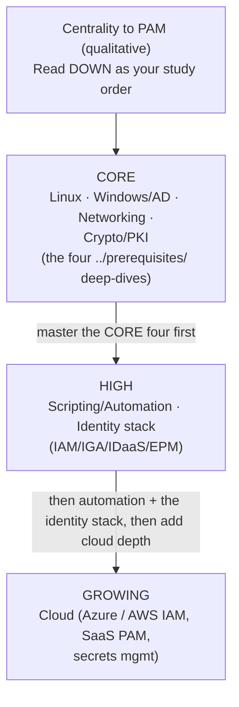
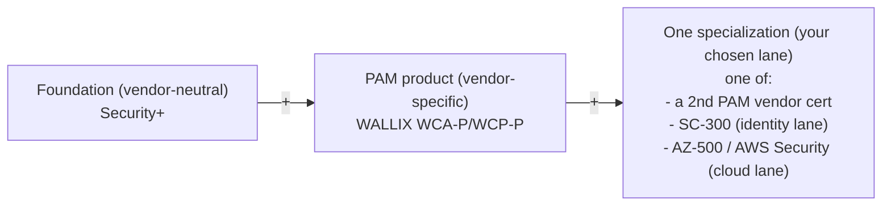

# Skills Matrix & Adjacent Certifications for a PAM Career

This page does two things for a **systems administrator** building a career in
**Privileged Access Management (PAM)**:

1. A **skills matrix** that scores the core technical domains — Linux, Windows / Active
   Directory, networking, cryptography / PKI, scripting & automation, cloud, and the
   identity stack — by how central each is to PAM work, and cross-links each to the
   prerequisite deep-dive in `../prerequisites/`.
2. A **survey of complementary certifications** with honest, one-line descriptions and
   provider links, organized by tier, and clearly labelled **vendor-specific** vs
   **vendor-neutral**.

For *why* PAM suits a sysadmin and the phased roadmap that uses these, see
[sysadmin-to-pam-roadmap.md](sysadmin-to-pam-roadmap.md). For the vendor/analyst landscape
see [../foundations/pam-market-landscape.md](../foundations/pam-market-landscape.md).

> **Verification note:** Certification names, levels, and exam codes change. Every cert
> below was checked against the provider's own site (links in each table and in Sources),
> but **always confirm current details on the provider's page before you book** — some
> are mid-refresh in 2026 (flagged inline).

---

## Acronyms used on this page

| Acronym | Expansion |
|---|---|
| **PAM** | Privileged Access Management |
| **IAM** | Identity & Access Management |
| **IGA / IAG** | Identity Governance & Administration / Identity & Access Governance |
| **IDaaS** | Identity-as-a-Service (cloud SSO / MFA / federation) |
| **EPM / PEDM** | Endpoint Privilege Management / Privilege Elevation & Delegation Management |
| **AD** | Active Directory |
| **SSH / RDP** | Secure Shell / Remote Desktop Protocol |
| **PKI** | Public Key Infrastructure |
| **MFA / SSO** | Multi-Factor Authentication / Single Sign-On |
| **SIEM** | Security Information & Event Management |
| **SCS / SC / AZ** | (exam-code prefixes used by AWS / Microsoft) |
| **DoD 8140** | US Department of Defense directive listing approved cyber workforce certs |

---

## Part 1 — The PAM skills matrix

"Centrality to PAM" is a qualitative judgement of how much a domain shows up in
day-to-day PAM work and in the WALLIX curricula; it is **not** a market statistic. Use it
to prioritize study, not as a ranking of difficulty.

| Domain | Centrality to PAM | What you specifically need | Why PAM needs it | Prerequisite deep-dive |
|---|---|---|---|---|
| **Linux** | **Core** | `sudo`/`su`, SSH server/client & keys, file permissions, systemd services, `journalctl`/`/var/log` | The WALLIX Bastion is a **Debian-based Linux appliance**; WCE-P explicitly requires GNU/Linux CLI | [../prerequisites/linux-essentials-for-pam.md](../prerequisites/linux-essentials-for-pam.md) |
| **Windows / Active Directory** | **Core** | AD objects/OUs/GPOs, domain controllers, NTLM vs Kerberos, privileged groups, service accounts, LAPS, tiered-admin model, RDP | PAM authenticates against AD/LDAP, maps AD groups to access, brokers RDP to Windows targets | [../prerequisites/windows-and-active-directory.md](../prerequisites/windows-and-active-directory.md) |
| **Networking & protocols** | **Core** | Ports/transport; session protocols (SSH/RDP/VNC/Telnet) vs infrastructure protocols (LDAP, RADIUS, Kerberos, SAML, OIDC, Syslog, SNMP) | The broker sits *between* admins and targets — you proxy some protocols and rely on others | [../prerequisites/networking-and-protocols.md](../prerequisites/networking-and-protocols.md) |
| **Cryptography / PKI** | **Core** | Symmetric vs asymmetric vs hashing, TLS handshake, X.509/CA/CSR/CRL/OCSP, SSH key types, TOTP & FIDO2/WebAuthn | Vault encryption, session encryption, certificate auth, key rotation, MFA all depend on it | [../prerequisites/cryptography-and-pki.md](../prerequisites/cryptography-and-pki.md) |
| **Scripting & automation** | **High** | Bash/PowerShell/Python, REST APIs, JSON, scheduled jobs | Automate credential rotation, target onboarding, and app-to-app secrets (WALLIX AAPM via the Bastion REST API) | (applied across the prerequisites; see roadmap §2) |
| **Cloud** | **Growing** | IAM roles/policies in Azure & AWS, cloud admin-role governance, SaaS PAM delivery, secrets managers | Privileged identities increasingly live in the cloud; PAM is delivered as SaaS (e.g., WALLIX One) and must govern cloud roles | see cloud certs in Part 2 (AZ-500, AWS Security, SC-300) |
| **The identity stack (IAM/IGA/IDaaS/EPM)** | **High** | How PAM relates to IAM, IGA/IAG, IDaaS (SSO/MFA), and EPM/PEDM; federation (SAML/OIDC); lifecycle (JML) | PAM is one layer of identity security; engineers/architects integrate it with the rest | [../foundations/pam-iam-iga-idaas-epm.md](../foundations/pam-iam-iga-idaas-epm.md) |

**How to read the matrix:** the four **Core** domains map one-to-one onto the
`../prerequisites/` files and onto the WALLIX exam prerequisites — these are
non-negotiable. **Scripting** and the **identity stack** are what turn a PAM
*administrator* into a PAM *engineer*. **Cloud** is the fastest-growing edge and the
clearest place to differentiate yourself.

---

## Part 2 — Complementary certifications

Each table uses the same columns: **Certification · Provider · Focus · Level · Why it
helps a PAM career**. The **Type** column states **vendor-neutral** (concepts that
transfer everywhere) vs **vendor-specific** (tied to one product).

> **Strategy reminder (from the roadmap):** you do **not** need all of these. A coherent
> early-career profile is *one vendor-neutral foundation* (Security+) + *the WALLIX
> ladder* + *one specialization* (a second PAM vendor **or** a cloud/identity cert). Add
> breadth later. Vendor-specific certs prove you can run a product; vendor-neutral certs
> prove you understand the concepts behind any product — employers value both, for
> different reasons.

### 2.1 Foundational — vendor-neutral

These certify the base a sysadmin needs before (or alongside) any PAM product cert. All
three are **CompTIA**, **vendor-neutral**, and entry-level.

| Certification | Provider | Type | Focus | Level | Why it helps a PAM career |
|---|---|---|---|---|---|
| **Security+** (SY0-7xx) | CompTIA | Vendor-neutral | Core security concepts, threats, crypto, identity, risk | Entry (foundational) | The standard "I understand security" baseline; widely requested and **DoD 8140-approved**. Validates the security lens PAM work needs |
| **Network+** | CompTIA | Vendor-neutral | Networking fundamentals, protocols, ports, infrastructure | Entry | A PAM broker lives in the network; solidifies the ports/protocols knowledge in [../prerequisites/networking-and-protocols.md](../prerequisites/networking-and-protocols.md) |
| **Linux+** | CompTIA | Vendor-neutral | Linux administration, security, automation, scripting | Entry/intermediate | The Bastion is a Linux appliance and WCE-P requires Linux CLI; certifies [../prerequisites/linux-essentials-for-pam.md](../prerequisites/linux-essentials-for-pam.md) |

Provider hub: <https://www.comptia.org/en-us/certifications/> ·
Security+: <https://www.comptia.org/en-us/certifications/security/> ·
Network+: <https://www.comptia.org/en-us/certifications/network/> ·
Linux+: <https://www.comptia.org/en-us/certifications/linux/>

### 2.2 Identity / PAM-specific — vendor-specific

These prove hands-on skill with a specific PAM/identity platform. **All are
vendor-specific.** The *concepts* (vaulting, session brokering, JIT, ZSP, PEDM) transfer
between them — that is what makes learning a second vendor fast.

| Certification | Provider | Type | Focus | Level | Why it helps a PAM career |
|---|---|---|---|---|---|
| **WCA-P** (Certified Administrator – PAM) | WALLIX | Vendor-specific | Day-to-day administration of WALLIX Bastion | Administrator (entry) | Your first WALLIX cert; matches the PAM Administrator role. See [../docs/pam-bastion/wca-p-administrator.md](../docs/pam-bastion/wca-p-administrator.md) |
| **WCP-P** (Certified Professional – PAM) | WALLIX | Vendor-specific | Install, configure, deploy, administer Bastion | Professional (mid) | The engineer-level WALLIX cert; gateway to IDaaS/OT tracks. See [../docs/pam-bastion/wcp-p-professional.md](../docs/pam-bastion/wcp-p-professional.md) |
| **WCE-P** (Certified Expert – PAM) | WALLIX | Vendor-specific | Advanced, large-scale, complex Bastion deployments | Expert (senior) | The architect-track WALLIX cert; **requires WCP-P + Linux CLI**. See [../docs/pam-bastion/wce-p-expert.md](../docs/pam-bastion/wce-p-expert.md) |
| **CyberArk** (Defender / Sentry / Guardian) | CyberArk | Vendor-specific | Operating, deploying, and architecting CyberArk's PAM/Identity Security platform | Tiered: Defender (operate) → Sentry (deploy) → Guardian (architect) | Largest enterprise PAM install base; CyberArk skills are widely demanded. *Verify level mapping & in-person exam policy on provider site* |
| **BeyondTrust University** (e.g., Certified Implementation Engineer) | BeyondTrust | Vendor-specific | Administering/implementing BeyondTrust PAM products | Administrative / implementation; **valid 2 years** | A 2025 Gartner PAM Leader; product cert for remote-access/endpoint-privilege estates |
| **Delinea** (e.g., Certified Engineer / Administrator) | Delinea | Vendor-specific | Administering/engineering Delinea Secret Server & platform | Administrator / engineer | A 2025 Gartner PAM Leader; Secret Server is widely deployed. *Confirm current program names on provider site* |
| **One Identity** (Safeguard) certifications | One Identity (Quest) | Vendor-specific | Safeguard PAM within the One Identity Fabric (IAM/IGA) | Varies | Useful where the employer runs the One Identity ecosystem. *Confirm exact, current credential names with the provider* |

Provider links: WALLIX Academy <https://www.wallix.com/support-services/wallix-academy/> ·
CyberArk certification <https://www.cyberark.com/services-support/certification/> ·
BeyondTrust University <https://www.beyondtrust.com/services-training/beyondtrust-university> ·
Delinea <https://delinea.com/> ·
One Identity <https://www.oneidentity.com/>

> **Why learn more than one PAM vendor?** Job ads name specific products. Knowing the
> shared concepts (this repo's foundations) lets you re-skill onto whichever vendor an
> employer runs; a second product cert is the proof. WALLIX + one of CyberArk /
> BeyondTrust / Delinea is a strong PAM pairing.

### 2.3 Microsoft identity & cloud security

A mix here. **SC-300** and **AZ-500** are **vendor-specific** to Microsoft; **AWS
Certified Security** is **vendor-specific** to AWS. They matter because privileged
identities increasingly live in the cloud and most enterprises run Microsoft Entra ID
(formerly Azure AD).

| Certification | Provider | Type | Focus | Level | Why it helps a PAM career |
|---|---|---|---|---|---|
| **SC-300** (Identity and Access Administrator Associate) | Microsoft | Vendor-specific | Microsoft Entra ID: identities, authentication, Conditional Access, identity governance (incl. Entra PIM) | Associate | Directly identity-focused; covers cloud privileged-role governance (Entra PIM) — the cloud-PAM adjacency |
| **AZ-500** (Azure Security Engineer Associate) | Microsoft | Vendor-specific | Securing Azure: identity & access, platform, data, network, operations | Associate | Cloud-security depth for the infrastructure lane. **Scheduled to retire 2026-08-31 — check Microsoft Learn for the successor before booking** |
| **AWS Certified Security – Specialty** (SCS-C0x) | Amazon Web Services | Vendor-specific | Securing AWS: IAM, detection, data protection, incident response, governance | Specialty (advanced) | Proves cloud privileged-identity and security skill on AWS; pairs PAM with cloud IAM |

Provider links: SC-300 <https://learn.microsoft.com/en-us/credentials/certifications/identity-and-access-administrator/> ·
AZ-500 <https://learn.microsoft.com/en-us/credentials/certifications/azure-security-engineer/> ·
AWS Certified Security – Specialty <https://aws.amazon.com/certification/certified-security-specialty/>

### 2.4 Broader / vendor-neutral

These widen your security credibility and matter most as you move from operating tools
toward designing and managing programs. Both are **(ISC)²** and **vendor-neutral**.

| Certification | Provider | Type | Focus | Level | Why it helps a PAM career |
|---|---|---|---|---|---|
| **CC** (Certified in Cybersecurity) | (ISC)² | Vendor-neutral | Foundational security principles; **no experience required** | Entry (foundational) | A low-barrier vendor-neutral entry credential to pair with Security+. *Exam outline refreshes 2026-09-01 — check current outline* |
| **CISSP** (Certified Information Systems Security Professional) | (ISC)² | Vendor-neutral | Broad security management across 8 domains | Senior / management — **requires ~5 years' experience** | The "manager/architect" benchmark; relevant once you head toward PAM/IAM Architect or security leadership — a later-career goal, not an entry cert |

Provider links: (ISC)² CC <https://www.isc2.org/certifications/cc> ·
CISSP <https://www.isc2.org/certifications/cissp>

---

## Part 3 — Vendor-specific vs vendor-neutral at a glance

| VENDOR-NEUTRAL (concepts transfer everywhere) | VENDOR-SPECIFIC (tied to one product) |
|---|---|
| CompTIA Security+ | WALLIX WCA-P / WCP-P / WCE-P |
| CompTIA Network+ | CyberArk Defender/Sentry/Guardian |
| CompTIA Linux+ | BeyondTrust University |
| (ISC)2 CC | Delinea (Secret Server) |
| (ISC)2 CISSP | One Identity (Safeguard) |
|  | Microsoft SC-300 / AZ-500 |
|  | AWS Certified Security – Spec. |

> Use NEUTRAL certs to prove you understand the concepts; use SPECIFIC certs to
> prove you can run the product an employer owns. A balanced PAM profile has some of each.

A suggested minimal-but-credible early-PAM stack (see the roadmap for timing):

---

## Sources

- CompTIA certifications hub: https://www.comptia.org/en-us/certifications/
- CompTIA Security+: https://www.comptia.org/en-us/certifications/security/
- CompTIA Network+: https://www.comptia.org/en-us/certifications/network/
- CompTIA Linux+: https://www.comptia.org/en-us/certifications/linux/
- WALLIX Academy (WCA-P / WCP-P / WCE-P): https://www.wallix.com/support-services/wallix-academy/
- CyberArk Identity Security Certification Program: https://www.cyberark.com/services-support/certification/
- BeyondTrust University (Get Certified): https://www.beyondtrust.com/services-training/beyondtrust-university/get-certified
- Delinea: https://delinea.com/
- One Identity: https://www.oneidentity.com/
- Microsoft SC-300 (Identity and Access Administrator): https://learn.microsoft.com/en-us/credentials/certifications/identity-and-access-administrator/
- Microsoft AZ-500 (Azure Security Engineer): https://learn.microsoft.com/en-us/credentials/certifications/azure-security-engineer/
- AWS Certified Security – Specialty: https://aws.amazon.com/certification/certified-security-specialty/
- (ISC)² Certified in Cybersecurity (CC): https://www.isc2.org/certifications/cc
- (ISC)² CISSP: https://www.isc2.org/certifications/cissp
- This repo — prerequisites (Linux, Windows/AD, networking, crypto/PKI): [../prerequisites/](../prerequisites/)
- This repo — PAM/IAM/IGA/IDaaS/EPM relationships: [../foundations/pam-iam-iga-idaas-epm.md](../foundations/pam-iam-iga-idaas-epm.md)
- This repo — sysadmin-to-PAM roadmap: [sysadmin-to-pam-roadmap.md](sysadmin-to-pam-roadmap.md)
