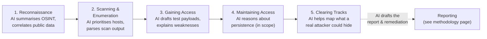
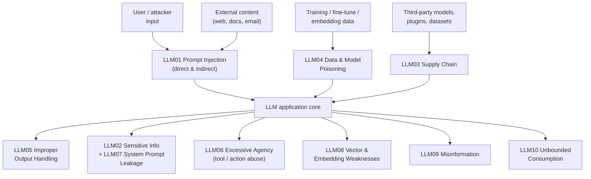

# Artificial Intelligence in Ethical Hacking ("CEH AI")

The Certified Ethical Hacker (CEH) version 13 is marketed by the EC-Council as **"CEH AI"** because it weaves artificial intelligence (AI) into all of its modules. For a systems administrator studying CEH, this page explains *why* AI was added, *how* AI assists each of the five phases of ethical hacking at a conceptual level, the AI-driven *threats* a defender must understand, and how to *secure* the AI systems your organisation is increasingly deploying. AI is presented here strictly as a tool that accelerates an *authorised* tester and that defenders must learn to anticipate — never as a way to do anything you could not lawfully do by hand.

> Everything on this page is **educational and defence-oriented**. AI does not change the law: every technique remains legal **only** with explicit written authorisation, an agreed scope, and Rules of Engagement (RoE). See [legal-and-ethics.md](legal-and-ethics.md) — the most important page in this hub.

## Learning objectives

- Explain why CEH v13 added AI and what "CEH AI" means.
- Describe, conceptually, how AI assists each of the **five phases of ethical hacking**.
- Identify AI-driven **threats** defenders must know: AI-assisted phishing, deepfakes, and automated reconnaissance.
- Explain the core risks of **securing AI systems**: prompt injection, model and data risks.
- Recognise the **OWASP Top 10 for Large Language Model (LLM) Applications** as a defensive checklist.
- Apply a strong **authorised-and-responsible-use** framing to any use of AI in security work.

## Why CEH v13 added AI

AI — and in particular **generative AI** built on **large language models (LLMs)** (statistical models trained on large text corpora to generate human-like text) — has changed both sides of the security equation:

- **Attackers** now use AI to work faster and at greater scale: drafting convincing phishing lures, summarising stolen data, generating variations of malware, and automating reconnaissance.
- **Defenders and authorised testers** use the same AI to triage findings, draft reports, and reason about large amounts of data more quickly.
- **AI systems themselves are now targets.** As organisations deploy chatbots, copilots, and AI agents, those systems become a new attack surface with their own vulnerability classes.

CEH v13 responds to all three. The EC-Council positions "CEH AI" as teaching candidates to *use* AI to be more effective, to *defend against* AI-enabled attacks, and to *secure* the AI systems an organisation runs. The exact courseware figures and AI tool list should be confirmed against current EC-Council materials (verify), but the conceptual thrust is consistent.

> Administrator's view: AI is an accelerant, not a new category of magic. It makes existing techniques faster and cheaper. Your defences (least privilege, monitoring, awareness training, patching) still apply — they just have to keep pace.

## How AI assists the five phases

The [five phases of ethical hacking](five-phases-of-hacking.md) are Reconnaissance, Scanning and Enumeration, Gaining Access, Maintaining Access, and Clearing Tracks. AI can assist an *authorised* tester at every phase — conceptually, by reducing manual effort and surfacing patterns a human might miss.

| Phase | How AI assists (conceptual) | Defensive takeaway |
| --- | --- | --- |
| **Reconnaissance / OSINT** | Summarising and correlating large volumes of public data (Open-Source Intelligence, OSINT) — company filings, social media, job adverts, leaked-data indexes — to build a target profile faster. | Reduce your public footprint; what AI can summarise, it found because you published it. See [../domains/02-footprinting-and-reconnaissance.md](../domains/02-footprinting-and-reconnaissance.md). |
| **Scanning & Enumeration** | Parsing noisy scanner output, clustering similar findings, and suggesting which hosts or services look most promising. | AI does not change what a scan reveals — keep attack surface small and monitor for active probing. |
| **Gaining Access (vulnerability triage)** | Explaining a vulnerability in plain language, ranking findings by likely exploitability, and drafting *test* payloads for an authorised tester to review before use. | Patch and harden by risk; AI-assisted triage on the defensive side closes the same gaps faster. |
| **Maintaining Access** | Reasoning about persistence options so a tester can *document* (not maliciously deploy) what an attacker could do. | Tamper-evident, centralised logging and behavioural monitoring detect persistence regardless of how it was devised. |
| **Clearing Tracks** | Helping a tester *describe* how an attacker might hide activity, to justify defensive controls. | Centralised, write-once log shipping and a strong Security Operations Centre (SOC) defeat track-clearing. |
| **Reporting (cross-phase)** | Drafting executive summaries, structuring findings, and suggesting remediation wording — always reviewed and verified by the human tester. | A faster report means faster fixes. See [engagement-methodology-and-reporting.md](engagement-methodology-and-reporting.md). |

> Critical guardrail: AI **drafts**, the human **decides**. AI output can be wrong (it can "hallucinate" — produce confident but false content). A tester must verify every AI-suggested finding and never run an AI-generated payload outside the authorised scope. AI never expands what you are permitted to do.

## AI-driven threats defenders must know

AI lowers the cost and raises the quality of several classic attacks. A defender does not need to *perform* these to understand and counter them.

### AI-assisted phishing and social engineering

Generative AI can produce fluent, personalised, error-free phishing messages at scale — removing the spelling and grammar "tells" that once flagged scams — and can tailor each message using OSINT about the recipient. This strengthens spear-phishing, whaling, and business-email-compromise pretexts. See [../domains/09-social-engineering.md](../domains/09-social-engineering.md).

- **Defence:** Multi-Factor Authentication (MFA), out-of-band verification of unusual requests (especially payments), continuous awareness training that assumes messages will *look* legitimate, and technical email controls (authentication, link/attachment filtering).

### Deepfakes (synthetic audio, image, and video)

AI can synthesise a convincing **voice** or **video** of a real person. Attackers have used cloned voices and video for vishing (voice phishing) and to authorise fraudulent transfers by impersonating an executive.

- **Defence:** Verification procedures that do **not** rely on recognising a voice or face — use pre-agreed call-back numbers, code words, or a second approver for high-value actions. Treat "the boss called and sounded stressed" as a red flag, not proof.

### Automated reconnaissance and tooling

AI agents can chain together OSINT gathering, summarisation, and prioritisation with little human effort, compressing reconnaissance from days to minutes and broadening the number of targets an attacker can profile.

- **Defence:** Minimise public exposure (DNS hygiene, careful job adverts, scrubbed document metadata), monitor for reconnaissance patterns, and assume your external footprint *will* be enumerated.

> The pattern across all three: AI does not invent new attack categories — it makes phishing more convincing, impersonation more realistic, and reconnaissance more scalable. Defences shift toward **verification you cannot fake** and **controls that do not depend on a human spotting a flaw**.

## Securing AI systems

When *your* organisation runs an LLM application (a chatbot, a support copilot, a retrieval-augmented assistant, or an AI agent), that system is a target. The dominant new risk classes are below.

### Prompt injection

**Prompt injection** is the leading LLM-application risk. It occurs when input alters the model's behaviour in unintended ways — overriding its instructions, leaking data, or misusing connected tools.

- **Direct prompt injection** — a user types malicious instructions into the application (for example, telling the model to ignore its rules). 
- **Indirect prompt injection** — malicious instructions are hidden in content the model later processes (a web page, document, or email). When the model reads that content, it may follow the hidden instructions as if they were legitimate. This is especially dangerous when the model can call tools or act on the user's behalf.

Conceptual defences: treat all model input as untrusted, apply **least privilege** to any tools the model can call, validate and sanitise model **output** before it is used, and require **human approval** for high-impact actions.

### Model and data risks

| Risk | What it means | Conceptual defence |
| --- | --- | --- |
| **Data / model poisoning** | Tampering with training, fine-tuning, or embedding data to plant biases or backdoors. | Vet and provenance-track training data; integrity-check models; monitor outputs. |
| **Sensitive information disclosure** | The model reveals secrets, personal data, or proprietary content in its responses. | Minimise sensitive data in prompts/training; filter outputs; apply access controls. |
| **Supply-chain risk** | Compromised third-party models, datasets, or plugins. | Source models/components from trusted suppliers; verify integrity; track a bill of materials. |
| **Excessive agency** | The model is given too much autonomy or too many permissions, so a manipulation has outsized impact. | Limit tool access and scope; require approval; log and constrain actions. |

### The OWASP Top 10 for LLM Applications

The **OWASP (Open Worldwide Application Security Project) Top 10 for LLM Applications** — maintained by the **OWASP GenAI Security Project** — is the most useful single checklist for securing AI systems. The **2025** list is:

| ID | Risk | One-line meaning |
| --- | --- | --- |
| **LLM01** | Prompt Injection | Crafted input alters the model's behaviour or output. |
| **LLM02** | Sensitive Information Disclosure | The model leaks confidential data, personal data, or secrets. |
| **LLM03** | Supply Chain | Compromised third-party models, data, or components. |
| **LLM04** | Data and Model Poisoning | Tampered training/fine-tuning/embedding data plants flaws or backdoors. |
| **LLM05** | Improper Output Handling | Model output is trusted without validation, enabling downstream attacks. |
| **LLM06** | Excessive Agency | The model has too much autonomy/permission, amplifying any abuse. |
| **LLM07** | System Prompt Leakage | The hidden system prompt (and any secrets in it) is exposed. |
| **LLM08** | Vector and Embedding Weaknesses | Flaws in the vector/embedding layer (e.g. of retrieval-augmented systems). |
| **LLM09** | Misinformation | The model produces confident but false or misleading output. |
| **LLM10** | Unbounded Consumption | Uncontrolled resource use (cost, compute) — a denial-of-wallet/service risk. |

Two complementary references round out the defensive picture:

- **NIST AI Risk Management Framework (AI RMF 1.0, NIST AI 100-1)** — a voluntary, lifecycle framework organised around four functions: **GOVERN, MAP, MEASURE, MANAGE**.
- **NIST AI 100-2e2025, Adversarial Machine Learning: A Taxonomy and Terminology** — formal vocabulary for evasion, poisoning, and privacy attacks on predictive AI, and prompt-injection (direct and indirect) attacks on generative AI.

## Authorised and responsible use

AI raises the stakes on the rules you already know. The boundary is unchanged: **permission, scope, and law come first.**

- **AI never grants authorisation.** Using AI to generate a payload, a phishing lure, or an OSINT profile is only lawful inside an authorised engagement and scope. See [legal-and-ethics.md](legal-and-ethics.md).
- **Protect confidential data.** Do not paste client data, credentials, or findings into third-party AI services unless the engagement's terms and the provider's data handling explicitly allow it — this can breach confidentiality, Non-Disclosure Agreements (NDAs), and privacy law.
- **Verify everything AI produces.** AI hallucinates. Unverified AI findings in a report damage credibility and can mislead remediation.
- **Stay within the EC-Council Code of Ethics.** Honesty, competence, confidentiality, and lawful conduct apply equally whether you used AI or not.
- **No weaponisation.** AI must not be used to build or distribute working attack tooling outside an authorised, controlled engagement.

> Bottom line: AI changes *how fast* you work, not *what you are allowed to do*. The same authorisation, scope, and ethics that govern manual testing govern AI-assisted testing.

## Where to go next

- [five-phases-of-hacking.md](five-phases-of-hacking.md) — the methodology AI accelerates.
- [engagement-methodology-and-reporting.md](engagement-methodology-and-reporting.md) — how AI-drafted output fits a professional engagement.
- [../domains/02-footprinting-and-reconnaissance.md](../domains/02-footprinting-and-reconnaissance.md) — AI-assisted OSINT and reconnaissance.
- [../domains/09-social-engineering.md](../domains/09-social-engineering.md) — AI-assisted phishing and deepfakes.
- [legal-and-ethics.md](legal-and-ethics.md) — authorisation, ethics, and confidentiality.
- [../reference/acronyms.md](../reference/acronyms.md) — expanded acronyms (LLM, OSINT, MFA, OWASP, NIST).

## Sources

- EC-Council, Certified Ethical Hacker (CEH) v13 ("CEH AI") program page — https://www.eccouncil.org/train-certify/certified-ethical-hacker-ceh/
- OWASP Top 10 for LLM Applications (2025), OWASP GenAI Security Project — https://genai.owasp.org/llm-top-10/
- OWASP, LLM01:2025 Prompt Injection — https://genai.owasp.org/llmrisk/llm01-prompt-injection/
- NIST AI Risk Management Framework (AI RMF 1.0, NIST AI 100-1) — https://www.nist.gov/itl/ai-risk-management-framework
- NIST AI 100-2e2025, Adversarial Machine Learning: A Taxonomy and Terminology of Attacks and Mitigations — https://csrc.nist.gov/pubs/ai/100/2/e2025/final
- Verified ground truth for this hub: CEH v13 is marketed "CEH AI" with AI integrated across the modules; five phases = Reconnaissance → Scanning & Enumeration → Gaining Access → Maintaining Access → Clearing Tracks.
- Exact EC-Council CEH v13 AI courseware figures and tool lists: *verify on EC-Council* — not fully specified in these sources.
