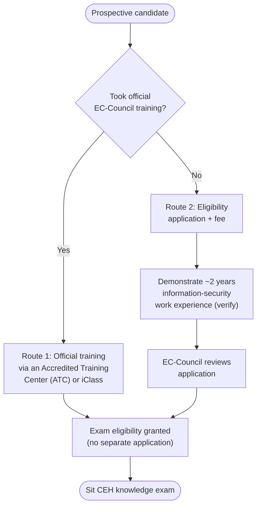
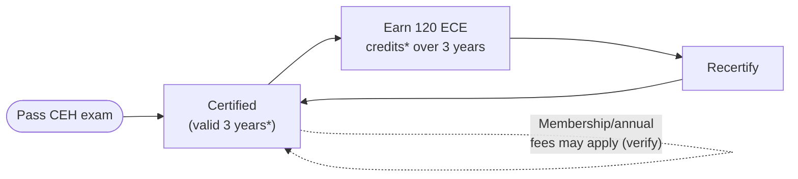

# CEH Exam Format and Eligibility

This page explains how the Certified Ethical Hacker (CEH) exams are structured, how you become eligible to sit them, how they are delivered and proctored, the retake rules, and how the certification stays valid afterward. Figures that change between versions are flagged so you verify them against the EC-Council before relying on them.

## Learning objectives

- Describe the format of the CEH knowledge exam and the CEH Practical exam.
- Compare the two routes to eligibility: official training versus the experience-based application.
- Explain how the exams are delivered and proctored.
- State the retake policy, certificate validity, and EC-Council Continuing Education (ECE) requirements.
- List the certification's accreditations and where to confirm cost.

## Exam format at a glance

| Item | CEH (knowledge exam) | CEH Practical |
| --- | --- | --- |
| Exam code | **312-50** (v13) | *not a separate numeric code in these sources* |
| Question type | Multiple-choice questions (MCQ) | Real-world, performance-based challenges |
| Number of items | **125 questions** | **20 challenges** |
| Duration | **4 hours** | **6 hours** |
| Passing score | **60–85%** (scaled cut-score, varies by exam form) | **60–85%** |
| Environment | Question-and-answer | Live "cyber range" lab |

### Why the passing score is a range

CEH exams use multiple exam *forms* (different sets of questions). Because some forms are slightly harder than others, EC-Council applies a **scaled cut-score** so that every candidate is held to an equivalent standard. The result is that the passing percentage for any given form sits somewhere in the **60–85%** band rather than at a single fixed number. Do not assume a flat "70% to pass."

### CEH Master

There is no separate "CEH Master" exam. **CEH Master** is a *title* awarded to candidates who pass **both** the CEH knowledge exam **and** the CEH Practical. See [what-is-ceh.md](what-is-ceh.md) for the credential family.

## Eligibility: the two routes

To sit the CEH knowledge exam you must qualify through **one** of two routes. (Verify the exact current requirements and any application/eligibility fee on EC-Council — the details below reflect the long-standing policy but are version-sensitive.)

### Route 1 — Official training

If you complete official EC-Council CEH training, you are generally granted exam eligibility without a separate application. Official training is delivered through:

- an **Accredited Training Center (ATC)** — an EC-Council-authorised training partner, or
- **iClass** — EC-Council's own official online training platform.

### Route 2 — Experience-based application (self-study)

Candidates who **self-study** (no official training) must apply for eligibility and typically must:

- demonstrate **at least 2 years of work experience in information security** (verify the current requirement and acceptable evidence on EC-Council), and
- **pay a non-refundable eligibility application fee** (amount *not stated here — verify on EC-Council*).

> Flagged as version-sensitive: the "2 years information-security experience" requirement and the application-fee amount are the historically published policy, but you must confirm both on EC-Council for v13 before applying. Treat any number you see in third-party blogs with suspicion.

## Exam delivery and proctoring

CEH exams are delivered through EC-Council's testing infrastructure and partners. Verify the current options on EC-Council, as availability varies by region:

- **ECC EXAM portal** — EC-Council's own exam delivery system.
- **Pearson VUE** — a global test-delivery network used for many IT certifications, offering test-center and (where available) online delivery (https://home.pearsonvue.com/).
- **Proctoring** — exams are proctored (supervised) to verify identity and prevent cheating, either at a physical test center or via remote online proctoring, depending on the channel.

The **CEH Practical** runs in a live, internet-accessible **cyber range** and is remotely proctored. Exact delivery mechanics for v13 should be confirmed on EC-Council.

## Retake policy

EC-Council publishes a formal **Exam Retake Policy**. The general shape (verify the current version) is:

- If you do not pass on the **first** attempt, you may retake without waiting.
- **Subsequent** attempts may require a **waiting period** (for example, a number of days between attempts) and a **retake voucher** with an associated fee.
- There is typically a **cap on the number of attempts** within a 12-month period.

Exact waiting periods, attempt limits, and fees are *not stated here* — confirm the current Exam Retake Policy on EC-Council before planning a resit.

## Certificate validity and continuing education (ECE)

CEH certification is **not permanent**; it must be maintained:

- **Validity period: 3 years** (verify on EC-Council).
- **Recertification requirement: 120 EC-Council Continuing Education (ECE) credits** over that period (verify).

**EC-Council Continuing Education (ECE)** credits are earned through ongoing professional development — for example, attending training, conferences, or webinars; publishing articles; or taking newer exams. The goal is to ensure certified professionals keep their skills current.

> Flagged as unverified: the "valid 3 years / 120 ECE credits" figures are the long-standing EC-Council policy, but you should confirm both numbers and the current ECE scheme rules on EC-Council, because continuing-education programs are periodically revised.

\*Verify "3 years" and "120 ECE credits" on EC-Council — version-sensitive.

## Accreditations and recognition

CEH is recognised by several standards bodies and government frameworks. Confirm current status on EC-Council, as accreditations are renewed periodically:

- **ANSI / ISO/IEC 17024** — CEH has been accredited under the ISO/IEC 17024 standard for personnel-certification bodies (historically through ANSI, the American National Standards Institute). Verify the current accrediting body and scope.
- **US Department of Defense (DoD) Directive 8140** — CEH has been mapped to qualifying roles under the DoD's cyber workforce framework (formerly 8570). Verify current 8140 mapping on EC-Council and the DoD.

These accreditations are a large part of why CEH appears so often in job requirements, especially for roles touching US government or regulated environments.

## Cost

**Cost is not fixed and is not stated here.** CEH pricing varies by:

- region and currency,
- whether you buy training + exam together or the exam alone,
- the channel (ATC, iClass, or direct), and
- any eligibility-application or retake fees.

To avoid relying on outdated or invented figures, get a current quote directly from **EC-Council** or an **Accredited Training Center**. Do not budget from third-party blog numbers.

## Where to go next

- [what-is-ceh.md](what-is-ceh.md) — the credential family and what CEH proves.
- [five-phases-of-hacking.md](five-phases-of-hacking.md) — the methodology the exam tests.
- [legal-and-ethics.md](legal-and-ethics.md) — the legal framework behind authorised testing.
- [../reference/acronyms.md](../reference/acronyms.md) — expanded acronyms.

## Sources

- EC-Council, Certified Ethical Hacker (CEH) program and exam information — https://www.eccouncil.org/train-certify/certified-ethical-hacker-ceh/
- EC-Council, exam eligibility and application policy — https://www.eccouncil.org/
- EC-Council, Exam Retake Policy and Continuing Education (ECE) scheme — https://www.eccouncil.org/ (verify current terms)
- Pearson VUE test delivery — https://home.pearsonvue.com/
- ANSI (American National Standards Institute) / ISO/IEC 17024 personnel certification standard — https://www.ansi.org/ and https://www.iso.org/standard/52993.html
- US DoD Cyber Workforce / Directive 8140 — https://public.cyber.mil/
- Verified ground truth for this hub: CEH knowledge exam = 125 MCQ / 4h / 60–85% / code 312-50v13; CEH Practical = 6h / 20 challenges / 60–85%.
- Eligibility experience requirement, fees, retake limits, validity (3 years), and 120 ECE credits: flagged as version-sensitive — *verify on EC-Council*.
