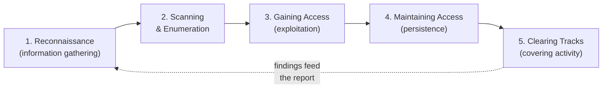
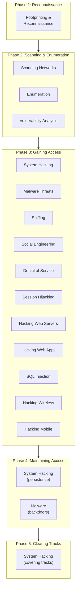

# The Five Phases of Ethical Hacking

Every structured attack — and every authorised penetration test that simulates one — follows a repeatable lifecycle. The Certified Ethical Hacker (CEH) program organises this lifecycle into **five phases**. Knowing them gives you a mental map for the whole certification: almost every module slots into one of these phases. This page explains each phase from first principles, maps the phases to CEH modules, and relates them to two industry models you will keep meeting: the **Cyber Kill Chain** and **MITRE ATT&CK**.

> Reminder: these techniques are taught for **defence and authorised testing only**. None of the phases below should be performed against systems you do not own or are not explicitly authorised — in writing — to test. See [legal-and-ethics.md](legal-and-ethics.md).

## Learning objectives

- Name and order the five phases of ethical hacking.
- Explain the goal and typical activities of each phase from a defender's perspective.
- Map each phase to the relevant CEH modules.
- Relate the five phases to the Cyber Kill Chain and MITRE ATT&CK.

## The five phases

The dotted line is a reminder that, in a real engagement, what you learn loops back: information from later phases often sends you back to gather more.

### Phase 1 — Reconnaissance

**Goal:** learn as much as possible about the target before touching it directly.

Reconnaissance ("recon") is information gathering. It comes in two flavours:

- **Passive reconnaissance** — collecting information *without* interacting with the target's systems: public records, search engines, social media, job postings, Domain Name System (DNS) records, and Open-Source Intelligence (OSINT). The target usually cannot detect this.
- **Active reconnaissance** — interacting with the target enough to learn about it (for example, probing which hosts respond), which begins to leave traces.

> Administrator's view: every public DNS record, exposed banner, or detailed job advert ("must know Cisco ASA, VMware ESXi 7") is recon fuel. Reducing that exposure is a defensive control.

### Phase 2 — Scanning and Enumeration

**Goal:** turn broad recon into a concrete map of live systems, open ports, services, and accounts.

- **Scanning** — identifying live hosts, open Transmission Control Protocol/User Datagram Protocol (TCP/UDP) ports, running services and versions, and potential vulnerabilities (using port scanners and vulnerability scanners).
- **Enumeration** — actively querying services to extract detail: usernames, shares, network resources, Simple Network Management Protocol (SNMP) data, directory information, etc.

This phase is where the attacker builds the target's "attack surface" inventory and where defenders detect a lot of suspicious activity.

### Phase 3 — Gaining Access

**Goal:** exploit a weakness to obtain a foothold (initial access) and, often, to escalate privileges.

This includes exploiting vulnerabilities, cracking or capturing credentials, social engineering, and web-application or wireless attacks. Once inside, attackers commonly attempt **privilege escalation** — moving from a low-privileged account to administrator/root.

> This hub does not provide exploit code or step-by-step attack playbooks. The exam-relevant point is *understanding what categories of weakness lead to access* so you can defend against them.

### Phase 4 — Maintaining Access

**Goal:** keep the foothold so the attacker can return without repeating the earlier phases.

Techniques here are about **persistence** and **command and control** — establishing backdoors, planting tools, and creating reliable channels back into the environment. In an authorised test, this demonstrates the real business impact of a breach: how long an attacker could remain.

### Phase 5 — Clearing Tracks

**Goal:** remove or obscure evidence of the activity to avoid detection (this is the attacker's objective).

This covers tampering with or deleting logs, hiding files, and disabling monitoring. For the **defender**, this phase is the rationale behind tamper-evident logging, centralised log shipping, file-integrity monitoring, and a strong Security Operations Center (SOC).

> In an *authorised* engagement, testers do **not** maliciously destroy logs; instead they document what an attacker *could* do, and any changes made are recorded and reverted as agreed in the Rules of Engagement (RoE).

## Mapping the five phases to CEH modules

CEH v13 is organised into modules. The exact module list and ordering should be confirmed against the current EC-Council CEH v13 courseware (see [../domains/](../domains/) in this hub as it is built out), but the **typical** mapping of modules to phases is shown below. Module titles are paraphrased; verify exact titles on EC-Council.

Cross-cutting modules that support **every** phase (and are tested throughout) include:

- **Introduction to Ethical Hacking** — methodology, laws, and the kill chain (Phase-spanning). See [../domains/01-introduction-to-ethical-hacking.md](../domains/01-introduction-to-ethical-hacking.md).
- **Evading IDS, Firewalls, and Honeypots** — relevant across scanning, access, and persistence.
- **Cloud Computing**, **IoT and OT Hacking**, **Cryptography** — apply across the lifecycle depending on the target.

> The numbering above (M02, M03, …) is illustrative of the conventional CEH module sequence; confirm exact module numbers and titles against EC-Council CEH v13 courseware.

## Relating the phases to other models

The five phases are CEH's vocabulary. Two other models describe the same reality with different granularity, and the exam expects you to recognise both.

### The Cyber Kill Chain

The **Cyber Kill Chain** is a model (originated by Lockheed Martin) that breaks an intrusion into seven sequential stages. CEH references it heavily. The seven stages are:

1. **Reconnaissance**
2. **Weaponization** — pairing an exploit with a deliverable payload.
3. **Delivery** — transmitting the payload (email, web, USB, etc.).
4. **Exploitation** — triggering the payload on the target.
5. **Installation** — installing malware/backdoor.
6. **Command and Control (C2)** — establishing a remote-control channel.
7. **Actions on Objectives** — achieving the goal (data theft, disruption).

| CEH phase | Roughly maps to Kill Chain stage(s) |
| --- | --- |
| Reconnaissance | Reconnaissance |
| Scanning & Enumeration | Reconnaissance (active) |
| Gaining Access | Weaponization, Delivery, Exploitation |
| Maintaining Access | Installation, Command and Control |
| Clearing Tracks | Actions on Objectives (stealth aspect) |

> The mapping is approximate — the two models do not line up one-to-one. The Kill Chain is more detailed about *how* access is achieved (weaponize/deliver/exploit), whereas CEH's "Gaining Access" compresses those into one phase.

### MITRE ATT&CK

**MITRE ATT&CK** (Adversarial Tactics, Techniques, and Common Knowledge) is a continuously updated, freely available knowledge base of real-world adversary behaviour. It is organised into:

- **Tactics** — the attacker's *goal* at a stage (the "why"), e.g. Initial Access, Persistence, Defense Evasion, Exfiltration.
- **Techniques (and sub-techniques)** — *how* the goal is achieved, each with a unique ID (e.g. `T1078`).

Unlike the linear five phases, ATT&CK is a **matrix**, not a strict sequence, reflecting that real attackers loop and branch. Defenders use it to map detections and gaps.

| CEH phase | Example ATT&CK tactic(s) |
| --- | --- |
| Reconnaissance | Reconnaissance, Resource Development |
| Scanning & Enumeration | Discovery |
| Gaining Access | Initial Access, Execution, Privilege Escalation, Lateral Movement |
| Maintaining Access | Persistence, Command and Control |
| Clearing Tracks | Defense Evasion |

> Why two models matter for a future defender: CEH's five phases are easy to memorise and explain to management; the Kill Chain helps you place a control "earlier" in an intrusion; ATT&CK lets you map your detections to specific, named adversary techniques. They are complementary lenses on the same events.

## Where to go next

- [../domains/01-introduction-to-ethical-hacking.md](../domains/01-introduction-to-ethical-hacking.md) — methodology and frameworks in detail.
- [legal-and-ethics.md](legal-and-ethics.md) — the authorisation that makes any of this legal.
- [what-is-ceh.md](what-is-ceh.md) — how the phases relate to the credential.
- [../reference/acronyms.md](../reference/acronyms.md) — expanded acronyms (OSINT, C2, TCP/UDP, etc.).

## Sources

- EC-Council, Certified Ethical Hacker (CEH) v13 program and module overview — https://www.eccouncil.org/train-certify/certified-ethical-hacker-ceh/
- Lockheed Martin, "Cyber Kill Chain" framework — https://www.lockheedmartin.com/en-us/capabilities/cyber/cyber-kill-chain.html
- MITRE ATT&CK knowledge base — https://attack.mitre.org/
- NIST SP 800-115, "Technical Guide to Information Security Testing and Assessment" (assessment lifecycle context) — https://csrc.nist.gov/pubs/sp/800/115/final
- Verified ground truth for this hub: five phases = Reconnaissance → Scanning (& Enumeration) → Gaining Access → Maintaining Access → Clearing Tracks.
- Exact CEH v13 module numbers/titles: paraphrased here — *verify against EC-Council courseware*.
