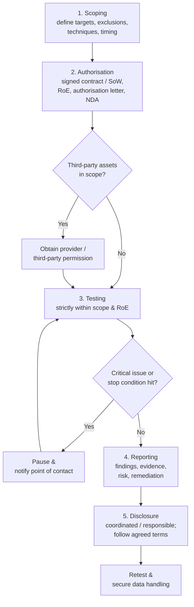

# Legal and Ethical Foundations

This is the most important page in the hub. Every technique you learn for the Certified Ethical Hacker (CEH) certification is legal **only** when performed with explicit authorisation, inside an agreed scope, and within Rules of Engagement (RoE). The difference between an ethical hacker and a criminal is **not** the tools — it is the **permission**. Get this wrong and you can face criminal charges, civil liability, and the end of a career, regardless of intent.

## Learning objectives

- Explain why authorisation, scope, and Rules of Engagement (RoE) are non-negotiable.
- Describe written consent and the "get-out-of-jail-free" authorisation letter.
- Distinguish black-box, white-box, and grey-box engagement types.
- Explain responsible/coordinated vulnerability disclosure.
- Summarise the EC-Council Code of Ethics.
- Recognise key computer-misuse and privacy laws and why jurisdiction matters.

## Authorisation: the foundation

**Authorisation** is explicit permission from the legitimate owner of a system to perform specified security testing against it. Without it, the same actions that make you an ethical hacker make you a criminal under computer-misuse laws worldwide.

Key principles:

- Authorisation must come from someone with the **authority to grant it** (the asset owner, not, say, a single helpful employee).
- It must be **specific** — it names what may be tested.
- It must be **in writing** and **time-bounded**.
- If your test could touch **third-party** infrastructure (cloud providers, hosting, Software-as-a-Service), you may need **their** authorisation too. For example, major cloud providers publish their own testing policies; verify each provider's current rules.

## Scope

**Scope** defines the precise boundaries of the engagement — what is **in** and, equally important, what is **out**.

Scope typically specifies:

- **Targets** — IP ranges, domains, applications, accounts, physical locations.
- **Exclusions** — systems that must **not** be touched (e.g. production payroll, medical devices).
- **Permitted techniques** — e.g. whether social engineering, Denial-of-Service (DoS) testing, or physical entry are allowed (often these are explicitly excluded).
- **Timing windows** — when testing may occur (e.g. outside business hours).
- **Data handling** — how any sensitive data discovered must be treated.

> Scope creep is dangerous: "while I was in there, I also tested the adjacent server" can be unauthorised access even mid-engagement. Stay strictly inside scope.

## Rules of Engagement (RoE)

The **Rules of Engagement (RoE)** is the document that operationalises scope and authorisation. It is the tester's playbook and the client's safety net. A typical RoE covers:

- Scope and exclusions (as above).
- **Authorised techniques and constraints** (e.g. "no DoS", "no exploitation of confirmed vulns without sign-off").
- **Points of contact** and an **escalation path** for emergencies.
- **Rules for handling discovered sensitive data** and for accidental impact.
- **Stop conditions** — when to halt testing immediately (e.g. signs of a *real* breach, or system instability).
- **Reporting expectations** and timelines.
- **Evidence-handling and confidentiality** terms.

## Written consent and the authorisation letter

Verbal permission is worthless if challenged. Engagements rest on **written consent**, usually a combination of:

- a **contract / Statement of Work (SoW)** and
- a signed **authorisation letter**, sometimes nicknamed the **"get-out-of-jail-free" letter**.

The authorisation letter is a signed document, held by the tester, that states the testing is authorised by the asset owner, identifies the scope and dates, and names the responsible signatory. If a tester's activity is questioned (for example, by the client's own SOC, or by law enforcement), this letter is the immediate proof of authorisation.

> It is "get out of jail" only against the *signing* organisation's systems, within the *stated* scope and dates. It does not authorise touching anyone else's systems, and it does not override the law.

A **Non-Disclosure Agreement (NDA)** is also standard, protecting the sensitive findings discovered during testing.

## Engagement types: black, white, and grey box

These terms describe how much **prior knowledge** the tester is given.

| Type | Knowledge given to tester | Simulates | Trade-off |
| --- | --- | --- | --- |
| **Black box** | Little or none (e.g. just a company name) | An external attacker with no inside knowledge | Realistic external view, but slower and may miss internal issues |
| **White box** | Full information (architecture, source code, credentials, configs) | A malicious insider or thorough audit | Most complete coverage, least realistic as an "attack" |
| **Grey box** | Partial (e.g. a standard user account, some docs) | A user-level insider or attacker with a foothold | Balanced realism and efficiency |

> Administrator's view: a white-box test of *your* environment, where you hand over diagrams and configs, usually finds far more in the available time than black-box guessing — but black-box better tests what an outsider could actually reach.

## Responsible / coordinated disclosure

When a vulnerability is found — whether in a paid engagement or by independent research — **disclosure** is how it gets reported and fixed.

- **Responsible disclosure** (also called **coordinated vulnerability disclosure, CVD**): the finder privately reports the issue to the vendor/owner, gives them a reasonable time to fix it, and only then (if at all) discloses publicly. The goal is to get the flaw fixed without arming attackers.
- **Full disclosure**: publishing details immediately and publicly — controversial, because it pressures vendors but can also expose users before a fix exists.
- **Bug-bounty programs**: vendors invite testing under published rules and may pay for valid reports; these provide a *pre-authorised* legal channel — but only within their stated scope and rules.

A widely referenced standard for this process is **ISO/IEC 29147** (vulnerability disclosure). Vendors often track issues with **Common Vulnerabilities and Exposures (CVE)** identifiers.

> Even "helpful" disclosure of a vulnerability you found by **unauthorised** poking can itself be illegal. Use authorised channels (engagements, bug bounties) — do not test systems just because you think the owner would be grateful.

## The EC-Council Code of Ethics

Holding an EC-Council certification binds you to the **EC-Council Code of Ethics**. The exact, current wording is published by EC-Council and you should read it in full; its themes include (paraphrased — verify on EC-Council):

- Keep private and confidential information gained in your work **confidential**.
- Protect intellectual property and disclose it appropriately.
- Do **not** use illegal/unauthorised access, or knowingly engage in unethical or illegal conduct.
- Do not misrepresent your qualifications or the results of your work.
- Use the certification and EC-Council property properly; do not engage in activity that harms the profession's reputation.
- Conduct yourself with honesty, competence, and respect for the law.

Violating the Code can result in loss of certification, in addition to any legal consequences.

## Relevant laws (general descriptions — jurisdiction matters)

Computer-misuse and privacy laws vary by country and even by region within a country. **Always confirm the law that applies to where you, the target, and the data are located, and seek qualified legal advice.** The following are described generally for awareness, not as legal advice.

| Law / regime | Jurisdiction | What it broadly covers |
| --- | --- | --- |
| **Computer Fraud and Abuse Act (CFAA)** | United States (federal) | Criminalises accessing a computer "without authorisation" or "exceeding authorised access." Authorisation/scope is central. |
| **Computer Misuse Act 1990** | United Kingdom | Offences for unauthorised access, unauthorised access with intent, and unauthorised acts impairing operation. |
| **General Data Protection Regulation (GDPR)** | European Union / European Economic Area | Governs processing and protection of personal data; relevant when testing may expose personal data — handling and breach rules apply. |
| **Network and Information Security (NIS2) Directive** | European Union | Cybersecurity obligations for essential/important entities; context for testing critical sectors (verify applicability). |

Other regions have their own laws (for example, various national cybercrime and data-protection acts). The constant theme across all of them is that **unauthorised access is illegal**, and **personal data has special protection**.

> Jurisdiction can be subtle: a cloud server you are testing may physically sit in a different country than the client, invoking that country's laws and the cloud provider's policies. When unsure, stop and ask.

## The authorised engagement workflow

## Checklist before you touch anything

- [ ] Signed contract / Statement of Work in place.
- [ ] Written authorisation letter from someone with authority, naming scope and dates.
- [ ] Rules of Engagement agreed, including stop conditions and contacts.
- [ ] Scope and exclusions confirmed in writing.
- [ ] Third-party / cloud-provider permissions obtained where needed.
- [ ] NDA and data-handling terms agreed.
- [ ] Applicable laws and jurisdiction reviewed (with legal advice if unsure).

If any box is unchecked, **do not proceed.**

## Where to go next

- [five-phases-of-hacking.md](./five-phases-of-hacking.md) — the methodology these rules govern.
- [what-is-ceh.md](./what-is-ceh.md) — the credential and what it expects of you.
- [../domains/01-introduction-to-ethical-hacking.md](../domains/01-introduction-to-ethical-hacking.md) — fuller treatment of laws and standards.
- [../reference/acronyms.md](../reference/acronyms.md) — expanded acronyms (RoE, SoW, NDA, CFAA, GDPR, CVE).

## Sources

- EC-Council, Code of Ethics — https://www.eccouncil.org/code-of-ethics/ (read the current, full wording)
- US Computer Fraud and Abuse Act (CFAA), 18 U.S.C. § 1030 — https://www.law.cornell.edu/uscode/text/18/1030
- UK Computer Misuse Act 1990 — https://www.legislation.gov.uk/ukpga/1990/18/contents
- EU General Data Protection Regulation (GDPR), Regulation (EU) 2016/679 — https://eur-lex.europa.eu/eli/reg/2016/679/oj
- EU NIS2 Directive (EU) 2022/2555 — https://eur-lex.europa.eu/eli/dir/2022/2555/oj
- ISO/IEC 29147, Vulnerability disclosure — https://www.iso.org/standard/72311.html
- NIST SP 800-115, Technical Guide to Information Security Testing and Assessment — https://csrc.nist.gov/pubs/sp/800/115/final
- This page is educational and not legal advice; laws are summarised generally and may have changed — *verify current law for your jurisdiction and seek qualified legal counsel.*
