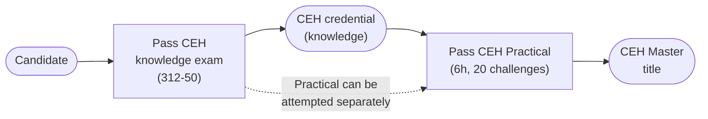
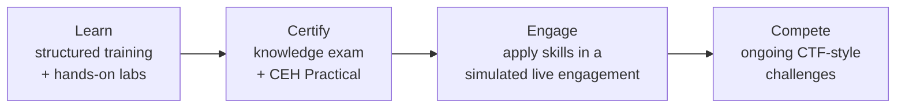

# What is the Certified Ethical Hacker (CEH)?

The Certified Ethical Hacker (CEH) is a vendor-neutral cybersecurity certification from the EC-Council that validates your ability to think and act like an attacker so you can defend systems. It teaches a structured methodology for finding and assessing weaknesses in systems, networks, and applications — legally, and with permission.

## Learning objectives

- Explain what the CEH certification is and who issues it.
- Distinguish the three members of the credential family: CEH, CEH Practical, and CEH Master.
- Summarise the CEH version history up to v13 ("CEH AI").
- Describe the EC-Council "Learn | Certify | Engage | Compete" framework.
- Identify what the certification proves and which roles it suits.

## Who issues CEH? (EC-Council)

CEH is produced by the **International Council of E-Commerce Consultants (EC-Council)**, a cybersecurity training and certification body. CEH is one of its best-known credentials and is widely referenced in job descriptions and government workforce frameworks.

Always treat the EC-Council website (https://www.eccouncil.org/) as the authoritative source for current exam codes, fees, and policies, because these change between versions.

## "Ethical" hacker — the core idea

An *ethical hacker* (sometimes called a *white-hat hacker* or *penetration tester*) uses the same tools and techniques as a malicious attacker, but:

- with **explicit written authorisation** from the system owner,
- within a defined **scope** and **Rules of Engagement (RoE)**, and
- to **improve** security rather than to cause harm.

The legal and ethical boundary is everything. Performing these techniques without authorisation is a crime in most jurisdictions. See [legal-and-ethics.md](./legal-and-ethics.md) for the full treatment — this is the most important page in this hub.

> For a systems administrator: think of the difference between *you* running a vulnerability scan on servers you administer (authorised, in scope) versus a stranger scanning them from the internet (unauthorised). Same packets, completely different legality.

## The CEH credential family

CEH is not a single exam. There are three related credentials:

| Credential | What it is | Format (summary) |
| --- | --- | --- |
| **CEH** (the "knowledge" exam) | Multiple-choice exam testing theory, tools, and methodology | 125 multiple-choice questions, 4 hours |
| **CEH Practical** | A hands-on, performance-based exam in a live lab range | 6 hours, 20 real-world challenges |
| **CEH Master** | A *title*, not a separate exam — earned by passing **both** the CEH knowledge exam **and** CEH Practical | n/a (composite) |

For exact passing scores, eligibility, and delivery details, see [exam-and-eligibility.md](./exam-and-eligibility.md).

> Note: the CEH knowledge exam and CEH Practical are separate exams. Earning the **CEH Master** title requires passing both. Confirm current sequencing rules on EC-Council, as policies can change between versions.

## Version history up to v13

CEH has been revised many times since its introduction in the early 2000s to keep pace with the threat landscape. Rather than list dates that are easy to get wrong, the key point for exam prep is the **current version**:

- **Current version: CEH v13**, marketed as **"CEH AI"** because it integrates artificial-intelligence (AI) tooling and AI-driven techniques across its modules.
- **Knowledge-exam code: 312-50 (v13)** — sometimes written `312-50v13`.

The v13 framework advertises (per EC-Council marketing materials):

- **221 hands-on labs**
- **550+ attack techniques**
- **4,000+ tools** covered

Earlier version numbers (for example, v11 and v12) appear in older study material and job postings; if a resource references an older version, verify it against current v13 content. Exact historical release dates are *not specified in these sources* — check EC-Council if you need them.

## The "Learn | Certify | Engage | Compete" model

EC-Council frames CEH v13 as a four-part learning journey rather than just an exam:

- **Learn** — the structured curriculum and labs that teach the methodology and tools.
- **Certify** — the CEH knowledge exam and the optional CEH Practical.
- **Engage** — a mock engagement that lets you apply the full methodology against a simulated target organisation.
- **Compete** — recurring Capture-the-Flag (CTF) style challenges to keep skills sharp after certification.

The acronym **CTF (Capture the Flag)** refers to gamified security challenges where you "capture" hidden tokens by solving security puzzles.

## What the certification proves

CEH is designed to demonstrate that the holder can:

- Apply the **5 phases of ethical hacking** (Reconnaissance → Scanning & Enumeration → Gaining Access → Maintaining Access → Clearing Tracks). See [five-phases-of-hacking.md](./five-phases-of-hacking.md).
- Use common offensive **tools and techniques** to identify vulnerabilities.
- Understand attacks across networks, web applications, wireless, cloud, mobile, Internet of Things (IoT), and Operational Technology (OT).
- Operate within **legal and ethical** constraints.

CEH is principally a **breadth** certification: it covers a very wide range of topics at a working level, which makes it a strong foundation. It is widely recognised, including in the United States Department of Defense (DoD) workforce framework (verify current accreditation status on EC-Council — see [exam-and-eligibility.md](./exam-and-eligibility.md)).

## Who CEH is for

CEH suits people moving toward offensive-security and broader security roles, including:

- **Systems and network administrators** transitioning into cybersecurity (this hub's primary audience).
- Security analysts and Security Operations Center (SOC) staff who want to understand attacker behaviour.
- Aspiring penetration testers and red-team members (often as a foundational step before more hands-on certifications).
- IT auditors, security officers, and compliance staff who need a working knowledge of attack techniques.

> For an administrator: your existing knowledge of operating systems, networking, Active Directory, and services is a major advantage. CEH reframes that knowledge from the attacker's point of view.

## Where to go next

- [exam-and-eligibility.md](./exam-and-eligibility.md) — exam format, eligibility routes, costs, and validity.
- [five-phases-of-hacking.md](./five-phases-of-hacking.md) — the core methodology in depth.
- [legal-and-ethics.md](./legal-and-ethics.md) — authorisation, scope, and the law.
- [../reference/acronyms.md](../reference/acronyms.md) — expanded acronyms used across this hub.

## Sources

- EC-Council, Certified Ethical Hacker (CEH) official program page — https://www.eccouncil.org/train-certify/certified-ethical-hacker-ceh/
- EC-Council, CEH v13 ("CEH AI") program materials — https://www.eccouncil.org/
- Verified ground truth provided for this study hub (CEH v13, exam code 312-50v13; framework figures: 221 labs, 550+ techniques, 4,000+ tools; "Learn | Certify | Engage | Compete").
- Specific historical version release dates: *not specified in these sources* — verify on EC-Council if required.
