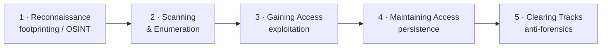
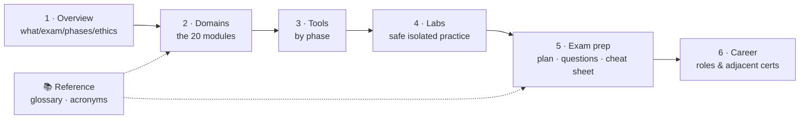

# 🎯 Certified Ethical Hacker (CEH) — Study Hub

### A source-grounded, **defense-oriented** study hub for the EC-Council **CEH v13**

*Concepts, real diagrams, tools, labs, and exam prep* — for a sysadmin moving into
offensive-aware **blue-team / ethical hacking** work.

-red)

---

> [!WARNING]
> **Educational & authorized use only.** This material explains attack techniques at a
> **conceptual level for understanding and defense** — every offensive topic is paired with
> **countermeasures**. Performing these techniques against systems you do not own or are
> not **explicitly authorized in writing** to test is illegal. See
> **[Legal & ethics](00-overview/legal-and-ethics.md)** first.

> [!NOTE]
> **Unofficial & no fabrication.** Not affiliated with or endorsed by EC-Council. Facts are
> tied to EC-Council and reputable sources (NIST, MITRE ATT&CK, OWASP, RFCs); unknowns are
> marked *“not specified in sources.”* Verify version/exam specifics at
> [eccouncil.org](https://www.eccouncil.org/). Compiled **2026-06-18**.

## 🔁 The 5 phases of ethical hacking

See **[five-phases-of-hacking.md](00-overview/five-phases-of-hacking.md)** for the
phase → module mapping and the Cyber Kill Chain / MITRE ATT&CK alignment.

## 📋 Exam at a glance

| Track | Format | Pass | Notes |
|-------|--------|------|-------|
| **CEH (knowledge)** | 125 multiple-choice questions · 4 hours · code `312-50v13` | **60–85%** (scaled cut-score per form) | The “ANSI” exam |
| **CEH Practical** | 20 real-world challenges · 6 hours · iLabs Cyber Range | **60–85%** | Hands-on, optional |
| **CEH Master** | — | — | Awarded for passing **both** above |

Full details: **[exam & eligibility](00-overview/exam-and-eligibility.md)**.

## 🗺️ Learning path

## 📦 What's inside

| Section | Contents |
|---------|----------|
| **[00-overview/](00-overview/what-is-ceh.md)** | [What is CEH](00-overview/what-is-ceh.md) · [Exam & eligibility](00-overview/exam-and-eligibility.md) · [5 phases](00-overview/five-phases-of-hacking.md) · [Legal & ethics](00-overview/legal-and-ethics.md) · [AI in ethical hacking](00-overview/ai-in-ethical-hacking.md) · [Engagement & reporting](00-overview/engagement-methodology-and-reporting.md) |
| **[domains/](domains/README.md)** | The **20 CEH modules** — concepts, flows, tools, and countermeasures |
| **[tools/](tools/tools-by-phase.md)** | Common tools mapped to phases/modules (purpose only) |
| **[labs/](labs/building-a-ceh-lab.md)** | [Build a safe lab](labs/building-a-ceh-lab.md) · [Practice ranges](labs/practice-ranges.md) |
| **[exam-prep/](exam-prep/study-plan.md)** | [Study plan](exam-prep/study-plan.md) · [Practice questions](exam-prep/practice-questions.md) · [Cheat sheet](exam-prep/cheat-sheet.md) |
| **[career/](career/ceh-career-and-adjacent-certs.md)** | CEH's place in a career & adjacent certifications |
| **[reference/](reference/glossary.md)** | [Glossary](reference/glossary.md) · [Acronyms](reference/acronyms.md) |

## 🔗 Quick links

- 🎓 [EC-Council CEH (official)](https://www.eccouncil.org/train-certify/certified-ethical-hacker-ceh/)
- 🧠 [Glossary](reference/glossary.md) · [Acronyms](reference/acronyms.md)
- 🧪 [The 20 modules](domains/README.md)
- ⚖️ [Legal & ethics](00-overview/legal-and-ethics.md)

> CEH, C|EH and EC-Council are trademarks of EC-Council, used here for identification and
> educational purposes only.
