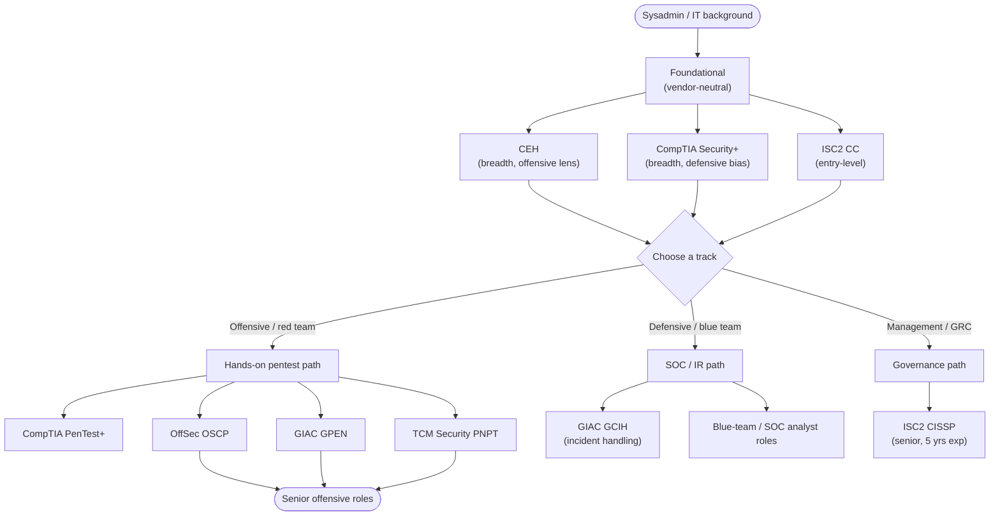
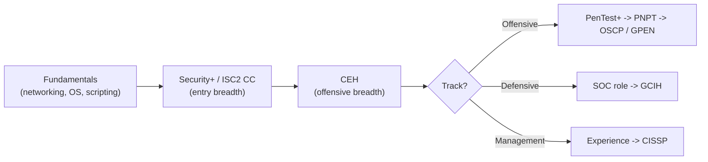

# CEH in a Cybersecurity Career, and Adjacent Certifications

This page puts the Certified Ethical Hacker (CEH) in context: the roles it supports, how it compares with adjacent certifications, its relevance to the United States Department of Defense (DoD) workforce framework, and a suggested learning order for someone moving from systems administration into cybersecurity. Market claims here are kept **qualitative** or attributed to a named, dated source; for live demand and salary figures, consult the cited sources directly.

> For a sysadmin: your operating-system, networking, and Active Directory background is a genuine advantage. CEH reframes that knowledge from the attacker's side, which makes it a natural breadth-first entry into security. See [what-is-ceh.md](../00-overview/what-is-ceh.md).

## Learning objectives

- Place CEH on the cybersecurity certification landscape (vendor-neutral, breadth-focused).
- Identify roles that commonly list or value CEH.
- Compare CEH honestly with adjacent certifications and know where each fits.
- Understand CEH's relevance to DoD 8140/8570 (and how to verify it).
- Follow a sensible learning order from sysadmin to security practitioner.

## Where CEH sits

CEH is a **vendor-neutral, breadth-oriented** certification: it covers a very wide range of offensive topics at a working level rather than drilling deep into one stack. That makes it strong for early-career roles and for screening filters in job postings, and a sensible foundation before more **hands-on, depth-focused** certifications.

> The diagram is illustrative, not prescriptive. Many practitioners mix tracks (e.g., a SOC analyst who also holds CEH), and titles vary widely between employers.

## Roles CEH supports

CEH is referenced across both offensive and defensive job families. Typical fits:

| Role | What they do | How CEH helps |
| --- | --- | --- |
| SOC Analyst (Security Operations Center) | Monitors alerts, triages and investigates events, escalates incidents. | Understanding attacker tactics, techniques, and procedures (TTPs) sharpens detection and triage. |
| Security Analyst | Assesses risk, reviews vulnerabilities, supports hardening and policy. | Breadth across attack types maps directly to vulnerability work. |
| Penetration Tester | Performs authorised, scoped attacks and writes remediation reports. | CEH is a common foundational/screening credential before deeper hands-on certs. |
| Red Team member | Emulates real adversaries end-to-end to test defences. | CEH provides the methodology vocabulary; deeper practical certs usually follow. |
| Blue Team member | Builds and tunes defences, hunts threats, responds to incidents. | "Know the attacker to defend" — CEH's core premise supports detection engineering. |
| Vulnerability Analyst | Identifies, rates (e.g., via CVSS), and prioritises vulnerabilities. | Maps to CEH's vulnerability-analysis and scanning modules. |
| IT Auditor / Compliance | Checks controls against standards (e.g., PCI DSS, ISO 27001). | A working knowledge of attacks improves control assessment. |

Red team vs blue team in one line: **red** simulates the attacker, **blue** defends and detects; a **purple team** is the collaboration between them.

## CEH vs adjacent certifications

Honest, one-line comparisons. **Verify current names, levels, prerequisites, and fees on each provider's site** before relying on them — programs change. CEH is included for reference.

| Certification | Provider | Vendor | Focus / style | Where it fits | Provider link |
| --- | --- | --- | --- | --- | --- |
| CEH | EC-Council | Vendor-neutral | Broad offensive theory + tools; mostly multiple-choice (CEH Practical is hands-on) | Foundational breadth; common in job filters and DoD-relevant roles | https://www.eccouncil.org/train-certify/certified-ethical-hacker-ceh/ |
| Security+ | CompTIA | Vendor-neutral | Broad, defensive-leaning security fundamentals | Common first security cert; baseline for many roles | https://www.comptia.org/certifications/security |
| PenTest+ | CompTIA | Vendor-neutral | Penetration testing process incl. planning, scoping, and reporting | Vendor-neutral pentest step above Security+ | https://www.comptia.org/certifications/pentest |
| OSCP | OffSec (Offensive Security) | Vendor-neutral | Hard, fully hands-on 24h exam; exploit a live lab and report | Respected proof of practical offensive skill | https://www.offsec.com/courses/pen-200/ |
| PNPT | TCM Security | Vendor-neutral | Practical, multi-day network pentest with Active Directory focus, report, and a live debrief | Affordable, realistic hands-on pentest credential | https://certifications.tcm-sec.com/pnpt/ |
| GPEN | GIAC (SANS) | Vendor-neutral | Penetration testing methodology and exploitation | Premium, in-depth pentest cert (often employer-funded) | https://www.giac.org/certifications/penetration-tester-gpen/ |
| GCIH | GIAC (SANS) | Vendor-neutral | Incident handling and attack techniques (blue-team leaning) | Strong for SOC/incident-response roles | https://www.giac.org/certifications/certified-incident-handler-gcih/ |
| CISSP | ISC2 ((ISC)²) | Vendor-neutral | Broad security management across eight domains; senior level | Management/leadership track; requires ~5 years' experience | https://www.isc2.org/certifications/cissp |
| CC (Certified in Cybersecurity) | ISC2 ((ISC)²) | Vendor-neutral | Entry-level security fundamentals; no experience required | True entry point into security | https://www.isc2.org/certifications/cc |

Notes:

- **Vendor-neutral vs vendor-specific:** all the certs above are vendor-neutral (not tied to one product). Vendor-specific certs (e.g., from cloud or network-equipment vendors) prove depth in a particular platform and complement, rather than replace, these.
- **Breadth vs depth:** CEH, Security+, and CC are breadth/foundational; OSCP, PNPT, GPEN go deep on hands-on offence; CISSP goes broad but at a senior management altitude.
- **(ISC)² branding:** the body now styles itself **ISC2** (the old "(ISC)²" superscript form still appears widely). Use the provider site as the source of truth.

## CEH and US DoD 8140 / 8570 (verify)

CEH has historically been mapped to qualifying roles under the US Department of Defense cyber workforce framework — **DoD Directive 8570** (the older information-assurance baseline) and its successor, **DoD Directive 8140** (the current cyber workforce framework). This mapping is a large part of why CEH appears so often in US government and defence-contractor job requirements.

- **Verify current status** on the DoD cyber workforce site and on EC-Council, because approved-certification lists and role mappings are revised over time. See [exam-and-eligibility.md](../00-overview/exam-and-eligibility.md) for the accreditation summary.
- Relevant verification sources: US DoD Cyber Workforce — https://public.cyber.mil/ ; EC-Council accreditations page — https://www.eccouncil.org/.

## A suggested learning order

A pragmatic path from systems administration into security. Adjust to your target role and budget; not every step is required.

1. **Shore up fundamentals** — networking, operating systems, and a scripting language. As a sysadmin you likely have much of this already.
2. **Entry-level / breadth** — **CompTIA Security+** and/or **ISC2 CC** to establish vendor-neutral security baseline knowledge.
3. **CEH** — gain the offensive methodology and vocabulary across the [20 CEH modules](../domains/); strong for job-posting filters and DoD-relevant roles.
4. **Pick a track:**
   - **Offensive:** **CompTIA PenTest+** → **TCM Security PNPT** → **OffSec OSCP** and/or **GIAC GPEN** for depth.
   - **Defensive / SOC:** SOC analyst experience → **GIAC GCIH** for incident handling.
   - **Management / GRC:** build experience, then **ISC2 CISSP** (requires ~5 years).
5. **Keep current** — maintain credentials (e.g., CEH via EC-Council Continuing Education credits) and practise hands-on via labs and Capture-the-Flag (CTF) events. See [../labs/](../labs/).

## On demand and salary claims

Demand for cybersecurity skills is widely described as strong, with a persistent **workforce gap** reported by industry studies. Treat any specific number with care and check the source and date:

- The **ISC2 Cybersecurity Workforce Study** (published annually) is a commonly cited, named source for workforce-gap and demand discussion — https://www.isc2.org/research.
- Salary figures vary heavily by country, role, seniority, and clearance, and they age quickly; this hub does not quote specific figures. Consult current, named labour-market sources for your region.

## Where to go next

- [what-is-ceh.md](../00-overview/what-is-ceh.md) — what CEH is and who it suits.
- [exam-and-eligibility.md](../00-overview/exam-and-eligibility.md) — exam format, eligibility, and accreditations (incl. DoD 8140).
- [../reference/glossary.md](../reference/glossary.md) and [../reference/acronyms.md](../reference/acronyms.md) — terms and acronyms used here.
- [../domains/](../domains/) — the 20 CEH modules.

## Sources

- EC-Council, Certified Ethical Hacker (CEH) program — https://www.eccouncil.org/train-certify/certified-ethical-hacker-ceh/
- CompTIA, Security+ and PenTest+ — https://www.comptia.org/certifications/security and https://www.comptia.org/certifications/pentest
- OffSec (Offensive Security), OSCP / PEN-200 — https://www.offsec.com/courses/pen-200/
- TCM Security, Practical Network Penetration Tester (PNPT) — https://certifications.tcm-sec.com/pnpt/
- GIAC (SANS), GPEN and GCIH — https://www.giac.org/certifications/penetration-tester-gpen/ and https://www.giac.org/certifications/certified-incident-handler-gcih/
- ISC2 ((ISC)²), CISSP and CC (Certified in Cybersecurity) — https://www.isc2.org/certifications/cissp and https://www.isc2.org/certifications/cc ; CISSP experience requirements — https://www.isc2.org/certifications/cissp/cissp-experience-requirements
- ISC2 Cybersecurity Workforce Study (workforce-gap / demand reference) — https://www.isc2.org/research
- US DoD Cyber Workforce, Directives 8140 / 8570 — https://public.cyber.mil/ (verify current CEH mapping)
- Certification names, levels, prerequisites, and fees: verify on each provider's site — programs change.
