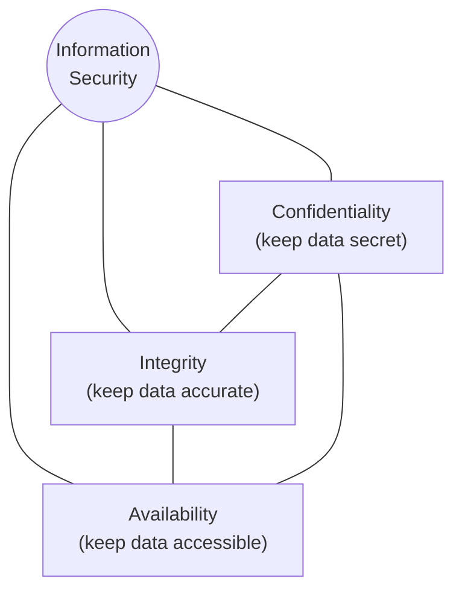
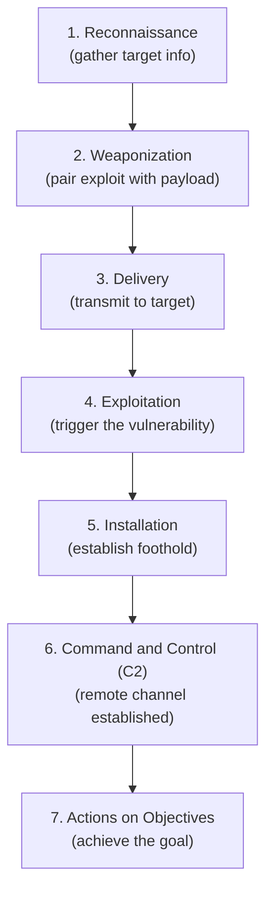
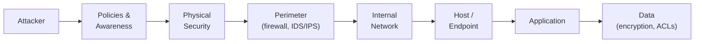

# Module 1 — Introduction to Ethical Hacking

This module is the foundation of the **Certified Ethical Hacker (CEH)** program from the **EC-Council (International Council of E-Commerce Consultants)**. It establishes the vocabulary and mental models you will use throughout the rest of your studies: what *information security* actually protects, how attackers are categorized, how an attack unfolds end to end, and the laws and frameworks that govern defensive work. Coming from a system administration background, you already know how to *operate* systems; this module reframes that knowledge through the lens of *protecting* them and understanding how they are attacked.

> **Authorization and legality — read first.** Every technique discussed in the CEH program is legal to perform **only** with explicit, written authorization (a signed scope-of-work, rules of engagement, or penetration-test contract) covering the specific systems involved. Performing reconnaissance, scanning, or exploitation against systems you do not own or are not contracted to test is a crime in most jurisdictions. This material is **educational and defense-oriented**: it explains attack concepts so you can detect, prevent, and respond to them. It contains no operational attack playbooks.

## Learning objectives

After completing this module you should be able to:

- Define information security and explain the elements of the **CIA triad** (Confidentiality, Integrity, Availability), plus authenticity and non-repudiation.
- Distinguish between **threat**, **vulnerability**, **risk**, and **exposure**, and categorize attacks (network/host/application, passive/active, insider/outsider).
- Identify the common **hacker classes** as CEH defines them.
- Describe the **Cyber Kill Chain** and the **MITRE ATT&CK** framework and explain how defenders use each.
- Explain **defense-in-depth** and the basic concept of **risk management** (risk = likelihood × impact).
- Recognize the major **information security laws and standards**: PCI-DSS, ISO/IEC 27001, HIPAA, GDPR, SOX, and DMCA.

---

## 1. Information security overview

**Information security (InfoSec)** is the practice of protecting information and information systems from unauthorized access, use, disclosure, disruption, modification, or destruction. It is broader than "cybersecurity" because it covers information in any form — digital, paper, or spoken — though in the CEH context the focus is on digital systems and networks.

The goal of InfoSec is not to make systems perfectly impenetrable (impossible in practice) but to manage **risk** to an acceptable level while keeping systems usable for legitimate purposes. This is the constant tension you will see throughout CEH: every security control has a cost in usability, performance, or money, so security is always a balancing act.

The U.S. **National Institute of Standards and Technology (NIST)** defines the core security objectives of confidentiality, integrity, and availability in **NIST Special Publication (SP) 800-12** and **FIPS Publication 199** (FIPS = Federal Information Processing Standards). These objectives form the CIA triad.

---

## 2. The CIA triad

The **CIA triad** is the foundational model of information security. CIA here stands for **Confidentiality, Integrity, and Availability** — it has nothing to do with the intelligence agency. Every security control you will ever design or evaluate supports one or more of these three properties.

### Confidentiality
Ensuring that information is accessible **only to those authorized** to have access. A breach of confidentiality is an unauthorized *disclosure* of data.
- **Supporting controls:** encryption (data at rest and in transit), access control lists (ACLs), authentication, classification of data, the principle of least privilege.
- **System-admin analogy:** file permissions and `chmod`/NTFS ACLs are confidentiality controls.

### Integrity
Ensuring that information is **accurate and complete** and has not been modified in an unauthorized or undetected manner — whether by an attacker, a faulty process, or accident.
- **Supporting controls:** cryptographic hashing (e.g., SHA-256), digital signatures, checksums, version control, change management, write-protection.
- **Analogy:** verifying an ISO image against its published SHA-256 hash before installing.

### Availability
Ensuring that information and systems are **accessible and usable on demand** by authorized users. A **denial-of-service (DoS)** attack is fundamentally an attack on availability.
- **Supporting controls:** redundancy, failover, load balancing, backups, disaster recovery, DoS/DDoS mitigation, patch management (to prevent crashes).

### Two extended properties

CEH also emphasizes two properties often added to the triad:

- **Authenticity** — the assurance that data, a transaction, or a communication is **genuine** and that the parties involved are who they claim to be. Supported by authentication mechanisms and digital certificates.
- **Non-repudiation** — the assurance that a party **cannot deny** the authenticity of their action or a message they sent. Supported by digital signatures and audit logging. (For example, a digitally signed email proves the sender cannot later credibly claim they did not send it.)

| Property | Protects against | Example control |
|---|---|---|
| Confidentiality | Unauthorized disclosure | Encryption, ACLs |
| Integrity | Unauthorized/undetected modification | Hashing, digital signatures |
| Availability | Disruption / loss of access | Redundancy, backups, DoS mitigation |
| Authenticity | Impersonation / forgery | Authentication, certificates |
| Non-repudiation | Denial of an action | Digital signatures, audit logs |

---

## 3. Threat, vulnerability, risk, and exposure

These four terms are frequently confused. CEH expects you to distinguish them precisely.

| Term | Definition | Example |
|---|---|---|
| **Threat** | A potential cause of an unwanted incident; an agent or event with the potential to harm an asset. | A ransomware group; a malicious insider; a flood. |
| **Vulnerability** | A weakness or flaw in a system, design, or process that a threat can exploit. | An unpatched service; a weak password policy; a misconfigured firewall. |
| **Risk** | The likelihood that a threat will exploit a vulnerability, combined with the resulting impact. | "High risk of data theft because an internet-facing server is unpatched." |
| **Exposure** | A state in which an asset is susceptible to loss; the specific instance of being exposed to a threat. | A confidential file readable by the public internet. |

A useful relationship to memorize: a **threat** exploits a **vulnerability**, which creates **exposure**, and the chance and consequence of that happening is **risk**. Removing the vulnerability (e.g., patching) reduces risk even if the threat still exists.

### Attack and threat categories

CEH groups attacks several ways. You should know all of these lenses:

**By target classification:**
- **Network attacks** — target the network infrastructure and protocols (e.g., session hijacking, denial of service, man-in-the-middle).
- **Host attacks** — target an individual system or operating system (e.g., malware, privilege escalation, password attacks).
- **Application attacks** — target software, especially web applications (e.g., injection flaws, broken authentication — see the **OWASP Top 10** and [Module 5 — Vulnerability Analysis](./05-vulnerability-analysis.md)).

**By interaction with the target:**
- **Passive attacks** — the attacker monitors or analyzes without altering data, making them hard to detect (e.g., traffic sniffing, eavesdropping, footprinting).
- **Active attacks** — the attacker directly interacts with and attempts to alter the system or data (e.g., DoS, spoofing, tampering, injection).

**By origin:**
- **Insider attacks** — originate from someone with legitimate access (employee, contractor). Often the most damaging because trust and access already exist.
- **Outsider (external) attacks** — originate from outside the organization's trust boundary.

CEH also describes broad **attack vectors / threat sources** such as cloud-based threats, advanced persistent threats (APTs), mobile threats, insider threats, botnets, and others. An **Advanced Persistent Threat (APT)** is a stealthy, well-resourced adversary (often state-sponsored) that maintains long-term unauthorized access to a network.

---

## 4. Hacker classes

CEH classifies hackers primarily by **intent and authorization**. The most important distinction is whether the activity is authorized.

| Class | Description |
|---|---|
| **Black hat** | Malicious attacker who violates security for personal gain, disruption, or malice. No authorization. Illegal. |
| **White hat** | Ethical hacker / penetration tester who tests systems **with authorization** to improve security. This is the CEH role. |
| **Grey hat** | Operates between the two — may probe systems without authorization but typically without clear malicious intent, sometimes reporting flaws afterward. Still legally and ethically problematic because authorization is absent. |
| **Suicide hacker** | Aims to cause major damage (e.g., to critical infrastructure) and is unconcerned about being caught or facing punishment. |
| **Script kiddie** | An unskilled individual who uses tools and scripts written by others without understanding the underlying mechanisms. |
| **Hacktivist** | Hacks to promote a political, social, or ideological agenda (e.g., defacing websites to spread a message). |
| **State-sponsored hacker** | Employed or directed by a government to conduct espionage, sabotage, or offensive operations against other states or organizations. |
| **Cyber terrorist** | Motivated by religious or political beliefs to create fear or disruption through large-scale attacks. |

The defining line for *ethical* hacking is **explicit written authorization and a defined scope**. A white-hat engagement always begins with a signed agreement (rules of engagement) — see [The Five Phases of Hacking](../00-overview/five-phases-of-hacking.md) for how an authorized engagement is structured.

---

## 5. The Cyber Kill Chain

The **Cyber Kill Chain** is a model developed by **Lockheed Martin** that describes the stages of a targeted intrusion as a sequence. Its defensive value is that **breaking any single link** disrupts the entire attack — so defenders map detection and prevention controls to each stage.

| Stage | What happens | Defensive idea |
|---|---|---|
| **1. Reconnaissance** | Attacker gathers information about the target (open-source research, scanning). | Limit public exposure; monitor for scanning. See [Module 2 — Footprinting and Reconnaissance](./02-footprinting-and-reconnaissance.md). |
| **2. Weaponization** | Attacker pairs an exploit with a deliverable payload. | Hardening, vulnerability management, threat intelligence. |
| **3. Delivery** | The weaponized payload is transmitted (e.g., email, web, removable media). | Email filtering, web proxies, disabling autorun, user awareness. |
| **4. Exploitation** | The payload triggers a vulnerability to execute on the target. | Patching, exploit mitigations, least privilege. |
| **5. Installation** | The attacker installs malware to maintain persistence. | Endpoint detection and response (EDR), application allow-listing, integrity monitoring. |
| **6. Command and Control (C2)** | A channel is opened for the attacker to control the compromised host remotely. | Network segmentation, egress filtering, DNS monitoring, blocking known C2. |
| **7. Actions on Objectives** | The attacker achieves their goal (data exfiltration, destruction, lateral movement). | Data loss prevention (DLP), anomaly detection, incident response. |

CEH also references the **MITRE ATT&CK** framework and may discuss the **Diamond Model of Intrusion Analysis** as complementary models.

---

## 6. The MITRE ATT&CK framework

**MITRE ATT&CK** (ATT&CK = **Adversarial Tactics, Techniques, and Common Knowledge**) is a globally accessible, continuously updated knowledge base of real-world adversary behavior, maintained by **The MITRE Corporation** (a not-for-profit organization that operates U.S. federally funded research centers).

Where the Cyber Kill Chain is a high-level **linear** model, ATT&CK is a **matrix** that catalogs adversary behavior in much finer detail:

- **Tactics** — the adversary's *goal* or "why" (the columns of the matrix), e.g., Initial Access, Persistence, Privilege Escalation, Defense Evasion, Credential Access, Lateral Movement, Exfiltration, Impact.
- **Techniques (and sub-techniques)** — the *how*: the specific methods used to achieve each tactic.
- **Procedures** — the specific real-world implementations observed in actual intrusions.

**Why defenders use it:** ATT&CK provides a common, vendor-neutral language to describe attacker behavior. Defenders use it to assess detection coverage (e.g., "which techniques can our tooling detect?"), to drive threat-hunting hypotheses, to map controls, and to communicate consistently across teams. It is widely used in security operations center (SOC) and threat-intelligence work.

---

## 7. Defense-in-depth (layered security)

**Defense-in-depth** is a strategy of applying **multiple, independent layers** of security controls so that if one layer fails, others still protect the asset. It assumes no single control is perfect. The concept is endorsed by NIST and is central to CEH's defensive philosophy.

Layers typically include: governance (policies, procedures, training); physical security; perimeter defenses (firewalls, intrusion detection/prevention systems — IDS/IPS); network controls (segmentation, monitoring); host/endpoint protection; application security; and data protection (encryption, access control). Controls are also categorized by function:

- **Preventive** — stop an incident (firewalls, access control).
- **Detective** — identify an incident in progress (IDS, logging, SIEM — Security Information and Event Management).
- **Corrective** — restore after an incident (backups, patching, incident response).

A related modern principle is **Zero Trust** ("never trust, always verify"), described in **NIST SP 800-207**, which removes implicit trust based on network location.

---

## 8. Risk and risk management

**Risk** is commonly expressed as:

> **Risk = Likelihood × Impact**

where *likelihood* is the probability that a threat successfully exploits a vulnerability, and *impact* is the magnitude of harm if it does. This lets organizations **prioritize** — a high-likelihood, high-impact risk demands more attention than a low-likelihood, low-impact one.

**Risk management** is the ongoing process of identifying, assessing, and responding to risk. The standard response options are:

| Response | Meaning | Example |
|---|---|---|
| **Mitigate (reduce)** | Apply controls to lower likelihood or impact. | Patch the vulnerable server. |
| **Transfer (share)** | Shift the financial impact elsewhere. | Buy cyber-insurance; outsource to a managed provider. |
| **Avoid** | Eliminate the activity that creates the risk. | Decommission the unneeded service. |
| **Accept** | Knowingly tolerate the residual risk. | Accept low risk after weighing cost vs. benefit. |

NIST's **Risk Management Framework (RMF)** is documented in **NIST SP 800-37**, and risk-assessment guidance is in **NIST SP 800-30**. The international standard for IT risk is **ISO/IEC 27005**.

---

## 9. Information security laws and standards

Ethical hackers must operate within the law and help organizations meet compliance obligations. The following are the major standards and regulations CEH references. *Specific contractual penalties and thresholds are not specified here; consult the authoritative sources.*

| Standard / Law | Full name | Scope / Purpose |
|---|---|---|
| **PCI-DSS** | Payment Card Industry Data Security Standard | A security standard (managed by the PCI Security Standards Council) for organizations that store, process, or transmit cardholder data. It mandates controls such as network segmentation, encryption, and regular testing. It is an industry standard, not a government law. |
| **ISO/IEC 27001** | International Organization for Standardization / International Electrotechnical Commission 27001 | The international standard specifying requirements for an **Information Security Management System (ISMS)** — a systematic, risk-based approach to managing information security. Organizations can be formally certified. |
| **HIPAA** | Health Insurance Portability and Accountability Act | U.S. law protecting the privacy and security of **protected health information (PHI)**. Its Security Rule sets administrative, physical, and technical safeguards for electronic PHI. |
| **GDPR** | General Data Protection Regulation | European Union regulation governing the protection and privacy of personal data of individuals in the EU/EEA. Establishes rights for data subjects and obligations (including breach notification) for organizations. |
| **SOX** | Sarbanes-Oxley Act | U.S. law focused on the accuracy and integrity of financial reporting for public companies; has significant IT controls and data-integrity implications. |
| **DMCA** | Digital Millennium Copyright Act | U.S. law addressing copyright in the digital age, including provisions on circumventing technological protection measures. |
| **FISMA** | Federal Information Security Management/Modernization Act | U.S. law requiring federal agencies to develop and maintain information security programs (closely tied to the NIST RMF). |

> Many of these overlap and reinforce one another. A single organization (e.g., a hospital processing card payments) may simultaneously be subject to HIPAA, PCI-DSS, and GDPR.

---

## Countermeasures / Defense

This section consolidates the defensive takeaways. As an ethical hacker, your purpose is to find weaknesses **so they can be fixed** — defense is the end goal of all offensive testing.

- **Reduce the attack surface.** Disable unused services and ports, remove default accounts, and minimize publicly exposed information (counters reconnaissance and the early Kill Chain stages).
- **Patch and manage vulnerabilities** continuously to remove the weaknesses threats exploit (addresses Exploitation; see [Module 5 — Vulnerability Analysis](./05-vulnerability-analysis.md)).
- **Enforce least privilege and strong authentication**, including multi-factor authentication (MFA), to protect confidentiality and limit lateral movement.
- **Encrypt data** at rest and in transit (confidentiality) and use **hashing/digital signatures** for integrity and non-repudiation.
- **Layer controls (defense-in-depth)** and segment networks so a single failure does not compromise everything; apply **egress filtering** and DNS monitoring to disrupt Command and Control (C2).
- **Detect and respond.** Deploy IDS/IPS, EDR, and centralized logging into a **SIEM**; map detection coverage to **MITRE ATT&CK** techniques; maintain an incident-response plan.
- **Ensure availability** through redundancy, backups, and tested disaster-recovery/DoS-mitigation plans.
- **Train people.** Security-awareness training counters social engineering and phishing — the most common Delivery vector.
- **Operate legally.** Always work under explicit written authorization, a defined scope, and rules of engagement, and comply with the laws and standards above.

---

## Exam tips

- **Memorize the CIA triad cold** and know which control supports which property. A DoS attack targets **Availability**; encryption supports **Confidentiality**; hashing supports **Integrity**.
- Distinguish **non-repudiation** (cannot deny an action — digital signatures) from **authenticity** (genuine identity — authentication). They are easy to confuse.
- Know the four terms precisely: a **threat** exploits a **vulnerability**, producing **exposure**; **risk** = likelihood × impact.
- Be able to list the **7 Cyber Kill Chain stages in order**: Reconnaissance → Weaponization → Delivery → Exploitation → Installation → Command and Control (C2) → Actions on Objectives.
- The defining trait of **white-hat / ethical hacking** is **explicit written authorization**.
- The Kill Chain is **linear and high-level**; **MITRE ATT&CK** is a detailed **matrix of tactics and techniques** used by defenders.
- Match laws to domains: **HIPAA** → healthcare/PHI; **PCI-DSS** → payment cards (industry standard, not a law); **SOX** → financial reporting; **GDPR** → EU personal data; **ISO/IEC 27001** → ISMS certification.
- **Risk responses:** mitigate, transfer, avoid, accept. Be ready to identify each from a scenario.
- See the [acronyms reference](../reference/acronyms.md) to drill the abbreviations used across the program.

---

## Sources

- EC-Council — Certified Ethical Hacker (CEH) program: <https://www.eccouncil.org/>
- NIST Computer Security Resource Center (CSRC) — SP 800 series, FIPS 199, RMF: <https://csrc.nist.gov/>
- MITRE ATT&CK: <https://attack.mitre.org/>
- Lockheed Martin — Cyber Kill Chain: <https://www.lockheedmartin.com/>
- OWASP (Open Worldwide Application Security Project): <https://owasp.org/>
- PCI Security Standards Council (PCI-DSS): <https://www.pcisecuritystandards.org/>
- ISO (International Organization for Standardization) — ISO/IEC 27001: <https://www.iso.org/>
- U.S. Department of Health & Human Services — HIPAA: <https://www.hhs.gov/hipaa/>
- General Data Protection Regulation (GDPR): <https://gdpr.eu/>

---

*Related: [Course overview](../00-overview/what-is-ceh.md) · [Five phases of hacking](../00-overview/five-phases-of-hacking.md) · [Module 2 — Footprinting and Reconnaissance](./02-footprinting-and-reconnaissance.md) · [Module 5 — Vulnerability Analysis](./05-vulnerability-analysis.md) · [Acronyms](../reference/acronyms.md)*
