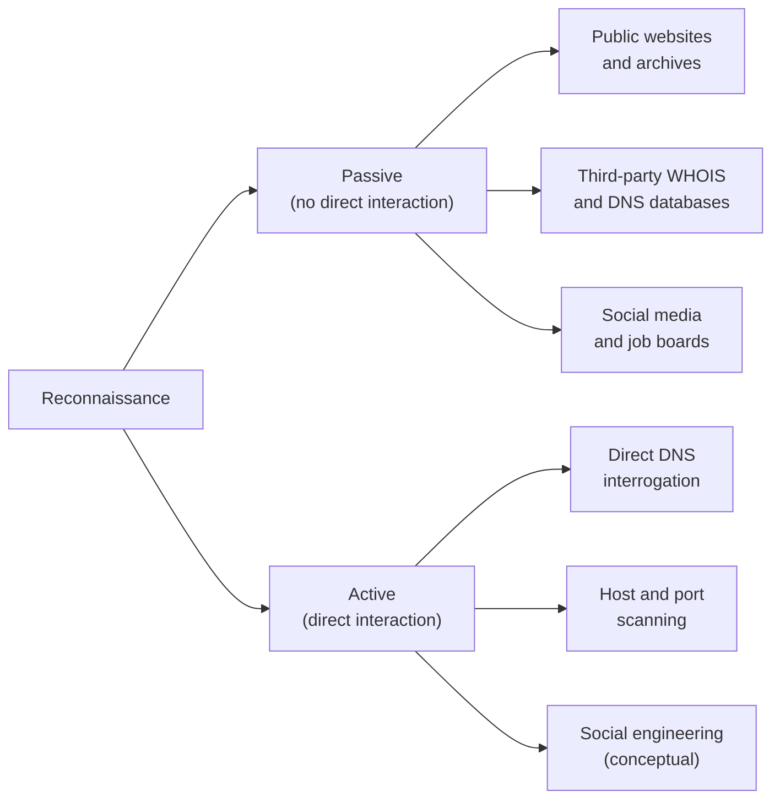
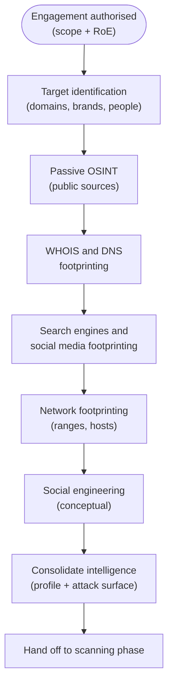

# Module 2 — Footprinting and Reconnaissance

Footprinting and reconnaissance is the first active phase of an ethical-hacking engagement: the systematic collection of information about a target organisation, its people, and its technology before any deeper testing begins. The goal is to build a detailed *profile* of the target — its internet-facing systems, domains, network ranges, technologies, and employees — so that later phases are focused and efficient.

This module teaches the concepts from a defender's standpoint. Everything here is **educational** and **defence-oriented**. These techniques are legal **only** with explicit written authorisation from the system owner, performed within a defined scope and Rules of Engagement (RoE). Using them against systems you do not own or are not authorised to test is a crime in most jurisdictions. See [./01-introduction-to-ethical-hacking.md](./01-introduction-to-ethical-hacking.md) and the overview at [../00-overview/five-phases-of-hacking.md](../00-overview/five-phases-of-hacking.md).

> For a systems administrator moving into security: footprinting is mostly *passive research using public sources*. Much of what an attacker learns about your organisation is information you (or your colleagues, or third-party services) have already published. Reconnaissance is therefore as much a defensive discipline — knowing your own exposure — as an offensive one.

## Learning objectives

- Define footprinting and reconnaissance and explain why they form the first phase of an engagement.
- Distinguish **passive** reconnaissance from **active** reconnaissance, with conceptual examples.
- Explain **Open-Source Intelligence (OSINT)** and the categories of public sources used.
- Describe footprinting through search engines, web services, social networking sites, websites, email, WHOIS, the Domain Name System (DNS), the network, and social engineering.
- Explain what common DNS records (A, MX, NS, TXT, SOA, CNAME) reveal and what "DNS interrogation" means conceptually.
- Explain search-engine footprinting and Google hacking / Google Dorking at a **conceptual** level, including the Google Hacking Database (GHDB).
- Identify the **purpose** of key footprinting tools: Maltego, Recon-ng, theHarvester, Shodan, and the utilities `nslookup`, `dig`, and `whois`.
- Apply defensive countermeasures to reduce an organisation's footprint.

## What footprinting and reconnaissance are

**Reconnaissance** is the broad activity of gathering information about a target. **Footprinting** is the structured, methodical sub-process of building a "footprint" — a map of an organisation's externally visible presence and attack surface. In practice the two terms are used closely together; CEH treats footprinting as the disciplined methodology that delivers reconnaissance results.

Footprinting is the **first phase** because information drives every later decision. Before scanning networks (covered in [./03-scanning-networks.md](./03-scanning-networks.md)) or attempting access, an attacker — or an authorised tester — needs to know *what* exists: which domains, IP (Internet Protocol) address ranges, hosts, services, technologies, and people belong to the target. Good reconnaissance reduces noise, narrows scope, and reveals the most promising avenues.

Typical objectives of footprinting include identifying:

- **Network information** — domain names, IP address ranges, network blocks, and DNS records.
- **System information** — operating systems, web-server software, and exposed services.
- **Organisational information** — employee names and roles, email address formats, phone numbers, physical locations, partners, and technologies in use.

This maps directly to the Reconnaissance step of the five-phase model and to the **Reconnaissance** tactic in the **MITRE ATT&CK** framework (Tactic TA0043), which catalogues real-world adversary information-gathering behaviours.

## Passive vs active reconnaissance

The single most important distinction in this module is *passive* vs *active*.

| Aspect | Passive reconnaissance | Active reconnaissance |
| --- | --- | --- |
| Definition | Gathering information **without directly interacting** with the target's systems | Gathering information **by directly interacting** with the target's systems |
| Detectability | Very low — the target usually cannot tell it is happening | Higher — the target may log or detect the interaction |
| Conceptual examples | Reading a company website, searching news and job boards, querying third-party WHOIS/DNS databases, reviewing social media, browsing public code repositories | Querying the target's own DNS servers directly, probing/scanning hosts, banner grabbing, social engineering an employee |
| Data source | Third parties and public archives | The target organisation itself |

Passive reconnaissance touches only intermediaries and public records; active reconnaissance sends something to, or solicits something from, the target. Note that some sources blur the line — for example, simply visiting a target's public website is often classed as passive even though a packet reaches their server, because it is ordinary public access. The key principle for an exam and for ethics is **the more direct the interaction, the more "active" — and the more detectable — it becomes**.

## Open-Source Intelligence (OSINT)

**Open-Source Intelligence (OSINT)** is intelligence produced from **publicly available** information — sources anyone can lawfully access without special privileges. "Open source" here means *open/public information*, not open-source software. OSINT is the backbone of passive footprinting.

OSINT sources include:

- **Search engines** and cached/archived web pages.
- **Organisational websites** — about pages, leadership bios, documents, metadata.
- **Social networking sites** and professional networks.
- **Public registries** — WHOIS, DNS, regional internet registries, certificate transparency logs.
- **News, press releases, regulatory filings, and job postings**.
- **Public code repositories and technical forums**.

OSINT is powerful because organisations leak far more than they intend through routine publishing. The defensive flip side is **self-OSINT**: regularly running the same searches against yourself to discover what an outsider can learn.

## The footprinting methodology

CEH presents footprinting as an ordered methodology rather than a random hunt. Conceptually, it flows from broad identification toward consolidated, actionable intelligence.

The following sections describe each footprinting *channel*.

### Footprinting through search engines

Search engines index a vast amount of an organisation's public content. Footprinting through search engines means using ordinary and advanced searches to surface documents, subdomains, exposed login portals, contact details, and technologies. Advanced search **operators** (sometimes called *Google Dorking* or *Google hacking*) let an investigator narrow results — for example, restricting results to a single domain, to a particular file type, or to text appearing in page titles or URLs.

This module describes Google hacking only **conceptually**: such operators *exist* and can locate sensitive content that was inadvertently exposed. The **Google Hacking Database (GHDB)** — hosted by Exploit-DB / Offensive Security — is a public reference that catalogues categories of such queries; CEH names it as a resource. No copy-paste query playbook is provided here, because the defensive lesson is what matters: **do not publish sensitive content where search engines can index it.**

### Footprinting through web services

Specialised web services aggregate useful data:

- **People- and company-search services** for names, roles, and contacts.
- **Internet archives** (e.g., the Wayback Machine) that preserve old versions of a website — historic pages can reveal previously exposed information, retired technologies, or staff who have since left.
- **Job and recruitment sites**, which frequently disclose internal technologies (the exact software, versions, and platforms a role requires hint at the internal stack).
- **Certificate transparency logs**, which publicly list issued Transport Layer Security (TLS) certificates and can reveal subdomains.

### Footprinting through social networking sites

Social and professional networks expose employee names, job titles, reporting structures, locations, technologies, and relationships. This information supports building an organisational chart and crafting believable **social engineering** (see below). The defensive concern is over-sharing by employees — for example, posting photos of badges, screens, or workplaces.

### Website footprinting

Examining a target's own website (passively, as a normal visitor) can reveal:

- Site structure, technologies, and content management systems.
- Email-address formats and contact information.
- **Metadata** embedded in published documents (author names, software versions, internal paths, usernames).
- Comments and hidden fields in page source.

### Email footprinting

Email reveals organisational structure and infrastructure. Email **headers** record the path a message travelled and can disclose internal server names, IP addresses, and mail software. Discovering the organisation's email naming convention (for example, `first.last@example.com`) lets an investigator infer addresses for known employees. Email-tracking concepts (knowing whether and where a message was opened) are also discussed in CEH at a conceptual level.

### WHOIS footprinting

**WHOIS** is a query/response protocol (defined in **RFC 3912**) for looking up records about domain-name and IP-address registrations. A WHOIS lookup can return:

- Registrar and registration/expiry dates.
- Registrant, administrative, and technical **contacts** (where not redacted by privacy services or, in the EU, restricted under the General Data Protection Regulation, GDPR).
- Authoritative **name servers** for the domain.

For IP addresses, the relevant registries are the **Regional Internet Registries (RIRs)** — for example, ARIN (American Registry for Internet Numbers), RIPE NCC, APNIC, LACNIC, and AFRINIC — which publish the owner and size of allocated network blocks. This helps map an organisation's IP address ranges.

### DNS footprinting

The **Domain Name System (DNS)** translates human-readable names (such as `www.example.com`) into IP addresses and stores other records about a domain. Querying public DNS data — and, in active reconnaissance, the target's own DNS servers — reveals much of the organisation's externally visible infrastructure. This is called **DNS interrogation**: systematically asking DNS for each record type to enumerate hosts and services.

Key record types and what they reveal:

| Record | Name | What it reveals |
| --- | --- | --- |
| **A** (and **AAAA**) | Address record | The IPv4 (A) or IPv6 (AAAA) address a hostname points to — maps names to hosts |
| **MX** | Mail Exchange | The mail servers that receive email for the domain — identifies email infrastructure |
| **NS** | Name Server | The authoritative DNS servers for the domain |
| **TXT** | Text | Arbitrary text records; often hold SPF, DKIM, and DMARC email-authentication policies, and verification tokens that hint at third-party services in use |
| **SOA** | Start of Authority | Administrative data for the zone — primary name server, responsible-party email, serial number, and refresh/retry timers |
| **CNAME** | Canonical Name | An alias mapping one name to another — can reveal use of third-party/cloud services |

A historically significant DNS concept is the **zone transfer** (the DNS query type **AXFR**), a mechanism intended to replicate a full zone between authoritative servers. If a server is misconfigured to allow zone transfers to anyone, it can hand over the entire list of records at once. **Properly configured servers restrict zone transfers**, so this is primarily a *defensive checklist item*. Email-authentication records appearing in TXT data relate to **SPF (Sender Policy Framework, RFC 7208)**, **DKIM (DomainKeys Identified Mail, RFC 6376)**, and **DMARC (Domain-based Message Authentication, Reporting and Conformance, RFC 7489)**.

### Network footprinting

Network footprinting determines the **IP address ranges** and **network topology** belonging to the target. Conceptually it combines RIR/WHOIS data (which blocks are allocated to the organisation) with reachability/path information to understand how the network is laid out. The output is a list of in-scope network ranges and live hosts that feeds directly into the scanning phase ([./03-scanning-networks.md](./03-scanning-networks.md)).

### Footprinting through social engineering (conceptual)

**Social engineering** is the manipulation of *people* into revealing information or performing actions. In reconnaissance it is used to gather details that are not published anywhere — for example by impersonation, pretexting, eavesdropping, or simply asking. Common conceptual techniques named by CEH include **pretexting** (a fabricated scenario), **phishing** (deceptive messages), **eavesdropping**, **shoulder surfing**, and **dumpster diving** (recovering discarded information). The defensive response is **security-awareness training** and clear data-handling policy. This module covers social engineering only at a conceptual level; it is treated in depth in its own CEH module.

## Footprinting tools (name and purpose only)

CEH expects you to recognise tools by **name and purpose**. The following are described conceptually — what each is *for* — not as operational playbooks.

| Tool | Type | Purpose |
| --- | --- | --- |
| **Maltego** | Link-analysis / data-mining platform | Visualises relationships between entities (people, domains, emails, organisations, infrastructure) gathered from many sources, making connections in OSINT data easy to see |
| **Recon-ng** | Modular OSINT reconnaissance framework | Provides a structured, module-based environment for automating web-based information gathering and organising results |
| **theHarvester** | OSINT gathering utility | Collects emails, subdomains, hostnames, and related data about a domain from public sources such as search engines |
| **Shodan** | Search engine for internet-connected devices | Indexes internet-facing hosts, services, and banners — used to discover exposed devices and services (servers, cameras, industrial systems) and to understand external exposure |
| **`nslookup`** | DNS query utility | A standard command-line tool for querying DNS records (an active, direct query against a name server) |
| **`dig`** | DNS query utility | (Domain Information Groper) A flexible command-line DNS lookup tool used for detailed DNS interrogation |
| **`whois`** | Registration lookup utility | Command-line client that performs WHOIS queries against registries for domain and IP registration data |

> Defensive note: the same tools that profile a target can be turned inward. Running Shodan, theHarvester, and `dig` against *your own* domains is a legitimate, recommended way to discover unintended exposure before an attacker does.

## Countermeasures / Defense

Footprinting exploits information you have already made public, so most defences are about **reducing and controlling exposure** rather than blocking a single attack. Recommended countermeasures (consistent with EC-Council guidance and **NIST** publications such as **SP 800-53** security controls and **SP 800-115**, the *Technical Guide to Information Security Testing and Assessment*):

- **Minimise public disclosure.** Publish only what is necessary on websites, job postings, and social media. Review what recruitment listings reveal about internal technologies.
- **Strip document metadata** before publishing files, removing author names, software versions, and internal paths.
- **Configure DNS securely.** Restrict **zone transfers (AXFR)** to authorised secondary servers only; avoid placing internal/sensitive hostnames in public DNS; segregate internal and external DNS (split-horizon).
- **Harden email.** Implement and correctly scope **SPF**, **DKIM**, and **DMARC**; limit information leaked in email headers and bounce messages.
- **Use WHOIS privacy/redaction** where lawful and appropriate so registrant contact details are not openly published.
- **Manage your external attack surface continuously.** Regularly perform **self-OSINT** — query Shodan, certificate transparency logs, and search engines against your own assets to find exposed services and stale subdomains, then remediate.
- **Prevent inadvertent search-engine indexing** of sensitive content; control access so confidential material is never reachable by crawlers (note that access controls, not just `robots.txt`, are the real protection).
- **Train staff against social engineering.** Security-awareness programmes, clear policies on what may be shared publicly, and safe disposal of documents (countering dumpster diving) all reduce the human-source footprint.
- **Monitor and log.** Detect patterns of active reconnaissance (for example, anomalous DNS queries or scanning) and feed them into your monitoring, mapping observed behaviour to **MITRE ATT&CK** Reconnaissance (TA0043) techniques.

> Reminder: all reconnaissance activity against systems you do not own requires **explicit written authorisation**, a defined **scope**, and agreed **Rules of Engagement**. Without these, the activity may be unlawful regardless of intent.

## Exam tips

- **Footprinting/reconnaissance is the FIRST phase** of the five-phase methodology — it precedes scanning.
- Be able to **define passive vs active** instantly: passive = no direct interaction with the target; active = direct interaction (more detectable).
- **OSINT = Open-Source Intelligence** = intelligence from publicly available sources (not "open-source software").
- Memorise the **DNS record meanings**: A → IPv4 address, AAAA → IPv6, MX → mail servers, NS → name servers, TXT → text (SPF/DKIM/DMARC, verification), SOA → start of authority (zone admin data), CNAME → alias.
- A **zone transfer is AXFR**; allowing it to anyone is a misconfiguration — restricting it is the countermeasure.
- **WHOIS** returns registration data (registrar, contacts, name servers); **RFC 3912** defines the protocol; IP allocations come from **RIRs** (ARIN, RIPE, APNIC, LACNIC, AFRINIC).
- Match **tool to purpose**: Maltego → link analysis/visualisation; Recon-ng → modular OSINT framework; theHarvester → emails/subdomains/hosts; Shodan → search engine for internet-connected devices.
- **Google hacking / Google Dorking** uses advanced search operators; the **Google Hacking Database (GHDB)** is the named reference.
- Job postings and **document metadata** are classic, high-yield information leaks.
- Footprinting maps to **MITRE ATT&CK Reconnaissance (TA0043)**.

## Where to go next

- [./01-introduction-to-ethical-hacking.md](./01-introduction-to-ethical-hacking.md) — ethics, scope, and authorisation foundations.
- [./03-scanning-networks.md](./03-scanning-networks.md) — the next phase, where footprinting output is used.
- [../00-overview/five-phases-of-hacking.md](../00-overview/five-phases-of-hacking.md) — the overall methodology.
- [../reference/acronyms.md](../reference/acronyms.md) — expanded acronyms used across this hub.

## Sources

- EC-Council, Certified Ethical Hacker (CEH) official program page — https://www.eccouncil.org/train-certify/certified-ethical-hacker-ceh/
- EC-Council, CEH v13 ("CEH AI") program materials — https://www.eccouncil.org/
- MITRE ATT&CK, Reconnaissance tactic (TA0043) — https://attack.mitre.org/tactics/TA0043/
- NIST, SP 800-115, *Technical Guide to Information Security Testing and Assessment* — https://csrc.nist.gov/
- NIST, SP 800-53, *Security and Privacy Controls for Information Systems and Organizations* — https://csrc.nist.gov/
- IETF, RFC 3912, *WHOIS Protocol Specification* — https://www.ietf.org/rfc/rfc3912.txt
- IETF, RFC 1034 / RFC 1035, *Domain Names — Concepts and Specifications* — https://www.ietf.org/
- IETF, RFC 7208 (SPF), RFC 6376 (DKIM), RFC 7489 (DMARC) — https://www.ietf.org/
- Google Hacking Database (GHDB), Exploit-DB / Offensive Security — https://www.exploit-db.com/google-hacking-database
- Specific exam question content and any per-tool version details: *not specified in these sources* — verify on EC-Council.
