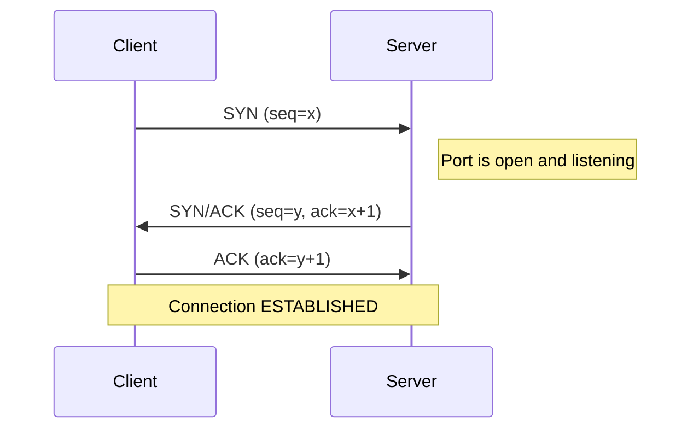
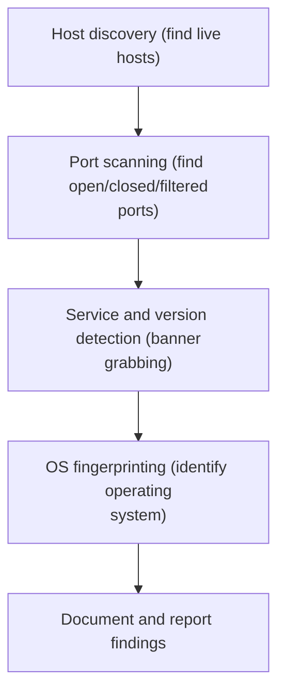

# Module 3 — Scanning Networks

Scanning is the second phase of the ethical hacking lifecycle. After footprinting and reconnaissance gathered information *about* a target from the outside, scanning actively probes the target's network to turn that broad picture into a concrete map: which machines are alive, which doors (ports) are open, what software is listening behind them, and what operating system (OS) each host runs.

> **Authorization first.** Active scanning sends packets *to* systems you do not own. It is legal only with **explicit written authorization** (a signed scope/rules-of-engagement document). Scanning networks without permission can be a criminal offense in most jurisdictions. This page is **conceptual, defense-oriented exam preparation** — it explains *what* techniques are and *how to defend against them*, not operational attack playbooks.

This module connects backward to [Footprinting and Reconnaissance](./02-footprinting-and-reconnaissance.md) and forward to [Enumeration](./04-enumeration.md), and it sits inside the broader [five phases of hacking](../00-overview/five-phases-of-hacking.md). Acronyms used here are also collected in the [acronyms reference](../reference/acronyms.md).

## Learning objectives

By the end of this module you should be able to:

- Define **network scanning** and state its core objectives.
- Explain **host discovery** concepts (Internet Control Message Protocol (ICMP) echo / ping sweep, Address Resolution Protocol (ARP) discovery).
- Describe the **Transmission Control Protocol (TCP) three-way handshake** from first principles and identify the TCP control flags.
- Explain, conceptually, the common **scan types** (TCP connect, SYN, FIN/NULL/Xmas, ACK, User Datagram Protocol (UDP)) and what each reveals.
- Interpret the three **port states**: open, closed, filtered.
- Describe **banner grabbing** and **OS fingerprinting** at a concept level.
- Name common scanning **tools** and their purpose.
- Apply **countermeasures** that reduce a network's exposure to scanning.

## What network scanning is

**Network scanning** is the practice of sending carefully chosen packets to a host or range of hosts and analyzing the responses to learn about the systems and services present. It is more targeted and active than footprinting: footprinting often uses public sources (passive), while scanning interacts directly with the target (active).

The main objectives of scanning are to discover:

- **Live hosts** — which Internet Protocol (IP) addresses are actually up and reachable.
- **Open ports** — which Transmission Control Protocol (TCP) and User Datagram Protocol (UDP) ports accept connections.
- **Services and versions** — what application is listening on each open port (for example, a web server) and which version.
- **Operating system (OS)** — the family and approximate version of the OS, inferred from how the host responds.
- **Network topology** — how hosts, routers, and segments relate to one another.

The output of scanning becomes the input to [enumeration](./04-enumeration.md), where the tester extracts detailed information (user accounts, shares, etc.) from the services found.

## Host discovery (live-host detection)

Before probing ports, a tester usually determines *which hosts are alive* so effort is not wasted on dead addresses. This is **host discovery**.

### ICMP echo / ping sweep

The **Internet Control Message Protocol (ICMP)** is a helper protocol used for diagnostics and error messages. A classic **ping** sends an *ICMP Echo Request* (type 8) and expects an *ICMP Echo Reply* (type 0). A **ping sweep** simply repeats this across a whole range of IP addresses to list which ones answer.

- **What it reveals:** which hosts respond to ICMP, suggesting they are live.
- **Limitation:** many networks block or rate-limit ICMP, so a silent host is not necessarily down — it may simply be filtered.

### ARP discovery

On a *local* network segment, the **Address Resolution Protocol (ARP)** maps an IP address to a hardware **Media Access Control (MAC)** address. Because every device on the segment must answer ARP to communicate, **ARP discovery** is highly reliable for finding live hosts on the *same* local subnet — even hosts that ignore ICMP. It does not cross routers, so it works only within the local broadcast domain.

## The TCP three-way handshake (first principles)

The **Transmission Control Protocol (TCP)** is a *connection-oriented* transport protocol: before any application data flows, the two endpoints establish a connection and agree on starting sequence numbers. The procedure is defined in **RFC 793** (the original TCP specification; later updated by RFC 9293). Understanding the handshake is the key to understanding nearly every TCP scan type.

TCP segments carry **control flags** (single bits) in the header. The flags relevant to scanning are:

| Flag | Name | Meaning (conceptual) |
| --- | --- | --- |
| **SYN** | Synchronize | Initiates a connection; "let's synchronize sequence numbers." |
| **ACK** | Acknowledge | Acknowledges received data; the acknowledgment number field is valid. |
| **FIN** | Finish | Graceful close; "I have no more data to send." |
| **RST** | Reset | Abort/refuse; tears down or rejects a connection immediately. |
| **PSH** | Push | Asks the receiver to deliver buffered data to the application now. |
| **URG** | Urgent | Marks data as urgent; the urgent-pointer field is valid. |

The three-way handshake uses three of these flags to open a connection:

1. **Client → Server: SYN.** The client picks an initial sequence number and asks to synchronize.
2. **Server → Client: SYN/ACK.** The server acknowledges the client's SYN and sends its own SYN (its own initial sequence number).
3. **Client → Server: ACK.** The client acknowledges the server's SYN. The connection is now **established** and data can flow.

If a port is **not** listening, a well-behaved host replies to a SYN with an **RST** (reset) instead, refusing the connection. This single fact — *SYN/ACK means open, RST means closed* — is the foundation of TCP port scanning.

## Port and service scanning concepts

A **port** is a 16-bit number (0–65535) that identifies a specific service endpoint on a host. Scanning probes these ports to learn their **state**.

### Port states

CEH and tools such as Nmap describe ports using three primary states:

| State | Meaning |
| --- | --- |
| **Open** | A service is actively listening and accepting connections on that port. |
| **Closed** | The port is reachable (the host responded) but no service is listening. |
| **Filtered** | A firewall or filter is blocking the probe, so the scanner cannot tell whether the port is open or closed — typically *no response* is received. |

### Scan-type concepts

Each scan type is just a different way of sending probe packets and interpreting the replies. The table summarizes them conceptually; the goal here is to understand *what each scan is* and *what its response means*, which is core CEH knowledge.

| Scan type | What it sends (concept) | How results are read |
| --- | --- | --- |
| **TCP connect scan** | Completes the *full* three-way handshake (SYN → SYN/ACK → ACK) using the OS networking interface. | A completed handshake means **open**; an RST means **closed**. Reliable but easily logged because a real connection is made. |
| **SYN scan (half-open)** | Sends a SYN; if it receives SYN/ACK it does not finish the handshake. | SYN/ACK ⇒ **open**; RST ⇒ **closed**; no response ⇒ **filtered**. Called "half-open" because the connection is never fully established. |
| **FIN scan** | Sends a packet with only the FIN flag set. | Per RFC 793, a closed port should reply **RST**; an open port should send **no response**. |
| **NULL scan** | Sends a packet with **no** flags set. | Same logic as FIN: closed ⇒ RST, open ⇒ no response. |
| **Xmas scan** | Sends a packet with FIN, PSH, and URG set (the header is "lit up like a Christmas tree"). | Same logic as FIN/NULL. |
| **ACK scan** | Sends a packet with only the ACK flag set. | Used to map firewall rules: an RST back means the port is **unfiltered**; no response means **filtered**. It maps *filtering*, not open/closed. |
| **UDP scan** | Sends a UDP datagram (UDP is connectionless — no handshake). | No reply often means **open or filtered**; an *ICMP port-unreachable* message means **closed**. UDP scanning is slower and less certain than TCP. |

> **Why FIN/NULL/Xmas behave that way:** they rely on the RFC 793 rule that a closed port resets on unexpected packets while an open port silently ignores them. Note that some operating systems (notably certain Windows versions) do not follow this rule strictly, so these scans give ambiguous results against them — a frequently tested detail.

## Banner grabbing and OS fingerprinting (concepts)

- **Banner grabbing** is reading the *banner* — the identifying text or version string a service sends when you connect (for example, the greeting from a mail or web service). It reveals the **service and version**, which helps map known vulnerabilities. It can be *active* (connecting directly) or *passive* (observing traffic).
- **OS fingerprinting** infers the target operating system. **Active fingerprinting** sends crafted probes and studies subtle differences in how the OS builds its responses (default Time To Live (TTL) values, TCP window sizes, flag handling). **Passive fingerprinting** simply observes existing traffic without sending probes, making it stealthier but less precise.

## Scanning methodology

A disciplined scan moves from broad to specific: find hosts, then ports, then identify what is behind those ports, then the OS, and finally record everything for the report.

## Tools (purpose only)

The CEH curriculum names tools by their **purpose**. The list below is for recognition and defense — it is not a command guide.

| Tool | Purpose |
| --- | --- |
| **Nmap (Network Mapper)** | The de-facto scanning tool: host discovery, port scanning, service/version detection, and OS detection. The reference implementation for the scan-type concepts above. |
| **Zenmap** | The official graphical user interface (GUI) front end for Nmap; presents scan results visually. |
| **hping3** | A packet-crafting utility used to assemble and send custom TCP/UDP/ICMP packets — useful conceptually for understanding how individual flags and probes work. |
| **Angry IP Scanner** | A lightweight, cross-platform host and port scanner often used for quick network sweeps. |
| **Masscan** | A very high-speed port scanner designed to scan large address ranges rapidly (asynchronous transmission). |

## Countermeasures / Defense

Defenders should assume scanning *will* happen and design to limit what it reveals:

- **Firewalls and filtering.** Default-deny inbound rules; expose only the ports a service genuinely requires. Filtering causes probes to be dropped, yielding the "filtered" state and starving the attacker of information.
- **Intrusion Detection / Prevention Systems (IDS/IPS).** Tune signatures to detect scan patterns (many connection attempts, unusual flag combinations such as NULL/Xmas/FIN) and alert or block. (This is detection guidance — not an evasion guide.)
- **Restrict ICMP thoughtfully.** Limit or rate-limit ICMP at the perimeter to reduce easy ping-sweep discovery, while keeping diagnostics you need internally.
- **Network segmentation.** Separate networks with routers/VLANs so a foothold or a scan in one segment does not reveal or reach the whole environment.
- **Disable unnecessary services and close unused ports.** Fewer listening ports means a smaller attack surface and less for a scan to find.
- **Suppress or genericize banners.** Configure services not to disclose exact product versions, weakening banner grabbing and OS fingerprinting.
- **Logging and monitoring.** Centralize logs and review them; a full TCP connect scan in particular leaves connection records.
- **Patch and inventory.** Maintain an accurate asset inventory and patch promptly so that even discovered services are not exploitable.

Remember: running these *scanning* techniques yourself is legal **only** with explicit written authorization and within an agreed scope.

## Exam tips

- **TCP three-way handshake = SYN → SYN/ACK → ACK.** Memorize the order and which side sends which.
- **SYN/ACK ⇒ port open; RST ⇒ port closed.** This single rule underlies most TCP scans.
- **No response often means *filtered*** — a firewall is likely dropping the probe; it does **not** prove the port is closed.
- **SYN scan = "half-open"** because the handshake is never completed (no final ACK).
- **TCP connect scan completes the full handshake** and is therefore the easiest to detect/log.
- **FIN, NULL, and Xmas scans** rely on RFC 793: *closed* port → RST, *open* port → no response. They are unreliable against some Windows hosts.
- **Xmas scan flags = FIN + PSH + URG.**
- **ACK scan maps firewall filtering** (filtered vs. unfiltered), not open vs. closed.
- **UDP scan:** ICMP *port unreachable* ⇒ closed; silence ⇒ open|filtered. UDP scans are slow.
- **ARP discovery** is reliable for live-host detection **only on the local subnet**; it does not cross routers.
- **Banner grabbing reveals service/version**; **OS fingerprinting** uses TTL, window size, and flag behavior.
- **Nmap** is the canonical tool; **Zenmap** is its GUI; **Masscan** is built for speed across large ranges.

## Sources

- EC-Council, Certified Ethical Hacker (CEH) program: <https://www.eccouncil.org/>
- EC-Council, CEH certification overview: <https://www.eccouncil.org/programs/certified-ethical-hacker-ceh/>
- Internet Engineering Task Force (IETF), RFC 793 — Transmission Control Protocol: <https://www.ietf.org/rfc/rfc793.txt>
- IETF, RFC 9293 — Transmission Control Protocol (updates RFC 793): <https://www.rfc-editor.org/rfc/rfc9293>
- IETF, RFC 792 — Internet Control Message Protocol (ICMP): <https://www.ietf.org/rfc/rfc792.txt>
- IETF, RFC 826 — Address Resolution Protocol (ARP): <https://www.ietf.org/rfc/rfc826.txt>
- National Institute of Standards and Technology (NIST), Computer Security Resource Center: <https://csrc.nist.gov/>
- NIST Special Publication 800-115, Technical Guide to Information Security Testing and Assessment: <https://csrc.nist.gov/pubs/sp/800/115/final>
- Nmap reference documentation: <https://nmap.org/book/man.html>
