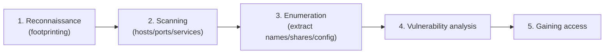
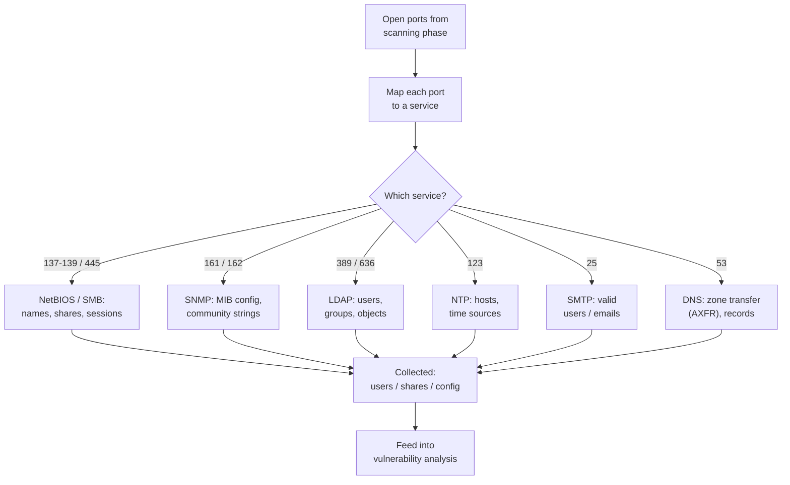

# Module 4 — Enumeration

Enumeration is the phase where an ethical hacker actively connects to a target's running services to pull out concrete, named details: user accounts, machine names, network shares, group memberships, routing tables, and service configuration. Where scanning answers *"what is alive and what ports are open?"*, enumeration answers *"who and what is actually behind those open ports, and what can it tell me?"*. It is deeper and noisier than scanning because it requires establishing real connections (sessions, queries, lookups) rather than just probing.

> **Authorisation first.** Every technique on this page is legal **only** with explicit written authorisation from the system owner, performed inside an agreed scope and Rules of Engagement (RoE). Enumeration creates real connections and is highly visible in logs — doing it without permission is a crime in most jurisdictions. This page is conceptual, defence-oriented exam preparation. It names tools and explains their *purpose* (as the Certified Ethical Hacker (CEH) program does); it does **not** provide operational playbooks or exploit code. See [../00-overview/legal-and-ethics.md](../00-overview/legal-and-ethics.md).

## Learning objectives

- Define enumeration and explain how it differs from scanning.
- Locate enumeration within the five phases of hacking.
- Recall common services, their default ports, and what each can expose.
- Explain conceptually how NetBIOS, SNMP, LDAP, NTP, SMTP, and DNS leak information.
- Describe additional CEH-listed targets: NFS, SMB, and IPsec/VoIP enumeration.
- Match common enumeration tools to their purpose (no command playbooks).
- Apply defensive countermeasures that reduce what these services reveal.

## Where enumeration fits

Enumeration is the **third** phase in the classic CEH methodology, following reconnaissance and scanning, and feeding the data needed for vulnerability analysis and gaining access. See [../00-overview/five-phases-of-hacking.md](../00-overview/five-phases-of-hacking.md).

## Scanning vs. enumeration

| Aspect | Scanning | Enumeration |
| --- | --- | --- |
| Question answered | What hosts/ports/services exist? | Who/what is behind the service? |
| Interaction depth | Probes (often no session) | Active **connections** and queries |
| Typical output | Open ports, service banners | Usernames, shares, groups, config, MIB data |
| Visibility in logs | Lower | Higher (sessions are recorded) |
| CEH phase | Phase 2 | Phase 3 |

For the scanning phase that precedes this, see [./03-scanning-networks.md](03-scanning-networks.md). For what comes next, see [./05-vulnerability-analysis.md](05-vulnerability-analysis.md).

## Common default ports to remember

These are the high-yield defaults CEH expects you to recognise on sight. Port assignments are maintained by the Internet Assigned Numbers Authority (IANA).

| Service | Protocol / port(s) | What it is |
| --- | --- | --- |
| NetBIOS (Network Basic Input/Output System) | TCP/UDP 137, 138, 139 | Legacy Windows name/session service |
| SMB (Server Message Block) | TCP 445 | File/printer sharing (modern, direct over TCP) |
| SNMP (Simple Network Management Protocol) | UDP 161 (queries), 162 (traps) | Device monitoring/management |
| LDAP (Lightweight Directory Access Protocol) | TCP/UDP 389 | Directory queries (users, groups, objects) |
| LDAPS (LDAP over Transport Layer Security / TLS) | TCP 636 | Encrypted LDAP |
| NTP (Network Time Protocol) | UDP 123 | Time synchronisation |
| SMTP (Simple Mail Transfer Protocol) | TCP 25 | Mail transfer between servers |
| DNS (Domain Name System) | UDP/TCP 53 | Name resolution; zone transfers use TCP |
| NFS (Network File System) | TCP/UDP 2049 | Unix/Linux file sharing |
| RPC portmapper (Remote Procedure Call) | TCP/UDP 111 | Maps RPC programs to ports (used by NFS) |
| ISAKMP / IKE (for IPsec) | UDP 500 | Key exchange for IPsec VPN tunnels |
| SIP (Session Initiation Protocol, VoIP) | UDP/TCP 5060, 5061 (TLS) | Voice over IP call setup |

> IANA registers ports in three ranges: System/Well-Known (0–1023), User/Registered (1024–49151), and Dynamic/Private (49152–65535). See [RFC 6335](https://www.rfc-editor.org/rfc/rfc6335).

## What each service can expose

### NetBIOS — names, shares, and sessions
NetBIOS (Network Basic Input/Output System) is a legacy Windows naming and session layer. Querying it can reveal the computer name, domain/workgroup, logged-on users, and a **NetBIOS name table** of registered services. A core CEH concept is the **null session**: an unauthenticated connection to the inter-process communication share (`IPC$`) that, on poorly configured legacy systems, can list shares, users, and group information without credentials.

### SNMP — device configuration via the MIB
SNMP (Simple Network Management Protocol) lets administrators read and write device state. Data is organised in a **MIB (Management Information Base)**, a hierarchical tree of values identified by **OIDs (Object Identifiers)**. Access is gated by a **community string**, effectively a shared password. The classic exposure: devices shipped with default community strings — **`public`** (read-only) and **`private`** (read-write). SNMP versions 1 and 2c send these in clear text; **SNMPv3** adds authentication and encryption. A readable MIB can leak interfaces, routing tables, ARP caches, running processes, installed software, and user accounts.

### LDAP — directory objects, users, and groups
LDAP (Lightweight Directory Access Protocol) is the query language and protocol for directory services such as Microsoft Active Directory and OpenLDAP. If a directory permits **anonymous binds** (connecting without credentials), an attacker can enumerate the organisational structure: usernames, email addresses, group memberships, computer objects, and naming contexts.

### NTP — hosts and time sources
NTP (Network Time Protocol) synchronises clocks. Certain query/monitoring functions (conceptually, `monlist`-style queries on misconfigured servers) can reveal the list of hosts that recently contacted the time server, upstream time sources, and the operating system / version — exposing internal hosts and feeding both reconnaissance and amplification denial-of-service abuse.

### SMTP — user/email enumeration
SMTP (Simple Mail Transfer Protocol) defines three commands that historically confirm whether a mailbox exists, allowing valid usernames/emails to be harvested by observing different server responses (concept only):

- **`VRFY`** — asks the server to *verify* that a user exists.
- **`EXPN`** — asks the server to *expand* a mailing list into its members.
- **`RCPT TO`** — the recipient command; acceptance vs. rejection can confirm an address.

See the SMTP specification, [RFC 5321](https://www.rfc-editor.org/rfc/rfc5321).

### DNS — zone transfers and records
DNS (Domain Name System) maps names to addresses. The high-yield risk is the **zone transfer**, technically an **AXFR (Authoritative Full Zone Transfer)** request. If a name server is misconfigured to allow AXFR to any client, it hands over its **entire zone file** — every record (A, MX, CNAME, NS, TXT, etc.), effectively a map of the internal network. Zone transfers run over **TCP 53** (ordinary lookups use UDP 53). See [RFC 5936](https://www.rfc-editor.org/rfc/rfc5936).

### Also on the CEH list: NFS, SMB, IPsec/VoIP
- **NFS (Network File System)** — can reveal exported directories (via the RPC portmapper) and their export permissions, exposing files to clients that should not have access.
- **SMB (Server Message Block)** — beyond NetBIOS, SMB over TCP 445 can expose share names, share permissions, operating-system version, and (where misconfigured) user/group lists.
- **IPsec / VoIP** — IPsec VPN gateways speaking IKE/ISAKMP on UDP 500 can leak the gateway's presence, supported encryption/authentication settings, and vendor. VoIP services using SIP (Session Initiation Protocol) can leak extensions (user accounts), device types, and registrar details.

## Enumeration flow

## Tools and their purpose

CEH expects familiarity with what each tool is *for*, not memorised command lines. The table below lists purpose only.

| Tool | Purpose |
| --- | --- |
| Nmap (Network Mapper) | Host/port/service discovery; foundation that identifies which services to enumerate. |
| Nmap Scripting Engine (NSE) | Pluggable scripts that automate service-specific enumeration tasks (for example SMB, SNMP, LDAP, NFS, SMTP user discovery). |
| enum4linux | Consolidated enumeration of SMB/NetBIOS on Windows and Samba hosts — shares, users, groups, password policy. |
| snmp-check / SnmpWalk | Query SNMP devices to walk the MIB and report system, interface, and configuration data. |
| ldapsearch | Issue LDAP queries to read directory objects, users, and groups from a directory server. |
| Nbtstat | Windows NetBIOS over TCP/IP utility that displays the local/remote NetBIOS name table and name cache. |
| SuperScan | Windows port scanner with built-in enumeration helpers (NetBIOS, related Windows info). |
| Hyena | Windows management/enumeration tool that presents users, groups, shares, and directory data through a single interface. |

Tool-by-tool reference notes live in [../tools/](../tools/); acronym definitions are collected in [../reference/acronyms.md](../reference/acronyms.md).

## Countermeasures / Defense

Enumeration succeeds because services volunteer information to unauthenticated or low-privileged clients. The defensive theme is **least exposure**: only the right parties should be able to query a service, and services should reveal only what they must.

- **NetBIOS / SMB:** Disable NetBIOS over TCP/IP where it is not needed; block ports 137–139 and 445 at the perimeter. Restrict or disable null sessions (`IPC$`) on legacy systems and enforce authentication and SMB signing.
- **SNMP:** Remove the default `public`/`private` community strings; treat community strings as secrets. Prefer **SNMPv3** with authentication and encryption. Restrict SNMP to a management network with access control lists, and disable SNMP entirely on devices that do not need it.
- **LDAP / Active Directory:** Disable anonymous binds; require authentication for directory queries. Apply least-privilege access to directory objects and use **LDAPS (LDAP over TLS)** to protect queries in transit.
- **NTP:** Disable legacy monitoring/query commands (such as `monlist`); restrict who may query the server and keep NTP software patched.
- **SMTP:** Disable the `VRFY` and `EXPN` commands; configure the mail server so responses do not differentiate between valid and invalid recipients.
- **DNS:** Restrict zone transfers (AXFR) to explicitly authorised secondary name servers only; separate internal and external (split-horizon) DNS so internal records are never served to the internet.
- **NFS:** Export only required directories, scope exports to specific hosts, and avoid world-readable/writable exports.
- **General hardening:** Apply firewall segmentation, disable unneeded services, enforce least privilege, and monitor logs for unusual session/query activity. Map controls to the **NIST Cybersecurity Framework (CSF)** and **NIST Special Publication (SP) 800-53** control families (see Sources).

## Exam tips

- **Null session** = unauthenticated connection to `IPC$`; enables NetBIOS/SMB enumeration on misconfigured legacy Windows systems.
- **SNMP community strings:** `public` = read-only default, `private` = read-write default. SNMPv1/v2c send them in clear text; **SNMPv3** adds security. SNMP uses **UDP 161** (queries) and **162** (traps).
- **DNS zone transfer = AXFR**, runs over **TCP 53**; ordinary lookups use UDP 53. Allow transfers only to authorised secondaries.
- **SMTP enumeration commands: `VRFY`, `EXPN`, `RCPT TO`** — used to confirm valid users/emails.
- **LDAP anonymous bind** lets attackers enumerate directory users and groups; LDAP = TCP/UDP 389, LDAPS = TCP 636.
- **NetBIOS ports 137–139; SMB 445.** Know these as a pair.
- **NTP** can reveal connected internal hosts and upstream time sources.
- Remember the order: scanning → **enumeration** → vulnerability analysis. Enumeration establishes **connections**; scanning generally does not.

## Sources

- EC-Council — Certified Ethical Hacker (CEH): https://www.eccouncil.org/
- IANA Service Name and Transport Protocol Port Number Registry / RFC 6335: https://www.rfc-editor.org/rfc/rfc6335
- RFC 5321 — Simple Mail Transfer Protocol (SMTP): https://www.rfc-editor.org/rfc/rfc5321
- RFC 5936 — DNS Zone Transfer Protocol (AXFR): https://www.rfc-editor.org/rfc/rfc5936
- NIST Cybersecurity Framework (CSF): https://www.nist.gov/cyberframework
- NIST SP 800-53 — Security and Privacy Controls (NIST Computer Security Resource Center): https://csrc.nist.gov/pubs/sp/800/53/r5/upd1/final
