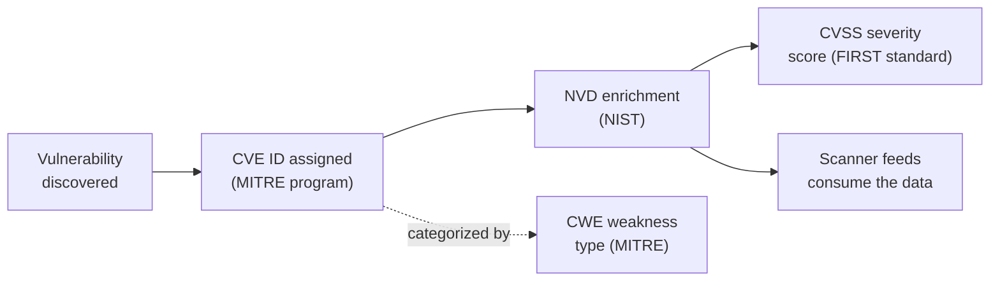
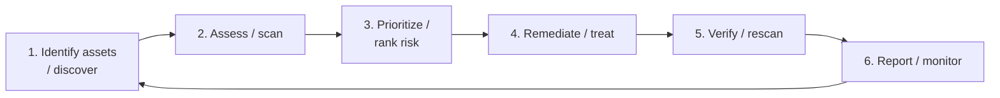

# Module 05 — Vulnerability Analysis

A *vulnerability* is a weakness in a system — in its design, configuration, code, or operation — that an attacker can use to violate the system's security policy (for example, to read data they should not see, or to run code they should not run). **Vulnerability analysis** is the disciplined, mostly defensive practice of finding those weaknesses *before* an attacker does, judging how serious each one is, and tracking it through to a fix. For a sysadmin moving into security, this is the most familiar starting point: it is patching, hardening, and asset inventory, made systematic and measurable.

> Everything here is described **conceptually for understanding and defense**. Vulnerability scanning sends real probes to real systems and can disrupt them. It is legal **only with explicit written authorization** and a defined scope. Scanning systems you do not own or lack permission to test is illegal in most jurisdictions. See [../00-overview/what-is-ceh.md](../00-overview/what-is-ceh.md).

## Learning objectives

- Define what a vulnerability is, and distinguish a **vulnerability assessment** from a **penetration test**.
- Describe the main **types of vulnerability assessment** (active vs passive, external vs internal, and by target: network, host, application, database, wireless) at a concept level.
- Explain **CVSS (Common Vulnerability Scoring System)** — what it measures, who maintains it, its 0.0–10.0 score, and its qualitative severity ratings.
- Explain **CVE (Common Vulnerabilities and Exposures)** and **CWE (Common Weakness Enumeration)**, and how they relate to the **National Vulnerability Database (NVD)**.
- Name common **vulnerability scanners** and their purpose.
- Walk through the continuous **vulnerability-management lifecycle**.
- Identify **countermeasures** and high-yield exam facts (false positives vs false negatives; authenticated vs unauthenticated scans).

## What is a vulnerability?

In security terms, three ideas sit close together and are easy to confuse:

| Term | Meaning |
| --- | --- |
| **Vulnerability** | A weakness or flaw (e.g., an unpatched service, a weak password policy, a misconfiguration). |
| **Threat** | A potential cause of harm — an actor or event that *could* exploit a vulnerability. |
| **Exploit** | The actual technique, code, or path that *uses* a vulnerability to cause harm. |
| **Risk** | The combination of likelihood (a threat exploiting a vulnerability) and impact. |

This module is about finding and rating **vulnerabilities**. It sits between [enumeration](04-enumeration.md) (where you discover services, accounts, and details about a target) and [system hacking](06-system-hacking.md) (where weaknesses are actually exploited). In the broader engagement, it maps to the *scanning/analysis* stage of the [five phases of hacking](../00-overview/five-phases-of-hacking.md).

## Vulnerability assessment vs penetration testing

These two are frequently confused on the exam, and the distinction matters.

| Aspect | Vulnerability assessment | Penetration test |
| --- | --- | --- |
| Core question | *What weaknesses exist?* | *Can these weaknesses actually be exploited, and how far?* |
| Depth | **Breadth** — find and list as many issues as possible | **Depth** — prove impact by exploiting selected issues |
| Exploitation | Usually **does not** exploit | **Does** exploit (within scope/rules of engagement) |
| Output | A prioritized list of findings | A narrative of attack paths, proof, and business impact |
| Frequency | Often **continuous / scheduled** | **Point-in-time**, periodic |
| Tooling | Heavily automated (scanners) | Automated **plus** manual/creative effort |

A simple way to remember it: a **vulnerability assessment tells you the doors are unlocked; a penetration test walks through them** to show what is behind. A vulnerability assessment is one early activity inside a penetration test, but a penetration test goes much further.

## Types of vulnerability assessment

Vulnerability assessments are classified along two axes: **how** they look, and **what** they look at.

### By technique — active vs passive

- **Active assessment** — sends probes/requests to targets (e.g., a scanner querying ports and services) and analyzes the responses. More thorough, but generates traffic and can affect fragile systems.
- **Passive assessment** — observes existing traffic or data (e.g., sniffing, reviewing configurations and logs) without actively probing. Quieter and lower-risk, but sees only what is already visible.

### By vantage point — external vs internal

- **External assessment** — looks from the **outside** (the Internet's perspective) at the public attack surface: perimeter firewalls, web servers, exposed services.
- **Internal assessment** — looks from **inside** the network, modeling an insider, a compromised host, or an attacker who has already breached the perimeter (the assumed-breach view).

### By target

| Type | What it examines |
| --- | --- |
| **Network-based** | Network devices, open ports, exposed services, protocol weaknesses across hosts and segments. |
| **Host-based** | A single system's configuration, patch level, OS hardening, and local settings (often run with credentials on the host). |
| **Application** | Web and other applications for flaws such as injection, broken authentication, and misconfiguration. |
| **Database** | Database engines and instances — privileges, configuration, patching, and exposure. |
| **Wireless** | Wi-Fi networks — encryption strength, rogue access points, weak authentication. |

These categories are conceptual and overlap in practice; one engagement often combines several.

## CVSS — Common Vulnerability Scoring System

When a scanner finds dozens or thousands of issues, you need a consistent way to say *how bad* each one is. That is **CVSS (Common Vulnerability Scoring System)**: an open, vendor-neutral framework for rating the **severity** of a vulnerability. CVSS is owned and maintained by **FIRST (Forum of Incident Response and Security Teams)**.

Key points to know:

- A CVSS score is a number from **0.0 to 10.0**, where higher means more severe.
- The numeric score maps to **qualitative severity ratings** so humans can triage quickly:

| Rating | Score band |
| --- | --- |
| **None** | 0.0 |
| **Low** | 0.1 – 3.9 |
| **Medium** | 4.0 – 6.9 |
| **High** | 7.0 – 8.9 |
| **Critical** | 9.0 – 10.0 |

- CVSS organizes its inputs into **metric groups**, conceptually:
  - **Base** — the intrinsic, unchanging characteristics of the vulnerability (e.g., how it is accessed and the impact if exploited). This is what most published scores report.
  - **Temporal** (called *Threat* in newer versions) — factors that change over time, such as whether a working exploit exists.
  - **Environmental** — adjustments for *your* specific environment (how important the affected asset is to you, existing mitigations).
- Multiple versions of the standard exist — for example **CVSS v3.x** and **CVSS v4.0**. The exact current version and exam-specified version is **not specified in sources** here; know the *concepts* (score range, severity ratings, metric groups) rather than memorizing one version's formula.

> Mental model: **CVSS answers "how severe?"** — it does not name a specific flaw. For that, you need CVE.

## CVE — Common Vulnerabilities and Exposures

**CVE (Common Vulnerabilities and Exposures)** is a **dictionary of publicly known vulnerabilities**. Each entry gets a unique identifier (a **CVE ID**, e.g., the form `CVE-YYYY-NNNN`) so that everyone — vendors, scanners, researchers, defenders — refers to the *same* flaw by the *same* name. The CVE program is overseen by **MITRE** (with sponsorship from the U.S. government). CVE itself is mainly an identifier and a short description; it does not, by itself, provide the severity score.

### CVE and the NVD

The **National Vulnerability Database (NVD)** is run by **NIST (National Institute of Standards and Technology)**. The NVD builds **on top of** the CVE list: it ingests CVE entries and enriches them with extra analysis, including **CVSS severity scores**, affected-product information, and references. So the relationship is:

- **MITRE / CVE** — assigns the *identifier* and base description (the "which vulnerability").
- **NIST / NVD** — adds *analysis and scoring* (the "how severe, and where").

## CWE — Common Weakness Enumeration

While a CVE names *one specific* vulnerability in *one specific* product, **CWE (Common Weakness Enumeration)** — also stewarded by MITRE — is a catalog of the **categories of weakness** that cause vulnerabilities (for example, the class "improper input validation"). In short: **CWE is the type of flaw; CVE is a specific instance of it.** CWE helps developers and assessors talk about root causes and recurring patterns rather than individual bugs.

## Vulnerability scanners (purpose only)

Scanners automate discovery: they probe targets, match what they find against a **feed/database** of known vulnerabilities (often keyed to CVE IDs), and report findings, frequently with CVSS scores. The CEH names tools by **purpose**; this hub does the same and gives **no operational procedures**.

| Tool (vendor) | Purpose |
| --- | --- |
| **Nessus** (Tenable) | Widely used general-purpose vulnerability scanner for networks and hosts; matches findings against a regularly updated plugin/vulnerability feed and reports severities. |
| **OpenVAS / Greenbone** | Open-source vulnerability scanner (the **Greenbone** community engine) that uses a feed of vulnerability tests to scan networks and hosts. |
| **Qualys** | Cloud-based vulnerability management (VM) platform delivered as a service; performs scanning and continuous monitoring across distributed environments without on-premises scanner infrastructure. |
| **Nikto** | Open-source **web server scanner** focused on web servers and applications — checks for dangerous files, outdated server software, and common misconfigurations. |

All of these rely on up-to-date **scoring and feeds** (CVE/CVSS data, plugin updates) to recognize current vulnerabilities; an out-of-date feed produces blind spots.

## The vulnerability-management lifecycle

Vulnerability management is **not** a one-time scan — it is a **continuous loop**, because new vulnerabilities are disclosed daily and environments change constantly. CEH presents it as a recurring multi-phase cycle:

1. **Identify assets / discover** — inventory the systems, services, and software in scope. You cannot protect what you do not know exists.
2. **Assess / scan** — run vulnerability scans (and other checks) to find weaknesses across those assets.
3. **Prioritize / rank risk** — rate findings using severity (e.g., CVSS) **and** business context (asset value, exposure) so the most dangerous, most exploitable issues come first.
4. **Remediate / treat** — fix the issue: patch, reconfigure, apply a compensating control, or formally accept the risk.
5. **Verify / rescan** — re-scan to confirm the fix worked and introduced no new problems.
6. **Report / monitor** — document results, communicate to stakeholders, and keep monitoring — which feeds straight back into discovery, restarting the cycle.

The loop also aligns with risk-management guidance such as **NIST SP 800-30** (Guide for Conducting Risk Assessments), which frames identifying, prioritizing, and treating risk as an ongoing process rather than a single event.

## Countermeasures / Defense

Vulnerability analysis is itself a defensive discipline; the countermeasures are about closing the gaps it reveals and reducing how many appear:

- **Authorization first.** Never scan without **explicit written authorization** and an agreed scope, schedule, and rules of engagement — both for legality and to avoid disrupting fragile systems.
- **Maintain an accurate asset inventory.** Unknown assets are unscanned and unpatched; discovery is the foundation of the whole lifecycle.
- **Patch and configuration management.** Timely patching and secure baselines (hardening guides, CIS Benchmarks) remove the most common findings before a scan ever runs.
- **Prioritize by risk, not just by score.** Combine CVSS severity with **environmental context** — asset criticality, exposure, and whether an exploit exists — so effort goes where it matters.
- **Keep scanner feeds current.** A scanner is only as good as its vulnerability database; stale feeds cause **false negatives** (missed real issues).
- **Use authenticated (credentialed) scans where appropriate.** They see far more than unauthenticated scans and reduce false positives — but require careful credential handling.
- **Validate findings.** Confirm results to weed out **false positives** before spending remediation effort; this is also where a penetration test adds value.
- **Continuous monitoring and rescanning.** Treat vulnerability management as the ongoing loop above, not an annual checkbox.
- **Segment and reduce attack surface.** Fewer exposed services and well-segmented networks shrink both the number of vulnerabilities and their blast radius.

## Exam tips

- **CVSS = "how severe."** Score range **0.0–10.0**; severity ratings **None / Low / Medium / High / Critical**; maintained by **FIRST (Forum of Incident Response and Security Teams)**. Metric groups: **Base, Temporal, Environmental**.
- **CVE = "which vulnerability"** — a unique ID for one specific publicly known flaw; program overseen by **MITRE**.
- **NVD = the NIST database** that enriches CVE entries with analysis and **CVSS scores**.
- **CWE = the *type/category* of weakness** (root cause); CVE is a *specific instance*.
- **Vulnerability assessment vs penetration test:** assessment finds and lists weaknesses (breadth, usually no exploitation); penetration test exploits them to prove impact (depth).
- **False positive** = scanner reports a vulnerability that is **not really there**. **False negative** = scanner **misses** a vulnerability that **is** there (the more dangerous error).
- **Authenticated (credentialed) scans** see more and produce fewer false positives than **unauthenticated** scans.
- **Active vs passive:** active **probes** the target; passive **observes** without probing.
- The **vulnerability-management lifecycle is continuous** — discovery feeds remediation feeds rescanning feeds discovery again.
- Tool-to-purpose: **Nessus/OpenVAS** = network/host scanners, **Qualys** = cloud-based vulnerability management, **Nikto** = web server scanner.

## Sources

- EC-Council, Certified Ethical Hacker (CEH) — official program page — https://www.eccouncil.org/train-certify/certified-ethical-hacker-ceh/
- FIRST, Common Vulnerability Scoring System (CVSS) — https://www.first.org/cvss/
- NIST, National Vulnerability Database (NVD) — https://nvd.nist.gov/
- NIST SP 800-30, Guide for Conducting Risk Assessments — https://csrc.nist.gov/pubs/sp/800/30/r1/final
- MITRE, Common Vulnerabilities and Exposures (CVE) program — https://www.cve.org/
- MITRE, CVE List (historical home) — https://cve.mitre.org/
- MITRE, Common Weakness Enumeration (CWE) — https://cwe.mitre.org/
- See also: [../reference/acronyms.md](../reference/acronyms.md)
