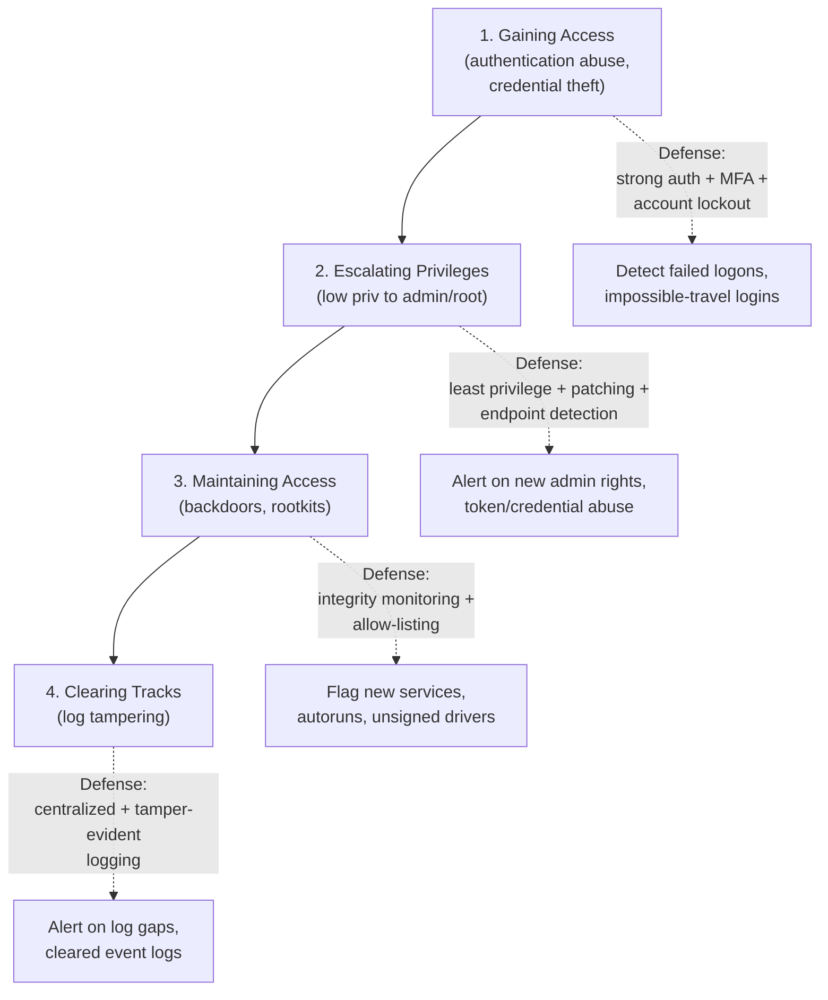
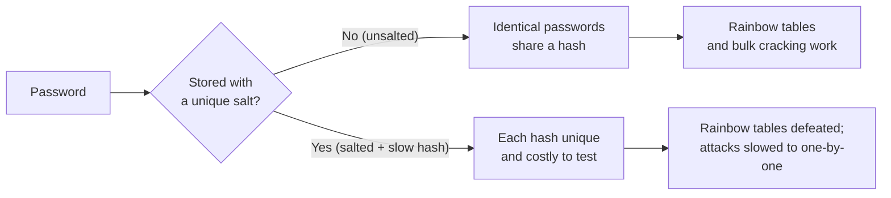

# Module 06 — System Hacking

*System hacking* is the phase where an attacker, having already gathered information and found weaknesses, turns that knowledge into actual control of a target host. EC-Council's **Certified Ethical Hacker (CEH)** program frames it as a structured methodology with four conceptual goals: **gaining access, escalating privileges, maintaining access, and clearing tracks.** For a systems administrator moving into security, this module is the mirror image of your day job — the same accounts, hashes, services, and logs you manage are exactly what an attacker targets, so understanding their goals tells you precisely what to defend.

> All techniques here are described **conceptually for understanding and defense**. They are legal **only with explicit written authorization** and a defined scope (an engagement contract or rules of engagement). Performing them against systems you do not own is illegal in most jurisdictions. This page contains **no operational playbooks, no exploit code, and no command lines** — only concepts and defenses. See [../00-overview/what-is-ceh.md](../00-overview/what-is-ceh.md).

## Learning objectives

- Describe the four conceptual goals of the CEH system-hacking methodology and what a **defender** should watch for at each stage.
- Define the major **password attack categories** (non-electronic, active online, passive online, offline) without describing how to run them.
- Explain the role of **password hashing and salting**, and why **rainbow tables** are defeated by salting.
- Distinguish **vertical** from **horizontal** privilege escalation.
- Explain how attackers **maintain access** (backdoors, rootkits — at concept level) and **clear tracks** (log tampering), and the defenses against each.
- Define **steganography** (hiding data) versus **cryptography** (scrambling data), and **steganalysis** (detecting hidden data).
- Recognize key tools by **name and purpose** for defensive awareness, mapping each phase to **MITRE ATT&CK** tactics.

## The system-hacking methodology (four conceptual phases)

System hacking sits *after* reconnaissance, scanning, and vulnerability analysis in the broader [five phases of hacking](../00-overview/five-phases-of-hacking.md). By this point the attacker knows which hosts, users, and services exist and which look weak (see [./05-vulnerability-analysis.md](05-vulnerability-analysis.md)). The four phases are sequential goals, each mapping to one or more **MITRE ATT&CK** tactics — the standard catalog of adversary behaviors.

### 1. Gaining access

The attacker turns a weakness into an initial foothold — most often by **abusing authentication** (stolen, guessed, or cracked credentials) or by exploiting a vulnerable service. In ATT&CK terms this spans **Initial Access** and **Credential Access**. Because credentials are the most common path, the bulk of this module covers **password attacks**.

**Defender's view:** watch for spikes in failed logons, logons at unusual times or from unusual locations ("impossible travel"), use of disabled or service accounts interactively, and authentication against accounts that normally never log in.

### 2. Escalating privileges

A foothold is rarely enough; attackers want **administrator** (Windows) or **root** (Unix/Linux) rights. Privilege escalation moves from limited access to higher access, mapping to ATT&CK **Privilege Escalation**. Two conceptual directions:

| Type | Definition | Plain-language example |
| --- | --- | --- |
| **Vertical** | Gaining **higher** privileges than the current account holds (e.g., standard user to administrator/root) | A normal user becomes a domain admin |
| **Horizontal** | Gaining the access **of another account at the same privilege level** | One standard user reads another standard user's data |

Vertical escalation typically abuses misconfigurations, unpatched local vulnerabilities, weak file/service permissions, or stolen privileged credentials. Horizontal escalation is often about reaching *another user's* resources, sometimes as a stepping stone to a more privileged target.

**Defender's view:** enforce **least privilege**, patch promptly, monitor for sudden grants of administrative rights, new members of privileged groups, and abuse of credentials or access tokens.

### 3. Maintaining access (persistence)

Having gained (and escalated) access, an attacker wants to **return later** without repeating the work. This is **persistence** in ATT&CK terms. Conceptually it relies on **backdoors** (hidden access paths) and **rootkits** (malware that hides its own presence, often at a deep level of the operating system). Detailed malware mechanics are covered in [./07-malware-threats.md](07-malware-threats.md); here the point is the *goal*: durable, stealthy re-entry.

**Defender's view:** monitor for new or unexpected services, scheduled tasks, autorun entries, new accounts, unsigned kernel drivers, and unexplained outbound connections. **File integrity monitoring** and application **allow-listing** are central controls.

### 4. Clearing tracks (anti-forensics)

Finally, an attacker tries to **erase evidence** so the intrusion goes unnoticed and is hard to reconstruct — for example by tampering with or deleting logs, timestamps, and command history. This maps to ATT&CK **Defense Evasion** (notably *Indicator Removal*). The defensive lesson matters more than the offensive detail: **logs an attacker can edit are logs you cannot trust.**

**Defender's view:** ship logs **off the host** to a central, write-restricted store (e.g., a Security Information and Event Management system, **SIEM**) in near real time, so that even if the local copy is wiped the central record survives. Treat **cleared or missing logs as an alert in itself**, not an absence of evidence.

## Password attack categories (concept only)

Passwords are the most attacked credential. CEH groups password attacks into categories based on *how* the attacker interacts with the system. The descriptions below define each **category** — they are deliberately **not** instructions for performing them.

| Category | Concept | Example idea |
| --- | --- | --- |
| **Non-electronic / social** | No technology against the system itself; the human is the target | **Shoulder surfing** (watching someone type a password), dumpster diving, and social-engineering a password out of a person (see [./09-social-engineering.md](09-social-engineering.md)) |
| **Active online** | Interacting **directly** with the live authentication system to try credentials | Guessing or trying credentials against a login service; noisy and detectable |
| **Passive online** | **Observing** credentials in transit without touching the login directly | **Sniffing** cleartext credentials or a **Man-in-the-Middle (MITM)** position capturing authentication data (see [./08-sniffing.md](08-sniffing.md)) |
| **Offline** | Attacking **captured password hashes** away from the system, with no rate limits | Working against a stolen hash dump on the attacker's own hardware |

### Offline attack subtypes (concept only)

Offline attacks matter most because, once a hash is stolen, the attacker faces no account lockout or network monitoring. The recognized conceptual sub-categories:

- **Dictionary attack** — testing hashes against a precompiled list of likely passwords (common words, leaked passwords).
- **Brute force** — exhaustively trying possible combinations; guaranteed eventually but limited by computational cost and password length/complexity.
- **Rule-based / hybrid** — applying transformation rules to dictionary words (capitalization, appended numbers, character substitutions) to model how humans actually create passwords.
- **Rainbow tables** — large **precomputed** lookup tables that map hashes back to passwords, trading storage for speed against *unsalted* hashes.

### Hashing and salting (why offline attacks succeed or fail)

A **hash** is a one-way function: a password is stored as its hash, not as plaintext, so the system can verify a login without keeping the password. The problem is that the *same password always produces the same hash* — which is exactly what rainbow tables and reused-hash lookups exploit.

A **salt** is a unique random value added to each password before hashing. Salting means two users with the same password get **different** hashes, so:

- **Precomputed rainbow tables are defeated** — a table built for unsalted hashes no longer matches, because the salt changes every output.
- Attackers are forced to attack **each hash individually** rather than all at once.

A **slow (work-factor) hash** — a function deliberately designed to be computationally expensive (for example, key-derivation/password-hashing functions intended for storing passwords) — further raises the cost per guess, blunting brute force. NIST guidance treats salted, computationally expensive password hashing as the baseline for storing user secrets.

## Steganography vs cryptography

These two are easy to confuse on the exam, so contrast them directly:

| Concept | What it does | What an observer sees |
| --- | --- | --- |
| **Cryptography** | **Scrambles** a message so it is unreadable without a key | Obvious ciphertext — the *existence* of a secret is visible, the *content* is hidden |
| **Steganography** | **Hides** data inside an ordinary-looking file (image, audio, video, document) | Nothing unusual — the *existence* of the secret message is hidden |

Steganography conceals **that** a message exists; cryptography conceals **what** the message says. Attackers may use steganography to smuggle data out of a network (data exfiltration) or hide malicious payloads inside benign-looking files, evading filters that only look for obvious secrets.

**Steganalysis** is the defensive counterpart: the practice of **detecting** hidden data — for example by spotting statistical anomalies, unusual file sizes, or artifacts that a clean file would not have. It is the basis for defenses such as inspecting and, where appropriate, sanitizing or re-encoding files crossing a security boundary.

## Tools (name and purpose only)

CEH names tools so candidates recognize them and know what defenders must guard against. The entries below give **name and purpose only — no usage, no commands.** Each is framed defensively.

| Tool | Purpose (as CEH frames it) | Why defenders care |
| --- | --- | --- |
| **John the Ripper** | Open-source **password recovery / auditing** tool used to assess the strength of stored password hashes | Treat its existence as proof that weak/unsalted hashes will not survive a breach; enforce strong salted slow hashes |
| **Hashcat** | High-performance password recovery/auditing tool that leverages hardware acceleration | Underscores how fast offline attacks run against weak hashes; drives the case for long passwords and slow hashing |
| **Mimikatz** | **Credential extraction** utility that can recover credentials and authentication material from a Windows host's memory and security subsystems | Awareness only: defend with least privilege, credential-protection features, and detection of credential-access behavior |
| **Responder** | A tool associated with **Link-Local Multicast Name Resolution (LLMNR) / NetBIOS Name Service (NBT-NS) poisoning**, abusing legacy name-resolution to capture authentication data | Disable LLMNR/NBT-NS where possible and monitor for name-resolution poisoning |

> For password tools specifically: the *same* auditing tools defenders use to find weak passwords are what attackers use against stolen hashes. The defense is not to ban the tool but to make its job impossible — long, unique, salted, slowly-hashed secrets plus **Multi-Factor Authentication (MFA)**.

## Countermeasures / Defense

Defense in this module is largely about **identity, privilege, integrity, and logging.** Layer the controls below; no single one is sufficient.

### Protect credentials (defeats gaining access)

- **Strong, long, unique passwords / passphrases.** Length matters more than exotic complexity against brute force; enforce minimum length and screen against known-breached passwords. NIST password guidance favors long passphrases and breached-password screening over forced periodic rotation and arbitrary complexity rules.
- **Multi-Factor Authentication (MFA).** Even a cracked or stolen password is not enough on its own — the single highest-value control against credential attacks.
- **Account lockout / throttling.** Limit and slow repeated failed attempts to blunt **active online** guessing. Balance against denial-of-service abuse.
- **Salted, slow (work-factor) password hashing.** Store secrets with a unique salt and a deliberately expensive hash function. This defeats **rainbow tables** and dramatically slows **offline** brute force.
- **Encrypt authentication in transit** and disable legacy/cleartext protocols and weak name-resolution (e.g., LLMNR/NBT-NS) to counter **passive online** sniffing and poisoning (see [./08-sniffing.md](08-sniffing.md)).
- **Defend against shoulder surfing** and other **non-electronic** attacks with privacy practices, clean-desk policy, and awareness training.

### Limit privilege (defeats escalation)

- **Least privilege** for every account and service; no day-to-day use of administrator/root.
- **Patch promptly**, especially local privilege-escalation vulnerabilities.
- **Tighten file, service, and permission hygiene** so misconfigurations cannot be abused.
- **Endpoint Detection and Response (EDR)** to flag token/credential abuse and anomalous privilege grants.

### Detect and prevent persistence (defeats maintaining access)

- **File integrity monitoring** and **application allow-listing** to catch backdoors and unauthorized binaries.
- **Baseline and alert** on new services, scheduled tasks, autoruns, accounts, and unsigned kernel drivers (a rootkit indicator).
- Rootkits are covered as malware in [./07-malware-threats.md](07-malware-threats.md); the key defense is preventing the privileged access they need to install.

### Protect the record (defeats clearing tracks)

- **Centralized, off-host logging** to a write-restricted store / SIEM in near real time, so the authoritative copy is beyond the attacker's reach.
- **Tamper-evident / append-only logging** so alteration is detectable.
- **Alert on log gaps and cleared event logs** — treat missing logs as a positive indicator of compromise.
- **Time synchronization** (e.g., via the Network Time Protocol, NTP) so timestamps across hosts can be correlated and tampering stands out.

### Detect hidden data (counters steganography)

- Apply **steganalysis** at security boundaries; inspect, and where appropriate sanitize or re-encode, files entering or leaving sensitive zones, and monitor for anomalous outbound data flows.

## Exam tips

- **Memorize the order of the four phases:** Gaining Access → Escalating Privileges → Maintaining Access → Clearing Tracks.
- **Rainbow tables are defeated by salting** — this exact pairing is high-yield. Salt makes precomputed tables useless and forces one-by-one attacks.
- **Vertical** escalation = *higher* privileges (user → admin/root). **Horizontal** escalation = *another account at the same level*.
- **Steganography hides that a message exists; cryptography hides what it says.** **Steganalysis** = detecting hidden data.
- Match phases to **MITRE ATT&CK** tactics: gaining access → Credential Access/Initial Access; escalation → Privilege Escalation; maintaining access → Persistence; clearing tracks → Defense Evasion.
- Password attack categories: **non-electronic** (shoulder surfing), **active online** (direct guessing), **passive online** (sniffing/MITM), **offline** (dictionary, brute force, rule/hybrid, rainbow tables).
- **MFA** is the strongest single defense against stolen/cracked passwords; **account lockout** counters active online guessing; **salted slow hashes** counter offline attacks.
- Clearing tracks targets **logs** — the defense is **centralized, tamper-evident logging**; missing logs are an alert.

## Sources

- EC-Council, Certified Ethical Hacker (CEH) v13 program (System Hacking module) — https://www.eccouncil.org/train-certify/certified-ethical-hacker-ceh/
- MITRE ATT&CK, Enterprise tactics (Credential Access, Privilege Escalation, Persistence, Defense Evasion) — https://attack.mitre.org/tactics/enterprise/
- MITRE ATT&CK, Indicator Removal (T1070) — https://attack.mitre.org/techniques/T1070/
- NIST SP 800-63B, Digital Identity Guidelines — Authentication and Lifecycle Management (password and hashing guidance) — https://csrc.nist.gov/pubs/sp/800/63/b/final
- NIST Glossary (steganography, hashing, salt definitions) — https://csrc.nist.gov/glossary
- [../00-overview/five-phases-of-hacking.md](../00-overview/five-phases-of-hacking.md)
- [../reference/acronyms.md](../reference/acronyms.md)
