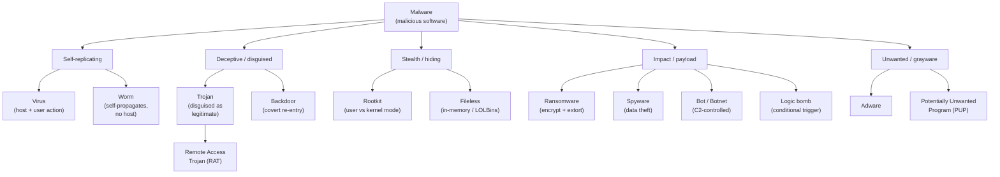
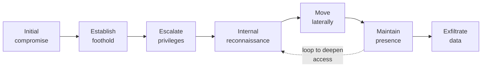
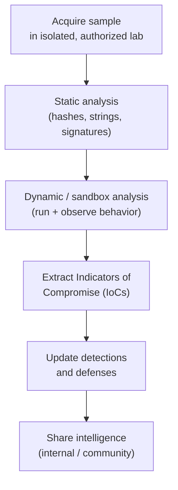

# Module 07 — Malware Threats

*Malware* (a contraction of **malicious software**) is any program or piece of code created to damage, disrupt, gain unauthorized access to, or steal information from a computer, network, or device against the owner's interests. This module teaches malware **conceptually and taxonomically** so you can recognize, classify, detect, and **defend** against each family — not build it. As a sysadmin moving into security, you already manage the systems attackers target; here you learn how malicious code behaves and how the defensive stack stops it.

> **Ethics and safety — read first.** Everything below is **educational, defense-oriented exam preparation only**. There is **no malware code, no payload construction, and no infection or persistence playbook** in this module. Handling *live* malware (real samples) is legal and safe **only** inside an **authorized, isolated lab environment** (an air-gapped or strictly segmented sandbox you are permitted to use). Never execute unknown samples on production systems or networks you do not own. See [../00-overview/what-is-ceh.md](../00-overview/what-is-ceh.md) and [../00-overview/five-phases-of-hacking.md](../00-overview/five-phases-of-hacking.md).

## Learning objectives

- Define malware and describe, at a high level, common distribution and infection vectors.
- Classify malware using a clear taxonomy: **virus, worm, trojan, ransomware, rootkit, fileless malware**, and others.
- Distinguish a **virus** (needs a host and user action) from a **worm** (self-propagates over a network).
- Define an **Advanced Persistent Threat (APT)** and walk through the APT lifecycle, relating it to **MITRE ATT&CK** tactics.
- Compare **static** versus **dynamic (behavioral)** malware analysis, both performed only in an isolated lab.
- Explain detection approaches — **signature-based, heuristic/behavioral, anomaly-based** — and the role of **Indicators of Compromise (IoCs)**.
- Apply layered **countermeasures**: Anti-Virus (AV), Endpoint Detection and Response (EDR), patching, allowlisting, segmentation, least privilege, and backups.

## What malware is and how it spreads

Malware is defined by **intent and effect**, not by a single technique. The same program can be a tool or a weapon depending on authorization and purpose. What unites the families below is that they run code the owner did not intend and would not approve.

Before code can do harm it must first **reach** and **execute** on a target. The high-level paths it takes are called **infection vectors** or **distribution vectors**. Understanding the vector matters because most defenses block the *delivery* long before the *payload* runs.

| Vector | What it is (concept) | Primary defense theme |
| --- | --- | --- |
| **Email / phishing** | A message tricks a user into opening an attachment or link that delivers malware. | User awareness, email filtering, attachment sandboxing |
| **Drive-by download** | Merely visiting a compromised or malicious web page triggers a download, often via an unpatched browser or plugin. | Patching, web filtering, browser hardening |
| **Removable media** | Infected Universal Serial Bus (USB) drives or other media carry malware between machines, including across air gaps. | Device control, disabling autorun, allowlisting |
| **Supply chain** | Malware is hidden inside trusted software, updates, or third-party components before they reach the victim. | Code signing, vendor vetting, integrity verification |
| **Network / remote exploitation** | Worms and exploit kits use a network-reachable vulnerability to spread without user action. | Patching, segmentation, firewalling |

> These are described **at the concept level only** — what the vector *is* and how to defend against it — never how to weaponize one.

## Malware taxonomy

Malware families are distinguished by **how they spread**, **what they do**, and **how they hide**. The table defines each family; the diagram that follows shows the same taxonomy visually.

| Family | Definition (conceptual) | Key distinguishing trait |
| --- | --- | --- |
| **Virus** | Malicious code that attaches to a **host** file or program and self-replicates **when the user runs the host**. | Needs a host **and** user action; does not spread on its own |
| **Worm** | Self-contained code that **self-propagates over a network**, copying itself to new hosts automatically. | No host file, no user action needed |
| **Trojan** (Trojan horse) | Malware **disguised as legitimate** software; the user installs it believing it is benign. | Deception, not self-replication |
| **Remote Access Trojan (RAT)** | A trojan whose payload gives an attacker **remote control** of the infected host (files, camera, commands). | Hidden interactive remote control |
| **Ransomware** | Malware that **encrypts** data (or locks the system) and demands payment; modern variants also **exfiltrate** data and threaten to publish it ("double extortion"). | Extortion via denial of access |
| **Rootkit** | Stealth software that **hides its own and other malware's presence** from the operating system and tools. | Concealment; can run in **user mode** or **kernel mode** |
| **Fileless malware** | Malicious activity that runs **in memory** and abuses **legitimate, already-installed tools** rather than dropping a file to disk. | Little or no file on disk; "lives off the land" |
| **Spyware** | Covertly **gathers information** (keystrokes, browsing, credentials) and sends it to a third party. | Stealthy data collection |
| **Adware** | Forces **unwanted advertisements**; often bundled with other software and may track the user. | Ad delivery / nuisance, sometimes a privacy risk |
| **Bot / Botnet** | A **bot** is a compromised host under remote control; many bots together form a **botnet** directed by a Command-and-Control (C2) server. | Coordinated, remotely controlled fleet |
| **Logic bomb** | Dormant code that **triggers on a condition** (a date, an event, a missing employee record). | Conditional, time- or event-delayed payload |
| **Backdoor** | A hidden access method that **bypasses normal authentication** to let an attacker return later. | Covert re-entry point |
| **Potentially Unwanted Program (PUP)** | Software the user technically agreed to but that behaves undesirably (toolbars, bundled extras). | Borderline; unwanted rather than overtly malicious |

### Rootkit: user mode vs kernel mode (concept)

A rootkit's danger is **privilege and stealth**. A **user-mode** rootkit operates with ordinary application privileges and hooks normal programs, so it is comparatively easier to detect and remove. A **kernel-mode** rootkit runs inside the operating system core, so it can lie to the very tools you would use to find it — making detection from the running system unreliable. This is why deep rootkit investigation often uses **offline or boot-from-trusted-media** examination. (Concept only — no implementation detail.)

### Fileless malware and Living-off-the-Land (concept)

**Fileless** techniques avoid writing a traditional executable to disk. Instead they abuse **legitimate, signed, pre-installed utilities** — the class of tools the industry calls **Living-off-the-Land Binaries (LOLBins)**, such as built-in scripting and administration interpreters. Because the binaries themselves are trusted, signature-based file scanning sees nothing. This is why **behavioral** detection (what is the trusted tool actually *doing*?) matters here. Discussed **conceptually only**.

### Malware taxonomy diagram

## Advanced Persistent Threat (APT)

An **Advanced Persistent Threat (APT)** is not a malware *type* but a **class of adversary** and the campaign they run. The three defining qualities are in the name:

- **Advanced** — uses sophisticated, sometimes custom tooling and tradecraft.
- **Persistent** — pursues a specific objective over a long **dwell time** (often months), maintaining quiet access rather than smashing and grabbing.
- **Threat** — a capable, well-resourced, often **state-sponsored or organized** actor with a deliberate target (a particular organization, sector, or data set).

APTs are **targeted and stealthy**: they prefer to blend in, reuse legitimate tools (Living-off-the-Land), and avoid triggering alarms so they can stay long enough to achieve espionage or sabotage goals.

### The APT lifecycle (conceptual)

Each stage maps onto **MITRE ATT&CK** tactics — ATT&CK is a public knowledge base of adversary **tactics** (the *why*: goals such as Initial Access, Persistence) and **techniques** (the *how*). At a high level:

| APT stage | Aligned MITRE ATT&CK tactic |
| --- | --- |
| Initial compromise | Initial Access |
| Establish foothold | Execution, Persistence |
| Escalate privileges | Privilege Escalation, Defense Evasion |
| Internal reconnaissance | Discovery |
| Move laterally | Lateral Movement, Credential Access |
| Maintain presence | Command and Control, Persistence |
| Exfiltrate data | Collection, Exfiltration |

Using ATT&CK, defenders translate "an APT is in our network" into a checklist of **observable behaviors** to hunt for. This complements the broader attack model in [../00-overview/five-phases-of-hacking.md](../00-overview/five-phases-of-hacking.md) and connects to post-exploitation persistence covered in [./06-system-hacking.md](./06-system-hacking.md).

## Malware analysis (concept)

Malware analysis answers: *what is this sample, and what does it do?* It has two complementary approaches. **Both are performed only inside an isolated, authorized lab** so the sample cannot escape or harm production. This module describes the **purpose and outputs** of each approach — it is **not** a reverse-engineering walkthrough.

| Approach | What it is | Examples of what you examine | Trade-off |
| --- | --- | --- | --- |
| **Static analysis** | Examine the sample **without running it**. | File **hashes**, embedded **strings**, file headers, known **signatures** | Safe and fast, but obfuscation/packing can hide intent |
| **Dynamic (behavioral) analysis** | **Run** the sample in an isolated **sandbox** and observe behavior. | Files created, registry/config changes, processes spawned, network calls (C2) | Reveals real behavior, but malware may detect the sandbox and stay dormant |

> **Lab discipline.** A malware analysis lab is **isolated** (no path to production or the internet except deliberately controlled), **snapshot-based** (revert to clean state between runs), and **authorized**. Treat every sample as live and dangerous.

A *disassembler/debugger* class of tool exists for deeper code-level inspection of a sample; it is mentioned here **only by purpose** (translating and stepping through compiled code). No usage is provided.

### Malware analysis workflow

## Detection approaches and Indicators of Compromise

Detection engines combine several philosophies, because no single one catches everything:

- **Signature-based** — matches files or traffic against a database of known-bad patterns (such as file hashes). Fast and precise for **known** threats; blind to brand-new or modified ones.
- **Heuristic / behavioral** — flags **suspicious characteristics or actions** (a document spawning a scripting interpreter, mass file encryption). Catches **unknown** variants; can produce false positives.
- **Anomaly-based** — learns a **baseline** of normal activity and alerts on deviations. Good for novel attacks; depends on an accurate baseline.

An **Indicator of Compromise (IoC)** is a forensic artifact that suggests an intrusion — for example a malicious **file hash**, a known C2 domain or IP address, a suspicious registry key, or an unusual process pattern. IoCs are the **output** of analysis (see the workflow above) and the **input** to detection: you extract them from a sample, then push them into AV/EDR/firewall/SIEM rules so the rest of the estate is protected. This ties directly to vulnerability identification in [./05-vulnerability-analysis.md](./05-vulnerability-analysis.md).

## Countermeasures / Defense

Malware defense is **layered (defense in depth)**: prevent delivery, prevent execution, detect what slips through, and recover quickly. Aligns with **NIST Special Publication (SP) 800-83**, *Guide to Malware Incident Prevention and Handling for Desktops and Laptops*.

| Control | Concept | What it stops |
| --- | --- | --- |
| **Anti-Virus (AV)** | Endpoint scanning, primarily signature + heuristic. | Known and many heuristic-detectable threats |
| **Endpoint Detection and Response (EDR)** | Continuously records endpoint behavior, detects suspicious activity, and enables response (isolate, kill, roll back). | Fileless, behavioral, and post-execution activity |
| **Extended Detection and Response (XDR)** | Correlates signals **across** endpoints, network, email, and cloud for a unified view. | Multi-stage attacks that span domains |
| **Sandboxing** | Detonates suspicious files in isolation before they reach users (e.g., email attachments). | Malicious attachments and downloads |
| **Application allowlisting** | Only **explicitly approved** programs may run; everything else is denied by default. | Unknown executables, many fileless launchers |
| **Patching** | Keep operating systems and software current. | Worms and drive-by exploits using known vulnerabilities |
| **User awareness training** | Teach staff to recognize phishing and risky behavior. | The **email/phishing** delivery vector |
| **Network segmentation** | Divide the network into zones to limit blast radius. | Worm propagation and lateral movement |
| **Least privilege** | Users and processes get only the rights they need. | Privilege escalation; limits malware impact |
| **Backups (offline / immutable)** | Maintain tested, isolated backups. | **Ransomware** — enables recovery without paying |

> **Ransomware-specific note.** The single most reliable ransomware countermeasure is **tested, offline or immutable backups** plus a rehearsed restore process. Because modern ransomware also **exfiltrates** data ("double extortion"), backups must be paired with **prevention and detection** — a restore alone does not undo data theft.

### Tools (purpose only)

Named for **purpose**, with **no usage, configuration, or steps**:

| Tool / class | Purpose |
| --- | --- |
| **Cuckoo Sandbox** | Open-source **automated dynamic analysis** — detonates a sample and reports observed behavior. |
| **VirusTotal** | Online **multi-engine file/URL reputation lookup** — checks a hash or URL against many engines and shares community intelligence. |
| **Disassembler / debugger (class)** | Code-level inspection of a compiled sample; mentioned **only** by purpose. |

## Exam tips

- **Virus** needs a **host file and user action**; a **worm self-propagates over the network** with no host and no user action. This distinction is high-yield.
- **Trojan = disguised as legitimate**; a **RAT (Remote Access Trojan)** is a trojan that grants remote control.
- **Rootkit = stealth/hiding**; know **user-mode vs kernel-mode** (kernel-mode is harder to detect from the running system).
- **Fileless malware** runs **in memory** and abuses **LOLBins (legitimate tools)** — so **behavioral** detection beats signatures.
- **Ransomware** countermeasure of choice = **tested offline/immutable backups**; note **double extortion** (encrypt **and** exfiltrate).
- **Static analysis** = examine **without running** (hashes, strings, signatures); **dynamic/behavioral** = **run in an isolated sandbox** and observe.
- **APT = Advanced (sophisticated) + Persistent (long dwell time) + targeted/often state-sponsored**, stealthy and goal-driven.
- Detection types: **signature** (known), **heuristic/behavioral** (unknown variants), **anomaly** (deviation from baseline).
- An **IoC (Indicator of Compromise)** is a forensic artifact (hash, C2 domain/IP, registry key) used to find and block threats.
- **EDR** focuses on the endpoint; **XDR** correlates across multiple domains.
- Handling live malware is safe/legal **only** in an **authorized, isolated lab**.
- See the acronym reference at [../reference/acronyms.md](../reference/acronyms.md).

## Sources

- EC-Council, Certified Ethical Hacker (CEH) v13 — https://www.eccouncil.org/train-certify/certified-ethical-hacker-ceh/
- NIST SP 800-83 Rev. 1, Guide to Malware Incident Prevention and Handling for Desktops and Laptops — https://csrc.nist.gov/pubs/sp/800/83/r1/final
- NIST SP 800-61, Computer Security Incident Handling Guide — https://csrc.nist.gov/pubs/sp/800/61/r2/final
- MITRE ATT&CK — Enterprise Tactics and Techniques — https://attack.mitre.org/
- MITRE ATT&CK — Software (malware/tool catalog) — https://attack.mitre.org/software/
