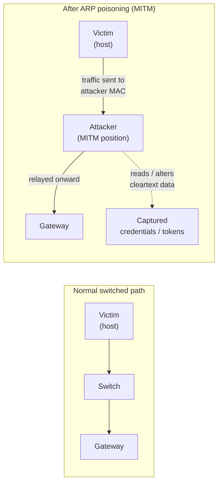
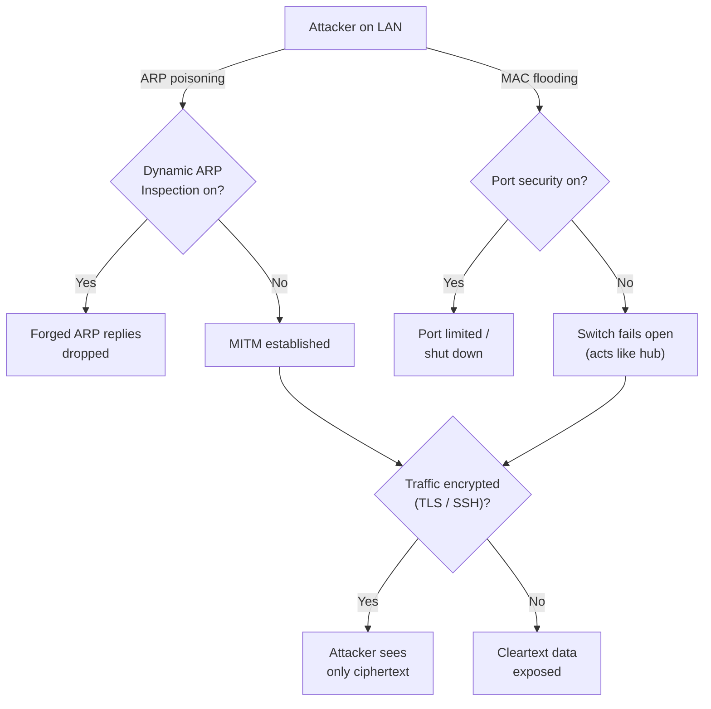

# Module 08 — Sniffing

*Packet sniffing* is the act of capturing and inspecting the data units (packets) that travel across a network. A defender uses sniffing for troubleshooting and intrusion detection; an attacker uses it to steal credentials, session tokens, and other secrets that cross the wire in the clear. This module explains how sniffing works, why some networks and protocols are vulnerable, and how to defend against it.

> All techniques here are described **conceptually for understanding and defense**. Performing them against systems you do not own is illegal in most jurisdictions and is permitted **only with explicit written authorization** and a defined scope. See [../00-overview/what-is-ceh.md](../00-overview/what-is-ceh.md).

## Learning objectives

- Explain what packet sniffing is and how a Network Interface Card (NIC) in *promiscuous mode* enables it.
- Distinguish **passive** sniffing from **active** sniffing.
- Describe, at a concept level, **Media Access Control (MAC) flooding** and **Address Resolution Protocol (ARP) poisoning** and how they enable a Man-in-the-Middle (MITM) position.
- Identify protocols that transmit data in cleartext and are therefore vulnerable.
- Apply countermeasures: encryption, **Dynamic ARP Inspection (DAI)**, switch **port security**, and network monitoring.

## How sniffing works

Every network packet has a destination address. Normally a NIC ignores frames not addressed to it. In **promiscuous mode**, the NIC passes *every* frame it sees up to the operating system, so a capture tool can read all traffic visible on that network segment.

The key question is therefore: **what traffic is actually visible to the attacker's NIC?** That depends on the network device in the middle:

- A **hub** (legacy) repeats every frame to every port — so all traffic is visible to everyone. This is why hubs are obsolete and a security risk.
- A **switch** forwards frames only to the port where the destination MAC address lives, using its **Content Addressable Memory (CAM) table** (the MAC-address-to-port mapping). On a switch, an attacker normally sees only their own traffic and broadcasts — which is why attackers try to *defeat* the switch.

### Passive vs active sniffing

| Type | What it is | Where it works | Detectability |
| --- | --- | --- | --- |
| **Passive** | Simply listening; the attacker injects no traffic | Hubs, wireless, and mirrored/SPAN ports | Very hard to detect (no traffic sent) |
| **Active** | The attacker injects traffic to redirect or expose data on a switched network | Switches | More detectable (abnormal traffic) |

**Passive sniffing** captures whatever the NIC can already see. **Active sniffing** is needed on a switched network: the attacker must *manipulate* the switch or the hosts so that traffic they should not see is sent to them. The two main concepts are MAC flooding and ARP poisoning.

### MAC flooding (concept)

The switch's CAM table has finite memory. In **MAC flooding**, an attacker sends a flood of frames each with a different, forged source MAC address. The CAM table fills up; when it can no longer learn new mappings, many switches **fail open** and start behaving like a hub — broadcasting frames out of all ports. The attacker can then passively sniff traffic that should have been switched privately. This is a denial-of-confidentiality side effect of a resource-exhaustion attack.

### ARP poisoning / ARP spoofing (concept)

ARP maps an Internet Protocol (IP) address to a MAC address on a local network. ARP has **no authentication**: a host accepts ARP replies even if it never asked. In **ARP poisoning** the attacker sends forged ARP replies that associate the attacker's MAC address with the IP address of, say, the default gateway. Victims then send their "gateway" traffic to the attacker, who relays it onward — placing the attacker **in the middle** (MITM). From there the attacker can read, modify, or drop traffic.

## Vulnerable protocols (cleartext)

Sniffing is dangerous mainly because some protocols send sensitive data with **no encryption**. If a protocol below is in use, anyone with a sniffing position can read its contents:

| Cleartext protocol | Purpose | Encrypted alternative |
| --- | --- | --- |
| **Telnet** | Remote shell | **SSH (Secure Shell)** |
| **File Transfer Protocol (FTP)** | File transfer | **SFTP / FTPS** |
| **Hypertext Transfer Protocol (HTTP)** | Web | **HTTPS (HTTP over TLS)** |
| **Post Office Protocol 3 (POP3) / Internet Message Access Protocol (IMAP) / Simple Mail Transfer Protocol (SMTP)** | Email | Their TLS variants (POP3S, IMAPS, SMTPS/STARTTLS) |
| **Simple Network Management Protocol v1/v2c (SNMP)** | Device management | **SNMPv3** (authentication + encryption) |

> For a sysadmin: the lesson is that the *network* should be treated as hostile. Even inside a "trusted" LAN, assume someone may be sniffing, and rely on **encryption in transit** rather than network location for confidentiality.

## Tools (purpose only)

| Tool | Purpose |
| --- | --- |
| **Wireshark** | Graphical packet analyzer; captures and decodes traffic, follows streams, and is the standard tool for protocol analysis and forensic review. |
| **tcpdump** | Command-line packet capture using **Berkeley Packet Filter (BPF)** expressions; ideal on servers and for scripted/headless capture. |
| **arpwatch** (defensive) | Monitors and logs IP-to-MAC pairings and alerts on suspicious changes — useful for *detecting* ARP poisoning. |

CEH also references capture/MITM frameworks (for example, Ettercap and Bettercap) as **concepts**; this hub names them for awareness and does not provide attack procedures.

## Countermeasures / Defense

Defense layers the network controls with cryptographic ones:

- **Encrypt data in transit.** Replace every cleartext protocol with its TLS/SSH equivalent. This is the single most effective control: even from an MITM position, the attacker sees only ciphertext.
- **Dynamic ARP Inspection (DAI).** A switch feature that validates ARP packets against a trusted IP-to-MAC binding table (built from **DHCP snooping** or static entries) and drops forged ARP replies — directly countering ARP poisoning.
- **Switch port security.** Limit the number of MAC addresses allowed per port and shut down or restrict ports that exceed it — directly countering MAC flooding.
- **DHCP snooping.** Trusts DHCP responses only from designated ports; underpins DAI and prevents rogue DHCP servers.
- **Static ARP entries** for critical hosts (e.g., gateways) so forged replies are ignored — manageable only on small/critical segments.
- **Network segmentation and VLANs** to limit the blast radius of any sniffing position.
- **Detect promiscuous mode and anomalies.** Tools and techniques (for example, ARP-anomaly monitors and intrusion detection) can flag NICs in promiscuous mode and abnormal ARP/MAC behavior.
- **Use a Network Access Control (NAC)** to authenticate devices before granting LAN access.

## Exam tips

- **Promiscuous mode** is the NIC setting that makes sniffing possible.
- On a **switch**, an attacker must use **active** sniffing (MAC flooding or ARP poisoning); on a **hub** or wireless, **passive** sniffing suffices.
- **MAC flooding** targets the **CAM table** and makes a switch **fail open** (act like a hub).
- **ARP poisoning** works because **ARP has no authentication**; the countermeasure is **Dynamic ARP Inspection (DAI)**, which depends on **DHCP snooping**.
- **Port security** is the switch countermeasure to **MAC flooding**.
- Know the cleartext protocols (Telnet, FTP, HTTP, SNMPv1/2c, POP3/IMAP/SMTP) and their encrypted replacements.
- The best defense against sniffing is **encryption in transit**, because it protects confidentiality even if the attacker achieves an MITM position.

## Sources

- EC-Council, Certified Ethical Hacker (CEH) v13 — Module on Sniffing — https://www.eccouncil.org/train-certify/certified-ethical-hacker-ceh/
- MITRE ATT&CK, Network Sniffing (T1040) — https://attack.mitre.org/techniques/T1040/
- MITRE ATT&CK, Adversary-in-the-Middle: ARP Cache Poisoning (T1557.002) — https://attack.mitre.org/techniques/T1557/002/
- RFC 826, An Ethernet Address Resolution Protocol — https://www.rfc-editor.org/rfc/rfc826
- NIST SP 800-95, Guide to Secure Web Services (transport confidentiality guidance) — https://csrc.nist.gov/pubs/sp/800/95/final
- Cisco, Dynamic ARP Inspection and DHCP Snooping (security configuration guidance) — https://www.cisco.com/
