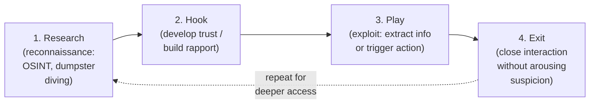

# Module 09 — Social Engineering

*Social engineering* is the art of manipulating people into breaking normal security procedures — revealing information, granting access, or performing actions — by exploiting trust, authority, fear, urgency, or helpfulness rather than a technical flaw. Because it targets humans, it bypasses firewalls, encryption, and patches, which is why it remains one of the most common entry points into organizations.

> All techniques here are described **conceptually for understanding and defense**. Conducting social-engineering tests against real people or organizations is permitted **only with explicit written authorization** and a defined scope. See [../00-overview/what-is-ceh.md](../00-overview/what-is-ceh.md).

## Learning objectives

- Define social engineering and explain why it works (human psychology).
- Distinguish **human-based** from **computer-based** (and mobile-based) attacks.
- Identify the major attack types: phishing, spear-phishing, whaling, vishing, smishing, pretexting, baiting, quid pro quo, and tailgating/piggybacking.
- Explain **insider threats** and **identity theft** as related risks.
- Apply countermeasures: security-awareness training, **Multi-Factor Authentication (MFA)**, verification procedures, and technical controls.

## Why social engineering works

Attackers exploit predictable human tendencies. CEH and behavioral research describe levers such as:

- **Authority** — people comply with apparent superiors (e.g., a "CEO" or "IT department").
- **Urgency / scarcity** — "act now or lose access" short-circuits careful thinking.
- **Trust / familiarity** — a known logo, name, or tone lowers suspicion.
- **Fear** — threats of penalties or account loss drive hasty action.
- **Helpfulness / reciprocity** — most people want to be helpful, especially if given something first.

## Categories: human-based vs computer-based

| Category | How it is delivered | Examples |
| --- | --- | --- |
| **Human-based** | Direct human interaction, in person or by voice | Impersonation, tailgating, pretexting, dumpster diving, shoulder surfing |
| **Computer-based** | Software/electronic channels | Phishing email, fake websites, pop-ups, scareware |
| **Mobile-based** | Mobile apps/messaging | Malicious apps, smishing (Short Message Service phishing), fake security apps |

## Major attack types

| Attack | Channel | Description |
| --- | --- | --- |
| **Phishing** | Email (broad) | Mass fraudulent messages luring victims to fake sites or malicious attachments to harvest credentials or deliver malware. |
| **Spear-phishing** | Email (targeted) | Phishing tailored to a specific individual/organization using researched details, making it far more convincing. |
| **Whaling** | Email (executives) | Spear-phishing aimed at high-value targets such as executives or finance staff. |
| **Vishing** | Voice call | "Voice phishing" — phone calls impersonating banks, IT support, or authorities. |
| **Smishing** | SMS/text | Phishing via text messages with malicious links. |
| **Pretexting** | Any | Inventing a fabricated scenario ("pretext") to justify a request for information or access. |
| **Baiting** | Physical/online | Leaving infected media (e.g., USB drives) or offering tempting downloads that deliver malware when used. |
| **Quid pro quo** | Voice/online | Offering a benefit (e.g., "free IT help") in exchange for credentials or actions. |
| **Tailgating / piggybacking** | Physical | Following an authorized person through a secured door without presenting credentials. |
| **Business Email Compromise (BEC)** | Email | Impersonating a trusted party (often via a hijacked or look-alike account) to redirect payments or data. |

> **Phishing vs spear-phishing:** phishing is wide and untargeted (cast a wide net); spear-phishing is narrow and researched (one specific fish). Whaling is spear-phishing aimed at "whales" (executives).

## Insider threats and identity theft

- **Insider threat** — a current or former employee, contractor, or partner who misuses authorized access. Insiders may be **malicious** (sabotage, theft, fraud), **negligent** (careless), or **compromised** (their account taken over). Social engineering is a common way to *create* a compromised insider.
- **Identity theft** — stealing personal data (e.g., name, government ID number, credentials) to impersonate a victim for fraud or to strengthen further social-engineering attacks. It is frequently both an *input* to and an *outcome* of social engineering.

## The social-engineering attack lifecycle

CEH describes a repeatable lifecycle. Defenders should recognize each stage to interrupt it early.

- **Research** — gather information using **Open-Source Intelligence (OSINT)**, social media, dumpster diving, and websites to find pretexts and targets.
- **Hook** — make contact and establish trust or authority.
- **Play** — exploit the relationship to obtain information, credentials, or an action (e.g., clicking a link, wiring funds, holding a door).
- **Exit** — disengage cleanly so the victim does not realize they were manipulated, preserving the ability to return.

## Tools (purpose only)

| Tool | Purpose |
| --- | --- |
| **Social-Engineer Toolkit (SET)** | Open-source framework used **in authorized testing** to model phishing and credential-harvesting scenarios; named here for awareness only. |
| **Gophish** | Open-source phishing-simulation platform used by defenders to run **authorized awareness campaigns** and measure click rates. |
| **OSINT collectors** (e.g., theHarvester, Maltego) | Gather publicly available information to understand an organization's attack surface — also used defensively to see what attackers can find. |

This hub names tools and their purpose only; it does not provide phishing kits, lures, or step-by-step procedures.

## Countermeasures / Defense

Because the target is human, defense combines **people**, **process**, and **technology**:

- **Security-awareness training.** Regular, scenario-based training so staff can recognize phishing, vishing, pretexting, and tailgating. Run **authorized phishing simulations** to measure and improve.
- **Multi-Factor Authentication (MFA).** Even if credentials are phished, MFA blocks reuse. Prefer phishing-resistant MFA (e.g., **FIDO2** hardware security keys) over Short Message Service (SMS) one-time codes.
- **Verification procedures.** Out-of-band callback verification for sensitive requests (especially payment changes) using known-good contact details — the primary control against BEC and vishing.
- **Least privilege and separation of duties.** Limits what a compromised account or insider can do; require dual approval for high-risk actions like fund transfers.
- **Reporting culture.** A simple, blame-free way to report suspected attacks (e.g., a "report phishing" button) so the security team can respond fast.
- **Technical email controls.** **Sender Policy Framework (SPF)**, **DomainKeys Identified Mail (DKIM)**, and **Domain-based Message Authentication, Reporting and Conformance (DMARC)** to reduce spoofing; email filtering, link rewriting, and attachment sandboxing.
- **Physical controls.** Badge access, mantraps/turnstiles, visitor escorting, and clean-desk/shredding policies to counter tailgating and dumpster diving.
- **Insider-threat program.** Monitoring, offboarding procedures that revoke access promptly, and user behavior analytics (UBA) to flag anomalies.

> For a sysadmin: the strongest *single* technical mitigation is **phishing-resistant MFA**, because it breaks the value of stolen passwords. But it is not sufficient alone — combine it with verification procedures and a strong reporting culture.

## Exam tips

- Social engineering exploits **human psychology** (authority, urgency, trust, fear), not technical flaws.
- **Phishing** = broad/untargeted; **spear-phishing** = targeted/researched; **whaling** = executives; **vishing** = voice; **smishing** = SMS.
- **Tailgating/piggybacking** is the *physical* attack of following someone through a secured door.
- **Pretexting** = a fabricated scenario; **baiting** = tempting infected media/downloads; **quid pro quo** = a service in exchange for access.
- The four lifecycle phases are **Research → Hook → Play → Exit**.
- The top countermeasures: **awareness training**, **MFA (phishing-resistant)**, and **out-of-band verification**.
- **Insider threats** can be malicious, negligent, or compromised.

## Sources

- EC-Council, Certified Ethical Hacker (CEH) v13 — Module on Social Engineering — https://www.eccouncil.org/train-certify/certified-ethical-hacker-ceh/
- MITRE ATT&CK, Phishing (T1566) — https://attack.mitre.org/techniques/T1566/
- MITRE ATT&CK, Phishing: Spearphishing Attachment (T1566.001) — https://attack.mitre.org/techniques/T1566/001/
- NIST SP 800-50, Building an Information Technology Security Awareness and Training Program — https://csrc.nist.gov/pubs/sp/800/50/final
- NIST SP 800-63B, Digital Identity Guidelines — Authentication (MFA, phishing resistance) — https://pages.nist.gov/800-63-3/sp800-63b.html
- Cybersecurity and Infrastructure Security Agency (CISA), Avoiding Social Engineering and Phishing Attacks — https://www.cisa.gov/news-events/news/avoiding-social-engineering-and-phishing-attacks
