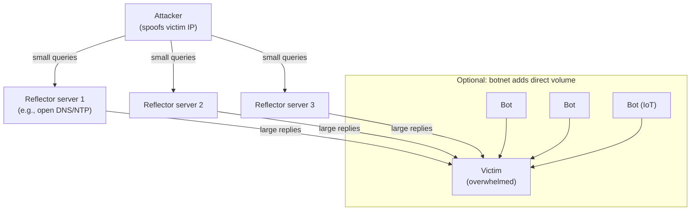
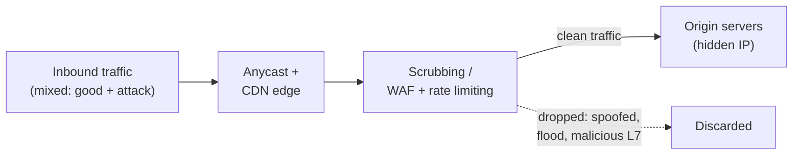

# Module 10 — Denial-of-Service (DoS) and Distributed Denial-of-Service (DDoS)

A **Denial-of-Service (DoS)** attack aims to make a system, service, or network **unavailable** to its legitimate users — attacking the *availability* leg of the confidentiality–integrity–availability (CIA) triad. A **Distributed Denial-of-Service (DDoS)** attack does the same thing from **many** sources at once (often a botnet), which makes it far harder to filter and to trace.

> All techniques here are described **conceptually for understanding and defense**. Launching DoS/DDoS traffic against systems you do not own is illegal in most jurisdictions and is permitted **only with explicit written authorization**. See [../00-overview/what-is-ceh.md](../00-overview/what-is-ceh.md).

## Learning objectives

- Define DoS and DDoS and explain how they differ.
- Describe the three attack categories: **volumetric**, **protocol**, and **application-layer**.
- Explain **botnets** and how attackers build and command them.
- Explain, at a concept level, **amplification** and **reflection** and why they are dangerous.
- Apply countermeasures: rate limiting, traffic scrubbing, Content Delivery Network (CDN), anycast, and source validation.

## DoS vs DDoS

| | DoS | DDoS |
| --- | --- | --- |
| Sources | One (or few) | Many (often thousands), distributed globally |
| Filtering | Easier — block the source | Harder — sources look legitimate and numerous |
| Tracing | Easier | Hard — true origin hidden behind the botnet |
| Typical scale | Limited | Very large (botnet aggregates bandwidth) |

The goal of both is **exhaustion** of a finite resource: bandwidth, connection state, CPU/memory, or an application's processing capacity.

## Attack categories

CEH groups DoS/DDoS by the resource targeted:

| Category | What it exhausts | Examples (concept) | Measured in |
| --- | --- | --- | --- |
| **Volumetric** | Network bandwidth | User Datagram Protocol (UDP) floods, Internet Control Message Protocol (ICMP) floods, amplification/reflection floods | Bits per second (bps) |
| **Protocol** | Connection-state tables on servers/firewalls/load balancers | SYN flood (half-open Transmission Control Protocol connections), Ping of Death, fragmentation attacks | Packets per second (pps) |
| **Application-layer (Layer 7)** | Server CPU/memory and app logic | HTTP floods, "slow" attacks (e.g., Slowloris) that hold connections open | Requests per second (rps) |

- **Volumetric** attacks are about raw size — fill the pipe so legitimate packets cannot get through.
- **Protocol** attacks exploit weaknesses in how protocols manage **state** — e.g., a **SYN flood** sends many connection requests but never completes the handshake, exhausting the server's half-open connection table.
- **Application-layer** attacks send requests that look legitimate but are expensive to serve; they are low-bandwidth and hard to distinguish from real users.

## Botnets

A **botnet** is a network of compromised devices ("bots" or "zombies") — PCs, servers, and **Internet of Things (IoT)** devices — under the control of an attacker via a **Command-and-Control (C2)** channel. The attacker (the "bot herder") issues a single command and thousands of bots flood the target simultaneously. IoT devices with default credentials are a common source of large botnets.

## Amplification and reflection (concept)

These two techniques multiply an attacker's firepower and hide their identity:

- **Reflection** — the attacker sends requests to third-party servers but **spoofs the source IP address** to be the *victim's*. The servers send their replies to the victim, who is "reflected" traffic from innocent intermediaries.
- **Amplification** — the attacker chooses protocols where a **small request triggers a much larger response** (a high *amplification factor*). Combined with reflection, a small amount of attacker bandwidth produces a flood at the victim.

Protocols historically abused for amplification include **Domain Name System (DNS)**, **Network Time Protocol (NTP)**, and **Memcached**, because they can return responses many times larger than the request. The root enabler is **IP source-address spoofing**.

## Tools (purpose only)

| Tool | Purpose |
| --- | --- |
| **hping3** | Crafts custom Transmission Control Protocol (TCP)/IP/UDP/ICMP packets; used in **authorized** testing to study protocol-level behavior. Named here for awareness only. |
| **LOIC / HOIC (concept)** | Historic public flooding tools, referenced by CEH as examples of volumetric tooling; no procedures are provided. |
| **Defensive: NetFlow/sFlow collectors** | Sample traffic flows so defenders can detect volumetric anomalies and identify attack vectors. |

This hub names tools and their purpose only; it does not provide attack scripts or playbooks.

## Countermeasures / Defense

DDoS defense is layered, because no single control stops every category:

- **Rate limiting and traffic shaping.** Cap requests/connections per source or per resource to blunt floods and application-layer abuse.
- **Traffic scrubbing.** Route suspect traffic through a **scrubbing center** (on-premises appliance or cloud service) that filters out attack packets and forwards clean traffic to the origin.
- **Content Delivery Network (CDN).** Distributes content across many edge servers, absorbing volumetric load and hiding the origin's IP address.
- **Anycast.** Advertises one IP address from many geographic locations so attack traffic is **dispersed** across many points of presence instead of hitting one site.
- **SYN protection.** **SYN cookies** and connection-rate limits defeat SYN floods without keeping per-connection state.
- **Source-address validation (anti-spoofing).** **BCP 38 / RFC 2827 ingress filtering** at the network edge drops packets with forged source addresses — the systemic fix that undermines reflection/amplification.
- **Harden and patch reflectors.** Disable open recursion on DNS resolvers, restrict NTP `monlist`, and secure Memcached so they cannot be abused as amplifiers.
- **Overprovisioning and autoscaling.** Extra capacity (especially elastic cloud capacity) buys time during a flood.
- **Web Application Firewall (WAF).** Filters malicious Layer-7 requests and enforces challenges (e.g., for HTTP floods).
- **Incident response and an upstream provider relationship.** Pre-arranged DDoS mitigation with the Internet Service Provider (ISP) or a specialist provider, plus a tested runbook.

## Exam tips

- **DoS = one source; DDoS = many sources** (usually a **botnet** of bots/zombies via **C2**).
- Memorize the three categories and their unit: **volumetric (bps)**, **protocol (pps)**, **application-layer (rps)**.
- A **SYN flood** is a **protocol** attack that exhausts the **half-open connection** table; the countermeasure is **SYN cookies**.
- **Reflection** spoofs the victim's IP so replies go to the victim; **amplification** uses protocols with a large response-to-request ratio (DNS, NTP, Memcached).
- The systemic anti-spoofing fix is **ingress filtering (BCP 38 / RFC 2827)**.
- **Anycast** disperses attack traffic; **CDN** absorbs volume and hides the origin; **scrubbing** filters attack packets.

## Sources

- EC-Council, Certified Ethical Hacker (CEH) v13 — Module on Denial-of-Service — https://www.eccouncil.org/train-certify/certified-ethical-hacker-ceh/
- MITRE ATT&CK, Network Denial of Service (T1498) — https://attack.mitre.org/techniques/T1498/
- MITRE ATT&CK, Endpoint Denial of Service (T1499) — https://attack.mitre.org/techniques/T1499/
- RFC 2827 / BCP 38, Network Ingress Filtering — https://www.rfc-editor.org/rfc/rfc2827
- RFC 4987, TCP SYN Flooding Attacks and Common Mitigations — https://www.rfc-editor.org/rfc/rfc4987
- CISA, Understanding Denial-of-Service Attacks — https://www.cisa.gov/news-events/news/understanding-denial-service-attacks
- NIST SP 800-61 Rev. 2, Computer Security Incident Handling Guide — https://csrc.nist.gov/pubs/sp/800/61/r2/final
