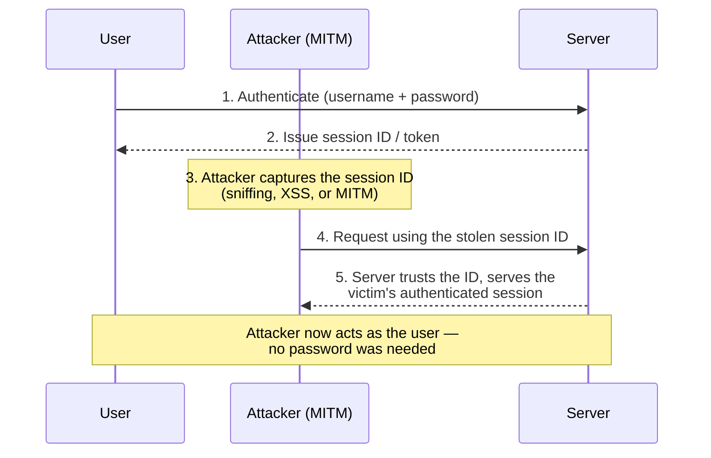

# Module 11 — Session Hijacking

A **session** is the established, authenticated context between a client and a server — proven by a **session identifier (session ID)** such as a cookie or token. **Session hijacking** is the act of taking over that already-authenticated session so the attacker is treated as the legitimate user, **without ever needing the password**. This is powerful because it sidesteps authentication entirely: the user already logged in, and the attacker steals or predicts the proof.

> All techniques here are described **conceptually for understanding and defense**. Hijacking sessions on systems you do not own is illegal and is permitted **only with explicit written authorization**. See [../00-overview/what-is-ceh.md](../00-overview/what-is-ceh.md).

## Learning objectives

- Explain what a session and a session ID are, and why hijacking bypasses authentication.
- Distinguish **application-level** from **network-level** session hijacking.
- Describe **Transmission Control Protocol (TCP) session hijacking**, token theft, and Man-in-the-Middle (MITM) at a concept level.
- Apply countermeasures: Transport Layer Security (TLS) everywhere, secure cookie flags, token binding, short lifetimes, and re-authentication.

## Why session hijacking works

After login, the server cannot re-check a password on every request (that would be impractical). Instead it issues a **session ID** and trusts whoever presents it. So the session ID is *bearer* proof — like a movie ticket, anyone holding it gets in. If an attacker **steals**, **predicts**, or **fixes** that ID, they inherit the victim's session.

## Two levels of hijacking

| Level | What is attacked | Examples (concept) |
| --- | --- | --- |
| **Application-level** | The session token at the application layer (HTTP cookie/token) | Stealing a cookie via Cross-Site Scripting (XSS), sniffing an unencrypted cookie, session prediction, **session fixation** |
| **Network-level** | The underlying transport connection (TCP) | TCP sequence-number prediction, MITM, packet injection into an established connection |

- **Application-level** hijacking goes after the **token** — the value the app uses to recognize the user.
- **Network-level** hijacking goes after the **connection** itself — taking over a live TCP stream beneath the application.

### Common application-level techniques (concept)

- **Session sniffing** — capturing a session cookie sent over unencrypted HTTP.
- **Cross-Site Scripting (XSS)** — injected script reads a non-`HttpOnly` cookie and exfiltrates it.
- **Session prediction** — guessing weak, sequential, or low-entropy session IDs.
- **Session fixation** — the attacker sets a known session ID *before* the victim logs in, then reuses it after the victim authenticates (defended by **rotating the session ID at login**).

### TCP session hijacking (concept)

TCP tracks a connection using **sequence and acknowledgment numbers**. In TCP hijacking, an attacker who can observe or predict these numbers (typically from an MITM position) injects forged packets with the correct sequence numbers, impersonating one side. This can desynchronize the legitimate endpoints and let the attacker inject commands. The two enabling conditions are **predictable sequence numbers** and a **vantage point** to observe/inject traffic — both are largely neutralized by encryption.

## The hijack, conceptually

## Tools (purpose only)

| Tool | Purpose |
| --- | --- |
| **Wireshark** | Captures and inspects traffic; used to *demonstrate and detect* exposed session IDs on unencrypted connections. |
| **Burp Suite / OWASP ZAP** | Web-proxy tools used in **authorized** testing to analyze session tokens (entropy, flags, lifetime, fixation). |
| **Defensive: SIEM / session monitoring** | Detects concurrent sessions, impossible-travel logins, and IP/user-agent changes that suggest hijacking. |

This hub names tools and their purpose only; it does not provide hijacking procedures or exploit code.

## Countermeasures / Defense

The dominant theme is: **protect the token in transit, in storage, and over time.**

- **TLS everywhere (HTTPS).** Encrypt all traffic end to end so session IDs cannot be sniffed and TCP streams cannot be read or injected. Enforce with **HTTP Strict Transport Security (HSTS)**. This single control defeats most network-level and sniffing-based hijacking.
- **Secure cookie flags.**
  - `Secure` — the cookie is sent only over HTTPS.
  - `HttpOnly` — JavaScript cannot read the cookie, blocking XSS-based theft.
  - `SameSite` — restricts cross-site sending, reducing Cross-Site Request Forgery (CSRF) and some leakage.
- **Strong, random session IDs.** High-entropy, unpredictable IDs from a cryptographically secure generator defeat prediction.
- **Rotate session ID on privilege change.** Issue a new ID at login and at privilege elevation to defeat **session fixation**.
- **Short lifetimes, idle timeouts, and logout that truly invalidates** the session server-side.
- **Re-authentication / step-up authentication** for sensitive actions (e.g., changing email, transferring funds), so a stolen session alone is not enough.
- **Token binding / contextual checks.** Bind the session to client attributes (and use **token binding** where supported) and flag changes in IP address, device, or user-agent.
- **Multi-Factor Authentication (MFA).** Limits damage and supports step-up checks.
- **Network-level hardening.** Modern operating systems use **randomized TCP initial sequence numbers (RFC 6528)**, which defeats classic sequence prediction.

> For a sysadmin: treat the session cookie like a password. If it travels in cleartext or is readable by page scripts, it is as good as compromised. `Secure` + `HttpOnly` + TLS + ID rotation on login covers the large majority of web session-hijacking risk.

## Exam tips

- Session hijacking **bypasses authentication** — the attacker reuses an already-authenticated session, no password required.
- **Application-level** = stealing the **token/cookie**; **network-level** = taking over the **TCP connection**.
- **TCP hijacking** relies on **sequence-number** prediction and a sniffing/MITM position.
- **Session fixation** is defended by **rotating (regenerating) the session ID at login**.
- The cookie flags to know: **`Secure`** (HTTPS-only), **`HttpOnly`** (blocks script access / XSS theft), **`SameSite`** (cross-site restriction).
- The number-one countermeasure is **TLS everywhere (HTTPS + HSTS)**; combine with strong random IDs, short lifetimes, and re-authentication.

## Sources

- EC-Council, Certified Ethical Hacker (CEH) v13 — Module on Session Hijacking — https://www.eccouncil.org/train-certify/certified-ethical-hacker-ceh/
- OWASP, Session Management Cheat Sheet — https://cheatsheetseries.owasp.org/cheatsheets/Session_Management_Cheat_Sheet.html
- OWASP, Session Hijacking Attack — https://owasp.org/www-community/attacks/Session_hijacking_attack
- MITRE ATT&CK, Steal Web Session Cookie (T1539) — https://attack.mitre.org/techniques/T1539/
- RFC 6265, HTTP State Management Mechanism (cookies; `Secure`, `HttpOnly`) — https://www.rfc-editor.org/rfc/rfc6265
- RFC 6528, Defending against Sequence Number Attacks — https://www.rfc-editor.org/rfc/rfc6528
- RFC 6797, HTTP Strict Transport Security (HSTS) — https://www.rfc-editor.org/rfc/rfc6797
