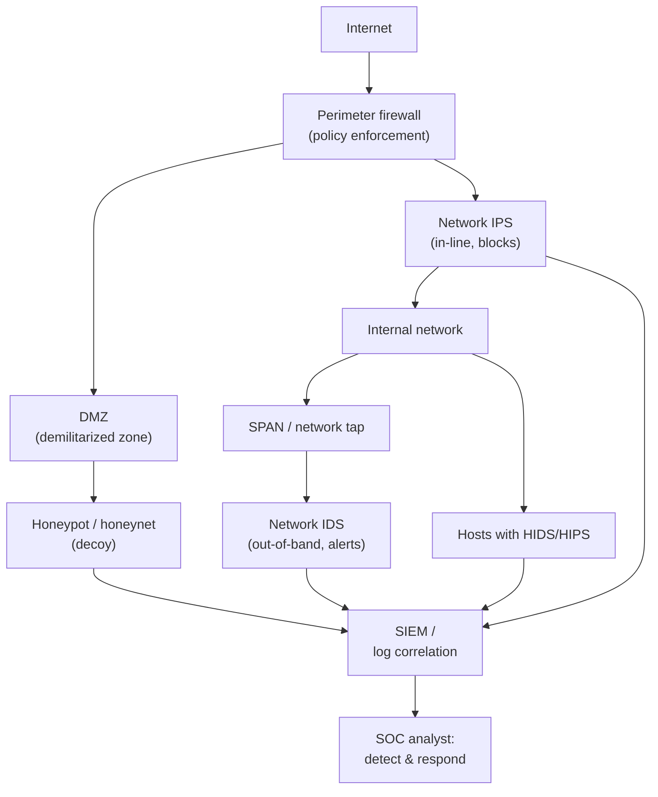

# Module 12 — Evading IDS, Firewalls, and Honeypots

Defensive systems — **Intrusion Detection Systems (IDS)**, **Intrusion Prevention Systems (IPS)**, **firewalls**, and **honeypots** — are the controls that watch for, block, and study attacks. CEH covers how attackers *try to evade* these controls. In keeping with this hub's defensive focus, this module explains **how these systems work, where they are placed, and how to DETECT evasion and tune defenses** — not how to evade them for malicious purposes.

> Everything here is for **building and improving defenses**. Any testing of these controls is permitted **only with explicit written authorization** and a defined scope. See [../00-overview/what-is-ceh.md](../00-overview/what-is-ceh.md).

## Learning objectives

- Explain how firewalls, IDS, IPS, and honeypots work and where each is deployed.
- Distinguish **signature-based** from **anomaly-based** detection, and IDS from IPS.
- Understand, conceptually, the *categories* of evasion attackers attempt — so you can recognize and detect them.
- Tune defenses and use detection techniques to spot evasion attempts.

## How the defensive controls work

### Firewalls

A **firewall** enforces a policy on what traffic may pass between network zones (e.g., the internet and an internal network). Types:

| Firewall type | Decision basis |
| --- | --- |
| **Packet-filtering** | Per-packet rules on IP addresses, ports, and protocol |
| **Stateful inspection** | Tracks connection **state** (the conversation), not just individual packets |
| **Application-layer / proxy** | Understands application protocols (e.g., HTTP) and can inspect content |
| **Next-Generation Firewall (NGFW)** | Adds application awareness, user identity, and integrated IPS/threat intelligence |

### IDS vs IPS

| | IDS | IPS |
| --- | --- | --- |
| Role | **Detects** and alerts | **Detects and blocks** in line |
| Placement | Out-of-band (sees a copy via a SPAN/mirror or network tap) | In-line (traffic flows through it) |
| Failure impact | Misses an attack (no block) | Can drop legitimate traffic if mis-tuned |

Detection methods:

- **Signature-based (misuse) detection** — matches traffic against known attack patterns. Accurate for known threats; blind to novel ones.
- **Anomaly-based detection** — builds a baseline of "normal" and flags deviations. Can catch novel attacks; prone to **false positives**.

A **Network IDS/IPS (NIDS/NIPS)** watches network traffic; a **Host IDS/IPS (HIDS/HIPS)** watches a single host's files, logs, and processes.

### Honeypots

A **honeypot** is a decoy system with no legitimate purpose, deployed to **attract and study** attackers. Because nothing should ever talk to it, **any** interaction is suspicious — making honeypots a high-signal, low-false-positive detection source.

| Type | Interaction | Use |
| --- | --- | --- |
| **Low-interaction** | Emulates a few services | Early-warning, low risk |
| **High-interaction** | Real (sandboxed) systems | Deep study of attacker behavior, higher maintenance/risk |

A **honeynet** is a network of honeypots; a **honeytoken** is a decoy *data* item (e.g., a fake credential or record) whose use signals compromise.

## Defense placement and detection flow

The **Security Information and Event Management (SIEM)** system correlates events from all controls; the **Security Operations Center (SOC)** investigates and responds. Defense-in-depth means an evasion that slips one control should be caught by another.

## Evasion categories (conceptual — for detection)

Attackers try to make malicious traffic *look benign or invisible* to detection. Understanding the **categories** lets you detect them; this hub does not provide working evasion recipes.

| Evasion category | What the attacker exploits | How defenders DETECT it |
| --- | --- | --- |
| **Fragmentation** | Splitting payloads so a sensor cannot reassemble the pattern | Enable full, target-aware reassembly; alert on abnormal fragmentation |
| **Encryption / tunneling** | Hiding payloads inside TLS, SSH, DNS, or HTTP tunnels | TLS inspection where lawful/appropriate; flag unusual tunnel volume and rare destinations |
| **Obfuscation / encoding** | Encoding payloads (e.g., Unicode, polymorphism) to dodge signatures | Normalize/decode before matching; combine with anomaly detection |
| **Insertion / evasion (TTL/timing games)** | Making the sensor and host interpret a stream differently | Target-based reassembly that mirrors the protected host's TCP/IP stack |
| **Source manipulation** | Spoofed addresses, decoys, and slow ("low-and-slow") scans to dodge thresholds | Long-window correlation; ingress filtering; behavioral baselining |
| **Firewall traversal** | Tunneling over allowed ports (e.g., 80/443), source-routing | Application-layer (NGFW) inspection; egress filtering; block source routing |
| **Anti-honeypot/anti-sandbox** | Detecting decoys/analysis environments and refusing to run | Make honeypots realistic; watch for environment-fingerprinting behavior |

## Tools (purpose only)

| Tool | Purpose |
| --- | --- |
| **Snort / Suricata** | Open-source IDS/IPS engines; **defensive** — write and tune detection rules. |
| **Zeek** | Network-security monitor producing rich connection/protocol logs for detection and hunting. |
| **Wireshark / tcpdump** | Packet analysis to validate what a sensor sees and to confirm/disprove suspected evasion. |
| **Honeypot frameworks** (e.g., Cowrie, T-Pot) | Deploy decoys to gather attacker intelligence and high-signal alerts. |
| **Firewall/IDS test traffic generators** | Used in **authorized** testing to validate detection coverage and tuning. |

This hub names tools and their purpose only; it does not provide evasion procedures or detection-bypass recipes.

## Countermeasures / Defense (tuning and detection)

- **Defense-in-depth.** Layer firewall + NIDS/NIPS + HIDS/HIPS + honeypots so one bypass is not total compromise.
- **Full, target-aware reassembly.** Configure sensors to reassemble fragmented and out-of-order traffic the way the protected host would — the core defense against fragmentation/insertion evasion.
- **Decrypt where appropriate.** Use TLS inspection (with policy/legal review) so encrypted payloads can be examined; otherwise rely on metadata/anomaly signals.
- **Normalize before matching.** Decode and canonicalize input so encoding/obfuscation cannot hide a signature.
- **Tune to reduce false positives/negatives.** Baseline normal traffic, suppress noisy rules, and keep signatures and threat intelligence current — over-alerting hides real evasion.
- **Egress filtering.** Restrict outbound traffic to block tunneling and command-and-control over "allowed" ports.
- **Behavioral / anomaly detection + SIEM correlation.** Detect low-and-slow and novel attacks that signatures miss; correlate across all controls.
- **Deploy honeypots/honeytokens** as high-signal tripwires; keep them realistic and isolated.
- **Continuous validation.** Run **authorized** detection-coverage tests (purple-team exercises) to confirm controls catch what they should.

> For a sysadmin: an IDS is only as good as its tuning. A noisy, default-rule sensor *invites* evasion because real alerts drown in false positives. Baselining your environment and trimming rules is itself a security control.

## Exam tips

- **IDS detects/alerts; IPS detects and blocks (in-line).** IDS is typically **out-of-band** (SPAN/tap); IPS is **in-line**.
- **Signature-based** catches known attacks (misses novel); **anomaly-based** catches novel attacks (more false positives).
- **NIDS/NIPS** = network; **HIDS/HIPS** = host.
- **Honeypots** have no legitimate use, so **any interaction is suspicious**; low- vs high-interaction differ by realism/risk. A **honeynet** = many honeypots; a **honeytoken** = decoy data.
- The main answer to **fragmentation/insertion** evasion is **target-aware full reassembly**; to **encoding**, **normalization before matching**; to **tunneling**, **application-layer inspection + egress filtering**.
- **Stateful** firewalls track connection state; **NGFW** adds application/user awareness and integrated IPS.

## Sources

- EC-Council, Certified Ethical Hacker (CEH) v13 — Module on Evading IDS, Firewalls, and Honeypots — https://www.eccouncil.org/train-certify/certified-ethical-hacker-ceh/
- NIST SP 800-94, Guide to Intrusion Detection and Prevention Systems (IDPS) — https://csrc.nist.gov/pubs/sp/800/94/final
- NIST SP 800-41 Rev. 1, Guidelines on Firewalls and Firewall Policy — https://csrc.nist.gov/pubs/sp/800/41/r1/final
- MITRE ATT&CK, Defense Evasion (tactic TA0005) — https://attack.mitre.org/tactics/TA0005/
- Ptacek and Newsham, Insertion, Evasion, and Denial of Service: Eluding Network Intrusion Detection (foundational evasion taxonomy) — referenced concept; verify primary source if cited formally.
- Snort documentation (open-source IDS/IPS) — https://www.snort.org/documents
