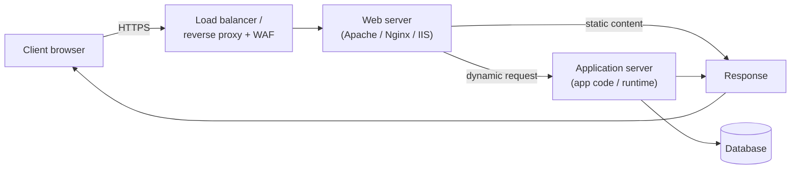
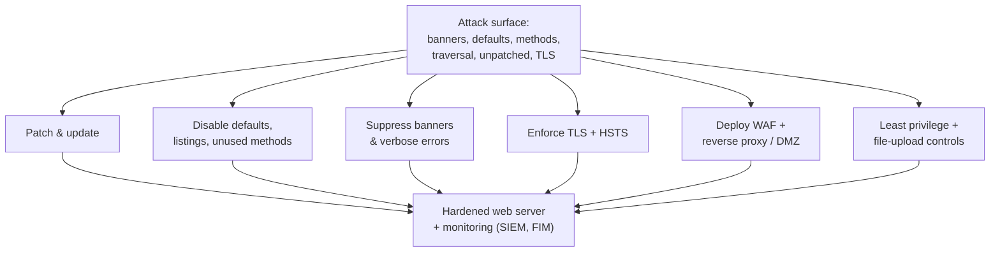

# Module 13 — Hacking Web Servers

A **web server** is the software (and host) that accepts Hypertext Transfer Protocol (HTTP/HTTPS) requests and returns web content — for example Apache HTTP Server, Nginx, or Microsoft Internet Information Services (IIS). This module looks at the web server as **infrastructure**: its architecture, the misconfigurations and weaknesses attackers target, and how to harden it. (The next module, [14-hacking-web-applications.md](14-hacking-web-applications.md), covers the *application* running on top.)

> All techniques here are described **conceptually for understanding and defense**. Attacking web servers you do not own is illegal and is permitted **only with explicit written authorization**. See [../00-overview/what-is-ceh.md](../00-overview/what-is-ceh.md).

## Learning objectives

- Describe web-server architecture and where it sits in the request path.
- Distinguish web-server attacks (the platform) from web-application attacks (the code).
- Identify common misconfigurations and attack concepts: default credentials, directory traversal, unpatched software, verbose errors, and HTTP method abuse.
- Apply countermeasures: hardening, patch management, **Web Application Firewall (WAF)**, and Transport Layer Security (TLS).

## Web-server architecture

A typical request flows through several tiers. The **web server** serves static content and forwards dynamic requests to an **application server**, which uses a **database**.

Distinguishing the layers matters: a **web-server** attack targets the platform (the server software, its configuration, modules, and the operating system); a **web-application** attack targets the custom code (input handling, authentication logic). They overlap, but the defenses differ.

## Why web servers are attacked

Web servers are exposed to the internet by design, run complex software, and often host valuable data or act as a foothold into the internal network. Attackers seek **information disclosure**, **defacement**, **malware delivery to visitors**, **data theft**, or a **pivot** deeper into the network.

## Common misconfigurations and attack concepts

| Weakness | What it is | Risk |
| --- | --- | --- |
| **Default / weak credentials** | Admin consoles or panels left at vendor defaults | Full server takeover |
| **Unpatched software** | Known Common Vulnerabilities and Exposures (CVE) in the server, modules, or OS | Remote exploitation |
| **Directory traversal / path traversal** | `../` sequences escaping the web root to read files outside it | Disclosure of system/config files |
| **Directory listing enabled** | Server lists files when no index page exists | Exposure of files not meant to be public |
| **Verbose error messages / banners** | Stack traces and version banners leak internals | Aids fingerprinting and targeting |
| **Dangerous HTTP methods** | `PUT`, `DELETE`, `TRACE` enabled unnecessarily | File upload, cross-site tracing |
| **Webroot / source exposure** | Backups, `.git` folders, config files left in webroot | Secret and source-code leakage |
| **Misconfigured TLS** | Weak ciphers, expired/self-signed certs, no HSTS | Eavesdropping, downgrade attacks |
| **Webroot file upload abuse** | Uploaded files served/executed as code | **Web shell** (remote command execution) |

Attackers typically **fingerprint** the server first (banner grabbing to learn product and version), then look for a matching known vulnerability or misconfiguration. A successful compromise often ends in a **web shell** — a script the attacker uploads to run commands on the server.

## Tools (purpose only)

| Tool | Purpose |
| --- | --- |
| **Nikto** | Open-source web-server scanner that checks for known misconfigurations, dangerous files, and outdated software — used in **authorized** assessments and by defenders to find their own gaps. |
| **Nmap** (with HTTP scripts) | Service/version detection and HTTP enumeration to identify server software and exposed features. |
| **OWASP ZAP / Burp Suite** | Intercepting proxies for examining requests/responses, headers, and methods. |
| **Defensive: SSL/TLS testers** (e.g., testssl.sh, SSL Labs) | Validate certificate, protocol, and cipher configuration. |

This hub names tools and their purpose only; it does not provide exploitation procedures or web-shell code.

## Countermeasures / Defense

Web-server defense is mostly disciplined operations — **harden, patch, restrict, and monitor**:

- **Patch management.** Keep the server software, modules/plugins, runtime, and OS current; track CVEs for your stack. Unpatched software is the most common server-level entry point.
- **Hardening / minimize attack surface.** Remove default accounts, sample apps, and unused modules; disable **directory listing**; disable unneeded **HTTP methods**; restrict admin interfaces to trusted networks.
- **Suppress information leakage.** Turn off version banners and verbose errors; serve generic error pages; keep backups, `.git`, and config files **out of the webroot**.
- **Least privilege.** Run the server as a low-privilege account in a sandbox/container; isolate the web tier from the database tier.
- **TLS done right.** Enforce HTTPS with strong ciphers and valid certificates; enable **HTTP Strict Transport Security (HSTS)**; redirect HTTP to HTTPS.
- **Web Application Firewall (WAF).** Filter malicious requests (traversal attempts, known exploit patterns) in front of the server as a virtual-patching and defense-in-depth layer.
- **Reverse proxy / DMZ placement.** Put the server in a demilitarized zone (DMZ) behind a reverse proxy and firewall; never expose the database directly.
- **Security headers.** Set defensive HTTP response headers (e.g., `Content-Security-Policy`, `X-Content-Type-Options`, `X-Frame-Options`/frame controls).
- **File-upload controls.** Validate type/size, store outside the webroot, and never execute uploaded files — to prevent web shells.
- **Logging and monitoring.** Centralize access/error logs to a SIEM; alert on traversal patterns, error spikes, and new files in the webroot (file-integrity monitoring).
- **Configuration management / baselines.** Apply hardening benchmarks (e.g., CIS Benchmarks) and detect drift.

> For a sysadmin: this is familiar territory reframed for attackers. The same hygiene that keeps a server stable — patching, removing defaults, least privilege, good logging — is exactly what blocks web-server attacks. Add a WAF and correct TLS, and you have covered most of this module.

## Exam tips

- Separate **web-server** attacks (platform/config/OS) from **web-application** attacks (custom code).
- **Directory/path traversal** uses `../` to escape the webroot; the fix is input validation plus webroot confinement.
- **Banner grabbing / fingerprinting** identifies server product and version — countered by **suppressing banners and errors**.
- Disable unused **HTTP methods** (`PUT`, `DELETE`, `TRACE`) and **directory listing**.
- A **web shell** is an uploaded script giving command execution; prevent it with strict **file-upload controls** and not executing the upload directory.
- Top countermeasures: **patching**, **hardening (remove defaults, minimize surface)**, **WAF**, and **correct TLS + HSTS**.

## Sources

- EC-Council, Certified Ethical Hacker (CEH) v13 — Module on Hacking Web Servers — https://www.eccouncil.org/train-certify/certified-ethical-hacker-ceh/
- OWASP, Web Server / Configuration testing guidance (Web Security Testing Guide) — https://owasp.org/www-project-web-security-testing-guide/
- NIST SP 800-44 Version 2, Guidelines on Securing Public Web Servers — https://csrc.nist.gov/pubs/sp/800/44/ver2/final
- MITRE ATT&CK, Server Software Component: Web Shell (T1505.003) — https://attack.mitre.org/techniques/T1505/003/
- Center for Internet Security (CIS), CIS Benchmarks (Apache, Nginx, IIS hardening) — https://www.cisecurity.org/cis-benchmarks
- RFC 9110, HTTP Semantics (methods) — https://www.rfc-editor.org/rfc/rfc9110
