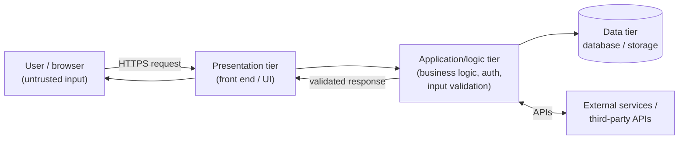
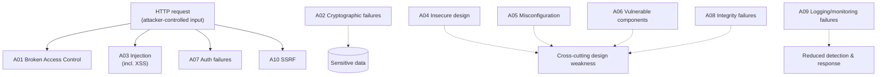

# Module 14 — Hacking Web Applications

A **web application** is the custom code that runs on top of a web server to deliver dynamic, interactive functionality — logins, shopping carts, dashboards, Application Programming Interfaces (APIs). Because this code processes attacker-controlled input and handles sensitive data, it is one of the largest attack surfaces in any organization. This module covers web-application architecture, the attack categories CEH expects, and the **OWASP Top 10** as the industry reference for the most critical risks.

> All techniques here are described **conceptually for understanding and defense**. Testing web applications you do not own is illegal and is permitted **only with explicit written authorization**. See [../00-overview/what-is-ceh.md](../00-overview/what-is-ceh.md). For the underlying platform, see [13-hacking-web-servers.md](13-hacking-web-servers.md).

## Learning objectives

- Describe web-application architecture and the request flow through its tiers.
- Explain the major attack categories at a concept level (injection, broken authentication, broken access control, XSS, etc.).
- List and explain the **OWASP Top 10** (2021) risk categories.
- Apply countermeasures: secure coding, input validation and output encoding, authentication/session controls, and a **Web Application Firewall (WAF)**.

## Web-application architecture

Most web apps follow a **three-tier** model. Trust must never be placed in the client, because everything from the browser is attacker-controllable.

The **logic tier** is where security decisions belong — authentication, authorization, validation, and encoding — because the client can be bypassed or tampered with entirely.

## Web-application attack categories (concept)

| Category | Concept | Defensive focus |
| --- | --- | --- |
| **Injection** (e.g., SQL injection, command injection) | Untrusted input is interpreted as code/commands by an interpreter | Parameterized queries; never build commands from raw input |
| **Cross-Site Scripting (XSS)** | Attacker script runs in another user's browser | Output encoding; `HttpOnly` cookies; Content Security Policy (CSP) |
| **Broken access control** | Users reach data/functions they should not (e.g., changing an ID in a URL to view another account) | Enforce authorization server-side on every request |
| **Broken authentication / session management** | Weak login, credential stuffing, predictable/stolen sessions | MFA, strong session IDs, secure cookie flags |
| **Cross-Site Request Forgery (CSRF)** | Tricks a logged-in user's browser into making an unwanted request | Anti-CSRF tokens; `SameSite` cookies |
| **Security misconfiguration** | Insecure defaults, verbose errors, open cloud storage | Hardening, baselines, least privilege |
| **Insecure deserialization / unsafe object handling** | Hostile serialized data triggers code execution or logic abuse | Avoid native deserialization of untrusted data; integrity checks |
| **Server-Side Request Forgery (SSRF)** | App is coerced into making requests to internal/unintended targets | Allow-list outbound destinations; block internal ranges |

## The OWASP Top 10 (2021)

The **Open Worldwide Application Security Project (OWASP) Top 10** is a community-driven, periodically updated awareness document listing the most critical web-application security risks. The current published edition is **2021**. (OWASP updates it periodically; always confirm the latest edition on the OWASP site.)

| # | 2021 category | What it covers (concept) |
| --- | --- | --- |
| **A01** | **Broken Access Control** | Users acting outside their permissions (the top risk in 2021). |
| **A02** | **Cryptographic Failures** | Weak/missing encryption exposing sensitive data (formerly "Sensitive Data Exposure"). |
| **A03** | **Injection** | Untrusted input interpreted as a command/query; **XSS is included here in 2021**. |
| **A04** | **Insecure Design** | Missing or flawed security controls at the design stage (new in 2021). |
| **A05** | **Security Misconfiguration** | Insecure defaults, incomplete hardening, verbose errors. |
| **A06** | **Vulnerable and Outdated Components** | Using libraries/frameworks with known vulnerabilities. |
| **A07** | **Identification and Authentication Failures** | Weak authentication and session management. |
| **A08** | **Software and Data Integrity Failures** | Unverified updates, insecure deserialization, untrusted CI/CD pipelines (new in 2021). |
| **A09** | **Security Logging and Monitoring Failures** | Inability to detect, alert on, and respond to breaches. |
| **A10** | **Server-Side Request Forgery (SSRF)** | App tricked into requesting attacker-chosen URLs (new in 2021, community-selected). |

> Exam note: the OWASP Top 10 is *risk categories*, not a ranked list of individual vulnerabilities. In **2021**, **Broken Access Control** moved to **A01**, and **XSS was merged into Injection (A03)**. Categories such as **Insecure Design (A04)**, **Software and Data Integrity Failures (A08)**, and **SSRF (A10)** were introduced/restructured. Verify the current edition on OWASP.

## Tools (purpose only)

| Tool | Purpose |
| --- | --- |
| **OWASP ZAP (Zed Attack Proxy)** | Free, open-source web-app scanner/intercepting proxy; used in **authorized** testing and by developers to find issues early. |
| **Burp Suite** | Intercepting proxy and testing platform for analyzing requests, sessions, and input handling under authorization. |
| **sqlmap** | Tool that demonstrates SQL-injection impact in **authorized** tests; named for awareness only — no procedures provided. |
| **Defensive: SAST/DAST/SCA** | Static and Dynamic Application Security Testing and Software Composition Analysis to find code flaws and vulnerable dependencies in the pipeline. |

This hub names tools and their purpose only; it does not provide payloads, injection strings, or exploitation steps.

## Countermeasures / Defense

Web-app security is built into the **Software Development Life Cycle (SDLC)**, not bolted on at the end:

- **Secure coding and a secure SDLC.** Threat-model during design (counters **Insecure Design**), do security code review, and train developers.
- **Input validation (allow-list).** Validate all input server-side against expected type, length, and format; reject by default. Never trust the client.
- **Output encoding / context-aware escaping.** Encode data for the context it is rendered in (HTML, attribute, JavaScript, URL) to stop **XSS**.
- **Parameterized queries / prepared statements.** Separate code from data so input cannot become a command — the definitive fix for **injection**.
- **Enforce access control server-side.** Deny by default; check authorization on every request and object reference (counters **Broken Access Control**).
- **Strong authentication and session management.** MFA, rate limiting/lockout, strong random session IDs, and `Secure`/`HttpOnly`/`SameSite` cookies (see [11-session-hijacking.md](11-session-hijacking.md)).
- **Anti-CSRF tokens** plus `SameSite` cookies.
- **Proper cryptography.** TLS in transit, strong hashing for stored passwords (e.g., a slow, salted algorithm), and secrets kept out of source (counters **Cryptographic Failures**).
- **Manage dependencies.** Track and patch third-party components; use SCA (counters **Vulnerable and Outdated Components**).
- **Secure configuration and headers.** Harden defaults, disable verbose errors, and set defensive headers including **Content-Security-Policy (CSP)**.
- **SSRF defenses.** Allow-list outbound destinations and block requests to internal address ranges and metadata endpoints.
- **Logging, monitoring, and integrity.** Log security events, alert on anomalies (counters **Logging/Monitoring Failures**), and verify the integrity of updates/pipelines (counters **Software and Data Integrity Failures**).
- **Web Application Firewall (WAF).** A defense-in-depth layer that filters common attack patterns and provides virtual patching — *complementing*, not replacing, secure code.

> For a sysadmin: the WAF is the control closest to your existing skill set, but the durable fixes live in the code — **parameterized queries**, **output encoding**, and **server-side access control**. A WAF buys time; secure code removes the flaw.

## Exam tips

- Know the **OWASP Top 10 (2021)** order, especially **A01 Broken Access Control** at the top and that **XSS is folded into A03 Injection**.
- Recognize the **2021 additions/changes**: **A04 Insecure Design**, **A08 Software and Data Integrity Failures**, **A10 SSRF**.
- **Injection** (including SQL injection) is fixed by **parameterized queries**; **XSS** by **output encoding** + `HttpOnly` + CSP.
- **CSRF** is countered by **anti-CSRF tokens** and **`SameSite`** cookies; do not confuse CSRF (forces the victim's browser to act) with XSS (runs script in the victim's browser).
- **Broken access control** = enforce authorization **server-side** on every request/object.
- A **WAF** is **defense-in-depth**, not a substitute for secure coding.
- OWASP Top 10 = **risk categories** (awareness document), not a vulnerability scanner ranking.

## Sources

- EC-Council, Certified Ethical Hacker (CEH) v13 — Module on Hacking Web Applications — https://www.eccouncil.org/train-certify/certified-ethical-hacker-ceh/
- OWASP, OWASP Top 10:2021 — https://owasp.org/Top10/
- OWASP, Web Security Testing Guide — https://owasp.org/www-project-web-security-testing-guide/
- OWASP, Cross-Site Scripting (XSS) — https://owasp.org/www-community/attacks/xss/
- OWASP, SQL Injection — https://owasp.org/www-community/attacks/SQL_Injection
- OWASP, Cross-Site Request Forgery (CSRF) — https://owasp.org/www-community/attacks/csrf
- OWASP, Cheat Sheet Series (Input Validation, XSS Prevention, SQL Injection Prevention) — https://cheatsheetseries.owasp.org/
- NIST SP 800-95, Guide to Secure Web Services — https://csrc.nist.gov/pubs/sp/800/95/final
