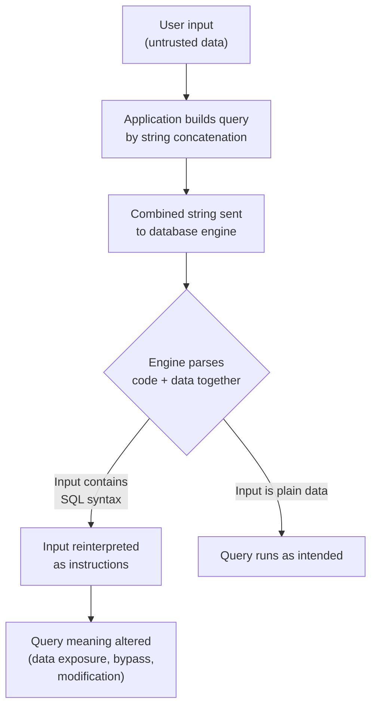
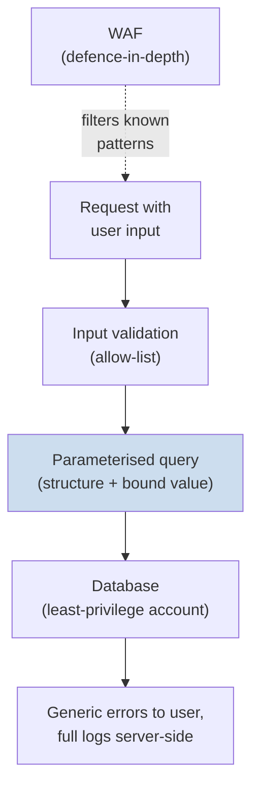

# SQL Injection (SQLi)

**Structured Query Language (SQL) injection** is a web-application attack in which an attacker inserts (injects) malicious SQL fragments into input that an application passes into a database query. When the application builds its query by gluing user input directly into the command text, the database cannot tell *data* from *instructions* — so attacker-supplied "data" gets executed as part of the query.

This page explains **conceptually** why SQLi happens and how to defend against it. It is educational and defence-oriented. Probing or exploiting any system you do not own is illegal without **explicit written authorisation** and a defined scope (see [legal-and-ethics.md](../00-overview/legal-and-ethics.md)). No working exploit recipe is provided here.

## Learning objectives

- Explain what SQL injection is and the root cause (mixing untrusted data with query code).
- Distinguish the conceptual SQLi categories: in-band (error-based, union-based), blind (boolean/time-based), and out-of-band.
- Describe the impact of a successful SQLi.
- Apply the primary countermeasures: parameterised queries / prepared statements, input validation, least privilege, and a Web Application Firewall (WAF).

## First principles: why SQLi arises

A database query is a string of *instructions*. Consider a login lookup written by concatenating user input into the query text. Conceptually:

```
query = "SELECT * FROM users WHERE name = '" + userInput + "'"
```

The flaw is structural: the developer **intended** `userInput` to be pure data (a username), but the database receives one combined string and parses the whole thing as code-plus-data. If the input itself contains SQL syntax (a quote, a comment marker, a boolean clause), it changes the *meaning* of the query rather than just filling in a value. This is the same class of bug as command injection and Cross-Site Scripting (XSS): **untrusted input crossing a code/data boundary without separation.**

The illustration below shows *why* it occurs — the boundary collapse — not how to weaponise it.



## Types of SQL injection (concept level)

CEH groups SQLi by **how the attacker receives the results**, not by a specific payload.

| Category | How information returns | Idea |
| --- | --- | --- |
| **In-band — error-based** | Through database error messages shown by the app | Verbose errors leak schema details and confirm injectable points |
| **In-band — union-based** | Through the application's normal output | A query is manipulated to append attacker-chosen result rows into the page |
| **Blind — boolean-based** | Indirectly, via true/false differences in the response | The app shows different output for true vs. false conditions, leaking data one bit at a time |
| **Blind — time-based** | Indirectly, via response delays | The injected condition causes the database to pause; a slow reply means "true" |
| **Out-of-band (OOB)** | Through a separate channel (e.g., a DNS or HTTP request from the database server) | Used when results cannot return in the response itself; relies on the database making outbound network calls |

> For a systems administrator: "blind" simply means the attacker cannot read the data directly, so they infer it from side effects (page behaviour or timing) — like guessing a locked room's contents from the sounds behind the door.

### Common SQLi-related attack goals

- **Authentication bypass** — manipulating a login query so it always evaluates true.
- **Data exfiltration** — reading rows the user should not see (e.g., other accounts).
- **Data tampering / destruction** — modifying or deleting records.
- **Privilege escalation / further compromise** — if the database account is over-privileged, an attacker may reach the operating system or other databases.

## Impact

A single injectable parameter can expose an entire database. SQLi consistently appears in the **OWASP (Open Worldwide Application Security Project) Top 10** under the broader "Injection" category, reflecting both its prevalence and severity. Consequences include data breaches, account takeover, regulatory penalties, and full server compromise when the database is over-privileged.

## Tools (purpose only)

Named for awareness; use only against authorised targets. No usage steps are given.

| Tool | Purpose |
| --- | --- |
| **sqlmap** | Automated detection and analysis of SQLi flaws (commonly used in authorised testing) |
| **OWASP ZAP / Burp Suite** | Web proxy and scanner that can flag potential injection points during assessments |
| **Static Application Security Testing (SAST) tools** | Scan source code for unsafe query construction patterns |
| **Dynamic Application Security Testing (DAST) tools** | Probe a running application for injection responses |

## Countermeasures / Defence

> Legal note: testing for SQLi is permitted **only** with explicit written authorisation and a defined scope.

The fix is to **restore the code/data boundary** the application broke. Defences, in priority order:

1. **Parameterised queries / prepared statements (primary defence).** The query structure is sent to the database first with placeholders; user values are bound separately as *data*. The database never parses user input as instructions, so the boundary cannot collapse. Conceptually:

   ```
   SELECT * FROM users WHERE name = ?      -- structure fixed first
   bind(?, userInput)                       -- value supplied as pure data
   ```

   This is the single most effective control. Use the safe Application Programming Interface (API) provided by your data-access library; never concatenate input into query strings.

2. **Stored procedures (when written safely).** Effective only if they also use parameter binding internally — a stored procedure that concatenates input is still vulnerable.

3. **Input validation (allow-listing).** Validate type, length, format, and range; prefer allow-lists ("only digits") over block-lists. This is a *defence-in-depth* layer, **not** a substitute for parameterisation, because escaping/filtering alone is error-prone.

4. **Least privilege for the database account.** The application should connect with an account that has only the rights it needs (e.g., read/write specific tables, no schema or administrative rights). This limits blast radius if injection succeeds. See [05-vulnerability-analysis.md](05-vulnerability-analysis.md) for related hardening concepts.

5. **Suppress detailed errors.** Show generic error pages to users; log full details server-side only. This blunts error-based SQLi.

6. **Web Application Firewall (WAF).** Inspects HyperText Transfer Protocol (HTTP) traffic and blocks common injection patterns. A WAF is a useful *additional* layer but is bypassable; never rely on it as the primary control.

7. **Use a safe Object-Relational Mapping (ORM) layer** and keep frameworks patched.



## Exam tips

- The **root cause** of SQLi is untrusted input mixed with query code; the **primary fix** is parameterised queries / prepared statements. Expect this pairing on the exam.
- **Input validation and WAFs are defence-in-depth, not the main fix.** If a question offers both "parameterised queries" and "input validation/WAF," choose parameterised queries as the strongest control.
- "**Blind SQLi**" = no direct data in the response; **boolean-based** infers from true/false output differences, **time-based** infers from delays.
- **Out-of-band** SQLi uses a separate channel (e.g., DNS/HTTP callback) when results cannot return inline.
- **Least privilege** on the database account limits damage but does not prevent the injection itself.
- SQLi falls under **OWASP Top 10 "Injection."**

## Sources

- OWASP, SQL Injection — https://owasp.org/www-community/attacks/SQL_Injection
- OWASP Cheat Sheet Series, SQL Injection Prevention Cheat Sheet — https://cheatsheetseries.owasp.org/cheatsheets/SQL_Injection_Prevention_Cheat_Sheet.html
- OWASP Top 10 (A03:2021 — Injection) — https://owasp.org/Top10/A03_2021-Injection/
- EC-Council, CEH v13 program (SQL Injection module) — https://www.eccouncil.org/train-certify/certified-ethical-hacker-ceh/
- [../reference/acronyms.md](../reference/acronyms.md)
