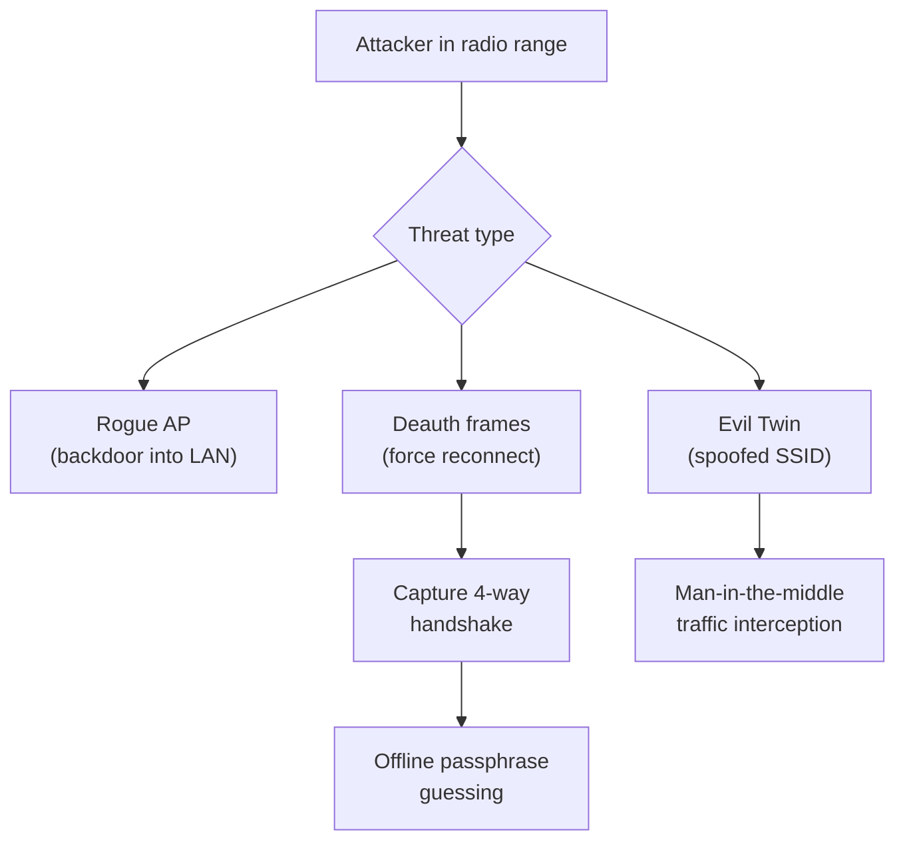
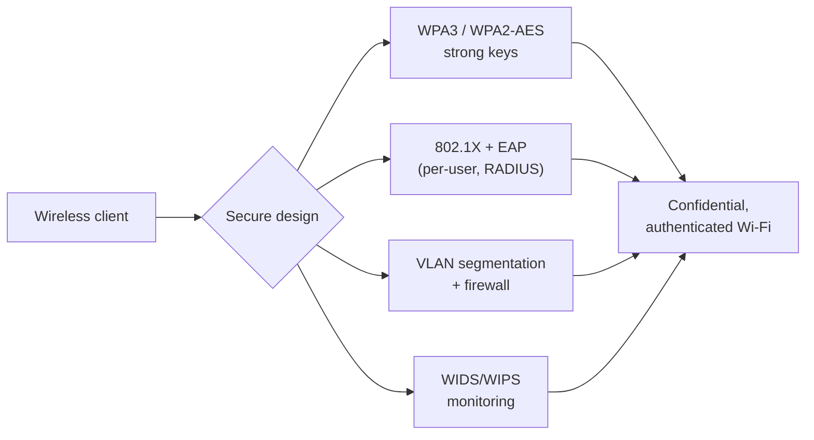

# Hacking Wireless Networks

Wireless networks broadcast over the air, so anyone within radio range can *hear* the traffic — there is no cable to physically protect. Wireless security is therefore about **encrypting** what is broadcast and **authenticating** who may join. This page covers the Wi-Fi security protocols (WEP, WPA, WPA2, WPA3) at a conceptual level, the main wireless threats, and how to defend against them.

This is defence-oriented exam preparation. Capturing, cracking, or joining networks you do not own is illegal without **explicit written authorisation** and a defined scope (see [legal-and-ethics.md](../00-overview/legal-and-ethics.md)). No cracking commands or capture recipes are given.

## Learning objectives

- Compare the Wi-Fi security protocols WEP, WPA, WPA2, and WPA3 and explain why each succeeded the last.
- Explain conceptually why older encryption (WEP, WPA-TKIP) is weak.
- Identify the main wireless threats: rogue access point, evil twin, deauthentication, and offline key cracking.
- Describe the WPA2 4-way handshake at a conceptual level.
- Apply countermeasures: WPA3, strong keys, 802.1X / Extensible Authentication Protocol (EAP), and segmentation.

## Wireless basics

A **Wi-Fi network** is built around an **Access Point (AP)** that bridges wireless clients to the wired network. Each network is identified by its **Service Set Identifier (SSID)** — the network name. Devices associate with the AP, then (on a secured network) prove they know a key before exchanging data. Because the medium is shared air, two properties matter:

- **Confidentiality** — traffic must be encrypted so eavesdroppers cannot read it.
- **Authentication** — only authorised devices/users should be able to join.

## The Wi-Fi security protocols

| Protocol | Year (approx.) | Encryption | Status | Key weakness (concept) |
| --- | --- | --- | --- | --- |
| **WEP** (Wired Equivalent Privacy) | 1997 | RC4 stream cipher | **Broken — do not use** | Tiny, reused **Initialisation Vectors (IVs)** leak the key; recoverable in minutes |
| **WPA** (Wi-Fi Protected Access) | 2003 | RC4 + **TKIP** (Temporal Key Integrity Protocol) | **Deprecated** | A stopgap over WEP hardware; TKIP has known flaws |
| **WPA2** | 2004 | **AES-CCMP** (Advanced Encryption Standard) | Widely deployed; ageing | Strong cipher, but the Pre-Shared Key (PSK) handshake can be captured for **offline** guessing; KRACK weakness in the handshake |
| **WPA3** | 2018 | AES with **SAE** (Simultaneous Authentication of Equals) | **Current best practice** | Adds forward secrecy and resistance to offline guessing |

### Why WEP is broken (concept)

WEP uses the RC4 cipher with a short **Initialisation Vector (IV)** — a value meant to make each packet's encryption unique. The IV space is so small that values **repeat** on a busy network. Repeated IVs reveal statistical relationships that let an attacker recover the key by passively collecting enough frames. The lesson: **the cipher's strength is undone by poor key/IV management.** WEP must never be used.

### Why the WPA2-PSK handshake is attackable (concept)

In **WPA2-Personal (PSK)**, every device shares one passphrase. When a client joins, the AP and client run a **4-way handshake** to prove both know the key and to derive fresh session keys. An attacker within range can **capture** this handshake (often after forcing a reconnection with a **deauthentication** frame) and then guess the passphrase **offline** — testing candidate passwords against the captured handshake without touching the network again. Weak or common passphrases fall quickly; long random ones resist guessing. **WPA2-Enterprise (802.1X)** avoids a shared passphrase entirely (see below).

## The WPA2 4-way handshake (conceptual)

The handshake confirms both sides know the **Pairwise Master Key (PMK)** (derived from the passphrase) and derives a per-session **Pairwise Transient Key (PTK)** for encrypting traffic. Nonces are random numbers used once.

```mermaid
sequenceDiagram
    participant C as Client (supplicant)
    participant A as Access Point (authenticator)
    Note over C,A: Both already share the PMK<br/>(from passphrase or 802.1X)
    A->>C: 1. ANonce (AP random number)
    Note over C: Derives PTK from<br/>PMK + ANonce + SNonce + MACs
    C->>A: 2. SNonce + Message Integrity Code (MIC)
    Note over A: Derives the same PTK,<br/>verifies MIC
    A->>C: 3. Install key + Group key (GTK) + MIC
    C->>A: 4. Acknowledgement
    Note over C,A: Session keys installed;<br/>encrypted data can flow
```

> Conceptually, the 4-way handshake is a mutual "prove you know the secret without sending it" exchange that also produces fresh keys for this session. CEH expects you to recognise this is the material an attacker captures for **offline** PSK guessing.

## Wireless threats

| Threat | What it is | Why it works |
| --- | --- | --- |
| **Rogue Access Point** | An unauthorised AP plugged into the corporate network | Creates an unmonitored backdoor into the wired LAN |
| **Evil Twin** | A fake AP broadcasting a legitimate-looking SSID | Clients auto-connect to the familiar name; attacker intercepts traffic |
| **Deauthentication / disassociation** | Forged management frames that kick clients off | Forces reconnection, exposing the handshake; also a denial-of-service |
| **Offline key cracking** | Guessing the PSK from a captured handshake | Weak passphrases are quickly recovered offline |
| **WPS abuse** | Attacks against Wi-Fi Protected Setup PIN | The 8-digit PIN can be guessed; disable WPS |
| **KRACK** | Key Reinstallation Attack against the WPA2 handshake | Forces nonce reuse, weakening encryption (patched in updated devices) |



## Tools (purpose only)

Named for awareness; authorised testing only. No usage steps are given.

| Tool | Purpose |
| --- | --- |
| **Aircrack-ng suite** | Wireless monitoring, handshake capture, and offline key analysis in authorised tests |
| **Kismet** | Passive wireless detection and rogue-AP discovery |
| **Wireshark** | Packet capture and protocol analysis (including 802.11 frames) |
| **Wireless Intrusion Detection/Prevention System (WIDS/WIPS)** | Defensive detection of rogue/evil-twin APs and deauth floods |

## Countermeasures / Defence

> Legal note: wireless testing is permitted **only** with explicit written authorisation and a defined scope.

1. **Use WPA3 where supported; WPA2-AES at minimum.** WPA3's SAE handshake resists offline guessing and adds forward secrecy. **Never use WEP or WPA-TKIP.** Disable mixed/legacy modes if not required.
2. **Use strong, long, random pre-shared keys** (for WPA2/WPA3-Personal). Length defeats offline guessing; avoid dictionary words.
3. **Prefer WPA2/WPA3-Enterprise with 802.1X + EAP** for organisations. **IEEE 802.1X** is port-based network access control: each user authenticates individually (e.g., via certificates) to a **RADIUS** (Remote Authentication Dial-In User Service) server, so there is **no shared passphrase to crack**. See [16-hacking-wireless-networks.md](./16-hacking-wireless-networks.md) cross-references and network access control concepts.
4. **Disable WPS** (Wi-Fi Protected Setup) — the PIN is brute-forceable.
5. **Network segmentation.** Put guest and untrusted wireless on separate Virtual Local Area Networks (VLANs) isolated from sensitive systems; place a firewall between wireless and the core network.
6. **Deploy WIDS/WIPS** to detect rogue APs, evil twins, and deauth floods; maintain an inventory of authorised APs.
7. **Use 802.11w (Protected Management Frames)** to blunt deauthentication/disassociation attacks.
8. **Patch APs and clients** (e.g., against KRACK), reduce signal bleed beyond the premises, and change default AP admin credentials.



## Exam tips

- Order of strength: **WEP < WPA(TKIP) < WPA2(AES) < WPA3**. WEP and WPA-TKIP are **deprecated/broken**.
- **WEP's flaw = weak/reused Initialisation Vectors (IVs)** with RC4.
- **WPA2-PSK** is attacked by **capturing the 4-way handshake** and guessing the passphrase **offline** — hence the value of long random keys.
- **WPA3** uses **SAE** (also called Dragonfly) and resists offline guessing; **WPA2** uses **AES-CCMP**.
- **Evil twin** = spoofed SSID/fake AP; **rogue AP** = unauthorised AP on your network. Know the difference.
- **802.1X / WPA2-Enterprise** removes the shared passphrase by authenticating each user (often to **RADIUS**).
- **KRACK** targets the handshake (nonce reuse); **WPS** PINs are brute-forceable — disable WPS.

## Sources

- Wi-Fi Alliance, Security (WPA3) — https://www.wi-fi.org/discover-wi-fi/security
- NIST SP 800-153, Guidelines for Securing Wireless Local Area Networks (WLANs) — https://csrc.nist.gov/pubs/sp/800/153/final
- IEEE 802.11 standard family (Wi-Fi) — https://standards.ieee.org/ieee/802.11/7028/
- KRACK Attacks (Key Reinstallation) — https://www.krackattacks.com/
- EC-Council, CEH v13 program (Hacking Wireless Networks module) — https://www.eccouncil.org/train-certify/certified-ethical-hacker-ceh/
- [../reference/acronyms.md](../reference/acronyms.md)
