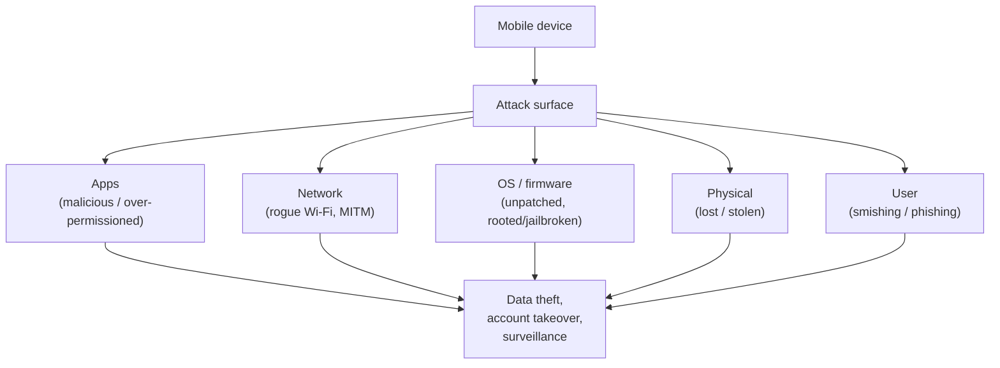
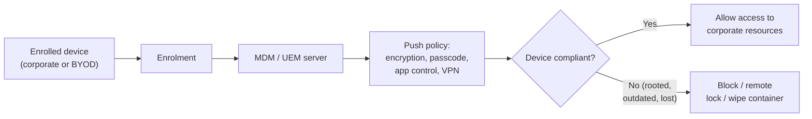

# Hacking Mobile Platforms

Smartphones combine a personal computer, a camera, a microphone, location sensors, and corporate data in one always-connected device. That makes them a high-value target. This page covers mobile threats on **Android** and **iOS**, common attack vectors, the **OWASP Mobile Top 10**, and **Mobile Device Management (MDM)** — plus the defences a sysadmin needs to know.

This is defence-oriented exam preparation. Attacking, rooting, or installing software on devices you do not own or administer requires **explicit written authorisation** (see [legal-and-ethics.md](../00-overview/legal-and-ethics.md)). No exploit steps are provided.

## Learning objectives

- Contrast the **Android** and **iOS** security models at a high level.
- Identify common mobile attack vectors (malicious apps, smishing, insecure Wi-Fi, rooting/jailbreaking).
- Summarise the **OWASP Mobile Top 10** risk categories.
- Explain what **Mobile Device Management (MDM)** does and how it enforces policy.
- Apply mobile countermeasures in an enterprise context.

## Android vs. iOS security models

| Aspect | Android | iOS |
| --- | --- | --- |
| Ecosystem | Open; multiple app stores and sideloading possible | Closed; primarily the Apple App Store |
| Isolation | App **sandboxing**; Linux user-per-app permissions | App **sandboxing**; tighter platform controls |
| Code signing | Apps signed; Google Play Protect screens apps | Mandatory Apple code signing; strict review |
| Privilege bypass | **Rooting** removes built-in restrictions | **Jailbreaking** removes built-in restrictions |
| Update model | Varies by manufacturer/carrier (fragmentation) | Centralised, broad, prompt updates |

> Both platforms rely on **sandboxing** — each app runs isolated so it cannot freely read other apps' data. **Rooting** (Android) and **jailbreaking** (iOS) deliberately break these protections, which removes the security guarantees the platform depends on.

## Common attack vectors

| Vector | Description |
| --- | --- |
| **Malicious / repackaged apps** | Trojanised apps (often from third-party stores or sideloading) request excessive permissions or hide spyware |
| **Smishing / phishing** | SMS or messaging-app lures that harvest credentials or push malware links |
| **Insecure / rogue Wi-Fi** | Public or evil-twin networks intercept traffic (links to [16-hacking-wireless-networks.md](./16-hacking-wireless-networks.md)) |
| **Rooting / jailbreaking** | Removes sandbox and update protections, expanding the attack surface |
| **Outdated OS / unpatched apps** | Known vulnerabilities remain exploitable |
| **Excessive permissions** | Apps over-collecting contacts, location, camera, or microphone |
| **Lost or stolen devices** | Physical access to unencrypted or unlocked devices |
| **Bluetooth / NFC abuse** | Proximity attacks against poorly configured wireless interfaces |

## OWASP Mobile Top 10

The **OWASP Mobile Top 10** is the industry reference for the most critical mobile-app risks. CEH expects familiarity with the categories (the current OWASP Mobile Top 10, 2024):

| ID | Risk |
| --- | --- |
| **M1** | Improper Credential Usage |
| **M2** | Inadequate Supply Chain Security |
| **M3** | Insecure Authentication / Authorization |
| **M4** | Insufficient Input/Output Validation |
| **M5** | Insecure Communication |
| **M6** | Inadequate Privacy Controls |
| **M7** | Insufficient Binary Protections |
| **M8** | Security Misconfiguration |
| **M9** | Insecure Data Storage |
| **M10** | Insufficient Cryptography |

> The exact list and ordering have changed across OWASP releases. For authoritative current wording, always check the OWASP source (linked below); some study materials still cite older versions.

## Mobile Device Management (MDM)

**Mobile Device Management (MDM)** is software that lets an organisation centrally enforce security policy on enrolled devices — whether corporate-owned or **Bring Your Own Device (BYOD)**. It is the cornerstone enterprise control for mobile. MDM is part of the broader **Enterprise Mobility Management (EMM)** / **Unified Endpoint Management (UEM)** category.

Typical MDM capabilities:

- Enforce **passcode/biometric** policy and **device encryption**.
- Push and update apps; restrict or block sideloading and unapproved stores.
- **Containerisation** — separate work data from personal data on BYOD devices.
- **Remote lock and remote wipe** of lost/stolen devices (or just the work container).
- Detect **rooted/jailbroken** devices and block them from corporate resources.
- Enforce VPN, certificate-based authentication, and conditional access.

## Tools (purpose only)

Named for awareness; authorised use only.

| Tool | Purpose |
| --- | --- |
| **MDM/UEM platforms** (e.g., enterprise endpoint managers) | Enforce policy, encryption, and remote wipe |
| **Mobile App Security Testing (MAST) tools** | Static/dynamic analysis of app binaries in authorised assessments |
| **Mobile antivirus / Mobile Threat Defense (MTD)** | Detect malicious apps and risky configurations |
| **Network proxy / analyser** | Inspect app traffic for insecure communication during testing |

## Countermeasures / Defence

> Legal note: testing mobile devices/apps is permitted **only** with explicit written authorisation.

1. **Install apps only from official stores** and review requested permissions; disable sideloading on managed devices.
2. **Keep the OS and apps patched**; retire devices that no longer receive security updates.
3. **Enforce device encryption, strong passcodes/biometrics, and auto-lock** via MDM.
4. **Block rooted/jailbroken devices** from corporate resources (MDM attestation).
5. **Use containerisation/UEM** to separate and protect corporate data on BYOD; enable remote wipe of the work container.
6. **Require encrypted communication** (Transport Layer Security, TLS) and avoid untrusted Wi-Fi; use a VPN. See [16-hacking-wireless-networks.md](./16-hacking-wireless-networks.md).
7. **Apply least-privilege app permissions** and use Mobile Threat Defense to flag malicious apps.
8. **User awareness training** against smishing/phishing.
9. **Developers:** follow the OWASP **Mobile Application Security Verification Standard (MASVS)** — secure storage, strong authentication, certificate validation, and no hard-coded secrets.

## Exam tips

- **Sandboxing** isolates apps; **rooting** (Android) and **jailbreaking** (iOS) break it and remove security guarantees.
- **Android** is more open (sideloading, multiple stores, fragmentation); **iOS** is more closed (mandatory signing, central updates).
- The enterprise control for mobile is **MDM/UEM**: encryption, passcode policy, app control, **remote wipe**, and **containerisation** for BYOD.
- Know the **OWASP Mobile Top 10** exists and a few categories (insecure data storage, insecure communication, insecure authentication). Verify exact wording against OWASP.
- **Smishing** = phishing over SMS/text. **BYOD** = Bring Your Own Device.

## Sources

- OWASP Mobile Top 10 — https://owasp.org/www-project-mobile-top-10/
- OWASP Mobile Application Security (MASVS / MASTG) — https://mas.owasp.org/
- NIST SP 800-124 Rev. 2, Guidelines for Managing the Security of Mobile Devices in the Enterprise — https://csrc.nist.gov/pubs/sp/800/124/r2/final
- Android security model — https://source.android.com/docs/security/features
- Apple Platform Security — https://support.apple.com/guide/security/welcome/web
- EC-Council, CEH v13 program (Hacking Mobile Platforms module) — https://www.eccouncil.org/train-certify/certified-ethical-hacker-ceh/
- [../reference/acronyms.md](../reference/acronyms.md)
