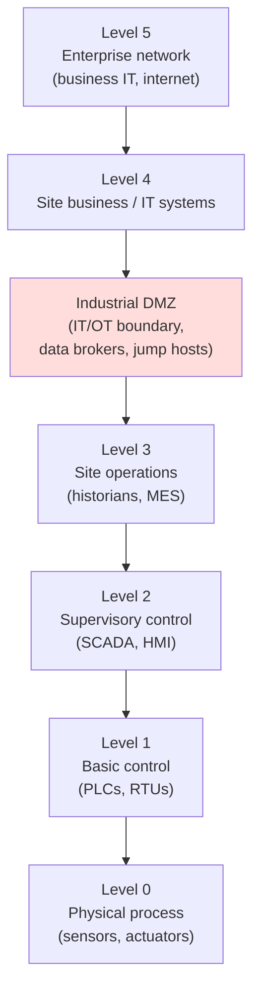
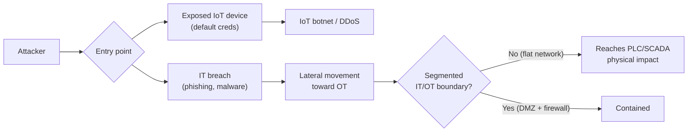

# IoT and OT Hacking

The **Internet of Things (IoT)** is the universe of network-connected everyday devices — cameras, sensors, smart locks, thermostats, medical devices. **Operational Technology (OT)** is the hardware and software that monitors and controls **physical** industrial processes — factory lines, power grids, water treatment, building systems. Both extend the attack surface far beyond traditional IT, often onto devices that were never designed with security in mind. This page covers IoT/OT concepts, common protocols, the attack surface, the **Purdue model**, and defences.

This is defence-oriented exam preparation. Attacks against IoT/OT — especially OT, where impact can be physical and dangerous — require **explicit written authorisation** and extreme care (see [legal-and-ethics.md](../00-overview/legal-and-ethics.md)). No exploit steps are provided.

## Learning objectives

- Define IoT and OT and explain why they are harder to secure than traditional IT.
- Name common IoT/OT protocols and the role of **SCADA**, **PLC**, **HMI**, and **ICS**.
- Describe the **Purdue Enterprise Reference Architecture** model and why segmentation matters.
- Identify the IoT/OT attack surface and common threats.
- Apply countermeasures: segmentation, secure-by-design, and monitoring.

## IoT vs. OT: key terms

| Term | Expansion | Meaning |
| --- | --- | --- |
| **IoT** | Internet of Things | Network-connected consumer/enterprise devices and sensors |
| **OT** | Operational Technology | Systems that control physical industrial processes |
| **ICS** | Industrial Control System | Umbrella term for OT control systems |
| **SCADA** | Supervisory Control and Data Acquisition | Software that monitors/controls geographically distributed industrial processes |
| **PLC** | Programmable Logic Controller | Rugged industrial computer that directly controls machinery |
| **HMI** | Human-Machine Interface | The operator's screen/dashboard for an ICS |
| **RTU** | Remote Terminal Unit | Field device that collects data and relays commands |

### Why IoT/OT is hard to secure

- **Long lifespans, rare patching.** OT equipment may run for decades; downtime is costly, so patches are delayed or never applied.
- **Legacy and proprietary protocols** built for trusted, isolated networks — often with **no authentication or encryption**.
- **Weak defaults.** IoT devices frequently ship with default/hard-coded credentials and exposed services.
- **Availability over confidentiality.** In OT, the priority order is **safety → availability → integrity → confidentiality** — the *reverse* of typical IT (the classic IT priority is confidentiality first). A reboot to patch can halt production or endanger people.
- **Physical consequences.** A compromised valve or breaker can cause real-world damage.

## Common IoT/OT protocols

| Protocol | Domain | Note |
| --- | --- | --- |
| **MQTT** (Message Queuing Telemetry Transport) | IoT messaging | Lightweight publish/subscribe; often unauthenticated if misconfigured |
| **CoAP** (Constrained Application Protocol) | IoT | Web-like protocol for constrained devices |
| **Zigbee / Z-Wave / BLE** | IoT (low-power RF) | Short-range wireless for sensors and home automation |
| **Modbus** | OT/ICS | Very old serial/TCP protocol; **no built-in authentication or encryption** |
| **DNP3** (Distributed Network Protocol 3) | OT (utilities) | Used in electric/water utilities; security is an add-on |
| **OPC UA** | OT | Modern industrial interoperability standard with security features |

> The recurring theme: many IoT/OT protocols **trust whoever can reach them**. They were designed for isolated networks, so simply having network access to a Modbus PLC can mean control over it. Segmentation is therefore the central defence.

## The Purdue model (architecture and segmentation)

The **Purdue Enterprise Reference Architecture** divides an industrial network into **levels**, separating physical process control from enterprise IT. It is the standard mental model for OT segmentation (also reflected in the **ISA/IEC 62443** standard). Traffic should be tightly controlled between levels, especially across the **IT/OT boundary (the DMZ between Level 3 and Level 4)**.

> The key exam idea: the **industrial DMZ (DeMilitarized Zone)** between enterprise IT (Levels 4–5) and operations (Levels 0–3) prevents an internet-borne compromise from reaching PLCs that control physical equipment. Lower levels are closer to the physical process and the most safety-critical.

## Attack surface and threats

| Threat | Description |
| --- | --- |
| **Default / hard-coded credentials** | Devices shipped with known passwords; mass-exploited by IoT botnets |
| **IoT botnets** | Compromised devices conscripted for Distributed Denial-of-Service (DDoS); the **Mirai** botnet is the canonical example |
| **Exposed device/management interfaces** | Web admin panels, Telnet, or protocols reachable from the internet |
| **Unauthenticated control protocols** | Modbus/DNP3 commands accepted from anyone on the network |
| **Firmware tampering** | Malicious or modified firmware persisting on the device |
| **Lateral movement IT → OT** | An IT breach pivots across a flat network into OT |
| **Physical access** | Tampering with field devices or local interfaces |

## Tools (purpose only)

Named for awareness; authorised use only — OT testing demands special caution because probing live equipment can cause physical harm.

| Tool | Purpose |
| --- | --- |
| **Shodan** | Search engine for internet-exposed devices/services (reconnaissance awareness) |
| **Nmap with ICS scripts** | Service/protocol discovery (use read-only/safe scans on OT) |
| **Wireshark** | Capture and analyse IoT/OT protocol traffic (e.g., Modbus) |
| **OT-aware monitoring / IDS** (e.g., passive network monitors) | Detect anomalies without disrupting fragile devices |

## Countermeasures / Defence

> Legal note: IoT/OT testing is permitted **only** with explicit written authorisation; on OT, even scanning can be hazardous — coordinate with engineering and prefer passive techniques.

1. **Network segmentation (primary control).** Separate IoT and OT from IT using VLANs, firewalls, and an **industrial DMZ** per the Purdue model. Restrict cross-level traffic to the minimum needed; never leave a flat network.
2. **Change default credentials and disable unused services/ports** on every device. Many IoT compromises are simply default passwords.
3. **Secure-by-design / secure procurement.** Choose devices that support authentication, encryption, signed firmware, and updates; follow **NIST IoT cybersecurity guidance (e.g., NISTIR 8259)** and **ISA/IEC 62443** for OT.
4. **Asset inventory and visibility.** You cannot protect what you cannot see; maintain a complete IoT/OT asset register.
5. **Patch and firmware management** where feasible; use **virtual patching / compensating controls** (e.g., firewall rules) when devices cannot be patched.
6. **Continuous monitoring with OT-aware IDS.** Use **passive** monitoring to detect anomalies without disrupting fragile equipment.
7. **No direct internet exposure.** Keep management interfaces off the public internet; use jump hosts and a VPN; do not expose devices to **Shodan**-style discovery.
8. **Physical security and least privilege** for field devices and engineering workstations.

## Exam tips

- **OT priorities are safety and availability first** — the reverse of IT's confidentiality-first model. Patching is hard because downtime/safety matters.
- Know the acronyms: **ICS** (umbrella), **SCADA** (supervisory monitoring/control), **PLC** (controls machinery), **HMI** (operator interface).
- **Modbus and DNP3** have **no built-in authentication/encryption** — they trust the network. Hence **segmentation** is the key defence.
- The **Purdue model** layers networks (Levels 0–5) with an **industrial DMZ** at the IT/OT boundary. **ISA/IEC 62443** is the OT security standard.
- **Mirai** is the classic **IoT botnet** built from devices with **default credentials**, used for DDoS.
- **Shodan** finds internet-exposed devices — keep IoT/OT off the public internet.

## Sources

- NIST SP 800-82 Rev. 3, Guide to Operational Technology (OT) Security — https://csrc.nist.gov/pubs/sp/800/82/r3/final
- NISTIR 8259, Foundational Cybersecurity Activities for IoT Device Manufacturers — https://csrc.nist.gov/pubs/ir/8259/final
- ISA/IEC 62443 series, Security for Industrial Automation and Control Systems — https://www.isa.org/standards-and-publications/isa-standards/isa-iec-62443-series-of-standards
- CISA, Industrial Control Systems guidance — https://www.cisa.gov/topics/industrial-control-systems
- OWASP Internet of Things Project — https://owasp.org/www-project-internet-of-things/
- EC-Council, CEH v13 program (IoT and OT Hacking module) — https://www.eccouncil.org/train-certify/certified-ethical-hacker-ceh/
- [../reference/acronyms.md](../reference/acronyms.md)
