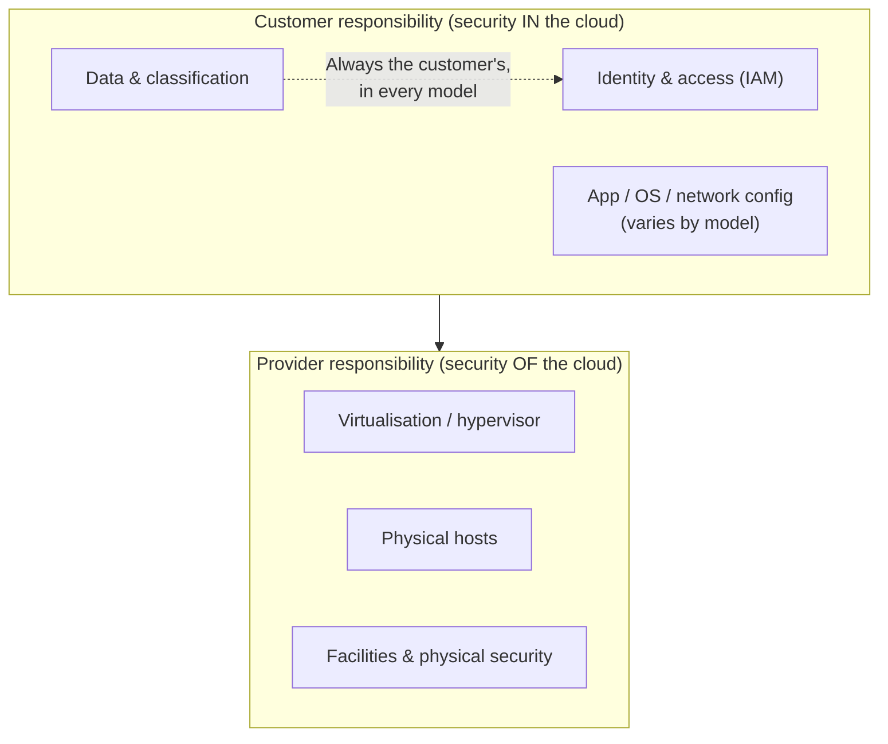
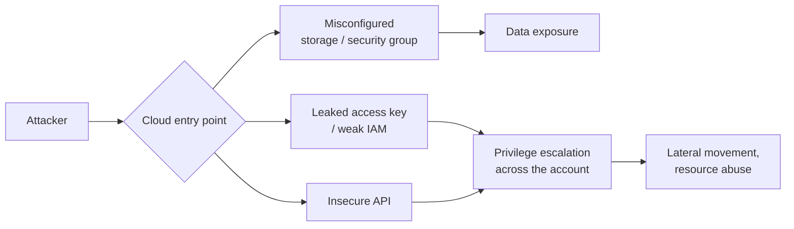

# Cloud Computing

**Cloud computing** delivers computing resources — servers, storage, databases, networking, software — on demand over the internet, billed by use, instead of running everything in your own data centre. For a sysadmin, the cloud changes *who* is responsible for *what*, introduces new abstractions (containers, serverless), and creates new ways to misconfigure things. This page covers the service models (IaaS/PaaS/SaaS), the **shared-responsibility model**, containers and serverless, cloud threats, **Cloud Security Posture Management (CSPM)**, and defences.

This is defence-oriented exam preparation. Testing cloud environments is bound by **explicit written authorisation** *and* the provider's rules of engagement (see [legal-and-ethics.md](../00-overview/legal-and-ethics.md)). No exploit steps are provided.

## Learning objectives

- Define the cloud service models **IaaS, PaaS, SaaS** and the deployment models.
- Explain the **shared-responsibility model** and how it shifts with each service model.
- Describe containers and serverless at a conceptual level and their security implications.
- Identify common cloud threats, especially **misconfiguration**.
- Explain what **CSPM** does and apply core cloud countermeasures.

## Service models: IaaS, PaaS, SaaS

| Model | Expansion | You manage | Provider manages | Example idea |
| --- | --- | --- | --- | --- |
| **IaaS** | Infrastructure as a Service | OS, runtime, apps, data, configuration | Physical hardware, virtualisation, network | Virtual machines, storage, networks |
| **PaaS** | Platform as a Service | Your app code and data | OS, runtime, scaling, patching | Managed app/runtime platforms, managed databases |
| **SaaS** | Software as a Service | Your data, users, access settings | Almost everything else | Ready-to-use applications (email, CRM) |

> Rule of thumb: as you move **IaaS → PaaS → SaaS**, the provider takes on more, and **you** are responsible for less infrastructure — but you are **always** responsible for your **data, identities, and access configuration.**

### Deployment models

- **Public cloud** — shared, provider-owned infrastructure.
- **Private cloud** — dedicated to one organisation.
- **Hybrid cloud** — combination of public and private with orchestration between them.
- **Community / multi-cloud** — shared by related organisations, or multiple providers used together.

## The shared-responsibility model

The single most important cloud security concept. Security responsibility is **split** between the provider and the customer, and the split **changes with the service model**. A common phrasing: the provider is responsible for security **of** the cloud; the customer is responsible for security **in** the cloud.

| Layer | IaaS | PaaS | SaaS |
| --- | --- | --- | --- |
| Data & access (IAM) | Customer | Customer | Customer |
| Application | Customer | Customer | Provider |
| OS / runtime | Customer | Provider | Provider |
| Virtualisation / hardware / facilities | Provider | Provider | Provider |

> The classic mistake: assuming "the cloud provider secures everything." Misconfigured storage buckets and over-permissive identities are *customer* responsibilities — and the leading cause of cloud breaches.

## Containers and serverless

- **Containers** package an application with its dependencies into a lightweight, portable unit that shares the host operating-system kernel (e.g., the **Docker** runtime; orchestrated by **Kubernetes**). Lighter than virtual machines but **less isolated** (shared kernel). Security concerns: vulnerable base images, exposed orchestration APIs, over-privileged containers, and secrets baked into images.
- **Serverless / Function as a Service (FaaS)** runs your code on demand without you managing servers. The provider handles infrastructure; you secure your **code, dependencies, and the function's permissions**. Concerns: over-broad function permissions, vulnerable dependencies, and event-injection.

## Cloud threats

| Threat | Description |
| --- | --- |
| **Misconfiguration** | Public storage buckets, open security groups, disabled logging — the **top** cloud risk |
| **Weak identity & access management (IAM)** | Over-privileged accounts, no Multi-Factor Authentication (MFA), leaked access keys |
| **Insecure APIs** | Application Programming Interfaces are the cloud's control plane; weak auth exposes everything |
| **Account / credential compromise** | Stolen keys or hijacked accounts |
| **Insecure storage / data exposure** | Unencrypted or world-readable data stores |
| **Shadow IT** | Unsanctioned cloud services outside security oversight |
| **Supply-chain / image risks** | Vulnerable container images or third-party dependencies |
| **Insufficient logging/monitoring** | Breaches go undetected without cloud-native logs |

## Cloud Security Posture Management (CSPM)

**Cloud Security Posture Management (CSPM)** is tooling that continuously scans cloud configurations against security best practices and compliance baselines, flags **misconfigurations** (e.g., public buckets, open ports, missing encryption), and helps remediate them. Because misconfiguration is the leading cloud risk, CSPM directly targets the most common failure. Related categories: **CWPP** (Cloud Workload Protection Platform) for workloads, and **CNAPP** (Cloud-Native Application Protection Platform) combining several capabilities.

## Tools (purpose only)

Named for awareness; authorised use only and within the provider's rules.

| Tool | Purpose |
| --- | --- |
| **CSPM platforms** | Continuous configuration assessment and misconfiguration detection |
| **Cloud-provider security services** (native) | Logging, threat detection, and policy enforcement |
| **Infrastructure-as-Code (IaC) scanners** | Catch misconfigurations before deployment |
| **Container image scanners** | Detect vulnerable base images and dependencies |
| **Cloud benchmarking tools** (e.g., CIS-benchmark scanners) | Audit accounts against the CIS Benchmarks |

## Countermeasures / Defence

> Legal note: cloud testing requires both customer authorisation **and** compliance with the provider's penetration-testing policy and rules of engagement.

1. **Understand and apply the shared-responsibility model.** Know exactly which layers you must secure for each service used. Most cloud breaches are *customer-side* misconfigurations.
2. **Strong IAM with least privilege.** Grant minimal permissions, avoid long-lived keys, rotate credentials, and **enforce MFA** — especially for administrative and root accounts.
3. **Fix and prevent misconfigurations** with CSPM and IaC scanning; align to **CIS Benchmarks**.
4. **Encrypt data** at rest and in transit; manage keys with a Key Management Service (KMS).
5. **Lock down storage and network exposure.** No public buckets unless intended; restrict security groups; private endpoints where possible.
6. **Enable comprehensive logging and monitoring** (cloud-native audit logs, threat detection) and alert on anomalies. See [05-vulnerability-analysis.md](./05-vulnerability-analysis.md) for monitoring concepts.
7. **Secure containers/serverless:** scan images, use minimal/trusted base images, never bake in secrets, restrict orchestration APIs, and apply least-privilege function roles.
8. **Govern shadow IT** with discovery and a Cloud Access Security Broker (CASB).

## Exam tips

- **Shared responsibility** is the cloud's central concept: provider secures **of** the cloud; customer secures **in** the cloud. The split shifts with **IaaS → PaaS → SaaS**.
- **You are always responsible for your data, identities, and access configuration** — in every model.
- **Misconfiguration** (public buckets, open ports, weak IAM) is the **leading** cloud breach cause; **CSPM** targets it.
- **IaaS:** you manage the OS up. **PaaS:** you manage app + data. **SaaS:** you manage data, users, and access settings.
- **Containers** share the host kernel (lighter, less isolated than VMs); **serverless/FaaS** removes server management but you still secure code and permissions.
- **MFA + least privilege IAM** are core countermeasures.

## Sources

- NIST SP 800-145, The NIST Definition of Cloud Computing — https://csrc.nist.gov/pubs/sp/800/145/final
- Cloud Security Alliance (CSA), Security Guidance / Top Threats — https://cloudsecurityalliance.org/research/
- AWS Shared Responsibility Model — https://aws.amazon.com/compliance/shared-responsibility-model/
- Microsoft Azure, Shared responsibility in the cloud — https://learn.microsoft.com/azure/security/fundamentals/shared-responsibility
- OWASP Cloud-Native Application Security Top 10 — https://owasp.org/www-project-cloud-native-application-security-top-10/
- EC-Council, CEH v13 program (Cloud Computing module) — https://www.eccouncil.org/train-certify/certified-ethical-hacker-ceh/
- [../reference/acronyms.md](../reference/acronyms.md)
