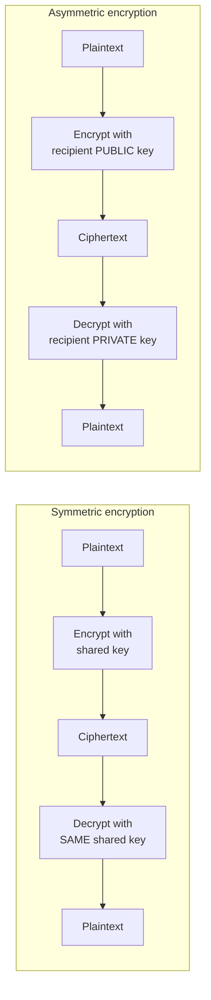
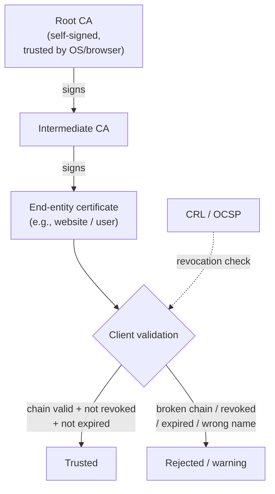

# Cryptography

**Cryptography** is the science of protecting information using mathematics — keeping it confidential, verifying it has not been altered, and proving who created it. It underpins almost every other security control: HyperText Transfer Protocol Secure (HTTPS), Virtual Private Networks (VPNs), disk encryption, digital signatures, and the wireless and cloud protections covered elsewhere in this hub. This page explains symmetric vs. asymmetric cryptography, hashing, **Public Key Infrastructure (PKI)**, the major algorithms, crypto attacks at a concept level, disk/email encryption, and best practices.

This is defence-oriented exam preparation. Cryptanalysis or password attacks against systems you do not own require **explicit written authorisation** (see [legal-and-ethics.md](../00-overview/legal-and-ethics.md)). No attack recipes are provided.

## Learning objectives

- Distinguish **symmetric** and **asymmetric** cryptography and when each is used.
- Explain **hashing** and how it differs from encryption.
- Describe **PKI**, certificates, and the chain of trust.
- Identify the major algorithms: **AES, RSA, ECC, SHA**.
- Recognise common crypto attacks at a concept level.
- Apply cryptographic best practices, including disk and email encryption.

## The goals of cryptography

Cryptography supports the security objectives:

- **Confidentiality** — only authorised parties can read the data (encryption).
- **Integrity** — detect if data was altered (hashing, Message Authentication Codes).
- **Authentication** — confirm identity (digital signatures, certificates).
- **Non-repudiation** — the sender cannot later deny sending it (digital signatures).

## Symmetric vs. asymmetric cryptography

| Property | Symmetric | Asymmetric (public-key) |
| --- | --- | --- |
| Keys | **One shared secret key** for encrypt and decrypt | A **key pair**: public key + private key |
| Speed | Fast; good for bulk data | Slower; good for small data / key exchange |
| Key distribution | Hard — both sides need the same secret safely | Easier — publish the public key |
| Examples | **AES**, 3DES (legacy), ChaCha20 | **RSA**, **ECC**, Diffie-Hellman |
| Typical use | Encrypting files, disks, sessions | Key exchange, digital signatures, certificates |

> The two are combined in practice: asymmetric crypto securely **exchanges a symmetric session key**, then fast symmetric crypto encrypts the actual data. This is exactly how TLS/HTTPS works — solving symmetric's key-distribution problem with asymmetric's public keys.

> Key rule for the exam: to send someone a **confidential** message you encrypt with **their public key** (only their private key can open it). To **sign**, you use **your own private key** (anyone can verify with your public key).

## Hashing

A **cryptographic hash function** takes any input and produces a fixed-size, irreversible **digest** (fingerprint). It is **one-way** — you cannot recover the input from the digest — which is why hashing is **not** encryption.

Properties of a good hash:

- **Deterministic** — same input always gives the same digest.
- **One-way (pre-image resistant)** — infeasible to reverse.
- **Collision-resistant** — infeasible to find two inputs with the same digest.
- **Avalanche effect** — a tiny input change drastically changes the digest.

Uses: integrity checks (file/download verification), password storage (hashed, never plaintext), and digital signatures (the signature is over the hash).

| Function | Status |
| --- | --- |
| **MD5** | **Broken** (collisions) — do not use for security |
| **SHA-1** | **Deprecated** (collisions) — do not use |
| **SHA-2** (SHA-256, SHA-512) | Current, widely used |
| **SHA-3** | Current alternative design |

> For passwords specifically, use a **slow, salted** algorithm such as **bcrypt, scrypt, Argon2, or PBKDF2** — not a fast general-purpose hash. The **salt** (a unique random value per password) defeats precomputed **rainbow tables**.

## Major algorithms

| Algorithm | Type | Role |
| --- | --- | --- |
| **AES** (Advanced Encryption Standard) | Symmetric block cipher | The standard for bulk encryption (128/192/256-bit keys) |
| **RSA** (Rivest–Shamir–Adleman) | Asymmetric | Key exchange and digital signatures; security from factoring large numbers |
| **ECC** (Elliptic Curve Cryptography) | Asymmetric | Same strength as RSA at **much smaller key sizes**; efficient for mobile/IoT |
| **Diffie–Hellman (DH / ECDH)** | Asymmetric (key agreement) | Securely agree a shared key over an open channel |
| **SHA-2 / SHA-3** | Hash | Integrity and signatures |

> **ECC vs. RSA:** ECC achieves equivalent security with far smaller keys (e.g., a 256-bit ECC key is roughly comparable to a 3072-bit RSA key), so it is favoured where compute/bandwidth is limited.

## Public Key Infrastructure (PKI)

**Public Key Infrastructure (PKI)** is the framework of policies, roles, and technology that binds **public keys to identities** using **digital certificates**, so you can trust that a public key really belongs to who it claims. It solves "how do I know this public key is genuinely the bank's?"

Core components:

- **Certificate Authority (CA)** — a trusted entity that issues and signs certificates.
- **Registration Authority (RA)** — verifies identity before a certificate is issued.
- **Digital certificate (X.509)** — binds an identity to a public key, signed by a CA.
- **Certificate Revocation List (CRL) / Online Certificate Status Protocol (OCSP)** — ways to check whether a certificate has been revoked.
- **Root CA → Intermediate CA → end-entity** — the **chain of trust**.

Trust flows from a small set of **root CAs** (pre-installed/trusted by your OS and browser) down through intermediates to the certificate on a website or person. Your client validates each signature up the chain to a trusted root.

> A **digital signature** uses the signer's **private key** over the data's hash; anyone can verify with the signer's **public key** (obtained via their certificate). This gives integrity, authentication, and non-repudiation.

## Crypto attacks (concept level)

Awareness only — no procedures. Most "crypto breaks" in practice are about **weak keys, weak algorithms, or poor implementation**, not breaking strong math.

| Attack | Concept |
| --- | --- |
| **Brute force** | Try all possible keys; defeated by sufficient key length |
| **Dictionary / rainbow tables** | Guess passwords from wordlists / precomputed hashes; defeated by **salting** + slow hashes |
| **Birthday attack** | Exploits hash **collisions** (the birthday paradox); why collision resistance and digest length matter |
| **Man-in-the-middle (MITM)** | Intercepts a key exchange; defeated by authenticated exchanges / PKI certificate validation |
| **Known-/chosen-plaintext** | Uses known input–output pairs to attack a cipher; modern ciphers resist these |
| **Side-channel** | Infers keys from timing, power, or emissions of the implementation |
| **Downgrade attack** | Forces use of a weak/legacy algorithm or protocol version |
| **Implementation flaws** | Bugs (e.g., poor random-number generation, key reuse) undermine strong algorithms |

## Disk and email encryption

- **Full Disk Encryption (FDE)** protects data **at rest** on a lost/stolen device — examples: **BitLocker** (Windows), **FileVault** (macOS), **LUKS** (Linux). Often anchored to a **Trusted Platform Module (TPM)**.
- **Email encryption** secures message confidentiality and integrity end-to-end — **S/MIME** (Secure/Multipurpose Internet Mail Extensions, certificate-based) and **PGP/OpenPGP** (Pretty Good Privacy, web-of-trust or keys). Both rely on public-key cryptography and digital signatures.
- **Data in transit** is protected by **TLS** (HTTPS, VPNs); **data at rest** by FDE/file/database encryption.

## Tools (purpose only)

Named for awareness; authorised use only.

| Tool | Purpose |
| --- | --- |
| **OpenSSL / GnuPG (GPG)** | General-purpose crypto, certificate, and encryption operations |
| **VeraCrypt / BitLocker / LUKS** | Disk and volume encryption |
| **Hashing utilities** (e.g., sha256sum) | Verify file integrity via digests |
| **Password-cracking tools** (e.g., John the Ripper, Hashcat) | Test password-hash strength in **authorised** assessments |

## Countermeasures / Defence

> Legal note: cryptanalysis and password cracking are permitted **only** with explicit written authorisation.

1. **Use strong, standard algorithms.** AES (256-bit), RSA ≥ 2048-bit, ECC (e.g., P-256), SHA-2/SHA-3. **Avoid DES, 3DES, RC4, MD5, SHA-1.** Never invent your own cryptography.
2. **Use long, random keys** and protect them. Generate keys with a strong random source.
3. **Manage keys properly** — secure storage (Hardware Security Module/Key Management Service), rotation, and separation from the data they protect.
4. **Salt and use slow hashes for passwords** (Argon2/bcrypt/scrypt/PBKDF2) to defeat rainbow tables.
5. **Encrypt data in transit (TLS) and at rest (FDE/file/DB encryption).**
6. **Validate certificates fully** (chain, expiry, revocation, hostname) and disable downgrade to weak protocols.
7. **Keep crypto libraries patched** and prefer vetted, well-tested implementations over hand-rolled code.
8. **Plan for crypto-agility / post-quantum.** Be ready to migrate algorithms; follow NIST's post-quantum standards as they mature.

## Exam tips

- **Symmetric = one shared key (fast, bulk data, e.g., AES); asymmetric = key pair (slower, key exchange/signatures, e.g., RSA/ECC).** TLS uses both.
- **Encrypt for confidentiality with the recipient's PUBLIC key; sign with your own PRIVATE key.** This pairing is heavily tested.
- **Hashing is one-way and is NOT encryption.** MD5/SHA-1 are broken; use SHA-2/SHA-3. Passwords need **salt** + a **slow** hash.
- **ECC = strong security with small keys**, ideal for mobile/IoT.
- **PKI:** CA issues/signs certificates; trust flows **Root CA → Intermediate → end-entity**; revocation via **CRL/OCSP**; certificates are **X.509**.
- **Birthday attack** targets hash **collisions**; **rainbow tables** are defeated by **salting**.
- **FDE** (BitLocker/FileVault/LUKS) protects data **at rest**; **TLS** protects data **in transit**; **S/MIME** and **PGP** secure email.

## Sources

- NIST FIPS 197, Advanced Encryption Standard (AES) — https://csrc.nist.gov/pubs/fips/197/final
- NIST FIPS 180-4 (SHA-2) and FIPS 202 (SHA-3) — https://csrc.nist.gov/pubs/fips/180-4/final and https://csrc.nist.gov/pubs/fips/202/final
- NIST SP 800-57, Recommendation for Key Management — https://csrc.nist.gov/pubs/sp/800/57/pt1/r5/final
- NIST Post-Quantum Cryptography project — https://csrc.nist.gov/projects/post-quantum-cryptography
- RFC 5280, Internet X.509 Public Key Infrastructure Certificate and CRL Profile — https://www.rfc-editor.org/rfc/rfc5280
- OWASP Cryptographic Storage Cheat Sheet — https://cheatsheetseries.owasp.org/cheatsheets/Cryptographic_Storage_Cheat_Sheet.html
- EC-Council, CEH v13 program (Cryptography module) — https://www.eccouncil.org/train-certify/certified-ethical-hacker-ceh/
- [../reference/acronyms.md](../reference/acronyms.md)
