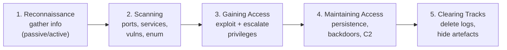

# CEH v13 Cheat Sheet

A dense, last-mile quick reference for the **Certified Ethical Hacker (CEH) v13** knowledge exam (code **312-50v13**). Use it for spaced review and final-week drilling, paired with the [study-plan.md](study-plan.md) and [practice-questions.md](practice-questions.md).

> This is a condensed reference, not a teaching page. Each line assumes you have already read the relevant module. Acronyms are expanded on first use.

## Exam-day facts

| Item | CEH knowledge exam | CEH Practical |
| --- | --- | --- |
| Code | 312-50v13 | (Practical) |
| Questions / challenges | **125 multiple-choice** | **20 challenges** |
| Time | **4 hours** | **6 hours** |
| Passing | scaled **cut-score ~60–85%** (varies by form) | as set by EC-Council |
| Style | theory, tools, methodology | hands-on in a live cyber-range |
| Pace target | ~1.9 min/question | budget ~18 min/challenge |

- **CEH Master** = passing **both** the knowledge exam **and** the Practical (a title, not a third exam).
- **20 modules**; methodology = **5 phases**.
- Confirm current cut-score, fees, eligibility, and delivery on EC-Council — these change between versions.

## The 5 phases at a glance

| Phase | Goal | Typical activity |
| --- | --- | --- |
| 1. Reconnaissance | Profile the target | OSINT, WHOIS, DNS, social, dorking |
| 2. Scanning | Map the attack surface | Port/host scans, enumeration, vuln analysis |
| 3. Gaining Access | Get a foothold | Exploit, password attacks, privilege escalation |
| 4. Maintaining Access | Stay in | Backdoors, rootkits, command-and-control (C2) |
| 5. Clearing Tracks | Avoid detection | Log clearing, timestomping, hiding files |

> OSINT = Open-Source Intelligence; DNS = Domain Name System; WHOIS = domain-registration lookup protocol.

## Common ports

| Port | Protocol | Service | Note |
| --- | --- | --- | --- |
| 20/21 | TCP | FTP (data/control) | Cleartext; banner-grab target |
| 22 | TCP | SSH / SCP / SFTP | Encrypted remote admin |
| 23 | TCP | Telnet | Cleartext — insecure |
| 25 | TCP | SMTP | Mail relay; spoofing/enum |
| 53 | TCP/UDP | DNS | UDP queries; TCP for zone transfer (AXFR) |
| 67/68 | UDP | DHCP | Address assignment |
| 69 | UDP | TFTP | No auth |
| 80 | TCP | HTTP | Cleartext web |
| 110 | TCP | POP3 | Mail retrieval |
| 111 | TCP/UDP | RPC / portmapper | Often precedes NFS |
| 123 | UDP | NTP | Time; amplification risk |
| 135 | TCP | MS RPC | Windows |
| 137/138/139 | TCP/UDP | NetBIOS | Enumeration target |
| 143 | TCP | IMAP | Mail retrieval |
| 161/162 | UDP | SNMP | Default community strings leak data |
| 389 | TCP/UDP | LDAP | Directory enumeration |
| 443 | TCP | HTTPS | TLS-encrypted web |
| 445 | TCP | SMB | Windows file sharing; high-value |
| 514 | UDP | Syslog | Logging |
| 636 | TCP | LDAPS | LDAP over TLS |
| 993 | TCP | IMAPS | IMAP over TLS |
| 995 | TCP | POP3S | POP3 over TLS |
| 1433 | TCP | Microsoft SQL Server | DB target |
| 1521 | TCP | Oracle DB | DB target |
| 2049 | TCP/UDP | NFS | Network File System |
| 3306 | TCP | MySQL | DB target |
| 3389 | TCP | RDP | Remote Desktop; brute-force target |
| 5432 | TCP | PostgreSQL | DB target |
| 5900 | TCP | VNC | Remote control |
| 8080 | TCP | HTTP alt / proxy | Web apps, proxies |

> FTP = File Transfer Protocol; SSH = Secure Shell; SMTP = Simple Mail Transfer Protocol; DHCP = Dynamic Host Configuration Protocol; NTP = Network Time Protocol; RPC = Remote Procedure Call; SMB = Server Message Block; LDAP = Lightweight Directory Access Protocol; RDP = Remote Desktop Protocol; VNC = Virtual Network Computing; NFS = Network File System.

## Scan-type concepts (TCP)

| Scan | Flags sent | Open port | Closed port | Note |
| --- | --- | --- | --- | --- |
| TCP Connect | Full handshake | SYN/ACK then completes | RST | Reliable, noisy, no privilege needed |
| SYN (half-open) | SYN | SYN/ACK (then RST) | RST | "Stealth"; common default |
| NULL | none | no response | RST | Bypasses simple filters (Unix-like) |
| FIN | FIN | no response | RST | Similar logic to NULL |
| Xmas | FIN+PSH+URG | no response | RST | Flags "light up" the packet |
| ACK | ACK | RST (port state ambiguous) | RST | Maps firewall rules, not open ports |
| UDP | (UDP datagram) | often no response | ICMP port-unreachable | Slow; ambiguous |

> SYN = Synchronise; ACK = Acknowledge; RST = Reset; FIN = Finish; PSH = Push; URG = Urgent; ICMP = Internet Control Message Protocol. The **TCP three-way handshake** = SYN → SYN/ACK → ACK.

## OWASP Top 10 (2021 edition)

Open Web Application Security Project (OWASP) Top 10 web-application risks:

| # | Category |
| --- | --- |
| A01 | Broken Access Control |
| A02 | Cryptographic Failures |
| A03 | Injection (includes SQL injection and Cross-Site Scripting) |
| A04 | Insecure Design |
| A05 | Security Misconfiguration |
| A06 | Vulnerable and Outdated Components |
| A07 | Identification and Authentication Failures |
| A08 | Software and Data Integrity Failures |
| A09 | Security Logging and Monitoring Failures |
| A10 | Server-Side Request Forgery (SSRF) |

> Verify the current edition on OWASP; the list is revised periodically.

## Common cryptography algorithms

| Type | Examples | Use |
| --- | --- | --- |
| Symmetric | AES, 3DES, DES (legacy), RC4 (legacy), Blowfish/Twofish | Bulk encryption with a shared key |
| Asymmetric | RSA, ECC, Diffie-Hellman (DH), ElGamal | Key exchange, signatures, confidentiality |
| Hashing | SHA-256/SHA-3, MD5 (broken), SHA-1 (deprecated) | Integrity, one-way digests |
| MAC / KDF | HMAC, PBKDF2, bcrypt, scrypt, Argon2 | Authenticated integrity, password storage |

> AES = Advanced Encryption Standard; DES = Data Encryption Standard; RSA = Rivest–Shamir–Adleman; ECC = Elliptic-Curve Cryptography; SHA = Secure Hash Algorithm; MD5 = Message Digest 5; HMAC = Hash-based Message Authentication Code; KDF = Key Derivation Function. **Symmetric** = one shared key (fast); **asymmetric** = key pair (public encrypts / private decrypts; private signs / public verifies); **hash** = irreversible, fixed-length, integrity only.

## CVSS severity bands (v3.x)

Common Vulnerability Scoring System (CVSS) base-score ranges:

| Band | Score range |
| --- | --- |
| None | 0.0 |
| Low | 0.1 – 3.9 |
| Medium | 4.0 – 6.9 |
| High | 7.0 – 8.9 |
| Critical | 9.0 – 10.0 |

> Related: CVE = Common Vulnerabilities and Exposures (the unique vulnerability identifier); CWE = Common Weakness Enumeration (the underlying flaw category).

## Tools by phase (representative)

Learn one tool per category — the exam tests "which tool for which job".

| Phase / task | Representative tools |
| --- | --- |
| Reconnaissance / OSINT | WHOIS, nslookup/dig, theHarvester, Maltego, Recon-ng, Shodan, Google dorks |
| Scanning / enumeration | Nmap, Masscan, Netcat, enum4linux, SNMP-walk, Nessus/OpenVAS (also vuln) |
| Vulnerability analysis | Nessus, OpenVAS, Qualys, Nikto (web) |
| Gaining access / exploitation | Metasploit Framework, sqlmap (SQL injection), Burp Suite (web) |
| Password attacks | John the Ripper, Hashcat, Hydra, Medusa |
| Sniffing / MITM | Wireshark, tcpdump, Ettercap, Bettercap |
| Wireless | Aircrack-ng suite, Kismet, Wifite |
| Web application | Burp Suite, OWASP ZAP, Nikto, dirb/gobuster |
| Maintaining access / post-exploitation | Meterpreter, Cobalt Strike (commercial), Empire |
| Clearing tracks (concept) | log/event-log clearing, timestomp, history wiping |

> MITM = Man-in-the-Middle. Use all tools only on systems you own or are explicitly authorised to test.

## High-yield distinctions to memorise

- **Passive vs active recon:** passive never touches the target; active sends packets (scans, banner grabs).
- **Scanning vs enumeration:** scanning finds what is open; enumeration extracts users/shares/services.
- **Virus vs worm:** a virus needs a host file and user action; a worm self-propagates.
- **DoS vs DDoS:** single source vs many distributed (botnet) sources.
- **IDS signature vs anomaly:** known patterns vs deviation from a baseline.
- **Symmetric vs asymmetric:** shared key vs key pair.
- **Encryption vs hashing:** reversible confidentiality vs one-way integrity.
- **Encryption vs steganography:** hides content vs hides existence.
- **False positive vs false negative:** reported-but-not-real vs real-but-missed (the dangerous one).
- **WEP vs WPA2/WPA3:** WEP is broken; use WPA2/WPA3.

## Where to go next

- [study-plan.md](study-plan.md) — the schedule that builds toward this reference.
- [practice-questions.md](practice-questions.md) — apply these facts under exam conditions.
- [../00-overview/what-is-ceh.md](../00-overview/what-is-ceh.md) — credential family and program overview.
- [../reference/acronyms.md](../reference/acronyms.md) — full acronym expansions.

## Sources

- EC-Council, Certified Ethical Hacker (CEH) v13 program and module outline — https://www.eccouncil.org/train-certify/certified-ethical-hacker-ceh/
- OWASP, OWASP Top 10 (2021) — https://owasp.org/www-project-top-ten/
- FIRST.org, CVSS v3.1 specification and qualitative severity bands — https://www.first.org/cvss/
- Internet Assigned Numbers Authority (IANA), Service Name and Transport Protocol Port Number Registry — https://www.iana.org/assignments/service-names-port-numbers/service-names-port-numbers.xhtml
- Sibling hub page: [../00-overview/what-is-ceh.md](../00-overview/what-is-ceh.md)
- Verified ground truth for this study hub (CEH v13; 312-50v13; 125 Q / 4 h; scaled 60–85% pass; CEH Practical 6 h / 20 challenges; 20 modules; 5 phases).
