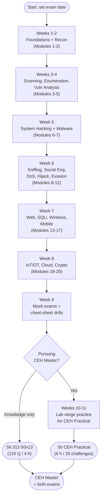

# CEH v13 Study Plan

A structured, ordered path through this study hub for the **Certified Ethical Hacker (CEH) v13** exam (code **312-50v13**). It maps the **20 modules** and the **5 phases of ethical hacking** onto a week-by-week schedule, gives logistics for both the knowledge exam and **CEH Practical**, and offers study tips tuned for a systems administrator.

> **Time estimates below are SUGGESTIONS, not requirements.** They assume you are a working sysadmin studying part-time. Compress or stretch them to fit your own pace, prior knowledge, and exam date. EC-Council does not publish a mandated study duration.

## Learning objectives

- Follow an ordered route through the `ceh/` hub aligned to the 20 modules.
- Understand how the 20 modules collapse into the 5 phases (Reconnaissance → Scanning → Gaining Access → Maintaining Access → Clearing Tracks).
- Plan time and weekly milestones for the knowledge exam **and** the optional CEH Practical.
- Know the exam-day logistics, eligibility routes, and re-test policy at a high level.
- Apply study techniques that exploit your existing administration knowledge.

## How this plan is organised

CEH v13 is taught as **20 modules**. The exam itself is organised around domains, but the modules are the unit you actually study. The classic **5 phases** are a *methodology* that runs across many of those modules — almost every attack-focused module maps onto one or more phases.

Use this plan in three passes:

1. **Pass 1 — Learn (Weeks 1–6):** read each module's hub page, build vocabulary, expand acronyms.
2. **Pass 2 — Practise (Weeks 7–8):** do the hands-on labs and the [practice questions](./practice-questions.md).
3. **Pass 3 — Polish (Week 9):** drill the [cheat sheet](./cheat-sheet.md), take timed mock exams, fix weak areas.

## The 20 modules mapped to the 5 phases

The table maps each CEH v13 module to the phase(s) it most supports. Modules like *Footprinting* are pure reconnaissance; cross-cutting modules (cryptography, cloud, IoT) support the methodology rather than sitting in one phase.

| # | Module | Primary phase(s) |
| --- | --- | --- |
| 1 | Introduction to Ethical Hacking | Foundations (all) |
| 2 | Footprinting and Reconnaissance | Reconnaissance |
| 3 | Scanning Networks | Scanning |
| 4 | Enumeration | Scanning |
| 5 | Vulnerability Analysis | Scanning |
| 6 | System Hacking | Gaining + Maintaining Access + Clearing Tracks |
| 7 | Malware Threats | Maintaining Access |
| 8 | Sniffing | Scanning + Gaining Access |
| 9 | Social Engineering | Reconnaissance + Gaining Access |
| 10 | Denial-of-Service (DoS/DDoS) | Gaining Access (disruption) |
| 11 | Session Hijacking | Gaining Access |
| 12 | Evading IDS, Firewalls, and Honeypots | Clearing Tracks + Gaining Access |
| 13 | Hacking Web Servers | Gaining Access |
| 14 | Hacking Web Applications | Gaining Access |
| 15 | SQL Injection | Gaining Access |
| 16 | Hacking Wireless Networks | Gaining Access |
| 17 | Hacking Mobile Platforms | Gaining Access |
| 18 | IoT and OT Hacking | Gaining Access (specialised targets) |
| 19 | Cloud Computing | Gaining Access (specialised targets) |
| 20 | Cryptography | Cross-cutting (all) |

> **Acronyms:** DoS = Denial-of-Service; DDoS = Distributed Denial-of-Service; IDS = Intrusion Detection System; SQL = Structured Query Language; IoT = Internet of Things; OT = Operational Technology.

## The study path at a glance

## Week-by-week milestones

### Week 1 — Foundations (suggested ~6–8 h)
- Read [../00-overview/what-is-ceh.md](../00-overview/what-is-ceh.md), the exam/eligibility page, and the legal/ethics page.
- **Module 1 — Introduction to Ethical Hacking:** the Cyber Kill Chain, MITRE ATT&CK at a glance, threat classifications, the 5 phases, and the difference between hat colours.
- **Milestone:** you can recite the 5 phases in order and state the exam format (125 Q / 4 h).

### Week 2 — Reconnaissance (suggested ~6–8 h)
- **Module 2 — Footprinting and Reconnaissance:** passive vs active recon, Open-Source Intelligence (OSINT), WHOIS, Domain Name System (DNS) footprinting, Google dorking, email/social footprinting.
- **Milestone:** distinguish passive from active recon and name 5 footprinting sources.

### Week 3 — Scanning (suggested ~7–9 h)
- **Module 3 — Scanning Networks:** Transmission Control Protocol (TCP) flags, scan types (SYN/Connect/NULL/FIN/Xmas/ACK/UDP), Nmap basics, host discovery, banner grabbing.
- **Milestone:** explain a TCP three-way handshake and why a SYN (half-open) scan is "stealthy".

### Week 4 — Enumeration + Vulnerability Analysis (suggested ~7–9 h)
- **Module 4 — Enumeration:** NetBIOS, Server Message Block (SMB), Simple Network Management Protocol (SNMP), Lightweight Directory Access Protocol (LDAP), DNS zone transfer, Network File System (NFS).
- **Module 5 — Vulnerability Analysis:** scanner types, the Common Vulnerability Scoring System (CVSS), Common Vulnerabilities and Exposures (CVE), false positives.
- **Milestone:** read a CVSS band and explain what enumeration adds beyond scanning.

### Week 5 — System Hacking + Malware (suggested ~8–10 h)
- **Module 6 — System Hacking:** password attacks (dictionary, brute force, hybrid, rainbow tables), privilege escalation, steganography, log clearing.
- **Module 7 — Malware Threats:** viruses, worms, Trojans, rootkits, ransomware, fileless malware, static vs dynamic analysis.
- **Milestone:** classify password-attack types and name 3 persistence techniques.

### Week 6 — Network & human attacks (suggested ~9–11 h)
- **Module 8 — Sniffing:** Address Resolution Protocol (ARP) poisoning, Media Access Control (MAC) flooding, active vs passive sniffing.
- **Module 9 — Social Engineering:** phishing, pretexting, baiting, tailgating, insider threats.
- **Module 10 — DoS/DDoS:** volumetric, protocol, and application-layer attacks; botnets.
- **Module 11 — Session Hijacking:** application vs network level, token theft.
- **Module 12 — Evading IDS, Firewalls, and Honeypots:** signature vs anomaly detection, fragmentation, tunnelling.
- **Milestone:** match each attack to a defensive control.

### Week 7 — Web, SQLi, wireless, mobile (suggested ~9–11 h)
- **Module 13 — Hacking Web Servers** and **Module 14 — Hacking Web Applications:** the OWASP Top 10, directory traversal, misconfiguration.
- **Module 15 — SQL Injection:** in-band, blind, and out-of-band; parameterised queries as the fix.
- **Module 16 — Hacking Wireless Networks:** Wired Equivalent Privacy (WEP) vs Wi-Fi Protected Access (WPA/WPA2/WPA3), evil twin, deauthentication.
- **Module 17 — Hacking Mobile Platforms:** Android/iOS threat models, mobile device management (MDM).
- **Milestone:** name the OWASP Top 10 categories and the canonical SQL-injection defence.

### Week 8 — IoT/OT, cloud, cryptography (suggested ~8–10 h)
- **Module 18 — IoT and OT Hacking:** Supervisory Control and Data Acquisition (SCADA), Modbus, default-credential risk.
- **Module 19 — Cloud Computing:** shared-responsibility model, IAM, misconfiguration, container/serverless basics.
- **Module 20 — Cryptography:** symmetric vs asymmetric, hashing, Public Key Infrastructure (PKI), common algorithms.
- **Milestone:** distinguish symmetric from asymmetric crypto and name the shared-responsibility boundary.

### Week 9 — Consolidation (suggested ~8–10 h)
- Take the [practice questions](./practice-questions.md) under time pressure; review every wrong answer.
- Drill the [cheat sheet](./cheat-sheet.md) until ports, scan types, and CVSS bands are automatic.
- Re-read the two or three weakest modules.
- **Milestone:** consistently score above your target threshold on mock sets.

### Weeks 10–11 (only if pursuing CEH Master) — Practical prep (suggested ~12–16 h)
- Rebuild key labs from scratch without notes: Nmap discovery, enumeration, password cracking, web exploitation, and basic post-exploitation in an authorised range.
- Practise note-taking and screenshot discipline — the Practical is scored on results you must demonstrate.
- **Milestone:** complete a full lab chain end-to-end inside a self-imposed time box.

## Exam logistics

### CEH knowledge exam (312-50v13)
- **Format:** 125 multiple-choice questions, **4 hours**.
- **Passing score:** a scaled **cut-score that varies by exam form, roughly in the 60–85% range** — EC-Council sets the exact cut-score per question bank, so do not assume a fixed percentage. Aim to score well above the top of that range in your practice tests to give yourself margin.
- **Delivery:** typically via remote proctoring or a testing centre (for example, the ECC Exam Portal or Pearson VUE). Confirm current delivery options on EC-Council.
- **Eligibility:** either complete official EC-Council training, **or** apply via the experience-based route (documented information-security work experience) and pay the eligibility-application fee. Verify current rules on EC-Council.

### CEH Practical
- **Format:** **6 hours, 20 real-world challenges** in a live cyber-range (iLabs-style environment).
- **Style:** performance-based — you perform the attack/analysis and submit answers derived from your work, not multiple-choice theory.
- **CEH Master:** the *title* awarded for passing **both** the knowledge exam and the Practical. It is not a separate third exam.

> **Re-tests and validity:** retake policies, certification validity, and EC-Council Continuing Education (ECE) credit requirements change between versions — check EC-Council for the current numbers rather than relying on study guides.

## Study tips for a sysadmin

- **Leverage what you know.** You already understand TCP/IP, DNS, Active Directory, SMB, and services. CEH mostly asks you to view them from the attacker's side — relabel your existing mental model rather than learning it fresh.
- **Master the ports and scan types cold.** These are high-frequency, low-effort points. The [cheat sheet](./cheat-sheet.md) port table is your single best return on study time.
- **Learn tools by *category*, not just by name.** The exam tests "which tool for which job" (scanner vs sniffer vs cracker). Knowing one representative tool per category beats memorising hundreds.
- **Watch the qualifier words.** CEH questions hinge on words like *passive*, *active*, *stealth*, *best*, *first*, and *most likely*. Read every option before answering.
- **Do everything in a legal lab.** Only practise on systems you own or are explicitly authorised to test. See [../00-overview/what-is-ceh.md](../00-overview/what-is-ceh.md) and the hub's legal/ethics page.
- **Space your reviews.** Short daily sessions plus weekly recall beat one long cram. Revisit the cheat sheet for 10 minutes most days.

## Where to go next

- [practice-questions.md](./practice-questions.md) — 50+ unofficial practice questions by module.
- [cheat-sheet.md](./cheat-sheet.md) — dense quick reference for the final review.
- [../00-overview/what-is-ceh.md](../00-overview/what-is-ceh.md) — credential family and program overview.
- [../reference/acronyms.md](../reference/acronyms.md) — expanded acronyms used across this hub.

## Sources

- EC-Council, Certified Ethical Hacker (CEH) official program page — https://www.eccouncil.org/train-certify/certified-ethical-hacker-ceh/
- EC-Council, CEH v13 ("CEH AI") course outline and 20-module structure — https://www.eccouncil.org/
- EC-Council, CEH exam blueprint / eligibility (current rules and cut-scores) — https://www.eccouncil.org/
- Sibling hub page: [../00-overview/what-is-ceh.md](../00-overview/what-is-ceh.md)
- Verified ground truth provided for this study hub (CEH v13; 312-50v13; 125 Q / 4 h; passing 60–85% scaled; CEH Practical 6 h / 20 challenges; CEH Master = both; 20 modules; 5 phases).
- Exact per-form cut-scores, retake rules, and validity period: *not fixed across versions* — verify on EC-Council.
