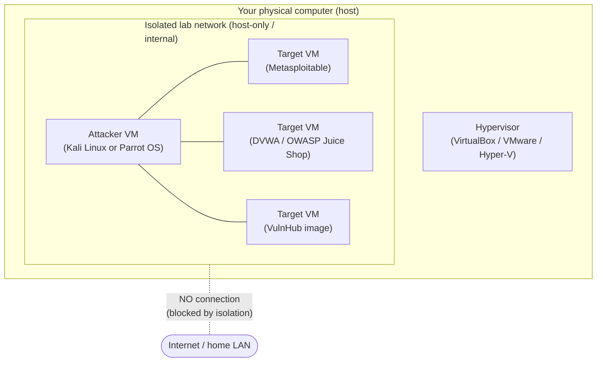

# Building a Safe, Isolated CEH Practice Lab

The single most important rule in ethical hacking is **only test systems you own or are explicitly authorised to test**. A self-contained home lab solves this completely: every machine in it belongs to you, so you can practise the full Certified Ethical Hacker (CEH) methodology legally. This page explains how to build that lab so it is **isolated** (cannot touch the internet or your home network) and **recoverable** (you can reset it in seconds).

> **Why isolation matters.** Intentionally vulnerable practice machines are, by design, full of security holes. If one is reachable from the internet — or even from your home Wi-Fi — it can be compromised by outsiders and used against others. An isolated lab keeps your practice attacks *inside the lab* and keeps outside attackers *out*. Combined with the legality point above, isolation is non-negotiable. See [../00-overview/legal-and-ethics.md](../00-overview/legal-and-ethics.md).

## Learning objectives

- Choose a hypervisor and explain why virtualisation is ideal for a security lab.
- Identify a suitable attacker virtual machine (VM) and its purpose.
- Identify intentionally vulnerable target VMs that are legal to attack.
- Design an isolated network (host-only or internal) so the lab cannot reach the internet or your LAN.
- Use snapshots to reset machines safely and quickly.
- Know where EC-Council's official ranges fit alongside a home lab.

## Step 1 — Pick a hypervisor

A **hypervisor** is software that runs virtual machines on your computer. Each VM is an isolated, disposable computer you can break, reset, or delete. Virtualisation is what makes a security lab cheap, safe, and reversible.

| Hypervisor | Type | Notes |
| --- | --- | --- |
| **Oracle VirtualBox** | Free, cross-platform | Popular free choice; runs on Windows, macOS, and Linux |
| **VMware Workstation Pro / Fusion** | Free for personal use; paid for commercial | Broadcom made the Pro editions free for personal use (2024); confirm current licensing on the vendor site |
| **Microsoft Hyper-V** | Built into Windows Pro/Enterprise | Native option on supported Windows editions |

> For a sysadmin: if you have managed VMware vSphere or Hyper-V at work, the desktop versions will feel familiar. The lab concepts (virtual switches, snapshots) carry straight over.

## Step 2 — Build the attacker machine

The "attacker" VM is the box you launch your authorised tests *from*. Two purpose-built Linux distributions package the common CEH tooling so you do not have to install each tool by hand.

| Attacker VM | Purpose |
| --- | --- |
| **Kali Linux** | Security-testing Linux distribution that ships with a broad collection of penetration-testing and analysis tools pre-installed |
| **Parrot OS (Security Edition)** | Alternative security-focused Linux distribution with a similar pre-loaded toolkit |

Either is fine — pick one, learn it, and treat the other as interchangeable. See [../tools/tools-by-phase.md](../tools/tools-by-phase.md) for what the bundled tools do.

## Step 3 — Add intentionally vulnerable targets

These are systems **deliberately built to be insecure** so people can practise legally. Because you download and run them yourself inside your own isolated lab, attacking them is authorised by definition.

| Target | Type | Purpose |
| --- | --- | --- |
| **Metasploitable** | Vulnerable Linux server VM | Classic intentionally vulnerable host for practising scanning, enumeration, and exploitation |
| **OWASP Juice Shop** | Vulnerable modern web application | Practises Open Web Application Security Project (OWASP) Top 10 web flaws in a realistic single-page app |
| **DVWA** (Damn Vulnerable Web Application) | Vulnerable PHP/MySQL web app | Adjustable difficulty levels for learning common web vulnerabilities step by step |
| **VulnHub images** | Community vulnerable VMs | A library of downloadable boot-to-root VMs covering many scenarios and difficulty levels |

> **Treat targets as quarantined.** Never expose any of these to the internet, never use real personal data on them, and keep them only on the isolated network described next.

## Step 4 — Isolate the network

This is the critical step. Configure the lab so VMs can talk to **each other** but **not** to the internet or your home LAN. Hypervisors offer network modes for exactly this:

| Network mode | Reaches the internet? | Reaches your home LAN? | VMs reach each other? | Use it for |
| --- | --- | --- | --- | --- |
| **Host-only** | No | No (only the host) | Yes | A lab that talks only among its VMs and the host |
| **Internal network** | No | No | Yes | The most isolated option — VMs see only each other |
| Bridged | Yes | Yes | Yes | **Avoid for vulnerable targets** — puts them on your real network |
| Network Address Translation (NAT) | Yes (outbound) | Limited | Varies | Avoid for vulnerable targets — gives them internet access |

Use **host-only** or **internal** for everything containing a vulnerable target. The exact menu names differ slightly between VirtualBox, VMware, and Hyper-V, so confirm in your hypervisor's documentation.

## Step 5 — Snapshot everything

A **snapshot** saves the exact state of a VM so you can roll back to it instantly. This turns mistakes into a non-event.

| Practice | Why |
| --- | --- |
| Snapshot each VM in a known-good clean state | Lets you reset to a baseline after any exercise |
| Snapshot before a risky or destructive step | One click to undo if something breaks |
| Restore the baseline between exercises | Guarantees a clean, repeatable starting point |

## EC-Council official ranges (alongside, not instead of)

A home lab is excellent for free, open-ended practice. EC-Council also provides hosted, browser-based environments aligned to the CEH curriculum, which require no local setup and map directly to the course modules.

| Platform | What it is |
| --- | --- |
| **EC-Council iLabs** | Cloud-hosted virtual lab environment used with official CEH courseware |
| **CEH Engage / Cyber Range** | A mock, simulated engagement where you apply the full methodology against a practice target organisation, part of the "Learn \| Certify \| Engage \| Compete" model |

Confirm current access, inclusion with courseware, and pricing on EC-Council, as these change between versions. For other legitimate practice options, see [practice-ranges.md](practice-ranges.md).

## Quick build checklist

| # | Step | Done when… |
| --- | --- | --- |
| 1 | Install a hypervisor | VirtualBox/VMware/Hyper-V is running |
| 2 | Create the attacker VM | Kali or Parrot boots |
| 3 | Add at least one target VM | Metasploitable / DVWA / Juice Shop / VulnHub imported |
| 4 | Set network to host-only or internal | No VM can reach the internet or your LAN |
| 5 | Verify isolation | Targets cannot ping the internet |
| 6 | Take clean snapshots | Every VM has a baseline snapshot |

## Where to go next

- [practice-ranges.md](practice-ranges.md) — legitimate online platforms for further practice.
- [../tools/tools-by-phase.md](../tools/tools-by-phase.md) — what the tools in your attacker VM are for.
- [../00-overview/five-phases-of-hacking.md](../00-overview/five-phases-of-hacking.md) — the methodology to practise.
- [../00-overview/legal-and-ethics.md](../00-overview/legal-and-ethics.md) — authorisation and the law.

## Sources

- EC-Council, Certified Ethical Hacker (CEH) official program page — https://www.eccouncil.org/train-certify/certified-ethical-hacker-ceh/
- Oracle VirtualBox — https://www.virtualbox.org/
- VMware Workstation / Fusion (Broadcom) — https://www.vmware.com/products/desktop-hypervisor.html
- Microsoft Hyper-V documentation — https://learn.microsoft.com/en-us/virtualization/hyper-v-on-windows/
- Kali Linux — https://www.kali.org/
- Parrot OS — https://www.parrotsec.org/
- Metasploitable (Rapid7) — https://docs.rapid7.com/metasploit/metasploitable-2/
- OWASP Juice Shop — https://owasp.org/www-project-juice-shop/
- Damn Vulnerable Web Application (DVWA) — https://github.com/digininja/DVWA
- VulnHub — https://www.vulnhub.com/
- EC-Council iLabs / CEH Cyber Range (verify current details on EC-Council) — https://www.eccouncil.org/
