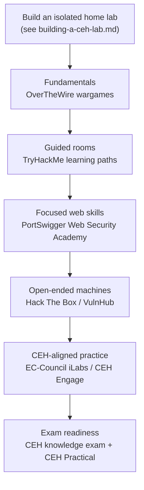

# Legitimate Online Practice Ranges

Once you have a local lab ([building-a-ceh-lab.md](building-a-ceh-lab.md)), online practice platforms let you keep building hands-on skill against legally provided targets without maintaining the infrastructure yourself. This page lists well-known, legitimate platforms, each described factually with its purpose.

> **The one rule that governs all of them: only practise on systems you own or are explicitly authorised to use.** Every platform below provides targets it owns or has arranged for you to attack, and your authorisation is limited to those targets. Pointing these skills at anything outside the platform's sandbox — a real website, a company, a neighbour's network — is unauthorised and illegal in most jurisdictions. See [../00-overview/legal-and-ethics.md](../00-overview/legal-and-ethics.md).

## Learning objectives

- Identify reputable online platforms for legal, hands-on security practice.
- State the purpose of each platform in one line.
- Apply the authorisation rule to every platform without exception.
- Sketch a sensible skill-progression path from beginner to more advanced practice.

## Platforms at a glance

| Platform | One-line purpose | Authorisation rule |
| --- | --- | --- |
| **EC-Council iLabs / CEH Engage** | Official EC-Council cloud labs and a simulated engagement aligned to the CEH curriculum | Practise only on the provided lab/range targets |
| **Hack The Box** | Subscription platform of hosted vulnerable machines and challenges for hands-on practice | Practise only on the provided lab/range targets |
| **TryHackMe** | Guided, beginner-friendly rooms and learning paths with hosted targets | Practise only on the provided lab/range targets |
| **PortSwigger Web Security Academy** | Free web-security training with interactive, browser-based vulnerable labs | Practise only on the provided lab/range targets |
| **VulnHub** | Library of downloadable intentionally vulnerable virtual machines you run in your own isolated lab | Practise only on machines you download and run yourself |
| **OverTheWire** | Free "wargames" that teach security concepts via progressive Secure Shell (SSH) challenges | Practise only on the provided lab/range targets |

> **Read each platform's own rules.** Beyond the universal rule above, every platform publishes Terms of Service and a code of conduct (for example, rules against attacking the platform's own infrastructure or sharing answers). These are binding — follow them.

## Choosing a platform

| If you want… | Start with |
| --- | --- |
| Labs that map directly to the CEH course | EC-Council iLabs / CEH Engage |
| Gentle, guided introductions | TryHackMe |
| Free, focused web-application practice | PortSwigger Web Security Academy |
| Open-ended boxes that mirror real engagements | Hack The Box |
| Practice fully offline in your own lab | VulnHub (see [building-a-ceh-lab.md](building-a-ceh-lab.md)) |
| Fundamentals via command-line challenges | OverTheWire |

## Suggested skill-progression path

This is a sensible order, not a rule — adapt it to your background as a systems administrator.

> For a sysadmin: your strengths in operating systems, networking, and Active Directory transfer directly. Beginner platforms will feel quick; spend your time on the unfamiliar attacker's-perspective parts.

## Where to go next

- [building-a-ceh-lab.md](building-a-ceh-lab.md) — build the local lab these platforms complement.
- [../tools/tools-by-phase.md](../tools/tools-by-phase.md) — the tools you will use on these ranges.
- [../00-overview/five-phases-of-hacking.md](../00-overview/five-phases-of-hacking.md) — the methodology to practise.
- [../00-overview/legal-and-ethics.md](../00-overview/legal-and-ethics.md) — authorisation and the law.

## Sources

- EC-Council, Certified Ethical Hacker (CEH) official program page — https://www.eccouncil.org/train-certify/certified-ethical-hacker-ceh/
- EC-Council iLabs / CEH Cyber Range (verify current details on EC-Council) — https://www.eccouncil.org/
- Hack The Box — https://www.hackthebox.com/
- TryHackMe — https://tryhackme.com/
- PortSwigger Web Security Academy — https://portswigger.net/web-security
- VulnHub — https://www.vulnhub.com/
- OverTheWire wargames — https://overthewire.org/wargames/
