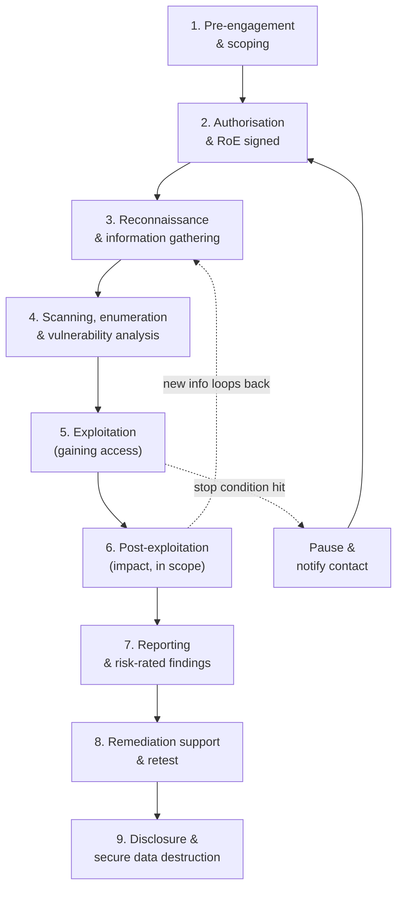
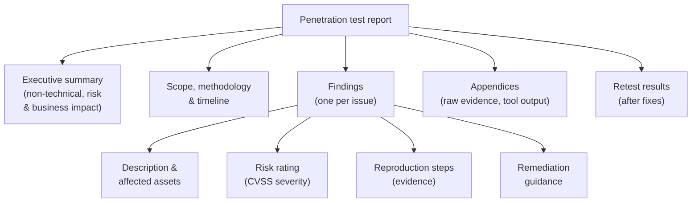

# Engagement Methodology and Reporting

Knowing attack techniques is only half of being a Certified Ethical Hacker (CEH). The other half is conducting a **professional engagement**: agreeing what will be tested and how, working safely and lawfully within those limits, handling evidence properly, and — most importantly to the client — delivering a **report** that turns findings into fixes. This page walks through the engagement lifecycle from pre-engagement scoping to final retest, maps the [five phases of ethical hacking](five-phases-of-hacking.md) onto a real engagement, and shows what CEH expects you to think about at each step. It also references the recognised methodologies CEH draws on: PTES, NIST SP 800-115, OSSTMM, and MITRE ATT&CK.

> Everything here assumes the legal foundation is already in place: explicit written authorisation, an agreed scope, and Rules of Engagement (RoE). See [legal-and-ethics.md](legal-and-ethics.md) — without those, *none* of this is lawful.

## Learning objectives

- Describe the professional **engagement lifecycle** end to end.
- Explain **pre-engagement and scoping**, and the role of the **Rules of Engagement (RoE)** and authorisation.
- Map the **five phases of hacking** onto a real engagement's testing methodology.
- Explain **evidence handling** and **chain of custody**.
- Structure a professional penetration-test **report**: executive summary, findings with **CVSS** risk ratings, reproduction steps, remediation, and retest.
- Recognise the major methodologies — **PTES, NIST SP 800-115, OSSTMM, MITRE ATT&CK** — and how CEH expects you to think.

## The engagement lifecycle

A professional engagement is far larger than "the hacking part." Most of the value (and the legal protection) comes from the work before and after active testing.

## Pre-engagement and scoping

Before any testing, the tester and client agree exactly what the engagement covers. This is the **pre-engagement** phase (the first phase of PTES, the Penetration Testing Execution Standard).

Scoping defines:

- **Targets** — IP (Internet Protocol) ranges, domains, applications, accounts, and physical locations that are *in* scope.
- **Exclusions** — assets that must **not** be touched (e.g. production payroll, medical or safety systems).
- **Engagement type** — black-box, white-box, or grey-box (how much prior knowledge the tester is given). See [legal-and-ethics.md](legal-and-ethics.md).
- **Permitted techniques** — whether social engineering, Denial-of-Service (DoS) testing, or physical entry are allowed (often explicitly excluded).
- **Timing windows** — when testing may occur, to limit business impact.
- **Goals and "crown jewels"** — what the client most wants protected, which focuses the test.

> Scoping is where the engagement's value is decided. Too narrow and the test misses real risk; too broad and it loses focus. CEH expects you to scope deliberately, in writing, before touching anything.

## Rules of Engagement and authorisation

The **Rules of Engagement (RoE)** is the document that operationalises scope into a working playbook. The **authorisation letter** (the signed "get-out-of-jail-free" letter) proves the testing is permitted. Together with a contract / Statement of Work (SoW) and a Non-Disclosure Agreement (NDA), they form the legal basis of the engagement (covered fully in [legal-and-ethics.md](legal-and-ethics.md)).

For methodology purposes, the RoE must pin down:

- **Points of contact** and an **escalation path** for emergencies.
- **Stop conditions** — when to halt immediately (e.g. system instability, or signs of a *real*, pre-existing breach).
- **Handling of discovered sensitive data** and of accidental impact.
- **Communication cadence** — status updates, and immediate notification of critical findings.
- **Evidence-handling and confidentiality** terms.

## The testing methodology — mapping the five phases

CEH's [five phases of hacking](five-phases-of-hacking.md) are the *technical engine* inside the engagement lifecycle. In a real engagement they map cleanly onto the testing work between authorisation and reporting.

| CEH phase | In a real engagement | Notes |
| --- | --- | --- |
| **1. Reconnaissance** | Information gathering / OSINT on in-scope targets | Build the target profile. See [../domains/02-footprinting-and-reconnaissance.md](../domains/02-footprinting-and-reconnaissance.md) (cross-reference). |
| **2. Scanning & Enumeration** | Discover live hosts, services, and accounts; run **vulnerability analysis** | Feeds the findings list. See [../domains/05-vulnerability-analysis.md](../domains/05-vulnerability-analysis.md). |
| **3. Gaining Access** | Exploit selected weaknesses to prove impact (within RoE) | Only exploit what scope/RoE permit; document each step. |
| **4. Maintaining Access** | Demonstrate persistence to show business impact | Changes are recorded and reverted as agreed. |
| **5. Clearing Tracks** | *Documented, not destructive* — describe what an attacker could hide | Testers do **not** maliciously destroy logs; they note the risk. |

> The key professional difference from a real attacker: every action is **authorised, scoped, logged, reversible, and reported**. A tester proves impact, then *restores* the environment — they never cause lasting harm.

This sequence is essentially the PTES execution flow (intelligence gathering → threat modelling → vulnerability analysis → exploitation → post-exploitation), and the discovery/attack phases of NIST SP 800-115. CEH presents the five-phase vocabulary, but expects you to recognise the same lifecycle in any of these standards.

## Evidence handling and chain of custody

Findings are only credible if the evidence behind them is trustworthy and properly controlled.

- **Capture clear evidence.** Screenshots, request/response logs, command output, and timestamps that demonstrate each finding without exposing more sensitive data than necessary.
- **Protect it.** Store evidence encrypted; restrict access; never copy client data to personal or uncontrolled systems.
- **Maintain chain of custody.** Record *what* was collected, *when*, *by whom*, and *how it was handled and stored*. **Chain of custody** is the documented, unbroken trail showing evidence has not been tampered with — essential if a finding ever supports legal or HR action, or an incident investigation.
- **Minimise and protect sensitive data.** Handle any personal or regulated data per the RoE and applicable privacy law; redact where possible.
- **Securely destroy data** at the end of the engagement, per the agreed terms.

> Administrator's view: the same discipline you would expect of an incident responder applies to a tester. If evidence handling is sloppy, a real finding can be disputed — and you may have created a new data-exposure risk yourself.

## The deliverable: the report

The report is the product the client pays for. A good report is **read by two very different audiences** — executives who need the business picture, and technical staff who must reproduce and fix each issue — so it is structured for both.

A professional report typically contains:

- **Executive summary** — a non-technical overview for leadership: overall risk posture, the most serious issues, and business impact. No jargon; this is what decision-makers read.
- **Scope, methodology, and timeline** — what was tested, how, when, and against which standards (e.g. PTES, NIST SP 800-115). Establishes credibility and reproducibility.
- **Findings**, one per issue, each with:
  - **Description and affected assets** — what the weakness is and where it exists.
  - **Risk rating** — severity via the **Common Vulnerability Scoring System (CVSS)**: a 0.0–10.0 score mapped to None / Low / Medium / High / Critical, ideally adjusted for the client's environment (asset value, exposure). See [../domains/05-vulnerability-analysis.md](../domains/05-vulnerability-analysis.md).
  - **Reproduction steps** — enough detail (with evidence) for the client to reproduce and confirm the issue.
  - **Remediation** — concrete, prioritised guidance to fix or mitigate the issue (patch, reconfigure, compensating control).
- **Appendices** — raw evidence, tool output, and references, kept out of the main narrative.
- **Retest** — after the client remediates, the tester **rescans/retests** to confirm fixes worked and introduced no new problems, and updates each finding's status.

> CEH expects you to **prioritise by risk, not by raw CVSS score alone.** A Medium-severity flaw on an internet-facing crown-jewel system can matter more than a Critical on an isolated test box. The report should make that prioritisation explicit so remediation effort goes where it counts.

### Risk ratings and MITRE ATT&CK

Two reference frameworks strengthen a report:

- **CVSS (maintained by FIRST, the Forum of Incident Response and Security Teams)** — the standard, vendor-neutral severity score; gives findings a comparable, defensible rating.
- **MITRE ATT&CK** (Adversarial Tactics, Techniques, and Common Knowledge) — a knowledge base of real adversary behaviour. Mapping each finding or attack path to ATT&CK technique IDs lets the client align their **detections** to the very techniques the test demonstrated, turning the report into a defensive roadmap.

## Disclosure

How findings are shared depends on the engagement:

- **Internal engagement** — findings go to the client under the NDA; distribution is controlled and need-to-know.
- **Coordinated / responsible disclosure** — when a flaw is found in a *third party's* product (e.g. a vendor whose software the client uses), it is reported privately to that vendor with reasonable time to fix before any public disclosure. A widely referenced standard is **ISO/IEC 29147** (vulnerability disclosure); vendors track issues with **Common Vulnerabilities and Exposures (CVE)** identifiers.

See [legal-and-ethics.md](legal-and-ethics.md) for the full treatment of disclosure, bug bounties, and full vs responsible disclosure.

## Recognised methodologies (how CEH expects you to think)

CEH is methodology-aware: it expects you to recognise the major standards and understand that they describe the *same* engagement lifecycle through different lenses.

| Methodology | Focus | Structure (summary) |
| --- | --- | --- |
| **PTES** (Penetration Testing Execution Standard) | The engagement *process* end to end | Seven phases: pre-engagement, intelligence gathering, threat modelling, vulnerability analysis, exploitation, post-exploitation, reporting. |
| **NIST SP 800-115** (Technical Guide to Information Security Testing and Assessment) | US-government technical assessment baseline | Four phases: planning, discovery, attack, reporting. |
| **OSSTMM** (Open Source Security Testing Methodology Manual) | Measurable, metrics-driven rigour | Scientific approach measuring operational security across channels (network, physical, wireless, human). |
| **MITRE ATT&CK** | Adversary behaviour knowledge base | Tactics and techniques (with IDs) used to map findings and detections, not a linear process. |
| **OWASP testing guides** | Application-layer coverage | Methodology for web and application testing (complements the above). |

> The takeaway CEH wants: these are **complementary**, not competing. PTES gives you the process spine, NIST SP 800-115 a recognised baseline, OSSTMM measurable rigour, and MITRE ATT&CK a shared vocabulary for adversary behaviour. A mature engagement borrows from all of them.

## Where to go next

- [legal-and-ethics.md](legal-and-ethics.md) — authorisation, scope, RoE, and disclosure (the legal foundation).
- [five-phases-of-hacking.md](five-phases-of-hacking.md) — the technical methodology inside the engagement.
- [../domains/05-vulnerability-analysis.md](../domains/05-vulnerability-analysis.md) — CVSS, findings, and the vulnerability-management lifecycle.
- [ai-in-ethical-hacking.md](ai-in-ethical-hacking.md) — how AI assists triage and report drafting (with verification).
- [../reference/acronyms.md](../reference/acronyms.md) — expanded acronyms (RoE, SoW, NDA, CVSS, CVE, PTES, OSSTMM).

## Sources

- EC-Council, Certified Ethical Hacker (CEH) v13 program page — https://www.eccouncil.org/train-certify/certified-ethical-hacker-ceh/
- PTES, Penetration Testing Execution Standard — http://www.pentest-standard.org/
- NIST SP 800-115, Technical Guide to Information Security Testing and Assessment — https://csrc.nist.gov/pubs/sp/800/115/final
- ISECOM, OSSTMM (Open Source Security Testing Methodology Manual) — https://www.isecom.org/OSSTMM.3.pdf
- MITRE ATT&CK knowledge base — https://attack.mitre.org/
- FIRST, Common Vulnerability Scoring System (CVSS) — https://www.first.org/cvss/
- ISO/IEC 29147, Vulnerability disclosure — https://www.iso.org/standard/72311.html
- OWASP Web Security Testing Guide — https://owasp.org/www-project-web-security-testing-guide/
- Verified ground truth for this hub: five phases = Reconnaissance → Scanning & Enumeration → Gaining Access → Maintaining Access → Clearing Tracks.
