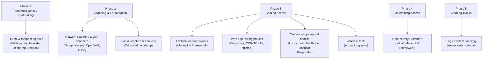

# CEH Tools by Phase and Module

This page is a quick reference to common tools that appear across the Certified Ethical Hacker (CEH) curriculum, organised by the phase or module where they are typically used. The focus is strictly on **what each tool is for** — its category and purpose — so you can recognise tool names on the exam and choose the right *type* of tool for a given task in an authorised lab.

> **Ethics and legality first.** Every tool below can be misused. Only ever run these against systems you **own** or are **explicitly authorised in writing** to test, inside an isolated lab or an authorised range. Running these against third-party systems without permission is a crime in most jurisdictions. See [../00-overview/legal-and-ethics.md](../00-overview/legal-and-ethics.md). This page deliberately contains **no command-line recipes, exploit code, or attack steps** — only descriptions of purpose. To practise safely, build a lab first: [../labs/building-a-ceh-lab.md](../labs/building-a-ceh-lab.md).

## Learning objectives

- Map common CEH tools to the phase or module where they are used.
- Describe the **category and purpose** of each tool without weaponised usage detail.
- Distinguish tool categories (scanner, sniffer, framework, cracker, etc.) so you can pick the right *type* of tool for a task.
- Recognise tool names as they appear in exam questions.

## The five phases (and where tools fit)

The CEH methodology has five phases. Most tools map cleanly to one or two of them. See [../00-overview/five-phases-of-hacking.md](../00-overview/five-phases-of-hacking.md) for the full methodology.

## Reconnaissance and footprinting (Open-Source Intelligence)

Open-Source Intelligence (OSINT) tools gather publicly available information about a target before any active interaction.

| Tool | Category | Purpose | Module / phase |
| --- | --- | --- | --- |
| **Maltego** | OSINT / link analysis | Visually maps relationships between people, domains, infrastructure, and other entities from public data sources | Reconnaissance / Footprinting |
| **theHarvester** | OSINT collector | Gathers emails, subdomains, hostnames, and related data from public search engines and sources | Reconnaissance / Footprinting |
| **Recon-ng** | OSINT framework | Modular framework for organising and automating open-source reconnaissance | Reconnaissance / Footprinting |
| **Shodan** | Internet device search engine | Indexes internet-connected devices and exposed services so you can discover an authorised target's public footprint | Reconnaissance / Footprinting |

> For a sysadmin: footprinting is the attacker's version of "inventorying" an organisation — but only from public information. It is the first thing a real attacker does, so understanding it helps you reduce your own exposure.

## Scanning, enumeration, and vulnerability assessment

These tools probe reachable hosts to map open ports, identify services, and find known weaknesses.

| Tool | Category | Purpose | Module / phase |
| --- | --- | --- | --- |
| **Nmap** (Network Mapper) | Network/port scanner | Discovers live hosts, open ports, services, and operating-system hints; the de-facto standard scanner | Scanning &amp; Enumeration |
| **Nessus** | Vulnerability scanner | Commercial scanner that checks hosts against a large database of known vulnerabilities and misconfigurations | Vulnerability Analysis |
| **OpenVAS** (Open Vulnerability Assessment Scanner) | Vulnerability scanner | Open-source vulnerability scanner; an alternative to commercial scanners for authorised assessments | Vulnerability Analysis |
| **Nikto** | Web server scanner | Scans web servers for known vulnerable files, outdated software, and common server misconfigurations | Web/Scanning |

## Packet capture and traffic analysis

These tools observe network traffic, which is essential for both offence and defence.

| Tool | Category | Purpose | Module / phase |
| --- | --- | --- | --- |
| **Wireshark** | Packet sniffer / analyser | Captures and decodes network traffic with a graphical interface for deep protocol inspection | Sniffing |
| **tcpdump** | Command-line packet sniffer | Lightweight command-line capture of network packets, useful where no graphical interface is available | Sniffing |
| **Responder** | LLMNR/NBT-NS poisoner (analysis/credential context) | Demonstrates name-resolution poisoning on a local network to study how credential-harvesting attacks work | Sniffing / Network attacks |

> The acronyms here: **LLMNR** is Link-Local Multicast Name Resolution and **NBT-NS** is NetBIOS Name Service — legacy Windows name-resolution protocols that are commonly studied as attack surfaces.

## Exploitation and gaining access

Frameworks and utilities used to validate and demonstrate exploitable conditions in an **authorised** test.

| Tool | Category | Purpose | Module / phase |
| --- | --- | --- | --- |
| **Metasploit Framework** | Exploitation framework | Modular framework for organising exploits, payloads, and post-exploitation modules during authorised testing | Gaining Access / System Hacking |
| **netcat** (`nc`) | Network utility ("TCP/IP Swiss-army knife") | Reads and writes raw network connections; used for connectivity testing, simple listeners, and transfers | Gaining / Maintaining Access |

## Web application testing

Tools focused on the Open Web Application Security Project (OWASP) class of web vulnerabilities.

| Tool | Category | Purpose | Module / phase |
| --- | --- | --- | --- |
| **Burp Suite** | Web app testing proxy | Intercepting proxy and toolkit for inspecting and analysing web application traffic and behaviour | Hacking Web Applications |
| **OWASP ZAP** (Zed Attack Proxy) | Web app testing proxy | Open-source intercepting proxy and web scanner; an alternative to commercial proxies | Hacking Web Applications |
| **sqlmap** | SQL-injection testing tool | Automates detection and assessment of Structured Query Language (SQL) injection flaws against authorised targets | SQL Injection |

## Password and credential attacks

These tools assess the strength of passwords and authentication — used only against accounts and hashes you are authorised to test.

| Tool | Category | Purpose | Module / phase |
| --- | --- | --- | --- |
| **Hydra** | Online login auditor | Tests authentication strength against live network services to study weak-credential risk | System Hacking |
| **John the Ripper** | Offline password cracker | Recovers passwords from captured hashes to demonstrate weak-password risk (offline) | System Hacking / Cryptography |
| **Hashcat** | Offline password cracker | High-performance, hardware-accelerated hash cracking for password-strength assessment (offline) | System Hacking / Cryptography |

> **Online vs offline:** an *online* tool (like Hydra) tests a live service; an *offline* cracker (John the Ripper, Hashcat) works on captured hashes without touching the target. Offline work is safer and more representative of real password-strength analysis.

## Wireless

| Tool | Category | Purpose | Module / phase |
| --- | --- | --- | --- |
| **Aircrack-ng** (suite) | Wireless security toolkit | Suite for capturing and analysing Wi-Fi traffic and assessing wireless security on networks you own | Hacking Wireless Networks |

## Tool category cheat-sheet

When an exam question describes a *need*, match it to a *category* rather than memorising one product:

| If you need to… | Category | Example tools |
| --- | --- | --- |
| Gather public info on a target | OSINT collector / framework | Maltego, theHarvester, Recon-ng, Shodan |
| Find live hosts and open ports | Network/port scanner | Nmap |
| Find known vulnerabilities | Vulnerability scanner | Nessus, OpenVAS, Nikto |
| Inspect network traffic | Packet sniffer/analyser | Wireshark, tcpdump |
| Organise exploits and payloads | Exploitation framework | Metasploit Framework |
| Test a web application | Web app proxy / scanner | Burp Suite, OWASP ZAP |
| Assess SQL injection | SQL-injection tester | sqlmap |
| Assess password strength (live) | Online login auditor | Hydra |
| Crack captured hashes (offline) | Offline password cracker | John the Ripper, Hashcat |
| Assess Wi-Fi security | Wireless toolkit | Aircrack-ng |
| Raw network connections / listener | Network utility | netcat |

## Where to go next

- [building-a-ceh-lab.md](../labs/building-a-ceh-lab.md) — set up a safe place to practise with these tools.
- [practice-ranges.md](../labs/practice-ranges.md) — legitimate online platforms to use them legally.
- [../00-overview/five-phases-of-hacking.md](../00-overview/five-phases-of-hacking.md) — the methodology these tools support.
- [../00-overview/legal-and-ethics.md](../00-overview/legal-and-ethics.md) — authorisation and the law.
- [../reference/acronyms.md](../reference/acronyms.md) — expanded acronyms used across this hub.

## Sources

- EC-Council, Certified Ethical Hacker (CEH) official program page — https://www.eccouncil.org/train-certify/certified-ethical-hacker-ceh/
- Nmap official site — https://nmap.org/
- Wireshark official site — https://www.wireshark.org/
- tcpdump official site — https://www.tcpdump.org/
- Metasploit Framework — https://www.metasploit.com/
- Burp Suite (PortSwigger) — https://portswigger.net/burp
- OWASP Zed Attack Proxy (ZAP) — https://www.zaproxy.org/
- Nikto (CIRT) — https://cirt.net/Nikto2
- sqlmap official site — https://sqlmap.org/
- Hydra (THC) — https://github.com/vanhauser-thc/thc-hydra
- John the Ripper (Openwall) — https://www.openwall.com/john/
- Hashcat official site — https://hashcat.net/hashcat/
- Aircrack-ng official site — https://www.aircrack-ng.org/
- Maltego official site — https://www.maltego.com/
- theHarvester — https://github.com/laramies/theHarvester
- Recon-ng — https://github.com/lanmaster53/recon-ng
- Shodan — https://www.shodan.io/
- Tenable Nessus — https://www.tenable.com/products/nessus
- OpenVAS / Greenbone — https://www.openvas.org/
- Responder — https://github.com/lgandx/Responder
