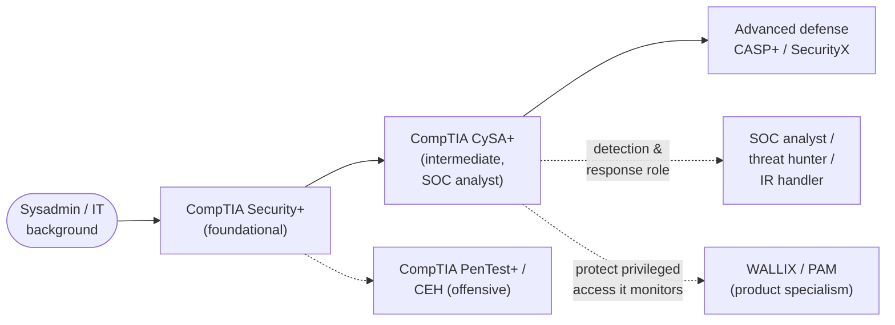

# What is CompTIA CySA+ (CS0-003)?

CompTIA **CySA+** — short for **Cybersecurity Analyst** — is a vendor-neutral,
**intermediate**, **defensive (blue-team)** certification from **CompTIA (the Computing
Technology Industry Association)**. It validates the skills a **Security Operations Center
(SOC)** analyst uses to **detect, analyze, and respond** to threats: ingesting and
interpreting logs, hunting for malicious activity, managing vulnerabilities, running the
incident-response process, and communicating findings to stakeholders. The current exam is
**CS0-003**. This page explains what the credential is, who it is for, the experience
CompTIA recommends, and where it sits in a learning path — including how it relates to this
repo's offensive (CEH) and Privileged Access Management (PAM/WALLIX) material.

> **Unofficial & no fabrication.** This hub is not affiliated with or endorsed by CompTIA.
> Exam specifics come from CompTIA's official CySA+ page; anything volatile (exam code,
> retirement date, price, renewal/Continuing Education terms, DoD mapping) is flagged
> **"verify on CompTIA"** and should be re-checked there before you rely on it. Compiled
> **2026-06-20**.

## Learning objectives

After working through this page you should be able to:

- Explain what CySA+ is and who issues it (**CompTIA**).
- Describe what **vendor-neutral**, **intermediate**, and **defensive/analyst** mean for
  this credential.
- Identify who CySA+ is for and the experience CompTIA recommends.
- Place CySA+ in a sysadmin-to-SOC-analyst path, **after Security+**.
- Relate CySA+ (detection/response) to this repo's **CEH** offense and **WALLIX/PAM**
  access-control defense.
- Summarise its US Department of Defense (DoD) 8140 relevance and where to confirm it.

## Who issues CySA+? (CompTIA)

CySA+ is produced by **CompTIA (the Computing Technology Industry Association)**, a
non-profit trade body and one of the largest vendor-neutral IT certification providers.
Within CompTIA's security track, CySA+ sits between the foundational **Security+** and the
advanced **CASP+/SecurityX**, alongside the offensive **PenTest+**.

Always treat the official CompTIA CySA+ page as the authoritative source for the current
exam code, format, languages, price, and renewal terms, because these change between exam
versions: <https://www.comptia.org/en-us/certifications/cybersecurity-analyst/>
*(verify — specifics change)*.

## "Vendor-neutral", "intermediate", and "defensive" — the core idea

Three properties define where CySA+ fits:

- **Vendor-neutral** — it is not tied to a single product. It teaches the *analyst's
  reasoning* (how to read a SIEM alert, correlate logs, scope an incident) rather than how
  to operate one vendor's console. This contrasts with product certifications such as the
  **WALLIX Academy** credentials in this repo's [main hub](../../../README.md), which certify a
  specific Privileged Access Management (PAM) product.
- **Intermediate** — it sits a level **above the foundational Security+**. It assumes you
  already know the vocabulary (CIA triad, controls, cryptography, Zero Trust) and goes
  deeper into **applying** it operationally: analyzing real indicators, prioritizing
  vulnerabilities, and running response.
- **Defensive (blue-team / analyst)** — CySA+ is built around the **SOC analyst** role:
  monitoring, detection, threat hunting, vulnerability management, and incident response.
  Offensive techniques appear only as **threats to detect and counter**, never as
  weaponized how-tos.

> For a systems administrator moving to a blue-team role: CySA+ formalizes the *analyst
> workflow* on top of skills you may already touch — reading logs, patching, watching
> alerts. It names and structures the day-to-day work of a SOC.

## Who CySA+ is for

CySA+ suits people moving into a **detection-and-response** role, including:

- **SOC analysts (Tier 1 / Tier 2)** and security operations staff.
- **Threat-intelligence and threat-hunting** analysts.
- **Vulnerability-management** analysts and security engineers.
- **Incident-response** handlers and triage analysts.
- **Systems and network administrators** moving into a blue-team role (this hub's primary
  audience) who already have Security+ or equivalent knowledge.

### Recommended experience (not required)

CompTIA recommends — but does not **require** — the following before attempting CySA+:

| Recommendation | Detail |
| --- | --- |
| Prior certification | **CompTIA Security+** (or equivalent foundational security knowledge) |
| Hands-on experience | **About four years** in an incident-response or security-analyst role *(verify on CompTIA)* |

These are guidance, not gatekeeping: there is **no mandatory prerequisite exam** or formal
eligibility application. A sysadmin's existing operating-system, networking, and logging
knowledge maps directly onto the material. See
[exam-and-objectives.md](exam-and-objectives.md) for the full exam detail.

## Where CySA+ sits in a certification path

CySA+ is typically taken **after Security+**, as the **defensive specialisation** that turns
foundational breadth into operational analyst skill.

How it relates to the other study hubs in this repository:

- **Relative to Security+ (before CySA+):** Security+ is the **breadth baseline** — it
  surveys threats, architecture, operations, and governance. CySA+ goes **deeper on the
  operations/analyst side**: where Security+ Domain 4
  ([Security Operations](../../security-plus/domains/04-security-operations.md)) *introduces*
  monitoring and incident response, CySA+ makes the **whole exam** about analyzing
  indicators, hunting threats, and running response. Do Security+ first.
- **Relative to this repo's CEH hub (offense):** the
  **CEH (Certified Ethical Hacker)** hub teaches the **attacker's** techniques. CySA+ is the
  **other side of the same coin** — it teaches the analyst to **detect and respond to** those
  same techniques. Reading the CEH module on a technique (e.g.
  [introduction to ethical hacking](../../ceh/domains/01-introduction-to-ethical-hacking.md))
  tells you what an analyst is hunting for. CySA+ never weaponizes; it defends.
- **Relative to WALLIX / Privileged Access Management (PAM):** PAM products such as WALLIX
  **control and record privileged access**; CySA+ is the analyst who **monitors and
  investigates** that access — privileged-account misuse is a top thing a SOC hunts for (see
  [the PAM threat landscape](../../../foundations/pam-threat-landscape.md)). The
  [attack-to-defense matrix](../../../attack-to-defense-matrix.md) maps attacker techniques to
  the controls an analyst relies on.
- **Shared fundamentals:** the cross-cutting [protocols reference](../../../protocols/README.md)
  (TLS, Kerberos, LDAP, SAML, OIDC/OAuth2, RADIUS, SSH) and the repo
  [reference glossary and acronyms](../../../reference/README.md) reinforce concepts that appear
  across CySA+, Security+, CEH, and PAM.

## DoD 8140 relevance *(verify on DoD / CompTIA)*

Like Security+, CySA+ is referenced as a **United States Department of Defense (DoD)**
baseline credential for several cyber work roles. CompTIA states that CySA+ aligns with
multiple **DoD Directive 8140** roles (particularly analyst and incident-response roles).
**DoD Directive 8140** is the current cyber-workforce qualification framework that succeeded
the older **DoD 8570** information-assurance baseline. This alignment is a reason CySA+
appears in US government and defence-contractor job requirements.

- Approved-certification lists and role mappings are **revised over time** — confirm the
  current CySA+ status and role mappings on the DoD cyber-workforce site:
  <https://public.cyber.mil/> *(verify on DoD / CompTIA — specifics change)*.

## Where to go next

- [exam-and-objectives.md](exam-and-objectives.md) — exam format, the four domains and
  weightings, performance-based questions (PBQs), and renewal.
- [../domains/README.md](../domains/README.md) — the four domain pages written to the
  CS0-003 objectives.
- [../../security-plus/README.md](../../security-plus/README.md) — the foundational sibling
  hub to take first.
- [../../ceh/README.md](../../ceh/README.md) — the offensive-leaning sibling hub (the attacks
  CySA+ teaches you to detect).
- [../../reference/README.md](../../../reference/README.md) — repo-wide glossary, acronyms, and
  standards.

## Sources

- CompTIA — CySA+ (CS0-003) official certification page (provider, vendor-neutral /
  intermediate / defensive positioning, recommended Security+ and ~4 years experience, four
  domains, DoD 8140 alignment): <https://www.comptia.org/en-us/certifications/cybersecurity-analyst/>
- US DoD Cyber Workforce, Directive 8140 (formerly 8570) — verify current CySA+ mapping:
  <https://public.cyber.mil/>
- Related in this repo: [../../security-plus/README.md](../../security-plus/README.md) ·
  [../../ceh/README.md](../../ceh/README.md) · [../../README.md](../../../README.md)
  (WALLIX/PAM hub) · [../../protocols/README.md](../../../protocols/README.md) ·
  [../../reference/README.md](../../../reference/README.md)
- Verify all volatile specifics (exam code, retirement date, price, renewal/CEU terms, DoD
  mapping) on CompTIA's site — programs change.
