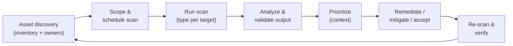
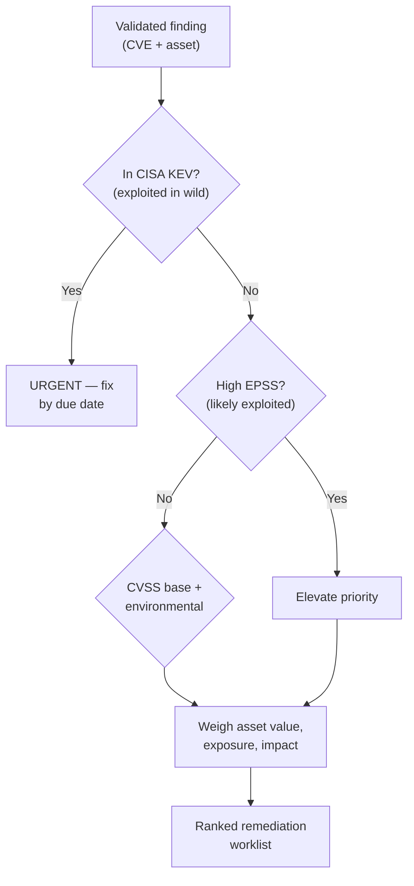
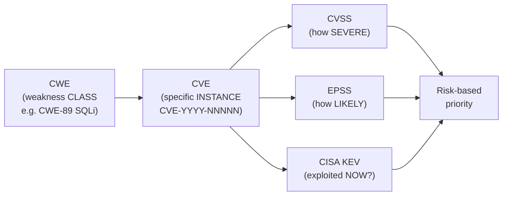

# Domain 2 — Vulnerability Management

This is the **largest** domain in the **CompTIA Cybersecurity Analyst (CySA+) CS0-003** exam — about **30%** of the scored questions, the single biggest slice. Where Security+ taught you *what* a vulnerability is, CySA+ makes you the analyst who **runs the program**: discover the assets, scan them, read the scanner output critically, tell a real finding from noise, **prioritize** what to fix first when you can never fix everything at once, drive the remediation, and frame it all with the attack frameworks (MITRE ATT&CK, the Diamond Model, the Cyber Kill Chain) that explain *why* a given weakness matters to an adversary. For a system administrator moving to the blue team, this is the daily grind of a Security Operations Center (SOC): a firehose of scanner findings that you must turn into a short, defensible list of actions. The repo's [Security+ Domain 2](../../security-plus/domains/02-threats-vulnerabilities-mitigations.md) covers the underlying vulnerability *concepts*; this page covers the *management process* the analyst owns.

> **Note on objective numbering.** CompTIA groups this domain into objectives 2.1–2.5. This page follows those topic areas faithfully without reproducing CompTIA's numbering verbatim — confirm the exact breakdown against the official **CS0-003 Exam Objectives** (Sources). Where a figure is not published by CompTIA, NIST, FIRST, or MITRE it is marked accordingly; nothing here is fabricated.

## Learning objectives

After working through this page you should be able to:

- Run **asset discovery** and choose the right **scan type** — credentialed vs. uncredentialed, agent vs. agentless, internal vs. external, active vs. passive — and explain the special care that **fragile/operational technology (OT)** demands.
- Analyze output from **network, web-application, cloud, and infrastructure** vulnerability scanners.
- **Validate** findings: distinguish true/false positives and true/false negatives and **reconcile** results across tools.
- **Prioritize** with context using **CVSS** (base/temporal/environmental metrics) and supplement it with **EPSS** and the **CISA KEV** catalog, weighing exploitability, asset value, exposure, zero-day risk, and organizational/industry impact.
- Drive **vulnerability response and management**: controls (managerial/operational/technical/physical), patch and configuration management, compensating controls, risk acceptance, secure coding, the SDLC, and threat modeling.
- Use the **attack frameworks** — MITRE ATT&CK, the Diamond Model, the Cyber Kill Chain — and the **CVE/CWE** identifier systems.

---

## 1. Discovery and scanning

You cannot protect what you do not know you have, so vulnerability management starts with **asset discovery**: enumerating hosts, services, software, and their owners to build an accurate, current inventory. Discovery feeds the **scope** of every scan; an incomplete inventory is itself a vulnerability (the unmanaged "shadow" host is the one that gets breached).

### Scan types

CompTIA expects you to choose the right scan for the target and to know the trade-offs. These are paired dimensions, not a single list:

| Dimension | Option | What it means | Trade-off |
|---|---|---|---|
| **Authentication** | **Credentialed** | Scanner logs in with valid credentials and reads installed-software/patch levels and configuration from inside. | Far more accurate, fewer false positives; needs managed credentials (a privileged-access concern). |
| | **Uncredentialed** | Scans from outside with no login — sees only what is exposed on the network. | Mimics an external attacker's view; misses local detail, more false positives. |
| **Deployment** | **Agent-based** | A persistent agent on the host scans locally and reports in. | Great for mobile/intermittent and cloud hosts; works offline; agent must be deployed and maintained. |
| | **Agentless** | A central scanner reaches out over the network. | No software to install; needs network reachability and (for depth) credentials. |
| **Vantage** | **Internal** | Scan from inside the perimeter. | Shows what an insider or post-breach attacker sees; reveals lateral-movement paths. |
| | **External** | Scan from the public internet against your edge. | Shows the **attack surface** an outsider can reach; key for internet-facing assets. |
| **Interaction** | **Active** | Sends probes/packets to elicit responses. | Thorough; can disrupt fragile systems and generates traffic/alerts. |
| | **Passive** | Observes existing traffic (e.g., span/tap, NetFlow) without probing. | Zero impact on targets — ideal for OT; only sees what happens to be on the wire. |

### Special considerations — fragile and operational technology

Some targets can be **knocked over by the scan itself**. Legacy systems, embedded devices, medical equipment, and especially **OT / Industrial Control Systems (ICS)** — Supervisory Control and Data Acquisition (SCADA), Programmable Logic Controllers (PLCs) — may crash, reboot, or behave dangerously when probed by an aggressive active scan. The analyst's mitigations:

- Prefer **passive** discovery and **read-only** checks on OT segments.
- Schedule active scans in **maintenance windows** with system owners present.
- **Throttle** scan intensity (rate-limit, fewer concurrent checks) and exclude fragile hosts from default templates.
- Account for **regulatory/sensitivity** constraints — some data or systems are off-limits to certain scan methods.

CompTIA also tests scan-planning factors: **scope**, **regulatory requirements**, **segmentation/zoning**, **bandwidth/performance** limits, and **scan timing**. The offensive counterpart — how an attacker enumerates the same weaknesses — is in [CEH Module 5 — Vulnerability Analysis](../../ceh/domains/05-vulnerability-analysis.md).

---

## 2. Analyzing scanner output

Different scanners look at different parts of the estate; the analyst correlates them:

| Scanner class | Looks at | Notes |
|---|---|---|
| **Network / infrastructure** | Hosts, open ports, service versions, missing patches, weak configs. | The classic vulnerability scanner (e.g., the general-purpose enterprise scanners). |
| **Web application** | Injection, **cross-site scripting (XSS)**, authentication/session flaws, OWASP Top 10 issues. | Often crawls and actively tests app inputs. |
| **Cloud infrastructure** | Misconfigured storage, over-broad **Identity and Access Management (IAM)**, exposed APIs, posture drift. | Cloud Security Posture Management (CSPM) territory. |
| **Container / image** | Vulnerable OS packages and libraries baked into images. | Shifts detection "left" to build time. |

When reading any report, the analyst checks: the **severity** and score, the **CVE** identifier, the affected asset and its **business value**, whether the finding is **exploitable in this environment**, and whether it is **confirmed or merely potential** (some scanners flag "potential" findings inferred from version banners).

---

## 3. Validation — true vs. false, positive vs. negative

A scanner is a starting point, not a verdict. The analyst **validates** every significant finding against the four outcomes:

| | Vulnerability actually present | Vulnerability actually absent |
|---|---|---|
| **Scanner reported it** | **True positive** — real, act on it. | **False positive** — noise; tune it out, but document why. |
| **Scanner stayed silent** | **False negative** — the dangerous one: a real hole the tool missed. | **True negative** — correctly clean. |

- **False positives** waste remediation effort and erode trust in the program; you suppress them only after confirming they are truly false.
- **False negatives** are the most dangerous because they create false confidence — mitigated by **multiple tools**, credentialed scans, and manual testing.
- **Reconciling results**: when two scanners disagree, the analyst correlates by CVE/asset, removes duplicates, and reasons about *why* they differ (credentialed vs. not, different plug-in coverage, timing). The goal is one de-duplicated, trustworthy worklist.

---

## 4. Prioritization and context

You will always have more findings than capacity, so **prioritization is the core analyst skill**. CVSS gives a severity number, but context decides the order of work.

### CVSS — the three metric groups

The **Common Vulnerability Scoring System (CVSS)**, maintained by **FIRST**, scores severity 0.0–10.0 across three groups:

| Group | Captures | Who sets it | Changes over time? |
|---|---|---|---|
| **Base** | Intrinsic, constant traits — attack vector, attack complexity, privileges required, user interaction, scope, and CIA (confidentiality/integrity/availability) impact. | The vulnerability publisher (e.g., the National Vulnerability Database). | No. |
| **Temporal / Threat** | Maturity of exploit code, remediation level, report confidence — how the threat evolves. | Updated as the situation develops. | Yes. |
| **Environmental** | How *your* organization is affected — your CIA requirements and any modified base metrics for your deployment. | **You**, the analyst, for your environment. | Per organization. |

Severity bands (CVSS v3.x): **0.0** none, **0.1–3.9** Low, **4.0–6.9** Medium, **7.0–8.9** High, **9.0–10.0** Critical. CVSS **v4.0** refines these groups (Base/Threat/Environmental/Supplemental); confirm which version your scanner reports.

> **Key analyst point:** a high **base** score is not automatically your top priority. A Critical CVE on an isolated, internet-unreachable test box may rank below a Medium one on a public, business-critical server once you apply **environmental** context. CVSS measures *severity*, not *risk* — risk = severity × exposure × asset value × likelihood of exploitation.

### Supplementing CVSS — EPSS and CISA KEV

CVSS base alone cannot tell you *what is being exploited right now*. Two data sources close that gap:

- **EPSS (Exploit Prediction Scoring System)**, also from FIRST, gives a **0–1 probability** that a CVE will be exploited in the wild in the next 30 days. It answers "how *likely* is exploitation?" where CVSS answers "how *bad* if it is?"
- **CISA KEV (Known Exploited Vulnerabilities) catalog** lists CVEs **confirmed exploited in the wild**, each with a remediation due date for U.S. federal agencies. A CVE in KEV is no longer hypothetical — it jumps the queue.

The mature program combines all three: **CVSS** for impact, **EPSS** for predicted likelihood, **KEV** for confirmed in-the-wild exploitation — then overlays **asset value, exposure, and zero-day** status (a flaw with no patch yet, exploited before defenders can react).

CompTIA also tests broader context factors: **exploitability/weaponization**, **asset value/criticality**, **zero-day**, **internal vs. external exposure**, and **organizational and industry-specific impact** (a flaw in a payment system or a hospital device carries weight beyond its raw score).

---

## 5. Vulnerability response, handling, and management

Finding the hole is half the job; **closing or accepting it** is the rest. The analyst recommends controls and drives them to done.

### Controls by category

CompTIA classifies controls into four types — know the category for each example:

| Category | Definition | Examples |
|---|---|---|
| **Managerial** | Administrative/governance controls — policy and process. | Risk assessments, policies, security awareness program, SDLC governance. |
| **Operational** | Controls executed by people day to day. | Patch cycles, change management, configuration reviews, incident handling. |
| **Technical** | Controls enforced by technology. | Patches, firewalls, encryption, EDR, access controls, secure coding. |
| **Physical** | Controls in the physical world. | Locks, badges, cameras, secure facilities for critical/OT assets. |

### Remediation and risk handling

- **Patching / patch management** — the primary remediation; test, schedule, deploy, verify by re-scan.
- **Configuration management** — apply and maintain secure **baselines** (e.g., CIS Benchmarks); configuration drift reintroduces vulnerabilities.
- **Compensating controls** — when you *cannot* patch (legacy app, vendor delay, OT downtime cost), reduce risk another way: **segmentation/isolation**, tighter firewall rules, increased monitoring, virtual patching via IPS/WAF. The vulnerability remains, but its exploitability drops.
- **Risk acceptance** — formally documented sign-off by the **risk owner** when the cost of fixing exceeds the risk; the decision is recorded, time-bounded, and revisited (see [Domain 4 — inhibitors to remediation](04-reporting-and-communication.md)).
- **Awareness, education, and training** — reduce human-introduced vulnerabilities.
- **Secure coding, SDLC, and threat modeling** — build the fix in upstream: a **Secure Software Development Life Cycle** bakes security into each phase, and **threat modeling** (e.g., asking "what can go wrong here?" during design) finds flaws before code ships. Privileged credentials used by scanners and automation must themselves be vaulted and rotated — see [Secrets & Password Management](../../wallix/deep-dives/secrets-and-password-management.md).

---

## 6. Attack frameworks and identifier systems

Frameworks give the analyst a shared language to describe *how* an adversary would use a vulnerability — which in turn justifies its priority.

| Framework | What it models | Analyst use |
|---|---|---|
| **MITRE ATT&CK** | A knowledge base of real-world adversary **tactics** (the "why" — e.g., Initial Access, Persistence, Lateral Movement) and **techniques** (the "how"), each with a `T####` ID. | Map detections and gaps; explain which ATT&CK techniques a vulnerability enables. |
| **Cyber Kill Chain** (Lockheed Martin) | A **linear** 7-stage attack progression: reconnaissance → weaponization → delivery → exploitation → installation → command & control → actions on objectives. | Reason about where in the chain a control breaks the attack. |
| **Diamond Model** | Every intrusion as four linked vertices: **adversary, capability, infrastructure, victim**. | Pivot analysis — relate findings across incidents. |
| **OWASP** | Web-application risk taxonomy (the **OWASP Top 10**) and testing guidance. | Classify and prioritize web-app scanner findings. |

### CVE, CWE, and scoring systems

- **CVE — Common Vulnerabilities and Exposures**: a unique identifier (`CVE-YYYY-NNNNN`) for a **specific** publicly known vulnerability in a specific product. The common key for reconciling scanner results.
- **CWE — Common Weakness Enumeration**: a catalog of **weakness types** (the *class* of flaw, e.g., CWE-89 SQL injection, CWE-79 XSS) — the root cause, where a CVE is a single instance.
- **CVSS / EPSS** — the scoring systems from §4 (the prompt's "CWS" reads as a typo for one of these — **verify** against the CS0-003 objectives; CompTIA's published systems are CVE, CWE, CVSS, and EPSS).

The repo's [attack-to-defense matrix](../../../attack-to-defense-matrix.md) ties many ATT&CK techniques to the defensive controls that detect or stop them.

---

## Exam tips

- **Credentialed** scans are **more accurate** with **fewer false positives** than uncredentialed — the most-tested scan distinction.
- **Passive** scanning (and read-only checks) is the safe choice for **fragile/OT/ICS/SCADA** systems; never run an aggressive **active** scan against them outside a maintenance window.
- Memorize the validation grid: **false positive** = reported but not real (noise); **false negative** = missed real flaw (the dangerous one).
- **CVSS Base** is intrinsic and set by the publisher; **Environmental** is yours to tailor; **Temporal/Threat** changes over time. A high base score is **severity, not risk** — apply context.
- **EPSS** = *probability of exploitation*; **CISA KEV** = *confirmed exploited in the wild*. Use them to supplement CVSS, not replace it. KEV membership pushes a finding to the top.
- **CVE** = a specific instance; **CWE** = the weakness class/root cause. Don't swap them.
- Know control **categories**: managerial (policy), operational (people/process), technical (tech), physical (locks/badges).
- A **compensating control** (segmentation, monitoring, virtual patching) is the answer when you **cannot patch**; **risk acceptance** is the documented decision by the **risk owner** to live with it.
- **Cyber Kill Chain** is **linear/sequential**; **MITRE ATT&CK** is a non-linear matrix of tactics/techniques; the **Diamond Model** has **four vertices** (adversary, capability, infrastructure, victim).

---

## Sources

- CompTIA — Cybersecurity Analyst (CySA+) CS0-003 certification and exam objectives: <https://www.comptia.org/certifications/cybersecurity-analyst>
- FIRST — Common Vulnerability Scoring System (CVSS) specification: <https://www.first.org/cvss/>
- FIRST — Exploit Prediction Scoring System (EPSS): <https://www.first.org/epss/>
- CISA — Known Exploited Vulnerabilities (KEV) catalog: <https://www.cisa.gov/known-exploited-vulnerabilities-catalog>
- MITRE ATT&CK — adversary tactics and techniques: <https://attack.mitre.org/>
- MITRE CVE — Common Vulnerabilities and Exposures: <https://www.cve.org/>
- MITRE CWE — Common Weakness Enumeration: <https://cwe.mitre.org/>
- Lockheed Martin — Cyber Kill Chain: <https://www.lockheedmartin.com/en-us/capabilities/cyber/cyber-kill-chain.html>
- The Diamond Model of Intrusion Analysis (Caltagirone, Pendergast, Betz): <https://www.threatintel.academy/wp-content/uploads/2020/07/diamond-model.pdf>
- OWASP Top 10 — web application security risks: <https://owasp.org/www-project-top-ten/>
- NIST SP 800-40 Rev. 4 — *Guide to Enterprise Patch Management Planning*: <https://csrc.nist.gov/pubs/sp/800/40/r4/final>

---

*Related: [Domain 3 — Incident Response & Management](03-incident-response-and-management.md) · [Domain 4 — Reporting & Communication](04-reporting-and-communication.md) · [Security+ — Threats, Vulnerabilities & Mitigations](../../security-plus/domains/02-threats-vulnerabilities-mitigations.md) · [CEH — Vulnerability Analysis](../../ceh/domains/05-vulnerability-analysis.md) · [Secrets & Password Management](../../wallix/deep-dives/secrets-and-password-management.md) · [Attack-to-Defense Matrix](../../../attack-to-defense-matrix.md) · [Acronyms](../../security-plus/reference/acronyms.md)*
