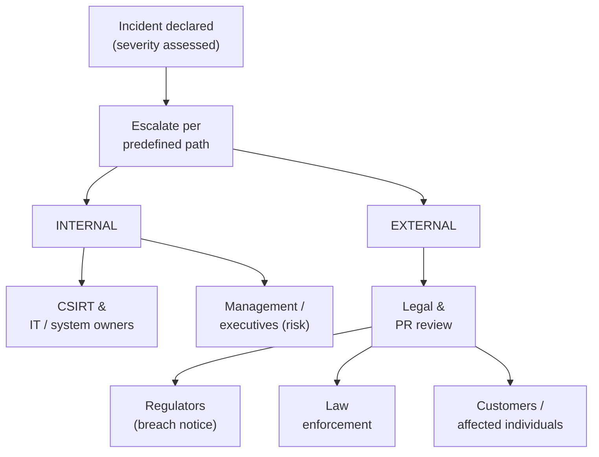

# Domain 4 — Reporting and Communication

This domain is about **17%** of the **CompTIA Cybersecurity Analyst (CySA+) CS0-003** exam — the smallest by weight, but the one that decides whether all the analysis in Domains 2 and 3 actually changes anything. A finding that never reaches the person who can act on it, or that drowns a non-technical executive in jargon, is wasted work. This domain teaches the analyst to **communicate**: vulnerability-management reporting (compliance reports, action plans, the real-world inhibitors that stall remediation, and the metrics that prove the program works) and incident-response reporting (who to notify, when to declare and escalate, what to tell legal/PR/regulators/customers, and how to close the loop with root-cause and lessons-learned). For a system administrator moving into a SOC, this is the skill that separates a technician from an analyst: translating technical risk into language stakeholders can act on. The Security+ companion is [Domain 5 — Security Program Management and Oversight](../../security-plus/domains/05-security-program-management-oversight.md).

> **Note on objective numbering.** CompTIA groups this domain into objectives 4.1–4.2. This page follows those topic areas faithfully without reproducing CompTIA's numbering verbatim — confirm the exact breakdown against the official **CS0-003 Exam Objectives** (Sources). No metric thresholds or regulatory specifics are invented; where a figure depends on your jurisdiction or contract it is marked **verify**.

## Learning objectives

After working through this page you should be able to:

- Produce **vulnerability-management reporting and communication**: compliance reports, action plans, and metrics/KPIs for the right stakeholders.
- Recognize the **inhibitors to remediation** — MOUs, SLAs, governance, business-process interruption, and legacy/proprietary systems — and account for them.
- Drive **incident-response reporting and communication**: stakeholder identification, incident **declaration and escalation**, and external communications to legal, PR, regulators, law enforcement, and customers.
- Close incidents with **root-cause analysis**, **lessons learned**, and **metrics**, and explain **due diligence/disclosure** obligations.
- Explain **why analysts must communicate to non-technical audiences** and tailor the message to each.

---

## 1. Vulnerability management reporting and communication

The output of the vulnerability program (see [Domain 2](02-vulnerability-management.md)) only creates value when it is reported to people who can act.

### What gets reported

| Artifact | Purpose | Typical audience |
|---|---|---|
| **Compliance report** | Demonstrate adherence to a standard or regulation (e.g., PCI DSS, HIPAA, ISO 27001) — often required, with deadlines. | Auditors, regulators, leadership. |
| **Action plan** | The concrete remediation steps, owners, and dates — turns findings into work. | Asset/system owners, IT operations. |
| **Risk report / dashboard** | The current risk posture and trend over time. | Management, risk committee. |
| **Vulnerability report** | The validated, prioritized findings (severity, CVE, asset, recommendation). | Remediation teams. |

### Metrics and KPIs

Metrics prove the program is working and where it is stuck. Analysts track measures such as:

- **Mean time to remediate (MTTR)** and **mean time to detect (MTTD)** — speed of closing/finding.
- **Vulnerability recurrence / reopen rate** — are fixes sticking?
- **Scan coverage** — percentage of the estate actually being scanned.
- **SLA compliance** — percentage of findings remediated within the agreed window.
- **Number of criticals/highs open over time** — the trend line leadership watches.

> Exact target thresholds (e.g., "patch criticals within N days") are set by **organizational policy** and contracts — **verify** against your own SLAs rather than assuming a universal number.

### Inhibitors to remediation

CompTIA explicitly tests the real-world reasons a fix does **not** simply happen. The analyst must surface these to stakeholders, not hide them:

| Inhibitor | Why it stalls remediation |
|---|---|
| **MOU (Memorandum of Understanding)** | A non-binding agreement between parties may constrain who may touch a system or when. |
| **SLA (Service-Level Agreement)** | Contractual uptime/availability commitments limit downtime windows for patching. |
| **Organizational governance** | Change-control boards, approvals, and policy gates add (necessary) delay. |
| **Business-process interruption** | Patching would disrupt a revenue-critical or safety-critical process. |
| **Degrading functionality** | A fix may break compatibility or remove a feature the business relies on. |
| **Legacy systems** | Out-of-support software may have **no patch available** at all. |
| **Proprietary systems** | Vendor-locked/closed systems cannot be modified by the customer; you wait on the vendor. |

When remediation is blocked, the analyst recommends **compensating controls** or documented **risk acceptance** (see [Domain 2 §5](02-vulnerability-management.md)) — and reports the residual risk to the risk owner so the decision is made with eyes open.

### Stakeholders and due diligence

The analyst **identifies stakeholders** (asset owners, IT ops, management, compliance, legal, and external parties) and tailors communication to each. **Due diligence** means doing the reasonable, documented work to find and address risk; **disclosure** means reporting vulnerabilities (internally, to vendors via responsible/coordinated disclosure, or to customers/regulators) as policy and law require.

---

## 2. Incident response reporting and communication

When an incident occurs (see [Domain 3](03-incident-response-and-management.md)), communication is part of the response, not an afterthought — and getting it wrong (too slow, too loud, to the wrong party) can cause more damage than the breach.

### Declaration, escalation, and stakeholders

- **Incident declaration** — the formal point at which an event is classified as an incident, starting the response clock and notification obligations. Criteria are defined in advance.
- **Escalation** — moving the incident up the chain by **severity** (see Domain 3) to the right responders and decision-makers, following a pre-defined path so nothing waits on someone being asked.
- **Stakeholder identification** — knowing *in advance* who must be told and in what order: the CSIRT, management/executives, IT/system owners, and the external parties below.

### External communications

Different audiences need different messages, and several are legally or contractually required:

| Audience | Why / what |
|---|---|
| **Legal** | Privilege, liability, contractual and statutory obligations; often reviews external messaging first. |
| **Public relations / communications** | Manages the external narrative; prevents inaccurate or premature statements. |
| **Regulatory bodies** | Mandatory breach notification under laws such as GDPR or HIPAA — within **prescribed deadlines** (**verify** the exact window for your jurisdiction/regulation; e.g., GDPR's 72-hour rule). |
| **Law enforcement** | When a crime has occurred; coordinate to preserve evidence and any investigation. |
| **Customers / affected individuals** | Notification of impact to their data, often legally mandated and time-bound. |

> **Why non-technical communication matters:** executives decide budget and risk acceptance, customers decide whether to keep trusting you, and regulators decide penalties — none of them read packet captures. The analyst's value is translating "CVE-XXXX-NNNN with EPSS 0.9 on the billing host" into "the system that processes customer payments has a flaw attackers are actively using; here is the business risk and what we recommend." Match the message to the audience: technical detail for responders, **risk and impact** for leadership, **clear plain-language facts** for customers.

### Closing the loop — RCA, lessons learned, metrics

- **Root-cause analysis (RCA)** — the report states the *underlying* cause, not just the symptom, so leadership funds the durable fix.
- **Lessons learned** — documented improvements to the plan, controls, and detections, fed back into [Preparation](03-incident-response-and-management.md).
- **Incident metrics** — **mean time to detect (MTTD)**, **mean time to respond/contain**, **mean time to recover**, number of incidents, and dwell time — these quantify response performance for leadership and drive investment.

The offensive-engagement reporting discipline — findings, evidence, and an executive summary tailored to the reader — is covered in [CEH — Engagement Methodology and Reporting](../../ceh/00-overview/engagement-methodology-and-reporting.md); the regulatory frameworks that drive many disclosure obligations are mapped in [Compliance & Standards](../../../reference/compliance-and-standards.md).

---

## Exam tips

- Know the **inhibitors to remediation** cold — especially **MOU**, **SLA**, **legacy systems** (no patch exists), and **proprietary systems** (vendor-locked). When a scenario says a fix is blocked, the answer is usually a **compensating control** or documented **risk acceptance**, not "patch anyway."
- A **compliance report** demonstrates adherence to a standard/regulation; an **action plan** assigns the remediation work and owners. Don't confuse the two.
- **Incident declaration** starts the clock and the notification duties; **escalation** follows a **predefined path** based on **severity**.
- **Legal and PR review external messaging first.** Customer and regulator notifications are often **legally mandated and time-bound** (e.g., GDPR 72 hours — **verify** the exact figure).
- **RCA and lessons learned** close the incident and feed back into preparation — the same post-incident activity as in Domain 3.
- Pick the right **metric** for the audience: **MTTD/MTTR** and trend lines for leadership; detailed findings for responders.
- The recurring theme: **tailor the message to the audience** — analysts must communicate **risk and impact** to non-technical stakeholders, not raw technical detail.

---

## Sources

- CompTIA — Cybersecurity Analyst (CySA+) CS0-003 certification and exam objectives: <https://www.comptia.org/certifications/cybersecurity-analyst>
- NIST SP 800-61 Rev. 2 — *Computer Security Incident Handling Guide* (reporting, coordination): <https://csrc.nist.gov/pubs/sp/800/61/r2/final>
- NIST SP 800-40 Rev. 4 — *Guide to Enterprise Patch Management Planning* (metrics, inhibitors): <https://csrc.nist.gov/pubs/sp/800/40/r4/final>
- CISA — incident reporting and coordinated vulnerability disclosure: <https://www.cisa.gov/coordinated-vulnerability-disclosure-process>
- EU GDPR — Article 33, breach notification (72-hour rule): <https://gdpr-info.eu/art-33-gdpr/>

---

*Related: [Domain 2 — Vulnerability Management](02-vulnerability-management.md) · [Domain 3 — Incident Response & Management](03-incident-response-and-management.md) · [Security+ — Security Program Management & Oversight](../../security-plus/domains/05-security-program-management-oversight.md) · [CEH — Engagement Methodology & Reporting](../../ceh/00-overview/engagement-methodology-and-reporting.md) · [Compliance & Standards](../../../reference/compliance-and-standards.md) · [Acronyms](../../security-plus/reference/acronyms.md)*
