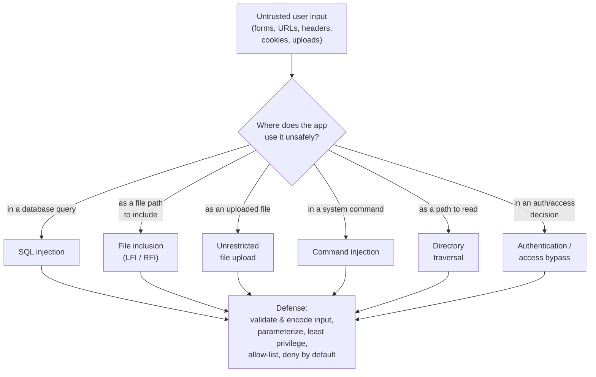

# Web Application Attacks

Web applications are one of the most common **initial-access** surfaces on the OSCP (Offensive Security Certified Professional) exam, because a single web flaw can hand an attacker code execution or sensitive data on the host behind it. This page explains the web attack **concepts** PEN-200 tests — what each one targets, *why* it works, and how to defend against it. It is deliberately conceptual: it names tools by purpose and contains **no exploit code or step-by-step playbooks**.

> **Educational & authorized use only.** Probing a web application without permission is unlawful in most jurisdictions. These techniques are legal **only** with explicit written authorization, an agreed scope, and Rules of Engagement (RoE). This page is for understanding, methodology, and defense. See [../00-overview/what-is-oscp.md](../00-overview/what-is-oscp.md).

## Learning objectives

- Describe the web flaws OSCP exercises: SQL injection, file inclusion (LFI/RFI), file upload, command injection, directory traversal, and authentication bypass.
- Explain the **root cause** common to most of them — trusting untrusted input.
- Map each attack class to its defensive control.
- Match web-testing tools to their purpose without using exploit code.

## The common root cause

Almost every flaw on this page reduces to one mistake: **trusting input the user controls.** When an application places user input directly into a query, a file path, a shell command, or a privileged decision without validating, encoding, or parameterizing it, the input can change the *meaning* of the operation. The unifying defense is therefore also one idea — **never trust input; validate, encode, and separate data from code.**

## The web attack surface (defense view)

## The attack classes

### SQL injection (SQLi)
**Targets:** the database query layer. **Why it works:** user input is concatenated into a Structured Query Language (SQL) statement, so crafted input is interpreted as query logic rather than data — letting an attacker read, alter, or bypass authentication against the database. **Defense:** use parameterized queries / prepared statements, apply least-privilege database accounts, and validate input. Deep dive: [../../ceh/domains/15-sql-injection.md](../../ceh/domains/15-sql-injection.md).

### File inclusion — LFI and RFI
**Targets:** functions that load a file chosen by user input. **Why it works:** the app builds a file path from input without restriction. **Local File Inclusion (LFI)** loads files already on the server (config files, logs, source); **Remote File Inclusion (RFI)** loads a file from an attacker-controlled URL, which can lead to code execution. **Defense:** never build include paths from user input; use a fixed allow-list of permitted files; disable remote includes in the language runtime.

### Unrestricted file upload
**Targets:** upload features that fail to constrain *what* is uploaded and *where* it lands. **Why it works:** if the app accepts an executable file type and stores it in a web-accessible, executable location, the attacker can later request it to run code. **Defense:** allow-list permitted file types, validate content (not just extension), store uploads outside the web root, and serve them as non-executable.

### Command injection
**Targets:** application code that passes input into an operating-system shell command. **Why it works:** shell metacharacters in the input let the attacker append or alter commands, yielding execution as the web service account. **Defense:** avoid shelling out; use safe library calls/APIs; if a command is unavoidable, pass arguments as a parameter array (not a concatenated string) and strictly validate input.

### Directory (path) traversal
**Targets:** features that map user input to a file location for reading. **Why it works:** sequences like `../` walk *outside* the intended directory, exposing files the app never meant to serve (e.g., system config). It differs from LFI in that traversal typically *reads* arbitrary files rather than *executing* an included one. **Defense:** canonicalize and validate paths, confine access to a base directory, and reject traversal sequences.

### Authentication / access bypass
**Targets:** the logic that decides *who* may do *what*. **Why it works:** weak session handling, predictable identifiers, missing server-side authorization checks, or trusting client-side controls let a user reach functions or data they should not. **Defense:** enforce authentication and authorization **server-side** on every request, use strong session management, and deny by default.

| Attack | Primarily targets | Core defense |
| --- | --- | --- |
| SQL injection | Database query | Parameterized queries, least-privilege DB user |
| LFI / RFI | File-include logic | Allow-list files, disable remote includes |
| File upload | Upload handler | Validate type/content, store outside web root, non-executable |
| Command injection | OS shell call | Avoid shell, argument arrays, input validation |
| Directory traversal | File-read logic | Canonicalize paths, confine to base dir |
| Auth bypass | Access-control logic | Server-side authz on every request, deny by default |

## Tools and their purpose

| Tool | Purpose |
| --- | --- |
| Burp Suite | Intercepting proxy to inspect and (with authorization) modify HTTP requests/responses; the core web-testing workbench. |
| Web content/dir discovery tools | Find hidden directories, files, and endpoints to map the attack surface. |
| Browser developer tools | Inspect requests, cookies, client-side logic, and responses. |
| Web vulnerability scanners | Flag candidate issues for manual, authorized verification (never as proof on their own). |

## Defense in depth

Beyond per-flaw fixes, layer defenses: input validation with **allow-lists**, output **encoding** appropriate to context, parameterized data access, least privilege for the app's service and database accounts, a **Web Application Firewall (WAF)** as a supplementary filter, and security testing in the development lifecycle. Server-hardening context: [../../ceh/domains/13-hacking-web-servers.md](../../ceh/domains/13-hacking-web-servers.md). Broader web-app attack catalog: [../../ceh/domains/14-hacking-web-applications.md](../../ceh/domains/14-hacking-web-applications.md).

## Exam tips

- **Web is a top initial-access vector** — enumerate the app thoroughly (versions, hidden paths, parameters) before attacking.
- **Find the version, find the path.** A precise framework/CMS version usually points to a known issue.
- **Manual verification matters.** OSCP expects you to understand and confirm a finding, not just trust a scanner.
- **Most web flaws share one root cause** — untrusted input changing the meaning of a query, path, or command.
- **LFI vs. traversal:** inclusion can lead to *execution*; traversal typically yields arbitrary file *reads*.

> Authorized use only: test web applications solely where you have explicit written permission, within scope and Rules of Engagement.

## Sources

- OffSec — PEN-200 / OSCP official course page (web application attacks): https://www.offsec.com/courses/pen-200/
- OffSec — OSCP+ Exam Guide: https://help.offsec.com/hc/en-us/articles/360040165632-OSCP-Exam-Guide
- OWASP Top 10 (web application security risks): https://owasp.org/www-project-top-ten/
- PortSwigger Web Security Academy (concepts and defenses): https://portswigger.net/web-security
- Related in this repo: [../../ceh/domains/14-hacking-web-applications.md](../../ceh/domains/14-hacking-web-applications.md) · [../../ceh/domains/15-sql-injection.md](../../ceh/domains/15-sql-injection.md) · [../../ceh/domains/13-hacking-web-servers.md](../../ceh/domains/13-hacking-web-servers.md)
