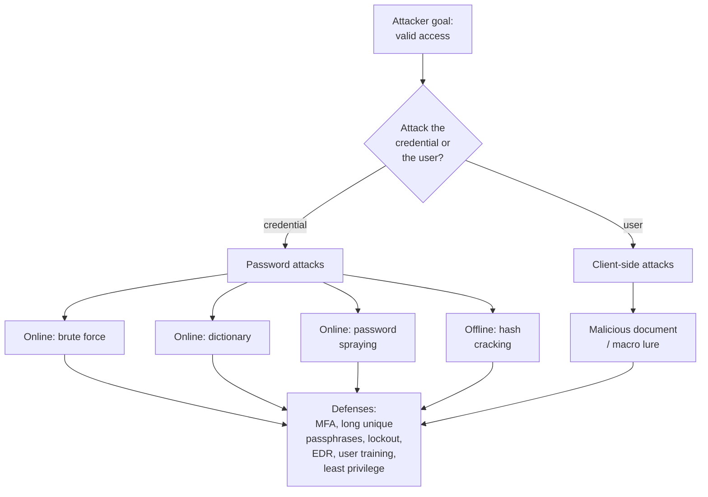

# Password & Client-Side Attacks

When a service exposes a login or a user can be persuaded to open a file, attackers target **people and credentials** rather than software bugs. OSCP (Offensive Security Certified Professional) and the PEN-200 course exercise two such areas: **password attacks** against authentication, and **client-side attacks** that trick a user into running attacker-supplied content. This page explains both **conceptually**, emphasizes the defenses, and names tools by purpose — with **no exploit code or step-by-step playbooks**.

> **Educational & authorized use only.** Credential guessing and client-side lures are legal **only** with explicit written authorization, an agreed scope, and Rules of Engagement (RoE); social-engineering tests in particular require careful, written consent. This page is for understanding, methodology, and defense. See [../00-overview/what-is-oscp.md](../00-overview/what-is-oscp.md).

## Learning objectives

- Distinguish brute-force, dictionary, and password-spraying attacks.
- Explain offline hash cracking and why it sidesteps account lockout.
- Explain why **length and uniqueness** beat character "complexity."
- Describe the client-side attack concept (malicious document / macro) at a conceptual level.
- Map each attack to layered defenses: MFA, password policy, EDR, and training.

## Two ways in: credentials and the client

## Password attacks

### Online attacks — guessing against a live service
The attacker submits guesses to a real login (web, SMB, SSH, RDP, etc.).

- **Brute force:** try every combination in a keyspace. Thorough but slow; effective only against short or weak secrets.
- **Dictionary attack:** try a curated wordlist of likely passwords instead of every combination — far faster because most weak passwords are predictable.
- **Password spraying:** try *one* common password across *many* accounts. By staying below the per-account failure threshold, it evades lockout and is a common Active Directory technique — see [./05-active-directory-attacks.md](05-active-directory-attacks.md).

### Offline attacks — cracking captured hashes
If an attacker obtains password **hashes** (one-way transformations stored instead of plaintext), they can crack them **offline** on their own hardware. This matters because offline cracking is unlimited and silent: **account lockout and rate limits do not apply**, since the target service is never touched. Speed depends on the hash algorithm (slow, salted hashes resist cracking far better than fast, unsalted ones) and on password strength.

### Why long + unique beats "complex"
Cracking effort grows with the **search space**. Each added character multiplies the space far more than swapping a letter for a symbol does, so a long passphrase outlasts a short "complex" password. **Uniqueness** matters independently: a password reused elsewhere is only as safe as the weakest site that ever held it — one breach exposes every reuse (credential stuffing). Modern guidance (e.g., NIST SP 800-63B) therefore favors length, blocklisting known-breached passwords, and dropping forced periodic rotation/arbitrary composition rules. See [../../foundations/privileged-accounts-and-credentials.md](../../../foundations/privileged-accounts-and-credentials.md).

| Attack | Mode | Defeated mainly by |
| --- | --- | --- |
| Brute force | Online | Length, lockout, MFA |
| Dictionary | Online | Blocklisting common/breached passwords, MFA |
| Password spraying | Online | MFA, anomaly detection, blocklists |
| Hash cracking | Offline | Strong slow+salted hashing, long unique passphrases |

## Client-side attacks (concept)

Where password attacks hit a service, **client-side attacks target the user's software** — the browser, document reader, or office suite. The classic concept is a **malicious document**: a file (e.g., an office document with an embedded **macro** — a small automation script) crafted so that, *if the user opens it and enables active content*, it runs attacker-chosen actions in the user's context. The point for OSCP is the **methodology and the defense**, not building a weaponized payload, so this stays conceptual. It overlaps heavily with social engineering — see [../../ceh/domains/09-social-engineering.md](../../ceh/domains/09-social-engineering.md).

## Defenses (layered)

- **Multi-factor authentication (MFA):** the single highest-impact control — a guessed or cracked password alone is insufficient. Especially critical for remote access and privileged accounts.
- **Password policy done right:** require **length** (passphrases), **block breached/common passwords**, and avoid forcing arbitrary complexity or frequent rotation that pushes users to weak patterns.
- **Account lockout / rate limiting / anomaly detection:** slow online guessing and surface spraying patterns (many accounts, one password).
- **Strong credential storage:** store passwords with slow, salted hashing so any stolen hashes resist offline cracking.
- **Endpoint Detection and Response (EDR) and macro hardening:** disable or block office macros by default, restrict active content, and detect malicious document behavior on the endpoint.
- **User awareness training:** teach staff to recognize lures and to be cautious about enabling content in unexpected files.
- **Least privilege & credential hygiene:** limit what any one credential can reach so a single compromise is contained. For privileged-credential context see [../../protocols/kerberos.md](../../../protocols/kerberos.md) and [../../foundations/privileged-accounts-and-credentials.md](../../../foundations/privileged-accounts-and-credentials.md).

## Tools and their purpose

| Tool | Purpose |
| --- | --- |
| Hydra | Online password-guessing tool that drives login attempts across many network protocols. |
| John the Ripper | Offline password cracker that recovers plaintext from captured hashes across many formats. |
| Hashcat | High-performance offline cracker that uses GPUs to accelerate hash recovery. |
| Wordlist tooling | Generate or tailor candidate password lists for dictionary attacks. |

## Exam tips

- **Reuse credentials you find.** A password recovered on one host often unlocks another — always test discovered creds elsewhere.
- **Spraying beats brute force in a domain** — one common password across many users avoids lockout (and MFA stops it).
- **Offline cracking ignores lockout** — that is why protecting hashes (slow + salted) matters.
- **Length > complexity:** a long passphrase is harder to crack than a short symbol-laden password.
- **Client-side = the user's app.** The exam treats it conceptually; the defenses (macro hardening, EDR, training) are the takeaway.

> Authorized use only: attempt password or client-side techniques solely against systems and users you are explicitly permitted to test, within scope and Rules of Engagement.

## Sources

- OffSec — PEN-200 / OSCP official course page (password & client-side attacks): https://www.offsec.com/courses/pen-200/
- OffSec — OSCP+ Exam Guide: https://help.offsec.com/hc/en-us/articles/360040165632-OSCP-Exam-Guide
- NIST SP 800-63B, Digital Identity Guidelines (length over complexity, breach blocklists): https://pages.nist.gov/800-63-3/sp800-63b.html
- OWASP — Authentication Cheat Sheet (defenses): https://cheatsheetseries.owasp.org/cheatsheets/Authentication_Cheat_Sheet.html
- Related in this repo: [../../ceh/domains/09-social-engineering.md](../../ceh/domains/09-social-engineering.md) · [../../protocols/kerberos.md](../../../protocols/kerberos.md) · [../../foundations/privileged-accounts-and-credentials.md](../../../foundations/privileged-accounts-and-credentials.md)
