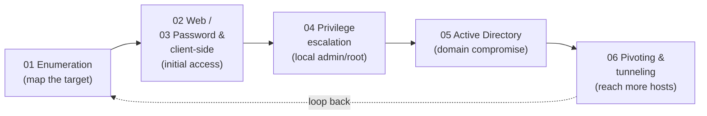

# OSCP / PEN-200 — Practical Skill Areas

This section breaks down the hands-on skills exercised by **OSCP** (Offensive Security Certified Professional), earned through OffSec's **PEN-200: Penetration Testing with Kali Linux** course. Each page covers a recurring skill area conceptually — the *what* and *why*, the methodology, and the matching defense — and names tools by **purpose** rather than supplying playbooks.

> **These are practical skill areas, not official "domains."** PEN-200 / OSCP is a fully hands-on certification: there is no published list of weighted exam domains the way knowledge-based certs have. The six pages below are a teaching breakdown of the skills the course builds and the 24-hour exam exercises, not an OffSec-defined syllabus. For the authoritative course outline and exam guide, see [../00-overview/what-is-oscp.md](../00-overview/what-is-oscp.md) and the Sources.

> **Educational & authorized use only.** Penetration testing is legal **only** with explicit written authorization, an agreed scope, and Rules of Engagement (RoE). Everything here is conceptual, for understanding, methodology, and defense — no weaponized step-by-step or exploit code.

## Learning objectives

- Identify the six recurring PEN-200 practical skill areas and how they chain together.
- Distinguish a practical skill breakdown from an official, weighted exam-domain list.
- Navigate to the page that matches each phase of a typical assessment.
- Connect each offensive skill to the defensive control that blunts it.

## The six skill pages

| # | Page | Theme (one line) |
| --- | --- | --- |
| 01 | [Enumeration & information gathering](01-enumeration-and-information-gathering.md) | The master skill — "enumerate everything": passive/active recon, port/service/web/SMB/SNMP enumeration. |
| 02 | [Web application attacks](02-web-application-attacks.md) | How injection, inclusion, upload, and traversal flaws arise — and how to defend the web attack surface. |
| 03 | [Password & client-side attacks](03-password-and-client-side-attacks.md) | Brute force, spraying, hash cracking, and malicious-document concepts — plus MFA/EDR defenses. |
| 04 | [Privilege escalation](04-privilege-escalation.md) | Turning a low-privileged foothold into admin/root on Windows and Linux, and how to harden against it. |
| 05 | [Active Directory attacks](05-active-directory-attacks.md) | Credential abuse and lateral movement across a Windows domain — the high-value exam set. |
| 06 | [Pivoting & tunneling](06-pivoting-and-tunneling.md) | Reaching internal networks through a compromised host via port forwarding and tunnels. |

## How the skills chain together

Enumeration is not a one-time step — every new foothold restarts the cycle, which is why page 01 is treated as the master skill.

## Where to go next

- [../00-overview/what-is-oscp.md](../00-overview/what-is-oscp.md) — what OSCP / OSCP+ is and the "Try Harder" philosophy.
- [../00-overview/exam-structure.md](../00-overview/exam-structure.md) — the 24-hour exam, scoring, and report window.

## Sources

- OffSec — PEN-200 / OSCP official course page (course scope, fully hands-on): https://www.offsec.com/courses/pen-200/
- OffSec — OSCP+ Exam Guide (exam format and scoring): https://help.offsec.com/hc/en-us/articles/360040165632-OSCP-Exam-Guide
- Related in this repo: [../../ceh/README.md](../../ceh/README.md)
- Verify all volatile specifics (exact exam structure, scoring, validity terms) on OffSec's site — programs change.
