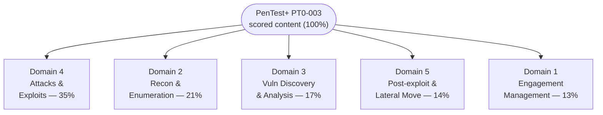

# PenTest+ (PT0-003) Exam Format and Objectives

This page explains how the CompTIA PenTest+ (PT0-003) exam is structured — question count
and types, duration, and scoring model — and lays out the **five exam domains and their
weightings**. It also explains what performance-based questions are, how renewal works, and
how to download CompTIA's official exam objectives. Figures that change between exam versions
are flagged so you verify them on CompTIA before relying on them.

> [!IMPORTANT]
> **Authorised use only.** Everything PenTest+ tests is performed in practice **only** under
> explicit **written authorisation**, a defined **scope**, and agreed **Rules of Engagement
> (RoE)**. See [../../ceh/00-overview/legal-and-ethics.md](../../ceh/00-overview/legal-and-ethics.md).

> **Verify volatile details.** The facts below come from CompTIA's official PenTest+ page and
> the verified ground truth for this hub. CompTIA rotates exam codes periodically and revises
> price, scoring, and renewal terms, so re-check anything marked **"verify on CompTIA"**: https://www.comptia.org/en-us/certifications/pentest/

## Learning objectives

- State the PenTest+ exam format: question count, types, and duration.
- Explain why the **passing/scoring model must be verified on CompTIA** rather than assumed.
- List the five PT0-003 domains and their published weightings.
- Explain what performance-based questions (PBQs) are and why they reward hands-on practice.
- Describe how to obtain CompTIA's official exam objectives PDF and how renewal (CEUs) works.

## Exam format at a glance

| Item | Detail | Note |
| --- | --- | --- |
| Exam code | **PT0-003** | Launched in 2024, replacing **PT0-002**; CompTIA rotates codes periodically — *verify on CompTIA* |
| Number of questions | **Maximum 90** | The cap is 90; some forms present fewer |
| Question types | **Multiple-choice questions (MCQ)** + **performance-based questions (PBQs)** | See PBQ section below |
| Duration | **165 minutes** | CompTIA official page |
| Passing / scoring model | **Reported pass/fail — verify on CompTIA** | Do **not** assume a fixed scaled number (see note below) |
| Recommended experience | **Network+ and Security+**, plus **~3–4 years** hands-on security/pentest experience | Recommended, **not required** — *verify on CompTIA* |
| Languages / price / renewal | **Not quoted here — verify on CompTIA** | Omitted to avoid stale figures |

> **Do not assume the pass score.** The previous exam, **PT0-002**, used a scaled passing
> score of **750 on a 100–900 scale**. **PT0-003 may differ**, and CompTIA reports PenTest+
> results as **pass/fail**. To avoid fabricating a number, this hub states **"scoring/passing
> model: verify on CompTIA"** rather than asserting a specific value. Treat any flat "you need
> X%" or "750" claim for PT0-003 from third-party sites with suspicion until you confirm it on
> CompTIA.

## The five domains and their weightings

PT0-003 is organised into **five domains**. CompTIA publishes the following weightings (the
percentage of scored content each domain contributes) *(verify on CompTIA — weightings change
per exam version)*:

| # | Domain | Weight |
| --- | --- | --- |
| 1 | [Engagement Management](../domains/01-engagement-management.md) | **13%** |
| 2 | [Reconnaissance and Enumeration](../domains/02-reconnaissance-and-enumeration.md) | **21%** |
| 3 | [Vulnerability Discovery and Analysis](../domains/03-vulnerability-discovery-and-analysis.md) | **17%** |
| 4 | [Attacks and Exploits](../domains/04-attacks-and-exploits.md) | **35%** |
| 5 | [Post-exploitation and Lateral Movement](../domains/05-post-exploitation-and-lateral-movement.md) | **14%** |

Two takeaways from the weightings:

- **Attacks and Exploits (35%)** is by far the single largest domain — over a third of scored
  content is the hands-on exploitation core. This is where lab practice (in an **authorised**
  environment) pays off most.
- **Reconnaissance and Enumeration (21%)** plus **Vulnerability Discovery and Analysis (17%)**
  together are ~38% of the exam: nearly as much as Attacks and Exploits. Solid information-
  gathering and analysis underpins everything — and **Engagement Management (13%)** ensures
  the planning, ethics, and reporting are never an afterthought.

See [../domains/README.md](../domains/README.md) for the full domain index and the per-domain
pages.

## What are performance-based questions (PBQs)?

**Performance-based questions (PBQs)** are interactive tasks that ask you to **do** something
rather than pick an answer — for example, analysing tool or scan output, completing or
correcting a short script, ordering the steps of an engagement, matching tools or techniques
to a scenario, or interpreting command output. They simulate realistic on-the-job activities.

Key points for planning:

- PBQs are **why hands-on practice matters.** A sysadmin who has actually run scans, read
  output, and written small scripts has a real advantage. The exact number of PBQs on any
  given form is **not published by CompTIA** — do not rely on a specific count.
- A common strategy is to **flag and skip** time-consuming PBQs, complete the multiple-choice
  questions first, then return with the remaining time. *(Verify whether the current exam
  delivery permits skipping/returning — CompTIA's interface and rules can change.)*

## How to get the official exam objectives

CompTIA publishes a free, downloadable **exam objectives** document (often called the
"objectives PDF" or "exam blueprint") for PT0-003. It is the **authoritative, comprehensive
list** of every topic, term, tool, and acronym that can appear on the exam, broken down by
domain and sub-objective. It is the single most important study artefact.

To obtain it:

1. Go to the official CompTIA PenTest+ page: https://www.comptia.org/en-us/certifications/pentest/ *(verify — the page layout changes)*.
2. Look for **"Download the exam objectives"** (CompTIA may ask for an email address).
3. Confirm the document is for **PT0-003** — older objectives (e.g., PT0-002) cover a retired
   exam and differ.

The domain pages in this hub are written **toward the PT0-003 objectives**, but the
objectives PDF is the canonical checklist — use it to track coverage and confirm exact
wording, because CompTIA can issue minor revisions.

## Renewal and continuing education (CEUs) *(verify on CompTIA)*

PenTest+ is **not permanent**; it must be maintained. CompTIA certifications are renewed
through the **Continuing Education (CE) program**, primarily by earning **Continuing Education
Units (CEUs)** over a fixed validity period (for example, by completing training, earning a
higher-level certification, or other approved activities).

- The **exact validity period, the number of CEUs required, and any renewal fee are not quoted
  here** — these terms change and must be confirmed on CompTIA's Continuing Education page.
  **Verify on CompTIA.**
- Earning a higher CompTIA certification can also renew PenTest+ automatically under the CE
  program *(verify current rules)*.

## Where to go next

- [what-is-pentest-plus.md](what-is-pentest-plus.md) — what the credential is and where it
  sits.
- [../domains/README.md](../domains/README.md) — the five domain pages.
- [../../ceh/00-overview/exam-and-eligibility.md](../../ceh/00-overview/exam-and-eligibility.md) —
  the equivalent exam page for the CEH sibling hub.
- [../../security-plus/00-overview/exam-and-objectives.md](../../security-plus/00-overview/exam-and-objectives.md) —
  the Security+ exam page (the foundational baseline before PenTest+).

## Sources

- CompTIA — PenTest+ (PT0-003) official certification page (max 90 questions, MCQ + PBQ,
  165 minutes, five domains and weightings, recommended experience, pass/fail reporting):
  https://www.comptia.org/en-us/certifications/pentest/
- CompTIA — PenTest+ exam objectives (PT0-003) download (authoritative topic blueprint):
  https://www.comptia.org/en-us/certifications/pentest/
- CompTIA — Continuing Education (CE) program / CEU renewal terms (validity period, CEU count,
  fees — verify; not quoted here): https://www.comptia.org/continuing-education
- Verified ground truth for this hub: PT0-003 launched 2024 (replacing PT0-002); max 90
  questions (MCQ + PBQ); 165 minutes; domain weights 13 / 21 / 17 / 35 / 14 percent; scoring/
  passing model reported pass/fail — *verify on CompTIA* (PT0-002 used 750/900; PT0-003 may
  differ).
- All volatile specifics (exam code, retirement date, price, languages, scoring model, CEU
  renewal terms, recommended-experience years) are version-sensitive — *verify on CompTIA*.
